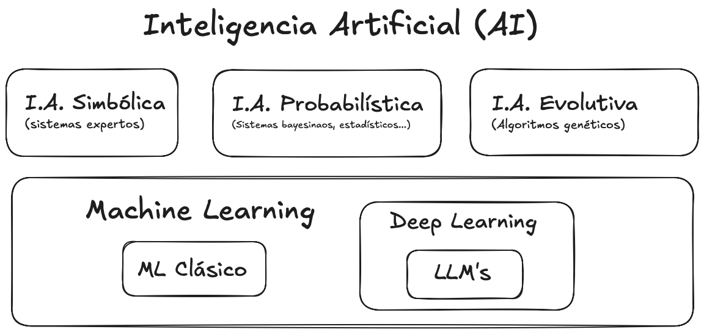
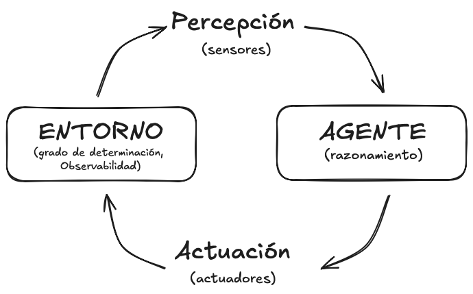
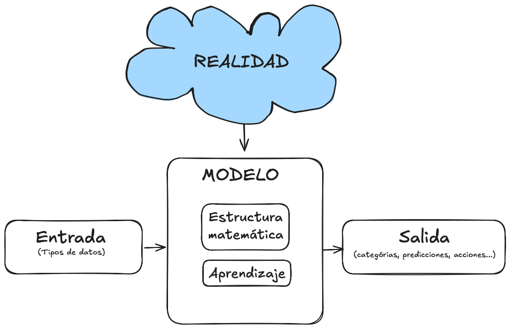
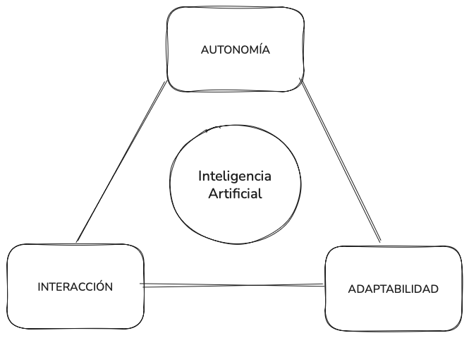

# Tema 1. Caracterización de la inteligencia artificial

> 1. Definiciones y conceptos clave
> 1. Historia y evolución de la IA
> 1. Paradigmas principales
> 1. IA débil vs. IA general
> 1. Componentes de un modelo de IA
> 1. Panorama de aplicaciones actuales
> 1. Desafios éticos y técnicos
## 1. Definiciones y conceptos clave

La inteligencia artificial (IA) es un campo de la informática que busca diseñar sistemas capaces de ejecutar tareas que, si fueran realizadas por seres humanos, requerirían inteligencia. Esta definición amplia abre la puerta a un debate sobre qué entendemos por “inteligencia” y hasta qué punto puede trasladarse a una máquina.

### Inteligencia e inteligencia artificial: diferencias y similitudes

La **inteligencia humana** se manifiesta en la capacidad de razonar, aprender de la experiencia, adaptarse a entornos cambiantes y resolver problemas novedosos. La **inteligencia artificial**, en cambio, no reproduce la conciencia ni la experiencia subjetiva, sino que simula algunos procesos cognitivos mediante algoritmos y modelos computacionales. Ambas comparten la finalidad de lograr conductas adaptativas y eficaces frente a problemas, pero difieren en los mecanismos subyacentes: mientras la inteligencia humana emerge de la interacción compleja entre biología y cultura, la IA se apoya en reglas formales, aprendizaje automático y capacidad de cómputo.

### Un "mapa" de la inteligencia artificial

La **inteligencia artificial** no es un campo homogéneo, sino un conjunto amplio de aproximaciones que buscan reproducir o simular distintos aspectos de la inteligencia. Una de sus ramas históricas es la **IA simbólica**, que representa el conocimiento mediante reglas lógicas y sistemas expertos capaces de razonar de forma explícita. Junto a ella se encuentra la **IA evolutiva**, inspirada en procesos biológicos como la selección natural o la cooperación en enjambres, aplicada sobre todo a problemas de optimización. En paralelo, la **IA probabilística** ofrece un marco matemático para tratar la incertidumbre mediante redes bayesianas y modelos estadísticos.

Dentro de este panorama aparece el **aprendizaje automático (machine learning)**, que constituye hoy la rama más dinámica de la IA. Su característica distintiva es que no se basa en reglas fijas, sino en algoritmos que aprenden directamente de los datos. El aprendizaje automático se subdivide en enfoques supervisados, no supervisados y por refuerzo, cada uno con sus propias aplicaciones y técnicas. Finalmente, dentro de este subconjunto encontramos el **aprendizaje profundo (deep learning)**, que utiliza redes neuronales artificiales de múltiples capas capaces de descubrir representaciones jerárquicas y muy complejas. El deep learning ha dado lugar a avances como el reconocimiento de imágenes, los sistemas de traducción automática o los **Large Language Models (LLMs)** que impulsan los chatbots actuales.

Este marco de clasificación permite entender que la IA es más amplia que el machine learning, y que a su vez el deep learning constituye solo una parte de este último, coexistiendo con otras corrientes igualmente válidas que abordan el problema de la inteligencia desde perspectivas simbólicas, evolutivas o probabilísticas.

### Algunos conceptos básicos: agente, entorno, percepción, racionalidad, razonamiento

En el estudio de la inteligencia artificial resulta esencial la noción de **agente**. Un agente es toda entidad capaz de **percibir su entorno** mediante sensores y de **actuar sobre él** a través de actuadores. Esta definición es amplia porque abarca tanto a los robots físicos, como un dron que usa cámaras y motores para volar, como a los sistemas virtuales, como un asistente de recomendación que procesa clics de usuarios y devuelve sugerencias personalizadas.

El **entorno** es el espacio donde el agente se desenvuelve y que establece las condiciones de sus acciones. Puede ser **determinista**, cuando cada acción tiene siempre la misma consecuencia (como en un tablero de ajedrez), o **estocástico**, cuando las mismas acciones pueden generar resultados distintos según el momento o las circunstancias (como ocurre en la conducción real). Asimismo, algunos entornos son **totalmente observables**, ya que el agente tiene acceso a toda la información necesaria para decidir, mientras que otros son **parcialmente observables**, obligando al agente a trabajar con incertidumbre y deducir lo que no ve.

> **Ejemplo de entorno físico**: la conducción autónoma representa un entorno estocástico y parcialmente observable. El coche no puede anticipar con exactitud las decisiones de otros conductores y sus sensores están expuestos a condiciones cambiantes como niebla o lluvia.
>
> **Ejemplo de entorno virtual**: un sistema de recomendación en una plataforma de vídeo se enfrenta a un entorno dinámico. La percepción se limita a los historiales de interacción del usuario, que no siempre revelan de forma completa sus preferencias, y la acción consiste en ofrecer nuevas sugerencias que maximicen la probabilidad de que el usuario siga interactuando.

La **percepción** constituye el vínculo entre el entorno y el agente. No siempre es exacta: puede ser incompleta o estar afectada por ruido, lo que obliga al agente a manejar incertidumbre. Por ejemplo, un coche autónomo que recibe datos de sensores de radar y cámaras debe interpretar correctamente las condiciones del tráfico, aun cuando haya lluvia, niebla o interferencias.

La **racionalidad** se refiere a la capacidad del agente de tomar decisiones orientadas a un fin, buscando maximizar el éxito esperado de acuerdo con sus objetivos. Ser racional no significa ser perfecto, sino actuar de la mejor forma posible según la información disponible y los recursos computacionales de los que dispone. Un agente puede ser racional incluso con percepciones parciales, siempre que adopte estrategias que incrementen su probabilidad de éxito en ese escenario limitado.

El **razonamiento**, por su parte, alude al proceso interno mediante el cual el agente selecciona y justifica sus acciones. Este razonamiento puede adoptar diferentes formas: en la **IA simbólica**, se realiza mediante la aplicación de reglas lógicas y motores de inferencia; en la **IA probabilística**, se basa en cálculos estadísticos que estiman la probabilidad de éxito de cada opción; en la **IA conexionista**, se apoya en modelos que aprenden patrones de comportamiento a partir de datos. Cada uno de estos enfoques ofrece ventajas y limitaciones, y en la práctica muchos sistemas modernos combinan más de uno para lograr un comportamiento más robusto.

### Qué es un modelo de IA y cómo se caracteriza

Un **modelo de inteligencia artificial** puede entenderse como una **abstracción matemática o computacional** que trata de capturar los patrones esenciales de un problema para producir soluciones útiles. Igual que un mapa no es el territorio, pero sirve para orientarse, un modelo no reproduce toda la complejidad de la realidad, sino que la simplifica para hacerla manejable.

La **estructura matemática** de un modelo depende del enfoque. En un sistema simbólico puede estar formada por reglas lógicas y bases de conocimiento; en el aprendizaje automático adopta la forma de funciones que se ajustan a datos; y en las redes neuronales se representa como capas de nodos y conexiones ponderadas.

El **tipo de datos de entrada** es otro rasgo definitorio. Algunos modelos trabajan con texto (procesamiento de lenguaje natural), otros con imágenes (visión artificial), señales numéricas, o incluso con información combinada de distintas fuentes. Lo importante es que los datos proporcionan la materia prima a partir de la cual el modelo reconoce patrones.

En cuanto a los **métodos de aprendizaje**, encontramos modelos entrenados de manera **supervisada**, que aprenden a partir de ejemplos con la respuesta correcta ya conocida (como un clasificador de correos spam/no spam); modelos **no supervisados**, que buscan estructuras ocultas en datos sin etiquetar (como un algoritmo de agrupamiento de clientes en marketing); y modelos de **aprendizaje por refuerzo**, donde un agente mejora su estrategia interactuando con un entorno y recibiendo recompensas o penalizaciones.

El **tipo de salida** define qué ofrece el modelo una vez entrenado. Puede tratarse de una etiqueta (por ejemplo, “positivo” o “negativo” en un análisis de sentimientos), un valor numérico (como la predicción del precio de una vivienda), una acción (girar a la izquierda en un coche autónomo) o incluso contenido nuevo (como un texto generado por un modelo de lenguaje o una imagen creada por una red generativa).

En definitiva, un modelo de IA actúa como una **simplificación operativa de la realidad**: no pretende captarla en toda su complejidad, sino representarla lo suficiente como para resolver un problema concreto de forma automatizada y con un grado de eficacia medible.

> **Ejemplo**: Un sistema de detección de fraude en transacciones bancarias utiliza como entrada los registros de pagos (cantidad, lugar, hora, dispositivo). A través de un modelo supervisado, aprende a distinguir entre operaciones normales y sospechosas. Su salida es una etiqueta que clasifica la operación como “legítima” o “fraudulenta”. Aunque el modelo no entiende el contexto social ni la psicología del fraude, su abstracción matemática es suficiente para reducir riesgos en la práctica.

------

##### Para reflexionar...

> **¿En qué sentido un agente artificial puede considerarse “racional” si su conocimiento del entorno es incompleto o incierto?**
> **Clave**: piensa en la diferencia entre actuar con certeza y actuar maximizando la probabilidad de éxito con información limitada.

### Hacia una definición definitiva de Inteligencia Artificial

La inteligencia artificial ha sido definida de distintas formas a lo largo de su historia, y ninguna definición única ha logrado imponerse de manera definitiva. Esto se debe a que la IA es un campo en constante evolución, que combina fundamentos teóricos, desarrollos tecnológicos y aplicaciones prácticas.

#### Primeras definiciones y aportaciones históricas

El término **“inteligencia artificial”** fue acuñado en 1956 por **John McCarthy**, quien la describió como *“la ciencia e ingeniería de hacer máquinas inteligentes, especialmente programas de cómputo inteligentes”*. Su definición pone el acento en la construcción de sistemas con capacidad de resolver problemas que normalmente requerirían inteligencia humana.

Antes de McCarthy, el matemático británico **Alan Turing** ya había sentado las bases teóricas de la computación moderna. En 1936 introdujo la idea de la **máquina de Turing**, una abstracción capaz de ejecutar cualquier cálculo siguiendo reglas lógicas. En 1950, en su famoso artículo *Computing Machinery and Intelligence*, propuso el **Test de Turing**: un experimento para evaluar si una máquina puede comportarse de forma indistinguible de un humano en una conversación. Turing fue pionero en la pregunta de si las máquinas podían “pensar”, mientras que McCarthy impulsó el desarrollo de la IA como disciplina independiente y práctica, creando además el lenguaje de programación **LISP**, fundamental en la investigación simbólica.

Así, mientras **Turing** ofreció las bases filosóficas y teóricas, **McCarthy** consolidó la IA como un campo autónomo de investigación, con un enfoque en la representación del conocimiento y el razonamiento simbólico.

#### La clasificación de Russell y Norvig

Décadas más tarde, los investigadores **Stuart Russell y Peter Norvig**, autores del influyente libro *Artificial Intelligence: A Modern Approach (AIMA)*, ampliaron la perspectiva distinguiendo dos grandes ejes:

- **Enfoques orientados a la imitación humana** (sistemas que piensan o actúan como humanos).
- **Enfoques orientados a la racionalidad** (sistemas que piensan o actúan racionalmente).

Esta clasificación nos permite entender que la IA no se limita a reproducir la mente humana, sino que también busca diseñar **agentes racionales**, es decir, sistemas que toman decisiones óptimas de acuerdo con el contexto.

En este marco, Russell y Norvig proponen **cuatro definiciones clásicas** de IA:

##### **Sistemas que piensan como humanos.**

Buscan replicar procesos cognitivos humanos, como la resolución de problemas.

> **Ejemplo:** las **redes neuronales convolucionales** imitan, de forma muy simplificada, el funcionamiento de las neuronas en la visión humana para identificar patrones en imágenes.

##### **Sistemas que actúan como humanos.**

Reproducen conductas observables de las personas, como la interacción por voz o el movimiento en robots.

> **Ejemplo:** los asistentes virtuales como **Siri o Alexa** interpretan órdenes de voz y responden como lo haría un humano en una conversación básica.

##### Sistemas que piensan racionalmente.

Se basan en la lógica formal y las reglas matemáticas para llegar a conclusiones óptimas.

> **Ejemplo:** **DENDRAL**, sistema experto de los años 60, ayudaba a químicos a deducir estructuras moleculares a partir de espectros de masas utilizando reglas lógicas.

##### **Sistemas que actúan racionalmente.**

Se conciben como **agentes inteligentes** que buscan maximizar recompensas en función de su entorno.

> **Ejemplo:** los sistemas de conducción autónoma evalúan constantemente el tráfico y eligen acciones que optimicen seguridad y eficiencia.

##### Para reflexionar…

> **Pregunta:** ¿qué significa ser “racional” en un entorno complejo?
> **Clave:** un coche autónomo puede enfrentarse a dilemas éticos donde la decisión más segura no siempre coincide con la más justa.

#### Una definición operativa: AI Watch (UE)

La **Comisión Europea**, a través de la iniciativa **AI Watch**, ha ofrecido una definición práctica de IA que propone un **enfoque operativo diferente** y que se basa en una **línea de acción orientada a objetivos**:

Con este enfoque se buecaría la **solución más óptima a un problema**, sin importar cómo los humanos lo resuelven. La metodología sería pues secundaria, priorizando la solución inteligente y óptima al problema. Al final, el **objetivo constante de la IA sería la creación de agentes inteligentes para la mayor cantidad posible de tareas diferentes**. Dada la diversidad de tareas, los métodos de la IA son igualmente variados.

Para la iniciativa, son de particular interés en la IA los **agentes de aprendizaje**, que son capaces de modificarse a sí mismos a partir de ejemplos de entrenamiento o retroalimentación (positiva o negativa), de tal manera que la utilidad promedio de sus acciones aumente con el tiempo.

En resumen, a diferencia de otras definiciones, en esta se enfatizan tres rasgos esenciales:

- **Autonomía:** capacidad de ejecutar tareas sin intervención humana directa.
- **Adaptabilidad:** habilidad de mejorar el rendimiento a medida que aprende de los datos.
- **Interacción:** posibilidad de comunicarse y colaborar eficazmente con personas y otros sistemas.

> **Ejemplo:** los **cobots industriales** trabajan junto a operarios humanos, ajustando su comportamiento mediante sensores de proximidad, aprendizaje continuo y comunicación intuitiva.

#### Una definición integradora

Teniendo en cuenta todo lo anterior podríamos elaborar una definición de Inteligencia Artifical que nos de una idea integrada y actual del término.

> La **inteligencia artificial** es el campo que se ocupa del desarrollo de sistemas computacionales y agentes inteligentes con la capacidad de percibir su entorno, procesar información, tomar decisiones y ejecutar tareas de forma **autónoma y adaptativa**. Estos sistemas pueden imitar la cognición o el comportamiento humano, pero su objetivo principal es **actuar de manera racional**, optimizando resultados y resolviendo problemas complejos a través del aprendizaje y la interacción.

Vemos como esta definición abarcaría desde algoritmos que replican procesos biológicos hasta robots que colaboran con personas en entornos industriales.

---

Tabla comparativa de la evolución del término IA

| **Autor / Fuente**          | **Definición / Enfoque**                                     | **Aportación clave**                                         | **Ejemplo ilustrativo**                                      |
| --------------------------- | ------------------------------------------------------------ | ------------------------------------------------------------ | ------------------------------------------------------------ |
| **Alan Turing (1950)**      | Pregunta si las máquinas pueden *pensar* y propone el **Test de Turing** como criterio. | Bases teóricas de la computación y primera aproximación a la inteligencia en términos de comportamiento. | Una máquina que conversa de forma indistinguible de un humano. |
| **John McCarthy (1956)**    | “La ciencia e ingeniería de hacer máquinas inteligentes, especialmente programas de cómputo inteligentes”. | Acuña el término “IA”, promueve el enfoque simbólico y crea el lenguaje **LISP**. | Sistemas expertos que razonan con reglas lógicas.            |
| **Russell & Norvig (1995)** | Cuatro definiciones según si piensan/actúan como humanos o racionalmente. | Amplían el marco conceptual y proponen la visión de **agentes inteligentes**. | Asistentes virtuales (actúan como humanos) o sistemas expertos (piensan racionalmente). |
| **AI Watch (UE, 2019)**     | Definición operativa: IA como sistemas con **autonomía, adaptabilidad e interacción**. | Perspectiva práctica y política para guiar el desarrollo responsable en Europa. | Cobots industriales que colaboran con humanos.               |

## 2. Una breve historia de la Inteligencia Artificial

### Antecedentes de la inteligencia artificial antes del siglo XIX

La idea de construir máquinas capaces de **imitar funciones propias de la inteligencia humana** no es nueva, y ha acompañado al ser humano desde la antigüedad en forma de mitos y proyectos mecánicos.

En la **Grecia clásica**, autores como **Aristóteles** reflexionaron sobre la lógica como método formal para razonar. Su *syllogismos* sentó la base de los sistemas de inferencia, que más de dos mil años después inspirarían el razonamiento simbólico en IA. En el mundo medieval e islámico, pensadores como **Al-Jazari** (s. XII) diseñaron **autómatas mecánicos** —muñecos que tocaban instrumentos o servían bebidas—, mostrando el deseo humano de replicar comportamientos animados mediante artificios técnicos.

Ya en la Edad Moderna, **René Descartes** planteó la separación entre mente y cuerpo, y consideró que los animales eran máquinas biológicas, lo que abría la posibilidad de concebir al ser humano mismo en términos mecanicistas. Poco después, **Blaise Pascal** y **Gottfried Leibniz** durante el siglo XVII construyeron calculadoras mecánicas y teorizaron sobre un *lenguaje universal* capaz de formalizar el pensamiento. La idea de Leibniz de una *“mathesis universalis”* anticipaba lo que siglos más tarde sería el **lenguaje lógico de la computación**.

### Antecedentes en el siglo XIX y primeras décadas del XX

El siglo XIX fue decisivo porque la reflexión filosófica sobre la inteligencia empezó a traducirse en **máquinas concretas** y en **formalizaciones matemáticas** que abrieron el camino a la computación moderna.

**Charles Babbage** diseñó en 1837 la **máquina analítica**, concebida como un dispositivo capaz de ejecutar instrucciones mediante tarjetas perforadas. Aunque nunca llegó a construirse plenamente, es considerada el primer diseño de un ordenador programable. Su importancia radica en que introdujo conceptos que hoy son centrales: la unidad de control, la memoria y la separación entre programa y datos.

**Ada Lovelace**, colaboradora de Babbage, comprendió que aquella máquina no estaba limitada a cálculos aritméticos, sino que podía manipular cualquier tipo de símbolos siguiendo reglas, anticipando así la noción de **programación**. En sus notas de 1843 escribió que la máquina podría “tejer patrones algebraicos” igual que un telar teje flores y hojas, una intuición sorprendentemente cercana a la computación simbólica de la inteligencia artificial.

En paralelo, **George Boole** desarrolló en 1854 el **álgebra booleana**, que traduce proposiciones lógicas en expresiones matemáticas manejables mediante operaciones como el AND, OR y NOT. Esta formalización permitió por primera vez razonar de manera automática con símbolos lógicos, y se convirtió en la base del diseño de circuitos digitales en el siglo XX.

La obra de Boole fue ampliada por **Augustus De Morgan** y posteriormente por **Gottlob Frege**, quien creó un sistema de **lógica formal** mucho más potente. La *Begriffsschrift* (1879) de Frege introdujo la lógica de predicados, indispensable para el razonamiento automático que desarrollaría la IA simbólica un siglo después.

El economista y lógico **William Stanley Jevons** construyó en 1869 la llamada **“máquina lógica”**, un dispositivo mecánico capaz de resolver silogismos mediante la manipulación de palancas y deslizadores. Aunque rudimentaria, mostraba que el razonamiento podía ser tratado como un proceso mecánico, no solo como un acto mental humano.

Mientras tanto, las calculadoras mecánicas se perfeccionaban. Inventores como **Herman Hollerith** desarrollaron sistemas de tabulación mediante tarjetas perforadas, usados en el censo de EE. UU. de 1890. Estas máquinas no eran “inteligentes”, pero mostraban la utilidad práctica de procesar datos a gran escala, algo esencial para la futura IA basada en aprendizaje.

#### Principios del siglo XX: lógica matemática y fundamentos de la computación

En las primeras décadas del siglo XX, la obra de **David Hilbert** y su programa formalista buscaban establecer las matemáticas sobre bases completamente lógicas. De este esfuerzo surgieron problemas como la **decidibilidad** y la **consistencia**, que marcaron la agenda de la lógica matemática.

**Kurt Gödel**, en 1931, con sus teoremas de incompletitud, demostró que no todo sistema formal podía ser completo y consistente a la vez. Estas ideas, lejos de cerrar el campo, estimularon el estudio de los límites de la lógica formal y anticiparon las preguntas que Turing plantearía pocos años después sobre qué puede y qué no puede calcular una máquina.

### La Inteligencia Artificial antes de Dartmouth

El desarrollo de la Inteligencia Artificial, que se fue gestando a partir del siglo XX a lo largo de varias décadas en el cruce entre matemáticas, lógica y teoría de la computación, tiene sin duda uno de sus hitos fundamentales en la publicación, en 1936, del artículo de **Alan Turing** sobre los números computables. Es en este artículo dónde presentaría su famosa máquina

La **máquina de Turing** es un modelo teórico ideado por Alan Turing en 1936 para responder a la pregunta acerca de qué puede calcular una máquina. Idealmente se compone de una **cinta infinita** dividida en casillas, que actúa como memoria, y de un **cabezal de lectura y escritura** que se desplaza por la cinta de casilla en casilla. En cada paso, el cabezal puede leer el símbolo escrito, modificarlo siguiendo una regla determinada y moverse a la izquierda o a la derecha. A primera vista puede parecer un mecanismo muy rudimentario, pero Turing demostró que, con las reglas adecuadas, esta máquina podía llevar a cabo cualquier operación que hoy consideramos computable. Es decir, operaciones tan simples como leer, escribir y moverse son suficientes, combinadas en secuencia, para ejecutar cualquier algoritmo.

De esta idea surgiría el **principio de la computabilidad universal**: una máquina lo bastante general, programada con las reglas adecuadas, puede realizar cualquier cálculo concebible. En otras palabras, Turing mostró que era posible diseñar una “máquina universal” capaz de simular a cualquier otra. Los ordenadores actuales son, en esencia, realizaciones prácticas de esa intuición teórica.

La obra de Turing no se limitó a las matemáticas. Durante la Segunda Guerra Mundial, participó en el descifrado de códigos en Bletchley Park, aplicando su conocimiento de lógica y computación a problemas prácticos. En 1950, publicó el influyente artículo *Computing Machinery and Intelligence*, en el que planteó la famosa pregunta: **“¿Pueden las máquinas pensar?”**. En ese texto propuso el **Test de Turing**, un experimento mental en el que una máquina sería considerada inteligente si, en una conversación escrita, sus respuestas resultaban indistinguibles de las de un humano.

> [!note]
>
> **La idea del “juego de imitación”**
>
> El test de Turing se basa en un escenario muy sencillo. Imaginemos a una persona que mantiene una conversación escrita (por ejemplo, a través de un teclado y una pantalla) sin saber si al otro lado está otro ser humano o una máquina. Si, después de cierto tiempo, la persona no puede distinguir con seguridad si está hablando con una máquina o con otro humano, entonces diremos que la máquina **ha pasado el test**.
>
> La clave está en que la evaluación no depende de examinar el funcionamiento interno de la máquina, sino únicamente de su **comportamiento externo**. Una máquina no tiene que “pensar como un humano”, sino **convencer a un humano de que lo hace**.
>
> **Importancia y limitaciones**
>
> El Test de Turing fue revolucionario porque trasladó la discusión de la filosofía al terreno práctico: en vez de preguntarnos qué es la mente o la inteligencia, podemos preguntar si una máquina es capaz de **interactuar con nosotros de manera indistinguible de un humano**.
>
> Sin embargo, también tiene limitaciones. Una máquina podría superar el test utilizando trucos superficiales —como dar respuestas evasivas o ingeniosas— sin poseer una verdadera comprensión del lenguaje o del mundo. Por eso, muchos investigadores consideran el Test de Turing como un **punto de partida histórico** más que como una prueba definitiva de inteligencia.
>
> Este vídeo puede servir para fijar ideas:
> https://youtu.be/AuvHr0OSIvg?si=5c8tZbI4Uqdz1QCy

##### Para reflexionar...

> **¿Crees que el Test de Turing sigue siendo un buen criterio para medir la inteligencia artificial?**
> **Clave:** considera si la imitación del comportamiento humano es suficiente o si necesitamos criterios más profundos relacionados con comprensión, aprendizaje o autonomía.

Paralelamente, en otros campos se estaban aportando ideas cruciales. En los años 40, **Warren McCulloch y Walter Pitts** desarrollaron un modelo matemático de **neurona artificial**, que describía cómo redes de unidades simples podían ejecutar funciones lógicas complejas. Esta propuesta fue el germen del enfoque conexionista que, décadas más tarde, daría lugar al deep learning.

En esa misma época, **Norbert Wiener** fundó la **cibernética**, disciplina centrada en el estudio de los sistemas de control y comunicación en máquinas y organismos vivos. La cibernética introdujo conceptos como retroalimentación, autorregulación y homeostasis, que anticiparon la visión de los agentes artificiales que perciben su entorno y actúan sobre él.

### La Conferencia de Dartmouth (1956): el nacimiento formal de la IA

ía decir que a principios de la década de los 50 del siglo XX ya existían los pilares teóricos de la inteligencia artificial. Recordemos que:

- Turing había mostrado la posibilidad de una computación universal y había planteado la cuestión de la inteligencia en máquinas al menos desde un punto de vista filosófico.
- McCulloch y Pitts habían propuesto un primer modelo de redes neuronales.
- Wiener había sentado las bases de la cibernética y el control automático.

Estos avances permitieron que en 1956 se pensara en la IA no solo como una especulación filosófica, sino como un campo científico emergente con bases sólidas.

La llamada **Conferencia de Dartmouth**, celebrada durante el verano de 1956 en Hanover (New Hampshire, EE. UU.), suele considerarse el **momento fundacional de la inteligencia artificial** como disciplina científica autónoma. Convocada por **John McCarthy, Marvin Minsky, Nathaniel Rochester y Claude Shannon**, se propuso reunir a un grupo de investigadores durante ocho semanas para explorar la posibilidad de “hacer que una máquina se comporte de manera inteligente”.

#### Contexto y motivaciones

A mediados de los años cincuenta, los avances en computación digital habían mostrado que era posible automatizar tareas de cálculo a gran escala. Al mismo tiempo, existía un clima intelectual marcado por la cibernética de **Norbert Wiener**, los modelos de neuronas artificiales de **McCulloch y Pitts**, y el entusiasmo por la capacidad de los ordenadores de “pensar” en términos de reglas lógicas.

En ese contexto, McCarthy y sus colegas plantearon un proyecto de investigación con un objetivo ambicioso: demostrar que la inteligencia podía describirse con tal precisión que una máquina pudiera simularla. En la propuesta de financiación presentada a la Fundación Rockefeller se lee: *“El estudio se basará en la conjetura de que cada aspecto del aprendizaje o cualquier otra característica de la inteligencia puede ser descrito con tal precisión que una máquina puede ser hecha para simularlo”*.

#### Participantes y contribuciones

Entre los asistentes más destacados estuvieron **Allen Newell y Herbert Simon**, creadores del *Logic Theorist*, considerado el primer programa de IA capaz de demostrar teoremas matemáticos, y que fue presentado durante la conferencia como prueba del potencial de la inteligencia artificial. También participó **Ray Solomonoff**, pionero de la inferencia inductiva, cuyas ideas se convertirían en la base de la teoría algorítmica de la probabilidad.

Cada uno de los organizadores de la Conferencia de Dartmouth llegaba con un **bagaje intelectual distinto**, lo que explica la riqueza del encuentro. **John McCarthy** defendía un enfoque centrado en la lógica y en la representación simbólica del conocimiento. Su interés era dotar a las máquinas de reglas claras para razonar y resolver problemas, lo que más tarde daría origen a los sistemas expertos y al lenguaje LISP, que él mismo desarrolló.

**Marvin Minsky**, en cambio, estaba más orientado hacia los mecanismos de percepción y aprendizaje. Creía que la inteligencia no podía reducirse únicamente a símbolos lógicos, sino que debía incluir procesos como la visión, la memoria o la creatividad. Su perspectiva más abierta y exploratoria lo convertiría en una de las figuras más influyentes de la IA durante las décadas siguientes.

Por su parte, **Claude Shannon**, ya consagrado como el padre de la teoría de la información, veía en la IA un terreno fértil para extender sus ideas sobre codificación, comunicación y transmisión de señales. Para él, la inteligencia podía entenderse también como un problema de procesamiento de información, donde lo esencial era cuantificar, transmitir y transformar datos de forma eficiente.

Finalmente, **Nathaniel Rochester**, ingeniero jefe en IBM, aportaba una mirada mucho más práctica. Con experiencia en el diseño de ordenadores digitales, representaba el puente entre las ideas teóricas de la academia y la tecnología disponible en la industria. Su participación aseguraba que las propuestas de Dartmouth no se quedaran en especulación, sino que pudieran relacionarse con las capacidades reales de las máquinas de la época.

Lo interesante es que estas **visiones, aunque distintas, resultaban complementarias**. McCarthy aportaba la formalización simbólica, Minsky la búsqueda de modelos de percepción y aprendizaje, Shannon el marco de la información como proceso cuantificable y Rochester la perspectiva de la implementación en ordenadores reales. En conjunto, tejieron una agenda de investigación ambiciosa: construir máquinas que pudieran razonar, aprender, procesar información y aplicarla a problemas concretos. Esa diversidad de enfoques fue, precisamente, lo que dio a la inteligencia artificial su carácter interdisciplinar desde el mismo momento de su nacimiento.

#### Impacto y legado

La Conferencia de Dartmouth no resolvió el problema de la inteligencia artificial, pero fue decisiva para **dar forma al campo**. En primer lugar, tuvo un impacto **terminológico**, ya que consolidó el uso del término *inteligencia artificial* para designar a esta nueva disciplina, diferenciándola tanto de la cibernética de Norbert Wiener como de la investigación general en computación.

En segundo lugar, tuvo un impacto **programático**, al fijar una agenda de investigación que señalaba los grandes retos a abordar: el aprendizaje automático, la representación del conocimiento, la búsqueda heurística y el procesamiento del lenguaje natural. Estos objetivos, planteados en 1956, siguen siendo en buena medida los ejes de trabajo de la IA actual.

Por último, la conferencia tuvo un efecto **institucional** al reunir a una comunidad de investigadores que, en los años posteriores, fundarían laboratorios de IA en universidades punteras como Stanford, Carnegie Mellon y el MIT. Esa institucionalización aseguró la continuidad de la investigación y dio a la IA un lugar estable dentro del panorama académico y científico.

#### Una visión con luces y sombras

El entusiasmo de los participantes llevó a predicciones muy optimistas: se pensaba que en una o dos décadas se podrían construir máquinas con inteligencia comparable a la humana. Estas expectativas no se cumplieron, lo que llevó posteriormente a los llamados **“inviernos de la IA”**. Sin embargo, la conferencia dejó un legado duradero: la convicción de que la inteligencia puede estudiarse de manera científica y replicarse, al menos en parte, en sistemas artificiales.

------

##### Para reflexionar...

> **¿Por qué la Conferencia de Dartmouth se considera el “acto fundacional” de la IA si no produjo resultados inmediatos?**
> **Clave:** piensa en la importancia de crear un marco común, una agenda compartida y una comunidad científica frente a los logros técnicos puntuales.

### La IA en expansión: de Dartmouth a los primeros éxitos (1956–1970)

Justo tras la Conferencia de Dartmouth, la inteligencia artificial vivió un período de entusiasmo y rápido crecimiento. Se multiplicaron los programas, los laboratorios y los proyectos financiados con la esperanza de que en pocas décadas se alcanzarían sistemas con capacidades similares a las humanas.

Los primeros avances fueron alentadores. Ya se ha comentado como en 1956, **Allen Newell y Herbert Simon** presentaron el **Logic Theorist**, capaz de demostrar teoremas matemáticos. Poco después desarrollaron el **General Problem Solver (1957)**, que buscaba ser un método general de resolución de problemas, aunque solo funcionaba en entornos muy restringidos.

En 1965 surgió **DENDRAL**, uno de los primeros sistemas expertos, diseñado en Stanford para ayudar a químicos a inferir estructuras moleculares a partir de espectros de masas. Fue una de las primeras pruebas de que la IA podía tener aplicaciones científicas concretas.

En paralelo, el **procesamiento del lenguaje natural** comenzó a dar sus primeros pasos. El ejemplo más famoso fue **ELIZA** (1966), creado por Joseph Weizenbaum en el MIT, que simulaba a un psicoterapeuta mediante reglas sencillas. Aunque limitado, impresionó a muchos usuarios, que llegaron a atribuirle comprensión real.

El juego fue otro campo de experimentación clave. En 1957, **Arthur Samuel** creó un programa de damas que no solo jugaba, sino que **aprendía de la experiencia**, mejorando su estrategia partida tras partida. Fue uno de los primeros ejemplos prácticos de lo que más tarde se denominaría aprendizaje automático.

Durante esta etapa se fundaron los principales **laboratorios de IA** en universidades como **MIT** (con Marvin Minsky), **Stanford** (con John McCarthy) y **Carnegie Mellon** (con Simon y Newell). Estos grupos atrajeron a estudiantes y recursos, estableciendo la IA como una disciplina reconocida dentro de la informática y las ciencias cognitivas.

Los éxitos iniciales alimentaron un gran optimismo. Se llegó a afirmar que en el plazo de una generación se podría construir una máquina con inteligencia general comparable a la humana. Esta confianza, sin embargo, pronto se vería desafiada por las limitaciones técnicas y conceptuales de la época, abriendo el camino a los primeros periodos de estancamiento.

------

##### Para reflexionar...

> **¿Por qué los primeros éxitos de la IA fueron posibles en dominios acotados (juegos, matemáticas, química), pero resultaron inalcanzables en problemas abiertos del mundo real?**
> **Clave:** reflexiona sobre la diferencia entre entornos con reglas claras y controladas y aquellos que requieren sentido común y conocimiento del contexto.

### Los “inviernos” de la IA (años 70 y 80): expectativas, crisis y lecciones

Tras el impulso de Dartmouth, ya se ha visto como la disciplina vivió una década de entusiasmo en la que se pensó que la inteligencia humana sería replicable a medio plazo. Estas altas expectativas se debieron fundamentalmente a que los primeros éxitos se consiguieron en dominios cerrados —demostración de teoremas, juegos, problemas con reglas bien definidas— y se extrapolaron indebidamente al “mundo abierto”. Cuando los sistemas de IA comenzaron a salir de entornos cerrados y bien definidos (como juegos de mesa o teoremas matemáticos) y se enfrentaron a problemas abiertos, aparecieron limitaciones fundamentales.

Una de ellas fue la **explosión combinatoria**: en tareas como la planificación o la búsqueda, el número de posibilidades crece de manera exponencial con cada paso adicional. Esto hace que incluso problemas sencillos se vuelvan intratables cuando el espacio de estados se multiplica.

A esta dificultad se sumó la **fragilidad del conocimiento codificado**. Los sistemas basados en reglas funcionaban bien cuando las condiciones eran exactamente las previstas por sus diseñadores, pero pequeños cambios en el entorno —nuevos datos, excepciones o ambigüedades— bastaban para invalidar gran parte del sistema. Esto mostraba lo costoso que resultaba capturar el sentido común humano en reglas explícitas.

Finalmente, se hizo evidente la **falta de datos y capacidad de cómputo**. Muchas de las ideas más prometedoras, como los modelos de redes neuronales, necesitaban cantidades de ejemplos y potencia de cálculo que en los años 60 y 70 eran simplemente inviables. Por esto es por lo que, aunque la teoría existía, la práctica se veía muy limitada.

En conjunto, estos tres problemas marcaron los límites de la primera ola de entusiasmo: la IA podía resolver bien problemas reducidos, pero no estaba lista para la complejidad del mundo real.

##### Primer invierno (años 70): diagnósticos duros y retirada de fondos

A comienzos de los 70 cristaliza la primera gran corrección. La evaluación de proyectos de **traducción automática** ya había sido muy crítica a finales de los 60, y en Reino Unido un informe académico de gran impacto cuestionó la viabilidad de muchas líneas de investigación en IA. Estas revisiones coincidieron con límites técnicos ya comentados, difíciles de salvar en la época: los **perceptrones** de una sola capa mostraban fronteras claras frente a problemas no lineales, las arquitecturas de búsqueda se ahogaban en ramas exponenciales y la representación del sentido común resultaba inabarcable con reglas declarativas. El resultado fue una **reducción drástica de la financiación** y un repliegue hacia problemas más modestos o instrumentales. Esta fase obligó a depurar metodologías, a aclarar objetivos y a distinguir entre demostraciones conceptuales y sistemas realmente desplegables.

##### Interludio optimista: auge de los sistemas expertos (finales 70–mediados 80)

Lejos de suponer una parálisis total, la década de 1970 vio madurar una vía pragmática: los **sistemas expertos**. La idea era clara y potente: si la inteligencia general estaba lejos, quizá era factible **capturar el conocimiento de expertos humanos** en dominios acotados (diagnóstico químico, configuración de equipos, soporte técnico) y operarlo con motores de inferencia. El éxito de **DENDRAL** y, sobre todo, de **MYCIN** en diagnóstico clínico —aunque no fuese finalmente implantado por razones éticas y legales— mostró que reglas y hechos bien representados podían ofrecer rendimiento competitivo en ámbitos restringidos. Ello es debido fundamentalmente a que el conocimiento experto, cuando está bien estructurado, reduce la búsqueda ciega y guía la inferencia hacia conclusiones útiles. Esta interpretación facilita entender por qué, en ese periodo, la IA “aplicada” ganó prestigio en empresas y laboratorios.

##### Segundo invierno (finales 80–principios 90): el “cuello de botella del conocimiento”

El ciclo volvió a girar a la baja cuando el coste real de construir y mantener sistemas expertos se hizo evidente. El proceso de **adquisición de conocimiento** resultó ser lento, caro y conflictivo: traducir lo que sabe un experto a reglas explícitas es mucho más difícil de lo que parece, y además ese conocimiento **envejece** y **se contradice** con nuevas evidencias. A ello se sumó la **fragilidad**: reglas que funcionaban en un caso fallaban estrepitosamente al cambiar el contexto. En paralelo, el hardware especializado (como las **Lisp machines**) perdió sentido frente a estaciones de trabajo generalistas más baratas y potentes. El optimismo institucional se moderó de nuevo y se consolidó la idea de que, sin **datos abundantes**, **métodos de aprendizaje robustos** y **modelos que gestionaran la incertidumbre**, la escalabilidad sería precaria.

##### Transiciones conceptuales: de la regla al dato y de lo determinista a lo probabilístico

De estos inviernos emergieron dos giros duraderos. El primero fue un viraje hacia el **aprendizaje a partir de datos**, con técnicas que no requerían capturar manualmente todo el conocimiento del dominio. Se consolidaron métodos estadísticos y, más adelante, redes neuronales entrenadas con **retropropagación** cuando el cómputo y los conjuntos de datos lo permitieron. El segundo fue un reconocimiento de la **incertidumbre** como rasgo esencial de los entornos reales: los modelos **probabilísticos** y bayesianos ganaron espacio porque ofrecían decisiones **racionales bajo información parcial**. Por esto es por lo que, al llegar los 90, el campo estaba preparado para un nuevo ciclo apoyado en aprendizaje estadístico, datos crecientes y, ya en la década de 2010, en el despegue del **deep learning**.

##### Lecciones que perduran

La historia de estos dos inviernos dejó una caja de herramientas conceptual: prometer una **IA general** sin límites claros genera ciclos de expectativas y recortes; la **ingeniería del conocimiento** es valiosa, pero **no sustituye** al aprendizaje cuando el dominio es amplio y cambiante; y los sistemas útiles combinan **representación**, **aprendizaje** y **razonamiento bajo incertidumbre**, apoyados en **cómputo** y **datos** adecuados. Esta síntesis explica por qué los éxitos posteriores —desde el aprendizaje estadístico de los 90 hasta los LLMs actuales— se cimentaron en datos masivos, hardware paralelo y técnicas capaces de generalizar más allá de reglas hechas a mano.

##### Para reflexionar…

> **¿Qué habría cambiado si en los 70 hubiéramos dispuesto del cómputo y los datos actuales?**
>  **Clave**: piensa en la diferencia entre una teoría prometedora y su ecosistema material (hardware, datasets, herramientas). ¿Hasta qué punto los “inviernos” fueron límites científicos y hasta qué punto fueron límites de infraestructura?

### De la recuperación al auge del deep learning (1990–?)

La tercera gran etapa en la historia de la inteligencia artificial comienza tras los inviernos de los años 70 y 80. Desde los 90 hasta nuestros días, la disciplina ha transitado por tres grandes momentos, al menos hasta este primer cuarto del siglo XXI: Una etapa de **renacimiento con el aprendizaje automático estadístico**, la **revolución del deep learning** y la actual **era de los modelos fundacionales y multimodales**. Cada uno de estos momentos estuvo impulsado por avances técnicos, disponibilidad de datos y mejoras en la capacidad de cómputo.

#### El renacimiento con el aprendizaje automático (1990–2005)

En los años 90 se consolidó un cambio de paradigma: La IA, en lugar de basarse en reglas diseñadas a mano, empezó a apoyarse en **métodos estadísticos de aprendizaje automático**. Esto implicaba entrenar algoritmos a partir de datos, lo que los hacía más flexibles y adaptables.

Entre los métodos más influyentes se pueden citar las **máquinas de soporte vectorial (SVM)**, los **árboles de decisión** o los **algoritmos de boosting**, capaces de combinar clasificadores débiles en modelos más potentes. Estos enfoques permitieron mejoras tangibles en tareas de reconocimiento de voz, visión por computador y minería de datos.

La expansión de internet jugó un papel decisivo: los datos disponibles crecieron de manera exponencial, lo que hizo posible entrenar modelos que antes resultaban inviables. En este periodo se sentaron también las bases del **aprendizaje probabilístico**, con modelos gráficos como las **redes bayesianas**, muy útiles para razonar en condiciones de incertidumbre.

Aunque todavía faltaba la potencia de cálculo necesaria para modelos muy complejos, esta fase marcó el regreso de la IA al ámbito académico y empresarial, dejando atrás la dependencia exclusiva de los sistemas expertos.

#### La revolución del deep learning (2005–2018)

El despegue definitivo llegó en la década de 2010, gracias a la combinación de tres factores: la disponibilidad de **grandes volúmenes de datos**, la **potencia de las GPU** (procesadores diseñados inicialmente para gráficos) y la maduración de técnicas de **redes neuronales profundas**.

Quizás el punto de inflexión podría situarse en 2012, cuando la red **AlexNet**, que participaba en el concurso **ImageNet**, superó ampliamente a todos sus competidores en clasificación de imágenes. A partir de ahí, las **redes convolucionales (CNN)** se convirtieron en el estándar de la visión por computador.

En paralelo, las **redes recurrentes (RNN)** y sus variantes como las **LSTM** demostraron su utilidad en el procesamiento de secuencias, desde la traducción automática hasta el análisis de sentimientos. En 2016, **AlphaGo**, desarrollado por DeepMind, sorprendió al mundo al derrotar al campeón mundial de Go, un juego considerado inabordable por su complejidad combinatoria.

En 2017, el artículo *Attention is All You Need*, desarrollado por un equipo de ingenieros e investigadores de **Google Brain** y **Google Research**, en colaboración con la **Universidad de Toronto**, supuso una auténtica revolución teórica en la IA. Su efecto más determinante ha sido la generalización de los modelos **Transformers**. Estos modelos son capaces de procesar secuencias en paralelo gracias a un mecanismo de **atención**, mucho más eficiente que las RNN. Este diseño abrió la puerta al desarrollo de los grandes modelos de lenguaje y a una nueva etapa de la IA.

#### La era de los modelos fundacionales y multimodales (2018–hoy)

A partir de 2018, la inteligencia artificial entró en una nueva fase con los llamados **modelos fundacionales**: arquitecturas masivas entrenadas sobre corpus enormes y diseñadas para ser adaptadas a múltiples tareas. Ejemplos emblemáticos son **BERT** (Google, 2018) y la familia **GPT** (OpenAI, desde 2018).

Estos modelos dieron origen a los **Large Language Models (LLMs)**, que han mostrado una sorprendente capacidad para redactar textos coherentes, responder preguntas, traducir idiomas o programar código. Modelos como **GPT-4**, **ChatGPT**, **PaLM** o **LLaMA** no solo se aplican en investigación, sino que han llegado a millones de usuarios en aplicaciones cotidianas.

En paralelo, han surgido modelos **multimodales**, como **CLIP** (que relaciona texto e imágenes) o **DALL·E** (que genera imágenes a partir de descripciones textuales). Estos avances amplían los horizontes de la IA más allá del lenguaje, integrando múltiples formas de información en un mismo sistema.

El impacto es tan profundo que la IA se ha convertido en un fenómeno social y político. Se discuten cuestiones éticas (sesgos, impacto en el empleo, desinformación), técnicas (consumo energético, interpretabilidad, robustez) y regulatorias (iniciativas como la **Ley de IA de la Unión Europea**). El futuro inmediato de la disciplina pasa por equilibrar innovación, responsabilidad y sostenibilidad.

### Mirando al futuro de la inteligencia artificial

El recorrido histórico de la IA muestra un campo en continua transformación, con ciclos de entusiasmo y crisis que han marcado su desarrollo. Hoy nos encontramos en un momento de gran expansión, pero también de grandes incertidumbres.

Por un lado, los avances técnicos apuntan hacia **modelos más potentes, multimodales y adaptativos**, capaces de integrar información de distintos tipos (texto, imagen, audio, vídeo, datos sensoriales) en un mismo sistema. La combinación de aprendizaje profundo, modelos probabilísticos y técnicas de optimización promete sistemas cada vez más robustos y generalistas.

Al mismo tiempo, se investiga en **IA más eficiente y sostenible**, con arquitecturas que reduzcan el consumo energético y no dependan de datasets descomunales. La línea de trabajo en **IA explicable** y **modelos interpretables** busca sistemas que no solo funcionen bien, sino que puedan ser entendidos y auditados por humanos.

Los debates más intensos giran en torno a la posibilidad de una **IA general (AGI)**, capaz de transferir conocimientos entre dominios de forma autónoma. Aunque aún estamos lejos de ello, la discusión sobre sus implicaciones sociales, éticas y económicas es ya una realidad.

Finalmente, el futuro de la IA no depende solo de la técnica, sino también de la **sociedad y la política**. La regulaciones legales, como la reciente **Ley de IA de la Unión Europea**, pretenden garantizar un desarrollo seguro y responsable. Al mismo tiempo, la integración de la IA en la educación, la salud, el medio ambiente o la justicia plantea la oportunidad de que se convierta en una **herramienta transformadora para el bien común**, siempre que se gestione con criterio y prudencia.

------

##### Para reflexionar...

> **¿El futuro de la IA debería centrarse en lograr una inteligencia artificial general, o en diseñar sistemas especializados, seguros y útiles para problemas concretos?**
>  **Clave:** considera los beneficios inmediatos de sistemas aplicados frente a los riesgos y desafíos de perseguir una inteligencia artificial de propósito general.

## 3. Paradigmas principales de la inteligencia artificial

A lo largo de su historia, la inteligencia artificial se ha estructurado en torno a distintos **paradigmas** o enfoques que responden a la pregunta de cómo lograr un comportamiento inteligente en una máquina. Cada paradigma aporta una visión distinta de lo que significa “inteligencia” y propone métodos específicos para alcanzarla.

### IA simbólica

La **inteligencia artificial simbólica** constituye uno de los paradigmas fundacionales del campo y se basa en la premisa de que la inteligencia puede formalizarse mediante **símbolos manipulados por reglas lógicas**. En este enfoque, el conocimiento del mundo se representa de manera explícita en forma de proposiciones, hechos o axiomas, y los sistemas de IA aplican procedimientos de inferencia para derivar nuevas conclusiones o planificar acciones.

#### Fundamentos teóricos

Su origen se encuentra en la tradición lógica iniciada por Aristóteles y desarrollada en el siglo XIX con el álgebra booleana de **George Boole** y la lógica de predicados de **Gottlob Frege**. Estas herramientas permitieron concebir el razonamiento como un proceso formal y manipulable. En el contexto de la IA, figuras como **John McCarthy** y **Allen Newell y Herbert Simon** trasladaron estos fundamentos a la programación, proponiendo que la mente podía entenderse como un sistema que procesa símbolos.

El supuesto central de la IA simbólica es el **hipótesis del sistema físico de símbolos** formulada por Newell y Simon (1976): *“Un sistema físico de símbolos tiene los medios necesarios y suficientes para la acción inteligente”*. En otras palabras, cualquier entidad capaz de manipular símbolos siguiendo reglas formales podría exhibir comportamiento inteligente.

#### Principales métodos

En el corazón de la **IA simbólica** se encuentran tres pilares que sustentan su funcionamiento: la representación del conocimiento, los motores de inferencia y la búsqueda heurística.

El primero, la **representación del conocimiento**, responde a una cuestión fundamental: ¿cómo describir de manera formal los hechos y relaciones del mundo para que una máquina pueda manipularlos? Desde los inicios se emplearon lenguajes lógicos, como la lógica proposicional o la lógica de predicados, que permitían traducir enunciados de la vida real a expresiones matemáticas. Con el tiempo se desarrollaron estructuras más ricas, como los marcos, las redes semánticas y, más tarde, las ontologías, todas ellas diseñadas para capturar no solo hechos aislados, sino también relaciones jerárquicas y semánticas entre conceptos.

El segundo pilar lo constituyen los **motores de inferencia**, mecanismos que permiten operar sobre el conocimiento representado para extraer conclusiones nuevas. Estos motores aplican reglas de deducción de forma sistemática: en algunos casos lo hacen “hacia adelante”, partiendo de hechos iniciales y encadenando reglas hasta alcanzar una conclusión; en otros, trabajan “hacia atrás”, partiendo de una hipótesis que se quiere comprobar y verificando qué hechos y reglas la sustentan. Esta capacidad de razonar formalmente era lo que dotaba de aparente inteligencia a los sistemas expertos de los años setenta y ochenta.

El tercer pilar es la **búsqueda heurística**, que surge como respuesta a la explosión combinatoria que aparece cuando el número de posibles inferencias se multiplica. Dado que es inviable explorar todas las opciones, se desarrollaron estrategias que guiaran la búsqueda hacia las soluciones más prometedoras, reduciendo el espacio de posibilidades. Estas heurísticas no garantizan encontrar siempre la mejor solución, pero permiten que el sistema llegue a respuestas útiles en un tiempo razonable.

En conjunto, estos tres pilares conforman el núcleo del paradigma simbólico: un marco en el que el conocimiento se hace explícito, se manipula mediante reglas precisas y se explora de manera estratégica para resolver problemas complejos.

#### Aplicaciones históricas y sistemas expertos

El campo alcanzó su madurez en los años 70 y 80 con el desarrollo de los **sistemas expertos**, programas diseñados para resolver problemas en dominios específicos mediante reglas “si… entonces…”. Uno de los ejemplos más influyentes fue **MYCIN**, creado en la Universidad de Stanford en 1972, que diagnosticaba infecciones bacterianas y sugería tratamientos antibióticos.

El atractivo de estos sistemas radicaba en que podían **capturar el conocimiento experto humano** en un conjunto de reglas y aplicarlo de manera consistente. Sin embargo, también pusieron de manifiesto limitaciones: el **cuello de botella de adquisición de conocimiento** (la dificultad de traducir la experiencia humana en reglas formales), la **fragilidad** frente a situaciones no previstas y la **incapacidad para gestionar la incertidumbre**.

#### Fortalezas y limitaciones

La IA simbólica tiene la ventaja de ser **transparente e interpretable**: las decisiones pueden rastrearse a través de reglas explícitas. Además, se adapta bien a dominios donde el conocimiento está claramente definido y las excepciones son pocas.

No obstante, su principal debilidad es la falta de **flexibilidad y adaptabilidad**. Los sistemas simbólicos no aprenden de los datos, sino que dependen de un conjunto de reglas establecidas previamente. Esto los hace poco aptos para entornos dinámicos, ambiguos o con información incompleta.

------

##### Para reflexionar...

> **¿Qué ventajas puede tener un enfoque simbólico en la era actual dominada por el deep learning?**
>  **Clave:** piensa en la necesidad de sistemas explicables, en dominios críticos como medicina o derecho, frente a la opacidad de los modelos conexionistas.

### IA conexionista

La **IA conexionista** parte de una idea muy distinta a la de la IA simbólica. En lugar de asumir que la inteligencia puede describirse mediante símbolos y reglas explícitas, propone que esta surge de la **interacción de muchas unidades simples interconectadas**, inspiradas en las neuronas biológicas. La clave no está en programar directamente el conocimiento, sino en permitir que el sistema **lo aprenda a partir de datos** ajustando las conexiones entre esas unidades.

#### Fundamentos teóricos

Las primeras semillas del enfoque conexionista se remontan al trabajo de **Warren McCulloch y Walter Pitts (1943)**, quienes diseñaron un modelo matemático de neurona capaz de ejecutar operaciones lógicas básicas. En 1958, **Frank Rosenblatt** presentó el **perceptrón**, la primera red neuronal con capacidad de aprender reglas simples a partir de ejemplos. Aunque sus limitaciones fueron pronto evidentes —como mostró Marvin Minsky en su crítica de 1969—, el perceptrón introdujo el principio de **aprendizaje a través del ajuste de pesos**, que se convertiría en el motor de todas las redes posteriores.

El verdadero resurgir llegó en los años 80 con la redescubierta **retropropagación del error (backpropagation)**, un algoritmo que permitía entrenar redes con múltiples capas de manera eficiente. Este avance consolidó la noción de **redes neuronales artificiales profundas**, que más tarde serían la base del deep learning.

#### Métodos y funcionamiento

El principio de funcionamiento del paradigma conexionista se apoya en tres ideas: las **neuronas artificiales**, que reciben entradas, las ponderan mediante pesos y producen una salida; las **capas de neuronas**, que al organizarse en secuencia permiten construir representaciones cada vez más complejas; y el **entrenamiento supervisado**, en el que la red ajusta sus pesos de conexión para minimizar la diferencia entre su salida y la respuesta deseada.

A diferencia de los sistemas simbólicos, que trabajan con representaciones explícitas, las redes conexionistas **descubren representaciones internas implícitas**. Esto les permite reconocer patrones en datos masivos sin necesidad de reglas programadas a mano.

#### Aplicaciones y expansión

Con el incremento del poder de cómputo y la disponibilidad de grandes volúmenes de datos, las redes neuronales demostraron un rendimiento sobresaliente en múltiples dominios. Las **redes convolucionales (CNN)** se convirtieron en la herramienta principal para visión por computador, resolviendo tareas de clasificación y detección de imágenes con precisión superior a la humana en algunos casos. Las **redes recurrentes (RNN)** y variantes como las **LSTM** resultaron adecuadas para el procesamiento de secuencias, como la traducción automática o el análisis de series temporales. Más recientemente, los **Transformers** basados en mecanismos de atención han revolucionado el procesamiento del lenguaje natural, dando origen a los modelos de gran escala actuales.

#### Fortalezas y limitaciones

El paradigma conexionista ofrece una gran **capacidad de aprendizaje y generalización**, siendo capaz de encontrar regularidades en datos no estructurados y de adaptarse a entornos cambiantes. Además, es especialmente potente en tareas perceptivas, como visión, voz o lenguaje, donde las reglas explícitas resultan inviables.

Sin embargo, adolece de dos problemas centrales: la **opacidad** de sus modelos —ya que las representaciones internas no son fácilmente interpretables— y la **dependencia de grandes volúmenes de datos y recursos computacionales**. Estas limitaciones han motivado debates sobre la necesidad de modelos más explicables y eficientes.

------

##### Para reflexionar...

> **¿Hasta qué punto es aceptable que un sistema funcione como una “caja negra” si su rendimiento es muy superior al de métodos interpretables?**
>  **Clave:** piensa en contextos críticos como la medicina o la justicia, donde la transparencia puede ser tan importante como la eficacia.

### IA evolutiva

La **inteligencia artificial evolutiva** se inspira directamente en los **procesos biológicos de la evolución** y la selección natural. Parte de la idea de que, al igual que en la naturaleza, es posible generar soluciones complejas mediante un proceso iterativo de **variación, selección y herencia**, sin necesidad de diseñarlas de forma explícita.

#### Fundamentos teóricos

El paradigma evolutivo se apoya en las teorías de **Charles Darwin**, trasladadas al ámbito computacional a mediados del siglo XX. En este enfoque, cada posible solución a un problema se representa como un “individuo” dentro de una **población**. A través de operadores como la **mutación** (pequeñas variaciones aleatorias), el **cruce** (combinación de características de dos individuos) y la **selección** (conservar las soluciones más aptas), la población evoluciona generación tras generación hacia soluciones cada vez más adaptadas.

El mérito de este paradigma es que no requiere conocer de antemano la mejor estrategia ni un conjunto de reglas predefinidas: basta con definir un **criterio de aptitud (fitness function)** que indique qué tan buena es una solución. El propio proceso evolutivo se encarga de explorar el espacio de posibilidades.

#### Métodos y variantes

Dentro del paradigma evolutivo, los **algoritmos genéticos** representan la técnica más influyente y conocida. En ellos, cada posible solución se codifica como un “individuo” dentro de una población, y a lo largo de múltiples generaciones se aplican operadores como la mutación o el cruce para producir descendencia cada vez más adaptada al problema. La clave está en la función de aptitud, que evalúa el rendimiento de cada individuo y guía la selección de los mejores candidatos para la siguiente generación.

Sin embargo, el paradigma evolutivo no se limita a los algoritmos genéticos. Una de sus extensiones más notables es la **programación genética**, en la que los individuos no son simples cadenas de parámetros, sino programas de ordenador completos. En este caso, la evolución permite descubrir estructuras algorítmicas originales que resuelven tareas sin necesidad de que un programador las diseñe explícitamente.

Otra variante importante son las **estrategias evolutivas**, que surgieron en Europa en la década de 1960 y se orientaron especialmente a problemas de optimización continua. A diferencia de los algoritmos genéticos clásicos, que solían trabajar con representaciones discretas, las estrategias evolutivas estaban pensadas para afinar parámetros en espacios numéricos de alta dimensionalidad.

El paradigma evolutivo también se ha enriquecido con enfoques inspirados en el comportamiento colectivo de animales sociales. La **optimización por enjambres de partículas (PSO)** reproduce el modo en que aves o peces se mueven en grupo, actualizando sus trayectorias según la experiencia individual y la información compartida por la comunidad. De forma similar, los **algoritmos de colonias de hormigas** se basan en el comportamiento de las hormigas al dejar rastros de feromonas para encontrar rutas óptimas entre su nido y una fuente de alimento.

En conjunto, todos estos métodos comparten la misma filosofía: aprovechar procesos de **variación, selección y cooperación** para explorar espacios de soluciones complejos sin necesidad de una programación detallada previa. Esta diversidad de variantes muestra la riqueza del paradigma evolutivo y su capacidad para abordar problemas desde múltiples ángulos inspirados en la naturaleza.

#### Aplicaciones

La IA evolutiva ha demostrado ser muy eficaz en problemas de **optimización compleja**, donde el espacio de búsqueda es tan amplio que los métodos deterministas resultan inviables. Ejemplos incluyen el diseño de **estructuras aeronáuticas**, la optimización de **redes logísticas**, la planificación de **rutas de vehículos** o la búsqueda de **hiperparámetros en redes neuronales**.

También ha sido útil en el terreno de la **creatividad artificial**, generando diseños novedosos de ingeniería, arte o música que no habían sido concebidos previamente por humanos.

#### Fortalezas y limitaciones

La gran fortaleza del paradigma evolutivo es su **capacidad exploratoria**. A diferencia de otros métodos que dependen fuertemente de datos o de reglas explícitas, los algoritmos evolutivos pueden encontrar soluciones innovadoras en espacios donde no existen fórmulas claras.

Su principal limitación es el **coste computacional**: requieren evaluar gran cantidad de soluciones candidatas, lo que los hace lentos frente a otros métodos más directos. Además, no garantizan encontrar la solución óptima, sino aproximaciones satisfactorias.

------

##### Para reflexionar...

> **¿Qué valor puede tener un enfoque inspirado en la evolución natural en un campo como la inteligencia artificial?**
>  **Clave:** piensa en la diferencia entre “buscar la mejor solución conocida” y “explorar nuevas soluciones inesperadas”.

### IA probabilística y estadística

La **IA probabilística** aborda la inteligencia desde la perspectiva de la **incertidumbre**. A diferencia de la IA simbólica, que se apoya en reglas lógicas rígidas, o de la conexionista, que busca patrones en datos mediante redes neuronales, este paradigma se fundamenta en la **teoría de la probabilidad y la estadística** como herramientas para modelar y razonar en entornos incompletos, ruidosos o ambiguos.

#### Fundamentos teóricos

Su base filosófica se encuentra en la estadística bayesiana y en la teoría de la decisión. El principio esencial es que un agente inteligente debe asignar **probabilidades a los posibles estados del mundo** y actuar de acuerdo con ellas para maximizar su éxito esperado. De este modo, el razonamiento no se concibe como deductivo y exacto, sino como **inferencia probabilística**.

Los **modelos gráficos probabilísticos** —como las redes bayesianas o las redes de Markov— se convirtieron en herramientas clave. Estos modelos permiten representar dependencias entre variables y calcular la probabilidad de hipótesis dadas evidencias parciales.

#### Métodos, modelos y aplicaciones

Aquí es donde se podrían encajar los llamados **modelos clásicos de machine learning**. Algoritmos como la **regresión logística**, las **máquinas de soporte vectorial (SVM)**, los **árboles de decisión**, los métodos de **clustering** o los **algoritmos de boosting** comparten una misma filosofía: aprender directamente de los datos mediante técnicas estadísticas y de optimización matemática.

Aunque no todos estos modelos son “probabilísticos” en sentido estricto (por ejemplo, las SVM se basan en geometría y optimización convexa), sí forman parte de lo que podemos llamar **aprendizaje automático estadístico**, que se relaciona con este paradigma por sus raíces matemáticas y su manera de manejar la incertidumbre.

En otras palabras, mientras que el **deep learning** pertenece al paradigma conexionista, el **aprendizaje automático clásico** se vincula más estrechamente con el **paradigma probabilístico**, ya que ambos comparten la idea de generalizar a partir de datos y estimar funciones o distribuciones en lugar de aplicar reglas simbólicas.

Los métodos probabilísticos y estadísticos han demostrado ser muy eficaces en problemas como el **diagnóstico médico**, la **predicción meteorológica**, el **reconocimiento de voz** o el **filtrado de spam**. Un clasificador bayesiano ingenuo, por ejemplo, puede decidir si un correo es spam calculando la probabilidad de que aparezcan ciertas palabras clave en función de ejemplos previos.

#### Fortalezas y limitaciones

La IA probabilística tiene la ventaja de ofrecer un marco coherente para manejar la **incertidumbre y el ruido**. Sus modelos son en general más **interpretables** y requieren menos datos que las redes neuronales profundas, lo que los hace prácticos en muchos contextos.

Sin embargo, también tienen limitaciones: suelen requerir **suposiciones simplificadas** sobre la distribución de los datos (como en el caso del clasificador bayesiano ingenuo) y en problemas de gran escala o alta complejidad pueden resultar menos competitivos que los modelos conexionistas modernos.

------

##### Para reflexionar...

> **¿Por qué crees que los modelos clásicos de machine learning siguen siendo útiles hoy en día, incluso en la era del deep learning?**
>  **Clave:** reflexiona sobre su mayor eficiencia, interpretabilidad y menor necesidad de datos frente a la potencia pero también opacidad y coste de las redes neuronales profundas.

### Cuando los paradigmas no son suficientes: Enfoques híbridos

La clasificación tradicional en paradigmas —simbólico, conexionista, evolutivo y probabilístico— ayuda a comprender los grandes caminos que ha recorrido la inteligencia artificial. Sin embargo, la evolución reciente del campo muestra que el verdadero progreso no se ha logrado por la pureza de cada paradigma, sino por su **combinación estratégica**. De esta convergencia han surgido los llamados **enfoques híbridos**, diseñados para aprovechar las fortalezas de cada tradición y compensar sus limitaciones.

Un caso especialmente representativo es el del **aprendizaje por refuerzo (Reinforcement Learning, RL)**. Este enfoque, que consiste en entrenar agentes para que aprendan a actuar en un entorno recibiendo recompensas o penalizaciones, se apoya de manera natural en **fundamentos probabilísticos**, pues modela el entorno como un proceso de decisión bajo incertidumbre. Al mismo tiempo, en su desarrollo más reciente —el **Deep Reinforcement Learning**— utiliza **redes neuronales profundas** para aproximar funciones de valor o políticas, integrando el paradigma conexionista. Y en algunos escenarios incluso se combina con técnicas **evolutivas** para optimizar políticas, o con métodos **simbólicos** para incorporar reglas de razonamiento en la toma de decisiones. El éxito de **AlphaGo** en 2016, capaz de derrotar al campeón mundial de Go, ejemplifica cómo la hibridación de paradigmas puede abrir posibilidades que ninguno lograría por separado.

Otros enfoques híbridos también ilustran esta tendencia. La **neuro-simbólica AI** combina la capacidad de las redes neuronales para procesar información no estructurada (texto, imágenes, audio) con las ventajas de la IA simbólica en términos de razonamiento lógico e interpretabilidad. Por otro lado, la **neuroevolución** une algoritmos genéticos con redes neuronales, utilizando principios evolutivos para optimizar arquitecturas o pesos de las redes, ampliando así la exploración de soluciones.

En conclusión, la **IA contemporánea no puede entenderse como la supremacía de un solo paradigma**. Su desarrollo actual se basa en la **hibridación**: integrar aprendizaje a gran escala, razonamiento simbólico, manejo de incertidumbre y búsqueda evolutiva en marcos comunes. Este mestizaje metodológico abre la puerta a sistemas más robustos, adaptativos y versátiles, preparados para enfrentarse a la complejidad del mundo real.

------

##### Para reflexionar...

> **¿Crees que la inteligencia artificial del futuro será fruto de un paradigma dominante o de la integración de múltiples enfoques?**
>  **Clave:** reflexiona sobre los límites de cada paradigma por separado y la necesidad de construir sistemas que combinen aprendizaje, razonamiento y adaptabilidad.

## 4. IA débil vs. IA general

En la literatura sobre inteligencia artificial es común distinguir entre **IA débil** y **IA fuerte** o **general**. Esta clasificación no se basa en la técnica empleada, sino en el **alcance de las capacidades** que el sistema es capaz de desplegar.

### IA débil

La **IA débil**, también conocida como **IA estrecha** o *narrow AI*, describe a los sistemas que han sido diseñados para desempeñar **tareas específicas** con gran eficacia, pero sin una comprensión general del mundo ni la capacidad de aplicar sus aprendizajes fuera del dominio para el que fueron entrenados. Su fortaleza radica en la **especialización**: se centran en un problema concreto y lo resuelven de manera más eficiente que un humano en muchos casos, pero son incapaces de transferir ese conocimiento a otro contexto.

Un asistente de voz como **Siri** o **Alexa**, por ejemplo, puede interpretar órdenes básicas, buscar información o controlar dispositivos inteligentes, pero carece de la habilidad para mantener una conversación abierta sobre cualquier tema, razonar de manera profunda o adaptar su conocimiento a ámbitos para los que no fue programado. De igual forma, un modelo de visión artificial entrenado para detectar tumores en imágenes médicas puede alcanzar niveles de precisión superiores a los de un especialista en ese contexto, pero no puede reconocer rostros ni analizar escenas cotidianas si no ha sido entrenado para ello.

Lo distintivo de la IA débil es que **no posee comprensión ni conciencia**: su rendimiento proviene de la capacidad de procesar datos y encontrar patrones estadísticos en ellos. Desde un punto de vista técnico, la mayoría de los sistemas actuales —incluyendo los **grandes modelos de lenguaje (LLMs)** como GPT o BERT— siguen siendo IA débil. Aunque estos modelos muestran una sorprendente versatilidad dentro del dominio del lenguaje, siguen estando limitados a lo aprendido en sus datos de entrenamiento y no pueden extrapolar de manera genuina a contextos totalmente nuevos.

El carácter estrecho de la IA débil implica también ciertas **limitaciones prácticas**. La dependencia de datos masivos la hace vulnerable a sesgos, su opacidad plantea dudas en entornos sensibles (como la medicina o el derecho) y su falta de “sentido común” genera errores que, desde la perspectiva humana, resultan triviales de evitar. Sin embargo, estas limitaciones no restan valor a su impacto: la IA débil es la que hoy impulsa las aplicaciones más extendidas en la industria, desde sistemas de recomendación y chatbots hasta algoritmos de detección de fraude, diagnóstico asistido y conducción autónoma en fase experimental.

En síntesis, la IA débil constituye la **realidad actual de la inteligencia artificial**: sistemas potentes y útiles, pero restringidos a ámbitos específicos. Representa el núcleo de la IA aplicada en la vida cotidiana, aunque al mismo tiempo subraya la distancia que todavía separa a la disciplina de la meta de una **inteligencia artificial general (AGI)**.

La **IA general (AGI, Artificial General Intelligence)**, en cambio, es una noción teórica que aspira a construir sistemas con una **inteligencia comparable a la humana**, capaces de transferir aprendizajes entre dominios, razonar de manera abstracta y adaptarse a entornos no previstos. La AGI no se limita a resolver tareas específicas, sino que tendría una comprensión global y versátil, con capacidad para integrar conocimientos diversos y aplicarlos creativamente en problemas nuevos.

### IA General

La **IA general**, conocida por sus siglas en inglés **AGI (Artificial General Intelligence)**, es una **noción teórica y aspiracional** que busca construir sistemas cuya inteligencia sea **equiparable a la humana** en cuanto a amplitud, flexibilidad y adaptabilidad. A diferencia de la IA débil, que está limitada a dominios específicos, la AGI se concibe como una forma de inteligencia **capaz de transferir conocimientos entre contextos muy diferentes**, de **razonar de manera abstracta** y de **adaptarse a entornos no previstos**.

Un sistema con AGI no solo resolvería problemas concretos, sino que también podría **interpretar situaciones nuevas, integrar aprendizajes previos y generar soluciones creativas** en campos para los que no fue específicamente entrenado. Por ejemplo, un agente con IA general que aprendiera a diagnosticar enfermedades médicas podría aplicar su experiencia para reconocer patrones en biología, analizar datos económicos o colaborar en proyectos de ingeniería, del mismo modo que un ser humano puede transferir competencias entre ámbitos diversos.

La idea de la AGI implica que la máquina poseería una **comprensión global y versátil del mundo**, no reducida a correlaciones estadísticas en un conjunto de datos. En la práctica, esto significaría dotar a los sistemas de una combinación de capacidades que incluyen **razonamiento lógico, sentido común, aprendizaje autónomo, planificación a largo plazo, adaptabilidad y creatividad**.

El desafío radica en que la **tecnología actual todavía está lejos de este objetivo**. Los modelos más avanzados, como los grandes modelos de lenguaje, muestran comportamientos impresionantes en dominios concretos, pero siguen careciendo de conciencia, motivaciones intrínsecas y una verdadera comprensión semántica. Alcanzar una AGI supondría superar barreras técnicas (eficiencia computacional, integración de paradigmas, interpretabilidad), filosóficas (definir qué entendemos por inteligencia y conciencia) y sociales (garantizar un desarrollo seguro y ético).

Por esto es por lo que la **IA general** es hoy más un **horizonte de investigación y debate** que una realidad práctica. Representa el ideal de una inteligencia artificial capaz de emular la flexibilidad humana, y plantea preguntas fundamentales sobre qué significa “pensar”, “entender” y “crear”.

### El debate entre IA débil e IA fuerte

El contraste entre la **IA débil** y la **IA general** constituye uno de los debates más intensos y persistentes en el campo de la inteligencia artificial. La práctica actual se sitúa claramente en el terreno de la IA débil: la mayoría de los sistemas que utilizamos a diario —desde los algoritmos de recomendación hasta los grandes modelos de lenguaje (LLMs)— son altamente efectivos en dominios concretos, pero no poseen una comprensión global ni la capacidad de transferir su conocimiento a contextos distintos. Aunque estos modelos exhiben una sorprendente versatilidad dentro de su ámbito de entrenamiento, siguen dependiendo de correlaciones estadísticas y carecen de lo que podríamos llamar **inteligencia generalizada o sentido común**.

El contraste entre **IA débil** y **IA general (AGI)** sigue marcando la agenda de la investigación y de la reflexión sobre el futuro de la disciplina. Aunque, como ya se ha señalado, los sistemas actuales se sitúan claramente en el ámbito de la IA débil, la posibilidad de alcanzar una inteligencia comparable a la humana plantea un debate abierto en tres frentes: **técnico, filosófico y social/ético**.

#### El frente técnico

Desde un punto de vista técnico, alcanzar una AGI supondría resolver problemas aún lejos de tener respuesta. La **eficiencia computacional** es uno de ellos: los modelos actuales requieren cantidades descomunales de datos y recursos energéticos para tareas que un humano aprende con muy pocos ejemplos. Además, la AGI necesitaría integrar múltiples formas de razonamiento: el **simbólico**, para manejar conocimiento abstracto y reglas explícitas; el **conexionista**, para percibir y reconocer patrones; y el **probabilístico**, para tomar decisiones bajo incertidumbre. También se plantea el reto de la **autonomía adaptativa**, es decir, la capacidad de aprender continuamente de la experiencia sin depender de un entrenamiento masivo previo. Superar estas limitaciones técnicas implica un salto no solo en algoritmos, sino también en hardware, teoría del aprendizaje y formas nuevas de integrar paradigmas híbridos.

#### El frente filosófico

El debate filosófico va más allá de lo técnico y aborda preguntas de fondo: **¿qué entendemos por inteligencia?** ¿Basta con que una máquina imite el comportamiento humano de forma convincente, como proponía Turing, o necesitamos exigirle conciencia, comprensión y experiencias subjetivas? Aquí se abren posturas opuestas: quienes sostienen que una AGI sería simplemente una **simulación avanzada** del pensamiento humano, útil pero carente de auténtica mente; y quienes defienden que, si un sistema logra razonar, planificar y crear de forma flexible, no habría razón para negarle la etiqueta de “inteligente”. Este frente conecta con discusiones clásicas de la filosofía de la mente, como el argumento de la **habitación china** de John Searle, que cuestiona si procesar símbolos basta para que exista comprensión genuina.

> [!tip]
>
> Una de las discusiones más conocidas en la filosofía de la mente es el **argumento de la habitación china**, formulado por **John Searle** en 1980 como crítica a la idea de que un sistema que manipula símbolos pueda considerarse inteligente en sentido pleno. El experimento mental plantea lo siguiente: imaginemos a una persona encerrada en una habitación, sin saber chino, pero con un manual de instrucciones en su lengua nativa que le indica cómo responder a caracteres chinos con otros caracteres. Desde fuera, alguien introduce preguntas en chino y recibe respuestas correctas, como si dentro hubiera un hablante competente del idioma. Sin embargo, la persona dentro de la habitación no entiende nada: simplemente sigue reglas formales de manipulación de símbolos.
>
> La conclusión de Searle es que **procesar símbolos de manera sintáctica no implica comprensión semántica**. El sistema puede producir respuestas correctas sin tener ninguna idea del significado de lo que manipula. Aplicado a la inteligencia artificial, esto cuestiona la hipótesis de que un ordenador que pasa el Test de Turing, o un modelo de lenguaje que genera respuestas coherentes, pueda considerarse realmente “inteligente”. Según Searle, una máquina así simula comprensión, pero no la posee.
>
> Este argumento se ha convertido en un punto de referencia en el debate filosófico sobre la **IA fuerte**. Para algunos, muestra los límites de los sistemas puramente simbólicos, que operan a nivel formal sin acceso al significado. Para otros, el ejemplo es demasiado restrictivo, ya que no tiene en cuenta que una máquina podría integrar percepción, acción y aprendizaje continuo, lo que podría conducir a una forma de comprensión más cercana a la humana.
>
> En cualquier caso, la habitación china sigue siendo una metáfora poderosa para plantear la pregunta clave: **¿es suficiente la imitación del comportamiento humano para hablar de inteligencia, o se requiere algo más, como la comprensión del significado o la experiencia consciente?**

#### El frente social y ético

En el plano social y ético, el debate sobre la AGI es aún más amplio. Una IA con capacidades generales podría convertirse en una herramienta decisiva para resolver problemas globales como el cambio climático, la gestión de pandemias o el descubrimiento científico. Sin embargo, también podría generar **riesgos sustanciales**: pérdida de empleos en amplios sectores, concentración del poder tecnológico en pocas empresas o Estados, manipulación de la información a gran escala, o incluso la dificultad de **controlar sistemas autónomos** que operen más allá de nuestra capacidad de supervisión. Estas preocupaciones han llevado a proponer marcos regulatorios internacionales y principios de “IA segura” que aseguren que cualquier avance hacia la AGI sea compatible con el bienestar humano.

#### Más allá de la resolución de problemas

El contraste entre la IA débil y la IA general no solo es un debate técnico, sino también **filosófico y político**. Mientras la IA débil se limita a resolver problemas bien definidos dentro de dominios acotados, la IA fuerte aspira a capturar la **flexibilidad y creatividad humanas**, incluida la capacidad de **generar nuevos problemas**, reinterpretarlos y formalizarlos a partir de la experiencia vivida. Esta diferencia marca un límite esencial: la IA actual optimiza, clasifica y predice; los humanos, además, **creamos problemas y preguntas nuevas** que reconfiguran el marco mismo de la acción y el conocimiento.

Desde la filosofía fenomenológica, autores como **Hubert Dreyfus** han criticado los modelos de IA fuerte basados en reglas abstractas y algoritmos. Inspirado en otros filósofos como Heidegger o Merleau-Ponty, Dreyfus argumenta que la verdadera inteligencia no se reduce a procesar símbolos, sino que se fundamenta en la **experiencia encarnada**, en el “saber hacer” práctico que surge de interactuar con el mundo. Los humanos no solo resolvemos problemas; **descubrimos qué es problemático** en cada situación, identificando lo relevante sin necesidad de reglas explícitas. Esto conecta con el famoso **problema del marco** en IA: la dificultad que tienen las máquinas para discernir, en un entorno abierto, qué información es pertinente y cuál no.

En el terreno computacional, investigadores como **Jürgen Schmidhuber** han propuesto que la inteligencia no se limita a cumplir objetivos dados, sino que debe incluir la capacidad de **inventar objetivos nuevos**. Su teoría formal de la creatividad y la curiosidad sostiene que un agente verdaderamente inteligente busca **progreso en la compresión de la información**: inventa problemas para descubrir patrones novedosos y, en ese proceso, amplía el conocimiento. En este enfoque, la IA fuerte sería aquella que, al igual que un “científico artificial”, formula nuevas preguntas en lugar de limitarse a responder las ya conocidas.

Otro planteamiento interesante sobre el tema nos viene desde campo de la evolución. **Kenneth Stanley** ha defendido que la grandeza no puede planificarse y que la inteligencia requiere un proceso de **open-endedness**, es decir, de generación indefinida de problemas y soluciones. Igual que la evolución biológica no sigue un objetivo predeterminado, sino que explora la novedad continuamente, una AGI debería ser capaz de inventar tareas y reformularlas en un ciclo inacabable de descubrimiento. La **búsqueda de novedad** se convierte así en motor de aprendizaje, más allá de la simple optimización.

Incluso desde campos más alejados de la computación como la filosofía política, autores como **Daniel Innerarity** han trasladado esta reflexión al terreno del funcionamiento de las democracias. Según Innerarity, la política no es un problema técnico de cálculo que pueda resolverse con datos y algoritmos, sino un ámbito marcado por la **incertidumbre, los valores y los juicios morales**. Mientras que la IA es eficaz en la resolución de problemas definidos (optimizar recursos, predecir escenarios), carece de la capacidad de **formular nuevos problemas políticos**, que surgen de los conflictos sociales y de la deliberación ciudadana. La tentación de sustituir la política por algoritmos de decisión ignora que la democracia se construye precisamente sobre la incertidumbre, la pluralidad y la negociación, dimensiones que no se pueden reducir a una lógica computacional.

En conjunto, estas perspectivas muestran que la diferencia entre IA débil y fuerte no reside únicamente en la complejidad de los problemas que se resuelven, sino en la **naturaleza del quehacer inteligente**. Resolver problemas es una parte; **inventarlos y formalizarlos** es otra, más profunda y ligada a la creatividad, la curiosidad y la experiencia encarnada. La IA fuerte, si llega a desarrollarse, debería incluir esta capacidad de abrir horizontes nuevos, no solo de optimizar dentro de los ya existentes.

------

##### Para reflexionar…

> **¿Qué significa realmente “inteligencia”?**
> ¿Resolver problemas de manera eficiente o también **inventar problemas nuevos** y darles forma en contextos cambiantes?
> La respuesta a esta pregunta podría marcar el rumbo de la investigación hacia la AGI y definir hasta dónde queremos y podemos llevar el desarrollo de la inteligencia artificial.

> **¿Es la inteligencia humana el único modelo válido de inteligencia, o pueden existir otras formas de inteligencia artificial que sean útiles sin necesidad de reproducir la nuestra?**
> **Clave:** piensa en si el objetivo debería ser alcanzar una AGI o diseñar sistemas especializados que, aunque limitados, resuelvan de manera efectiva problemas concretos.

> Visto lo anterior, ¿Podrían los modelos actuales evolucionar hacia una forma de inteligencia general o se requiere un paradigma radicalmente nuevo?

## 5. Caracterización de los modelos de IA

### Introducción a los sistemas de resolución de problemas

Un **sistema de resolución de problemas en el ámbito de la inteligencia artificial (IA)** se refiere a un conjunto de procesos o algoritmos que se utilizan para encontrar soluciones a situaciones definidas formalmente. Estos problemas pueden ser descritos mediante una serie de entradas, que representan los datos o condiciones iniciales, y una serie de salidas, que representan la solución o las acciones necesarias para resolver el problema. El objetivo de los modelos de IA es encontrar una solución óptima o, al menos, una solución satisfactoria dentro de un marco definido.

> [!example]
>
> Un ejemplo clásico de problema es la **clasificación de imágenes**, donde el sistema debe asignar una etiqueta a una imagen de entrada. El objetivo es que, dada una imagen, el sistema sea capaz de identificar si contiene un "gato", un "perro", u otra categoría predefinida. En este caso, las entradas son las características de la imagen, y la salida es la etiqueta correspondiente. Aquí, la **solución** se define como la asignación correcta de una categoría a la imagen.

#### Estructura general de un sistema de resolución de problemas

Así pues, el proceso de resolución de problemas en IA sigue una estructura básica que puede descomponerse en las siguientes fases:

**Entrada**: Los datos o condiciones iniciales que describen el problema. Esta entrada puede ser diversa y depender del tipo de problema a resolver. En el caso de un sistema de diagnóstico médico, por ejemplo, la entrada puede consistir en los síntomas del paciente o los resultados de pruebas diagnósticas.

**Procesamiento o razonamiento**: El corazón de cualquier sistema de resolución de problemas es el algoritmo o modelo que se utiliza para transformar la entrada en una solución. Este procesamiento puede implicar la aplicación de reglas lógicas, la búsqueda de soluciones dentro de un espacio definido o el aprendizaje a partir de ejemplos previos mediante técnicas de **machine learning**. Aquí, las decisiones se basan en el análisis de los datos de entrada y en la aplicación de estrategias que permitan alcanzar una solución.

**Salida**: Es la solución generada por el sistema, que debe responder a la pregunta planteada o resolver el problema dado. La salida puede ser una acción a realizar, una predicción o una serie de pasos a seguir. En el contexto de la clasificación de imágenes, la salida sería la etiqueta asignada a la imagen.

> **Ejemplo**: Supongamos que tenemos un robot autónomo en un entorno desconocido que debe encontrar la salida de un laberinto. El problema que enfrenta el robot es la necesidad de navegar por el espacio utilizando sus sensores para evitar obstáculos. En este caso:
>
> - La **entrada** es el estado inicial del robot, las posiciones de los obstáculos detectados y la localización de la salida.
> - El **procesamiento** incluye un algoritmo de búsqueda, como el algoritmo A*, que determina el camino más corto hacia la salida, utilizando los datos proporcionados por los sensores.
> - La **salida** es el conjunto de movimientos que el robot debe realizar para llegar a la salida del laberinto.

##### Para reflexionar...

> **¿En qué escenarios un sistema de resolución de problemas puede fallar al encontrar una solución óptima?**
> **Clave**: Considera factores como la calidad de los datos de entrada, la capacidad del algoritmo para explorar todas las posibilidades (complejidad del espacio de búsqueda), o las limitaciones computacionales que pueden afectar el resultado final.

#### Características de un sistema de resolución de problemas

En el proceso de resolución de problemas mediante inteligencia artificial, es fundamental comprender las características y componentes esenciales que definen cómo se aborda un problema. Para garantizar que el sistema pueda identificar y generar una solución adecuada, es necesario estructurar el problema de manera formal, definir los elementos claves que conforman el espacio de búsqueda y establecer criterios claros para evaluar las soluciones posibles.

##### Formalización del problema

La formalización es el primer paso esencial en la resolución de un problema. Este proceso implica descomponer el problema en sus componentes fundamentales para que pueda ser tratado de manera algorítmica. En general, los problemas en IA se representan mediante tres elementos clave:

**Estados iniciales**: Es la descripción del estado en el que se encuentra el sistema antes de comenzar la resolución del problema. Define el punto de partida, desde el cual el sistema debe operar. 

> **Ejemplo**: En un problema de planificación de rutas para un robot, el estado inicial sería la posición inicial del robot en un entorno determinado.

**Estados objetivos**: Son las condiciones que deben cumplirse para que el problema sea considerado resuelto. Este estado final puede representar una única solución o un conjunto de soluciones aceptables.

> **Ejemplo**: En el caso del robot, el estado objetivo sería llegar a una ubicación específica en el entorno, como un destino en un mapa.

**Operadores**: Son las acciones que el sistema puede ejecutar para modificar el estado actual y avanzar hacia el estado objetivo. Los operadores definen las transformaciones que pueden aplicarse a los estados.

> **Ejemplo**: Para el robot, los operadores serían los movimientos posibles, como avanzar, retroceder, girar a la izquierda o derecha, dependiendo de las características del entorno.

El objetivo de formalizar un problema es que este pueda ser tratado como un **problema de búsqueda**, donde el sistema explora un espacio de estados en busca de una secuencia de operadores que transforme el estado inicial en un estado objetivo. Este enfoque permite utilizar algoritmos de búsqueda y optimización para encontrar la solución más adecuada.

##### Espacio de búsqueda

El **espacio de búsqueda** es la representación de todas las posibles soluciones o secuencias de acciones que pueden llevar al sistema desde el estado inicial hasta el estado objetivo. Cada estado en el espacio de búsqueda es una posible configuración del problema, y el sistema debe explorar estas configuraciones para encontrar la secuencia óptima.

La eficiencia con la que se explora el espacio de búsqueda depende de varios factores, entre ellos:

**Tamaño del espacio de búsqueda**: El número de posibles estados y transiciones entre ellos puede crecer exponencialmente en problemas complejos. Por ejemplo, en el ajedrez, el número de posibles configuraciones del tablero es inmenso, y cada movimiento del oponente aumenta el número de posibilidades que deben ser consideradas.

**Algoritmo de búsqueda**: Los algoritmos de búsqueda determinan cómo se explora el espacio. Algoritmos como el **A\***, **búsqueda en profundidad** o **búsqueda en amplitud** aplican distintas estrategias para explorar los estados y encontrar la solución óptima o más cercana. Algunos algoritmos, como el A\*, utilizan heurísticas para priorizar la exploración de estados que parecen más prometedores, lo que puede reducir significativamente el espacio que se necesita explorar.

**Costo computacional**: Un aspecto importante es el tiempo y los recursos computacionales necesarios para explorar el espacio. La búsqueda exhaustiva de todas las soluciones posibles puede ser computacionalmente prohibitiva en problemas de gran tamaño, por lo que es crucial contar con estrategias de optimización y poda del espacio de búsqueda.

> **Ejemplo**: Consideremos el problema de jugar ajedrez contra un oponente. El estado inicial es la configuración de las piezas al inicio de la partida. Cada posible movimiento representa un estado nuevo, y el estado objetivo sería una victoria o una secuencia que conduzca a un jaque mate. En este caso:
>
> - La **entrada** es la disposición inicial de las piezas.
> - El **procesamiento** consiste en aplicar un algoritmo de búsqueda, como el A\*, para explorar las diferentes jugadas posibles.
> - La **salida** es la secuencia de movimientos que lleva al jaque mate o que maximiza las posibilidades de ganar.

##### Criterios de evaluación de soluciones

Una vez que el sistema ha identificado una o más posibles soluciones al problema, es necesario evaluarlas en función de ciertos criterios que determinarán si una solución es óptima o aceptable. Estos criterios pueden variar dependiendo de la naturaleza del problema y los requisitos específicos del sistema. Se pueden enumerar algunos criterios de evaluación habituales en sistemas de IA:

**Calidad de la solución (eficiencia)**

Este criterio se refiere a los recursos necesarios para ejecutar el algoritmo y encontrar una solución. Incluye factores como el tiempo de ejecución y la memoria utilizada. Un sistema de IA debe ser capaz de encontrar soluciones de manera eficiente, especialmente en problemas donde la rapidez es crítica.

En problemas de optimización, como la planificación de rutas o la asignación de recursos, se debe evaluar la calidad de la solución en términos del costo asociado (por ejemplo, el tiempo o los recursos consumidos). En estos casos, el sistema busca no solo una solución válida, sino la mejor solución posible, minimizando o maximizando una función objetivo.

**Precisión**

En problemas de clasificación o predicción, la precisión es una métrica fundamental para evaluar la calidad de la solución. La precisión mide cuán cercana está la solución propuesta al resultado real o esperado. Por ejemplo, en un problema de clasificación de imágenes, la precisión mide la proporción de imágenes correctamente clasificadas.

**Recall y F1-Score**

En problemas de clasificación donde los falsos positivos y los falsos negativos tienen un impacto significativo, el **recall** (sensibilidad) y el **F1-Score** proporcionan una visión más equilibrada del rendimiento del sistema. Estos indicadores se utilizan para evaluar la capacidad del sistema para identificar correctamente todas las instancias relevantes (recall), así como para equilibrar precisión y recall (F1-Score).

##### Para reflexionar...

> **¿Cómo afectan el tamaño del espacio de búsqueda y el algoritmo de búsqueda utilizado a la eficiencia de un sistema de resolución de problemas?**
> **Clave**: Reflexiona sobre cómo el aumento en el número de estados posibles puede afectar el tiempo de ejecución, y cómo ciertos algoritmos (heurísticos, por ejemplo) pueden optimizar la búsqueda y reducir la carga computacional.

#### Tipos de problemas y su relación con los modelos de IA

En la inteligencia artificial, es fundamental comprender que no todos los problemas se resuelven de la misma manera. Los problemas varían significativamente en cuanto a su naturaleza, complejidad y el tipo de información disponible, lo que influye directamente en la selección de los modelos y técnicas de IA más adecuados. Esta sección analiza los diferentes tipos de problemas y cómo se relacionan con los enfoques de IA más efectivos, teniendo en cuenta diversas características, como podrían ser el grado de definición del problema, la naturaleza determinística o estocástica, la disponibilidad de información, o si son problemas estáticos o dinámicos.

##### Problemas bien definidos vs. problemas mal definidos

**Problemas bien definidos** 

Los problemas bien definidos son aquellos que tienen reglas claras, objetivos específicos y una solución conocida o verificable. En estos problemas, tanto el estado inicial como el estado objetivo están bien descritos, lo que permite utilizar algoritmos de búsqueda exhaustiva o reglas explícitas. Para resolver estos problemas, los **sistemas basados en reglas** y los **algoritmos de búsqueda** son particularmente efectivos. En el caso del ajedrez, algoritmos como **Minimax** o **A\*** exploran sistemáticamente las posibles secuencias de jugadas, garantizando una toma de decisiones óptima basada en un análisis exhaustivo del espacio de búsqueda.

> **Ejemplo**: 
>
> Supongamos que tenemos un sistema de IA diseñado para resolver el **problema del viajante** (también conocido como **Travelling Salesman Problem, TSP**). En este problema, un viajante debe visitar un conjunto de ciudades exactamente una vez y regresar a la ciudad de origen. El objetivo es encontrar la ruta más corta que permita visitar todas las ciudades.
>
> - La **entrada** son las distancias entre cada par de ciudades.
> - El **procesamiento** consiste en utilizar un algoritmo de búsqueda u optimización, como **algoritmos genéticos** o **algoritmos de optimización discreta**, para explorar las posibles rutas y encontrar la más corta.
> - La **salida** es la secuencia de ciudades a visitar en el orden que minimiza la distancia total recorrida.
>
> Este es un problema bien definido porque tiene reglas claras (visitar todas las ciudades una sola vez y minimizar la distancia), un objetivo específico (minimizar la distancia total) y una solución conocida o verificable (la ruta óptima).

**Problemas mal definidos** 

En los problemas mal definidos, las reglas y los objetivos no están completamente especificados, o existe ambigüedad en las entradas o salidas. Un ejemplo típico es la **traducción automática**, donde las reglas gramaticales y contextuales varían según el idioma y el significado de las frases puede ser ambiguo. Otro ejemplo es el **diagnóstico médico**, donde los síntomas pueden ser inespecíficos y no apuntar claramente a una sola causa. Para este tipo de problemas, los **modelos de aprendizaje automático**, como las **redes neuronales** y los **modelos de transformadores** (BERT, GPT), son más adecuados. Estos modelos pueden aprender patrones a partir de grandes cantidades de datos y manejar la incertidumbre y ambigüedad inherentes. En el diagnóstico médico, por ejemplo, se utilizan **redes bayesianas** o **modelos de razonamiento impreciso** para calcular probabilidades y ayudar en la toma de decisiones en entornos de incertidumbre.

> **Ejemplo**:
>
> Consideremos el problema del **diagnóstico médico asistido por IA**. En este caso, el sistema debe diagnosticar a un paciente basándose en los síntomas reportados, pruebas de laboratorio y otros factores. Sin embargo, los síntomas pueden ser ambiguos o estar relacionados con múltiples enfermedades, y no existe una única manera clara de asociar los síntomas a una enfermedad específica.
>
> - La **entrada** incluye los síntomas del paciente, sus antecedentes médicos y los resultados de las pruebas diagnósticas.
> - El **procesamiento** implica el uso de **modelos probabilísticos**, como redes bayesianas o **modelos de razonamiento impreciso**, para calcular la probabilidad de que el paciente tenga una determinada enfermedad, dado el conjunto incompleto o ambiguo de síntomas.
> - La **salida** es una lista de posibles diagnósticos, ordenados por probabilidad, que el médico puede utilizar para tomar decisiones.
>
> Este es un problema mal definido porque los síntomas pueden ser vagos o inespecíficos, hay incertidumbre en los datos y no existe una única solución correcta. En lugar de encontrar una respuesta exacta, el sistema sugiere múltiples posibilidades, lo que requiere que un médico evalúe las opciones y tome una decisión informada.

##### Problemas determinísticos vs. problemas estocásticos

**Problemas determinísticos** 

En los problemas determinísticos, el resultado es completamente predecible a partir de la entrada y las acciones tomadas. Cada estado tiene una transición fija hacia un estado siguiente, y no hay factores aleatorios que puedan alterar el resultado. Para estos problemas, los **algoritmos de búsqueda exhaustiva** son extremadamente eficaces. El sistema puede prever todas las posibles secuencias de acciones y seleccionar la mejor. **Sistemas basados en reglas** también son adecuados, ya que no existe incertidumbre en la toma de decisiones.

> **Ejemplo**:
>
> Consideremos el **problema de planificación de rutas en un sistema de navegación GPS**. En este problema, el objetivo es encontrar la ruta más corta entre dos ubicaciones en una red de carreteras. Las condiciones de la red (ubicación de carreteras, distancias, y restricciones como giros permitidos) están completamente definidas y no cambian durante el proceso de cálculo.
>
> - La **entrada** es la posición actual del vehículo y la ubicación de destino, junto con un mapa detallado de la red de carreteras y las distancias entre los puntos.
> - El **procesamiento** utiliza un algoritmo de búsqueda, como el **algoritmo A\***, que explora todas las rutas posibles y encuentra la más corta basándose en la información conocida del mapa.
> - La **salida** es la secuencia de carreteras y giros que el vehículo debe tomar para llegar al destino de la manera más eficiente posible.
>
> Estamos ante un problema determinístico porque, dado el estado inicial (la ubicación del vehículo y la red de carreteras), la ruta óptima es completamente predecible y no hay incertidumbre ni variabilidad en el resultado. El sistema siempre devolverá la misma ruta si las entradas y el entorno permanecen constantes.

**Problemas estocásticos** 

Por el contrario, los problemas estocásticos son aquellos en los que el resultado no está completamente determinado por la entrada o las acciones, sino que está influido por factores aleatorios o inciertos. Para resolver problemas estocásticos, se requiere el uso de **modelos probabilísticos**, como las **redes bayesianas** o los **modelos de razonamiento impreciso**. Estos enfoques permiten al sistema gestionar la incertidumbre, calculando probabilidades basadas en la información disponible y adaptándose a escenarios donde no toda la información está presente o es confiable.

> **Ejemplo**:
>
> Consideremos el problema de la **predicción meteorológica**. En este caso, el objetivo es predecir el estado del tiempo, como la probabilidad de lluvia, la temperatura o la velocidad del viento, en un futuro cercano. Aunque existen modelos físicos y matemáticos para simular el clima, el resultado no es completamente predecible debido a la gran cantidad de variables y la naturaleza caótica de los sistemas meteorológicos.
>
> - La **entrada** incluye datos actuales sobre temperatura, presión atmosférica, humedad, velocidad del viento, y otros factores climáticos recopilados por estaciones meteorológicas y satélites.
> - El **procesamiento** se lleva a cabo utilizando **modelos probabilísticos** y simulaciones, como modelos de predicción numérica del clima (e.g., **Monte Carlo** o **modelos de predicción basada en redes bayesianas**), que generan múltiples escenarios posibles en función de la incertidumbre inherente al sistema climático.
> - La **salida** es un pronóstico meteorológico que incluye probabilidades, como "60% de probabilidad de lluvia" o "70% de probabilidad de vientos fuertes".
>
> Este es un problema estocástico porque los resultados (el clima) dependen de muchas variables interrelacionadas y con incertidumbre. Aunque los modelos meteorológicos son precisos hasta cierto punto, siempre existe un margen de variabilidad e incertidumbre en los pronósticos debido a la naturaleza caótica y la falta de información completa del sistema.

##### Problemas estáticos vs. problemas dinámicos

**Problemas estáticos** 

En los problemas estáticos, el entorno no cambia durante el tiempo en que el sistema está resolviendo el problema. Estos problemas son más sencillos de manejar, ya que no es necesario ajustar las decisiones en función de nuevas circunstancias. Para este tipo de problemas, los **modelos supervisados** o los **sistemas basados en reglas** son efectivos, ya que pueden aprender de datos históricos y aplicar soluciones sin necesidad de recalcular constantemente en función de nuevas entradas.

> **Ejemplo**:
>
> Consideremos el **problema de planificación de horarios de clases en una universidad**. En este caso, el objetivo es asignar horarios a las diferentes asignaturas, profesores y aulas disponibles de manera que se respeten las restricciones (por ejemplo, un profesor no puede estar en dos lugares al mismo tiempo) y se optimice el uso de recursos (aulas, tiempos, etc.). Una vez definidos los datos y restricciones, el entorno no cambia durante la planificación.
>
> - La **entrada** incluye los horarios disponibles, la lista de asignaturas, los profesores, las aulas, y las restricciones, como la disponibilidad de los profesores o el tamaño de las clases.
> - El **procesamiento** utiliza un algoritmo de planificación, como **algoritmos de satisfacción de restricciones (CSP)** o **algoritmos genéticos**, para generar una asignación de horarios que cumpla con todas las restricciones.
> - La **salida** es un horario que asigna las clases, profesores y aulas de manera óptima para todo el semestre.
>
> Está claro que esto es un problema estático porque una vez que se definen los datos de entrada (horarios, profesores, aulas, etc.), el entorno no cambia mientras se resuelve el problema. Las condiciones son fijas, y el sistema simplemente necesita encontrar la mejor solución dentro de esas condiciones estáticas.

**Problemas dinámicos** 

En contraste, los problemas dinámicos implican un entorno que cambia constantemente, lo que requiere que el sistema de IA se ajuste continuamente. Los **modelos de aprendizaje por refuerzo** son altamente eficaces en estos casos, ya que permiten que el sistema aprenda de sus interacciones con el entorno y mejore su toma de decisiones a través de la retroalimentación en tiempo real.

> **Ejemplo**:
>
> Consideremos el problema del **trading algorítmico en los mercados financieros**. En este caso, el objetivo es ejecutar transacciones de compra y venta de activos financieros (acciones, bonos, criptomonedas, etc.) para maximizar las ganancias o minimizar las pérdidas. El mercado financiero es un entorno altamente dinámico, donde los precios y las condiciones cambian constantemente en tiempo real.
>
> - La **entrada** incluye datos de precios en tiempo real, volúmenes de transacciones, noticias económicas, indicadores de mercado y otros factores que afectan el comportamiento de los activos.
> - El **procesamiento** utiliza **modelos de aprendizaje por refuerzo** o **algoritmos basados en redes neuronales recurrentes (RNN)**, que se ajustan continuamente a medida que cambian las condiciones del mercado. Estos modelos aprenden a tomar decisiones de compra o venta basándose en patrones históricos y en los datos en tiempo real, adaptándose dinámicamente a las fluctuaciones del mercado.
> - La **salida** son las acciones que el sistema debe tomar, como comprar o vender activos en momentos específicos para optimizar los beneficios.
>
> Este es un problema dinámico porque el entorno cambia continuamente y de manera impredecible. Los precios de los activos financieros fluctúan en función de una gran cantidad de variables, y el sistema debe adaptarse en tiempo real para tomar decisiones óptimas. Además, el mercado puede reaccionar a eventos externos de manera abrupta, lo que requiere que el modelo de IA sea capaz de adaptarse rápidamente a las nuevas condiciones.

##### Problemas discretos vs. problemas continuos

**Problemas discretos** 

En los problemas discretos, las posibles acciones o estados son **finitos** y claramente definidos. Estos problemas pueden resolverse mediante **algoritmos de búsqueda discreta**, como el **algoritmo A\*** o los **algoritmos de optimización discreta**, que exploran exhaustivamente el conjunto de soluciones posibles en busca de la mejor opción.

> **Ejemplo**:
>
> Consideremos el **problema de asignación de tareas en un sistema de gestión de proyectos**. En este caso, el objetivo es asignar un conjunto de tareas a un grupo de empleados o recursos, teniendo en cuenta las restricciones de tiempo, habilidades y disponibilidad de los empleados. Las posibles tareas y recursos están discretamente definidos.
>
> - La **entrada** incluye una lista finita de tareas, la disponibilidad de los empleados, y las restricciones, como el tiempo necesario para completar cada tarea o las habilidades específicas requeridas para cada tarea.
> - El **procesamiento** se realiza utilizando **algoritmos de optimización discreta** o **algoritmos de búsqueda** como **branch and bound**, para explorar las combinaciones posibles de asignación de tareas a empleados, cumpliendo las restricciones.
> - La **salida** es la asignación óptima de tareas a los empleados, maximizando el uso eficiente del tiempo y las habilidades disponibles.
>
> Este es un problema discreto porque tanto las tareas como los recursos (empleados) son elementos finitos y discretos, es decir, hay un número limitado de tareas y una cantidad específica de empleados. No hay un número infinito de combinaciones posibles, y cada tarea solo puede ser asignada a un empleado en un momento determinado.

###### **Problemas continuos**  

Los problemas continuos, por el contrario, involucran variables que pueden tomar un número **infinito** de valores dentro de un rango determinado. Para estos problemas, se utilizan técnicas como los **algoritmos de optimización continua** y el **control predictivo**, que permiten ajustar las soluciones de manera continua para encontrar el mejor resultado en función de los datos actuales.

> **Ejemplo**:
>
> Consideremos el **control de la temperatura en un sistema de climatización inteligente (HVAC)** para un edificio. En este caso, el objetivo es ajustar continuamente la temperatura para mantener un nivel de confort óptimo, mientras se minimiza el consumo de energía. Las decisiones no están limitadas a valores discretos, ya que la temperatura puede variar de manera continua.
>
> - La **entrada** incluye la temperatura actual, la temperatura deseada, las condiciones ambientales externas (por ejemplo, temperatura exterior), y otros factores como la ocupación del edificio.
> - El **procesamiento** se realiza utilizando **algoritmos de control continuo**, como el **control predictivo basado en modelos (MPC)** o **controladores PID (Proporcional-Integral-Derivativo)**, que ajustan continuamente la potencia de los sistemas de calefacción, ventilación y aire acondicionado (HVAC) para alcanzar y mantener la temperatura deseada.
> - La **salida** es el ajuste continuo del sistema de climatización, como aumentar o disminuir la potencia de calefacción o enfriamiento para mantener la temperatura de confort.
>
> Este es un problema continuo porque las variables de control, como la temperatura y la potencia del sistema HVAC, pueden tomar cualquier valor dentro de un rango continuo, en lugar de estar limitadas a un conjunto finito de opciones.

##### Problemas de optimización vs. problemas de satisfacción

**Problemas de optimización**  

En los problemas de optimización, el objetivo es encontrar la mejor solución posible dentro de un conjunto de soluciones factibles, maximizando o minimizando una función objetivo. Para estos problemas, se emplean **algoritmos genéticos**, **algoritmos de optimización estocástica** y **programación lineal**, que permiten explorar un gran número de posibles soluciones para encontrar la óptima.

> **Ejemplo**:
>
> Consideremos el **problema de optimización de precios dinámicos en un e-commerce**. En este caso, el objetivo es ajustar continuamente los precios de los productos en función de la demanda, la competencia, y otros factores para maximizar los ingresos o beneficios de la tienda online.
>
> - La **entrada** incluye datos históricos de ventas, precios de productos, precios de la competencia, comportamiento de los clientes (por ejemplo, visitas, clics), y otros factores económicos como estacionalidad o eventos especiales.
> - El **procesamiento** se realiza utilizando **modelos de aprendizaje automático supervisado** o **modelos de optimización basados en redes neuronales**. El sistema predice la demanda en función de las entradas y optimiza los precios para maximizar los ingresos o beneficios. Además, pueden utilizarse **algoritmos de optimización bayesiana** para ajustar dinámicamente los precios y encontrar el equilibrio óptimo entre oferta y demanda.
> - La **salida** es el conjunto de precios óptimos que el sistema recomienda para maximizar los ingresos o los beneficios esperados, teniendo en cuenta las fluctuaciones en la demanda y el comportamiento de los competidores.
>
> Lo expuesto es un problema de optimización porque el sistema busca la mejor estrategia de precios para maximizar los beneficios del e-commerce, tomando decisiones basadas en un modelo de IA que utiliza datos históricos y en tiempo real para ajustar los precios dinámicamente.

**Problemas de satisfacción**  

Los problemas de satisfacción, en cambio, solo requieren encontrar una solución que cumpla con un conjunto de restricciones, sin necesidad de optimizar ninguna función objetivo. Para estos problemas, los **algoritmos de satisfacción de restricciones (CSP)** son los más adecuados, ya que exploran el espacio de soluciones respetando las restricciones del problema.

> **Ejemplo**: Consideremos el **problema de asignación de turnos en una empresa**. El objetivo es asignar empleados a turnos de trabajo respetando una serie de restricciones, como disponibilidad de los empleados, leyes laborales y requisitos de personal por turno, sin necesidad de optimizar ninguna función en particular.
>
> - La **entrada** incluye la lista de empleados, su disponibilidad, las horas de trabajo permitidas por la legislación, y los requisitos de personal por turno (número mínimo de empleados por turno, cualificaciones necesarias, etc.).
> - El **procesamiento** se realiza utilizando **algoritmos de satisfacción de restricciones (CSP)**, que se encargan de encontrar una solución válida que asigne a los empleados a los turnos disponibles respetando todas las restricciones impuestas.
> - La **salida** es un horario de turnos que asigna a cada empleado a uno o más turnos de trabajo, cumpliendo todas las restricciones especificadas (disponibilidad, horas máximas permitidas, etc.).
>
> El anterior es un problema de satisfacción porque el objetivo no es optimizar una métrica, como maximizar la eficiencia o minimizar los costes, sino simplemente encontrar una solución válida que cumpla con todas las restricciones impuestas por la disponibilidad de los empleados y los requerimientos legales.

##### Problemas con información completa vs. problemas con información parcial

**Problemas con información completa**  

En los problemas con información completa, el sistema tiene acceso a todos los datos relevantes para tomar decisiones. Los **algoritmos de búsqueda exhaustiva** son eficaces en estos casos, ya que pueden utilizar toda la información disponible para explorar las mejores soluciones posibles.

> **Ejemplo**:
>
> Consideremos el **problema de planificación en una planta de manufactura**. En este caso, el objetivo es organizar el flujo de trabajo en una línea de producción para maximizar la eficiencia y minimizar los tiempos de inactividad, asignando máquinas y recursos a diferentes tareas de manera secuencial. Toda la información necesaria sobre las tareas y los recursos está completamente disponible al inicio del proceso.
>
> - La **entrada** incluye la lista de tareas a realizar, la disponibilidad de las máquinas, los tiempos de procesamiento de cada tarea en cada máquina, y las dependencias entre tareas (por ejemplo, algunas tareas no pueden empezar hasta que otras hayan terminado).
> - El **procesamiento** se realiza utilizando algoritmos de **planificación secuencial**, como **programación lineal** o **algoritmos de optimización de flujo**, que organizan el trabajo de manera eficiente utilizando toda la información disponible sobre las tareas, las máquinas y sus capacidades.
> - La **salida** es un cronograma que indica cuándo y en qué orden se deben realizar las tareas en cada máquina, optimizando el tiempo total de producción o reduciendo los tiempos de inactividad.
>
> Estamos ante un problema con información completa porque toda la información relevante, como los tiempos de procesamiento, las dependencias y la disponibilidad de recursos, está disponible desde el inicio. No hay incertidumbre ni cambios durante el proceso, y todas las decisiones se basan en información fija y conocida.

**Problemas con información parcial**  

En los problemas con información parcial, el sistema no tiene acceso a toda la información relevante. Los **modelos probabilísticos** y los **modelos de razonamiento impreciso** son esenciales en este tipo de problemas, ya que permiten hacer inferencias y tomar decisiones basadas en la información disponible, aun cuando no sea completa o perfecta.

> **Ejemplo**:
>
> Consideremos el **problema de navegación de un dron en un entorno desconocido**. El objetivo es que el dron llegue a su destino evitando obstáculos en su camino, pero no tiene información completa sobre el entorno, ya que no conoce la ubicación exacta de todos los obstáculos hasta que los detecta con sus sensores en tiempo real.
>
> - La **entrada** incluye la ubicación actual del dron, su destino y los datos parciales que recibe de sus sensores a medida que avanza, como la detección de obstáculos cercanos (edificios, árboles, etc.).
> - El **procesamiento** se realiza utilizando **algoritmos de búsqueda y planificación en entornos parcialmente observables**, como **algoritmos de planificación bajo incertidumbre** o **modelos de Markov parcialmente observables (POMDP)**, que permiten al dron tomar decisiones sobre su ruta basándose en la información limitada que tiene del entorno en cada momento.
> - La **salida** es la trayectoria óptima que el dron sigue, ajustando su ruta en tiempo real conforme detecta nuevos obstáculos y recibe nueva información del entorno.
>
> Este es un problema con información parcial porque el dron no tiene un mapa completo del entorno ni conoce todos los obstáculos de antemano. A medida que se desplaza, debe tomar decisiones basadas en información incompleta y adaptarse a los cambios en su percepción del entorno.

---

##### Para reflexionar...

> **¿Cómo influye la clasificación de un problema (discreto, continuo, estático, dinámico, clase de información...) en la elección del modelo de IA adecuado?**
> **Clave**: Reflexiona sobre cómo los modelos de IA varían en función de la necesidad de explorar un conjunto finito de opciones o de adaptarse dinámicamente a un entorno cambiante.

#### **Requisitos básicos de un sistema de resolución de problemas**

Para diseñar e implementar un sistema de resolución de problemas en el ámbito de la inteligencia artificial (IA), es necesario cumplir con ciertos requisitos que garantizan su efectividad, rendimiento y capacidad de adaptación a diferentes escenarios. 

Los requisitos de un sistema de resolución de problemas en IA establecen las capacidades esenciales que el sistema debe tener para resolver el problema de manera efectiva, tanto desde el punto de vista de la funcionalidad como del rendimiento y la sostenibilidad del sistema a largo plazo.

Estos requisitos pueden agruparse en dos categorías: **requisitos funcionales** y **requisitos no funcionales**. Además, es fundamental seleccionar herramientas y frameworks adecuados que faciliten el desarrollo y mantenimiento del sistema.

##### **Requisitos funcionales**

Los requisitos funcionales describen qué debe hacer el sistema para cumplir su propósito. Estos se centran en la capacidad del sistema para modelar, analizar y resolver problemas utilizando las técnicas y algoritmos adecuados.

**Capacidad de modelar el problema**

Un sistema de IA debe ser capaz de representar el problema de manera precisa. Esto incluye definir los estados iniciales, estados objetivo, operadores y restricciones. La correcta modelización del problema es crucial para garantizar que el sistema pueda abordar el problema de manera eficiente. Modelos como grafos, árboles de decisiones o representaciones estadísticas (por ejemplo, redes bayesianas) son fundamentales en este proceso.

> **Ejemplo**: En el caso del problema de planificación de rutas, el sistema debe modelar correctamente las ubicaciones, los posibles caminos y las restricciones de tráfico para determinar las rutas óptimas.

**Capacidad de ejecución eficiente**

El sistema debe ser capaz de resolver el problema de manera rápida y precisa, aplicando los algoritmos adecuados según el tipo de problema (búsqueda, optimización, aprendizaje). Esto implica el uso de algoritmos que minimicen el tiempo de cálculo y el uso de recursos. Para problemas de gran escala, es fundamental utilizar algoritmos eficientes, como el algoritmo A* para problemas de búsqueda, o redes neuronales para problemas de clasificación o predicción.

> **Ejemplo**: En el caso de un sistema de diagnóstico médico, el sistema debe ejecutar los modelos de predicción de manera eficiente para proporcionar diagnósticos en tiempo real, utilizando técnicas como redes neuronales convolucionales o redes bayesianas para manejar la incertidumbre.

##### **Requisitos no funcionales**

Los requisitos no funcionales se centran en cómo se comporta el sistema en términos de rendimiento, escalabilidad y sostenibilidad. Aunque no afectan directamente a la resolución del problema, son determinantes para garantizar que el sistema funcione adecuadamente en diferentes entornos y con distintas cargas de trabajo.

**Escalabilidad**

El sistema debe ser capaz de manejar un aumento en el volumen de datos o en la complejidad del problema sin perder eficiencia ni precisión. Esto es especialmente importante en sistemas que deben procesar grandes cantidades de datos, como los sistemas de recomendación o los modelos predictivos en grandes empresas tecnológicas. La capacidad de escalar horizontalmente (añadiendo más máquinas) o verticalmente (mejorando el hardware) es clave para mantener el rendimiento en escenarios de crecimiento.

> **Ejemplo**: Un sistema de recomendación en una plataforma de e-commerce debe ser capaz de escalar y manejar millones de usuarios y productos sin degradar su tiempo de respuesta.

**Robustez**

La robustez es la capacidad del sistema para manejar condiciones inesperadas, como datos faltantes o errores de hardware, sin fallar o producir resultados incorrectos. Los sistemas robustos deben ser resilientes y capaces de recuperarse de errores o manejar datos anómalos sin interrumpir su funcionamiento.

> **Ejemplo**: Un sistema de control industrial debe ser robusto ante la pérdida temporal de sensores o fallos en los datos de entrada para evitar paradas no planificadas en la producción.

- **Mantenimiento**: Los sistemas de IA, especialmente aquellos implementados en entornos productivos, deben ser fáciles de mantener y actualizar. A medida que los datos cambian o se descubren nuevas técnicas más eficientes, el sistema debe permitir ajustes sin requerir una reestructuración completa. Un diseño modular y bien documentado facilita el mantenimiento y la evolución del sistema a lo largo del tiempo.

  > **Ejemplo**: Un sistema de clasificación de imágenes debe permitir la actualización de su modelo entrenado conforme se disponen de nuevos datos, sin tener que rediseñar todo el sistema desde cero.

##### Principales herramientas para el desarrollo de sistemas de resolución de problemas en IA

El éxito de un sistema de resolución de problemas en inteligencia artificial no depende únicamente de los algoritmos elegidos, sino también de la selección adecuada de **herramientas y frameworks**. Estas proporcionan entornos optimizados que facilitan el diseño, el entrenamiento y el despliegue de modelos, mejorando la escalabilidad, el rendimiento y la mantenibilidad de los proyectos.

En el ámbito del **aprendizaje automático y las redes neuronales**, destacan **TensorFlow** y **PyTorch** como frameworks de referencia: el primero sobresale en entornos de producción y despliegues a gran escala, mientras que el segundo es preferido en investigación por su flexibilidad y facilidad para experimentar con nuevas arquitecturas. A ellos se suma **Scikit-learn**, más ligero y accesible, ideal para problemas clásicos de machine learning como clasificación, regresión o clustering en conjuntos de datos estructurados.

Para **problemas de búsqueda y planificación**, existen herramientas específicas como **OR-Tools** de Google, pensada para optimización combinatoria, rutas y asignación de recursos, o bibliotecas como **Pathfinding.js**, que implementan algoritmos como A* o Dijkstra y resultan útiles en simulaciones y juegos.

En el terreno de los **sistemas basados en reglas y razonamiento lógico**, el lenguaje **Prolog** y motores como **Drools**siguen siendo fundamentales. Prolog resulta adecuado para tareas de inferencia simbólica y resolución de problemas lógicos, mientras que Drools se aplica en entornos empresariales donde se requiere tomar decisiones automatizadas a partir de reglas predefinidas.

Finalmente, para el desarrollo de **agentes inteligentes en entornos dinámicos**, plataformas como **Unity ML-Agents**permiten entrenar agentes mediante simulación, especialmente en ámbitos como la robótica o los videojuegos, donde la interacción con el entorno es clave.

La elección entre estas herramientas depende del **tipo de problema**, el **volumen de datos**, la **complejidad del modelo** y los **requisitos de escalabilidad y mantenimiento**. Seleccionar el framework adecuado no solo determina la eficiencia de la solución, sino también su viabilidad y sostenibilidad a largo plazo.

> [!important]
>
> Seleccionar el framework adecuado es esencial para garantizar que el sistema de resolución de problemas en IA sea eficiente, escalable y sostenible. La correcta elección depende del tipo de problema, la complejidad del modelo, las necesidades de escalabilidad y los requisitos de mantenimiento a largo plazo. Al elegir el framework adecuado, los desarrolladores y empresas pueden maximizar el rendimiento de sus soluciones de IA y garantizar que el sistema sea adaptable a las crecientes demandas tecnológicas.

### Modelos de búsqueda y optimización

Los **modelos de búsqueda y optimización** constituyen una de las herramientas más antiguas y, al mismo tiempo, más vigentes dentro de la inteligencia artificial. Se utilizan para resolver problemas en los que la solución no se puede calcular de forma directa, sino que es necesario **explorar un espacio de posibles alternativas** y seleccionar la más adecuada según un criterio de evaluación. Estos modelos resultan especialmente relevantes en problemas de **planificación, asignación de recursos, optimización combinatoria y toma de decisiones secuenciales**.

#### Contextualización histórica

Los primeros programas de IA de los años cincuenta y sesenta, como el **General Problem Solver (GPS)** de Newell y Simon, se construyeron explícitamente sobre la idea de que **resolver un problema es buscar una secuencia de pasos en un espacio de estados**. Así, la búsqueda se convirtió en el mecanismo central de la IA simbólica inicial: cada estado se representaba mediante símbolos, cada acción correspondía a una regla de transformación, y el razonamiento consistía en explorar caminos hasta alcanzar la meta.

En paralelo, la planificación en robótica, la resolución de puzzles y los juegos clásicos (ajedrez, damas) se convirtieron en campos de prueba para algoritmos de búsqueda. La **explosión combinatoria** pronto reveló las limitaciones de la búsqueda exhaustiva: incluso con ordenadores modernos, explorar todas las opciones en problemas complejos resulta inabordable. Esto motivó el desarrollo de **heurísticas**, estrategias que permiten guiar la búsqueda hacia soluciones más prometedoras sin recorrer el espacio completo.

Con el tiempo, los métodos de búsqueda se integraron en otros paradigmas: los **algoritmos evolutivos** reinterpretaron la optimización como un proceso de exploración poblacional, mientras que el **aprendizaje automático** incorporó la optimización matemática (por ejemplo, el descenso por gradiente) como motor del entrenamiento de modelos.

#### Modelos de búsqueda

Los modelos de búsqueda clásicos se basan en recorrer un **espacio de estados** en busca de una solución. Un **espacio de estados** es una representación abstracta de todos los posibles **estados** en los que puede encontrarse un problema y de las **acciones** que permiten pasar de un estado a otro. Cada estado describe una configuración del problema, y el objetivo de un algoritmo de búsqueda es **encontrar un camino desde el estado inicial hasta un estado meta** atravesando ese espacio.

Se suele representar como un **grafo**, donde los nodos son estados y los arcos son las acciones que conectan un estado con otro. Resolver un problema equivale a **recorrer ese grafo** de manera sistemática para llegar a una solución.

> [!example]
>
> En el **juego del 8-puzzle**, se tiene una cuadrícula 3x3 con 8 fichas y un espacio vacío. El objetivo es mover las fichas hasta llegar a una configuración final ordenada.
>
> - Cada **estado** es una disposición concreta de las fichas en la cuadrícula.
> - Cada **acción** es mover una ficha adyacente al espacio vacío.
> - El **espacio de estados** son todas las configuraciones posibles de fichas (más de 180.000 en este caso).
> - El algoritmo de búsqueda explora estos estados hasta encontrar la secuencia de movimientos que conduce a la solución.
>
> En un sistema de **planificación de rutas**:
>
> - Cada **estado** es la posición del vehículo en una intersección o punto del mapa.
> - Cada **acción** es tomar una carretera hacia otra intersección.
> - El **espacio de estados** es la red completa de carreteras.
> - El algoritmo (por ejemplo, A*) explora este espacio para encontrar la ruta más corta entre origen y destino.

El concepto de espacio de estados muestra tanto la potencia como las limitaciones de los algoritmos de búsqueda. Cuanto más grande sea el espacio, más difícil será explorarlo exhaustivamente. De ahí surge la necesidad de **heurísticas**, para guiar la búsqueda hacia los estados más prometedores, así como la **optimización estocástica**, que permite explorar espacios demasiado grandes para ser recorridos de forma sistemática.

##### Optimización evolutiva

Cuando el espacio de búsqueda es demasiado grande o no está bien definido, entran en juego los **algoritmos evolutivos**, inspirados en la selección natural. Los **algoritmos genéticos**, en particular, generan una población inicial de posibles soluciones y aplican operadores de **selección, cruce y mutación** para producir nuevas generaciones. La **función de aptitud (fitness function)** determina qué soluciones sobreviven y cuáles se descartan.

Este enfoque no garantiza la solución óptima, pero ofrece una forma eficaz de encontrar soluciones suficientemente buenas en problemas de gran complejidad. Se aplica, por ejemplo, en la optimización de parámetros en sistemas de manufactura, el diseño de estructuras aeronáuticas o la planificación de rutas con múltiples restricciones.

##### Heurísticas y toma de decisiones

En muchos casos, lo esencial no es obtener la solución perfecta, sino una **solución viable en un tiempo razonable**. Aquí entran en juego los **modelos heurísticos**, que guían el proceso de decisión con reglas prácticas derivadas de la experiencia o del conocimiento del dominio. En el caso del algoritmo A*, la heurística estima el coste restante desde un estado hasta el objetivo, lo que permite priorizar rutas más prometedoras y evitar exploraciones inútiles.

Este enfoque es central en problemas donde la incertidumbre o el tamaño del espacio de soluciones impiden una exploración completa, como la planificación logística, la optimización de redes o la toma de decisiones en entornos dinámicos.

##### Relación con los distintios paradigmas de la IA

Aunque la búsqueda y la optimización no suelen considerarse un **paradigma independiente** dentro de la inteligencia artificial, su importancia es transversal: atraviesan y sostienen a todos los enfoques existentes.

En la **IA simbólica**, la búsqueda fue desde el principio el mecanismo básico de resolución de problemas. Los primeros sistemas se concebían como exploradores de un espacio de estados, ya fuera para demostrar teoremas matemáticos o para planificar secuencias de acciones en entornos definidos. Cada paso consistía en aplicar reglas y recorrer caminos hasta alcanzar una solución válida.

En el caso de la **IA conexionista**, la optimización adopta otra forma: el entrenamiento de redes neuronales. Aquí, el objetivo es ajustar los pesos de las conexiones entre neuronas para minimizar el error cometido por la red en sus predicciones. Este proceso se realiza mediante algoritmos de optimización como el **gradiente descendente**, que permiten que la red “aprenda” a partir de datos de entrenamiento.

En la **IA evolutiva**, la búsqueda no es solo una herramienta, sino la esencia misma del paradigma. Los algoritmos genéticos y otras técnicas inspiradas en la naturaleza exploran el espacio de soluciones de manera estocástica, creando poblaciones de candidatos, evaluando su rendimiento y generando nuevas generaciones que heredan y combinan las características de las anteriores. La optimización aquí se entiende como un proceso continuo de selección y variación.

Por último, en la **IA probabilística**, la optimización aparece en el corazón de los métodos de inferencia. Calcular la probabilidad de un estado o de una hipótesis exige encontrar la mejor explicación posible para los datos observados. Técnicas como la **maximización de la probabilidad a posteriori** o los **métodos de Monte Carlo** permiten aproximar esas soluciones en entornos donde la incertidumbre es inevitable.

En conjunto, puede decirse que la búsqueda y la optimización son los **motores ocultos de la IA**: cada paradigma las utiliza de manera distinta, pero todas las ramas de la disciplina dependen de ellas para convertir la teoría en soluciones efectivas.

> [!important]
>
> Los **modelos de búsqueda y optimización** son, en cierto modo, el **hilo conductor de la inteligencia artificial**: cada paradigma los ha reinterpretado de acuerdo con su visión particular, pero todos han dependido de ellos para concretar la noción de resolución de problemas. Si la IA puede considerarse el arte de **hallar soluciones en espacios complejos**, la búsqueda y la optimización son el conjunto de herramientas que lo hacen posible.

### Modelos de automatización de tareas

La automatización de tareas mediante modelos de IA es un aspecto central en la transformación digital de empresas y sectores industriales. Se trata de aplicar modelos de inteligencia artificial para que las máquinas puedan realizar tareas que antes requerían intervención humana. Esto permite ejecutar actividades de manera autónoma, eficiente y escalable, desde tareas simples y repetitivas hasta procesos complejos que involucran grandes volúmenes de información o análisis avanzados. La automatización con IA abarca un amplio espectro de aplicaciones, que van desde la manufactura y el control de calidad, hasta la atención al cliente y la conducción autónoma.

#### ¿Qué es la automatización de tareas mediante IA?

La **automatización de tareas mediante IA** consiste en el uso de **modelos de IA** y **algoritmos inteligentes** para realizar actividades específicas de manera autónoma, sin intervención humana continua. Estos modelos pueden basarse en distintos enfoques, como el **aprendizaje automático**, la **IA basada en reglas**, o algoritmos de **búsqueda y optimización**, dependiendo de la tarea y su complejidad.

Un aspecto clave de la automatización es su capacidad para adaptarse a diferentes condiciones y ejecutar tareas de manera escalable. Por ejemplo, los modelos de **aprendizaje automático** (como redes neuronales) pueden entrenarse con datos históricos para mejorar continuamente su capacidad de ejecutar tareas, generalizando patrones y tomando decisiones sin necesidad de reprogramación explícita. Esto es fundamental en escenarios donde los datos cambian frecuentemente o se requiere adaptabilidad.

Además, el uso de IA permite **procesar grandes volúmenes de datos** y realizar tareas a gran velocidad y precisión, superando las limitaciones humanas. Por ejemplo, en el **procesamiento de imágenes médicas**, la IA puede detectar patrones en radiografías o resonancias magnéticas con mayor rapidez que los radiólogos humanos.

#### Diferencias entre la automatización basada en IA y la automatización tradicional

La automatización, tanto en su forma tradicional como en la que emplea inteligencia artificial (IA), tiene como objetivo optimizar y ejecutar tareas de manera más eficiente, reduciendo la intervención humana. Sin embargo, existen diferencias fundamentales entre ambos enfoques, en términos de flexibilidad, capacidad de aprendizaje y adaptabilidad, que hacen que la automatización basada en IA sea más adecuada para ciertos tipos de problemas complejos o no estructurados. 

La **automatización tradicional** se refiere a la programación de sistemas para realizar tareas específicas siguiendo una serie de instrucciones predefinidas o reglas fijas. Estos sistemas operan bajo **condiciones deterministas**: cada posible escenario está programado explícitamente y el sistema ejecuta la tarea de acuerdo con una secuencia definida. En la mayoría de los casos, la automatización tradicional se basa en **algoritmos de control** y programación secuencial, donde las tareas se ejecutan en un flujo ordenado.

> **Ejemplo**: En sectores como la manufactura, la automatización tradicional ha sido crucial en líneas de ensamblaje o en la producción en masa, donde las máquinas realizan actividades repetitivas con alta precisión. Estos sistemas son robustos y confiables cuando se trata de escenarios predecibles y bien definidos. Sin embargo, presentan limitaciones cuando deben enfrentarse a situaciones nuevas o imprevistas, ya que cualquier cambio en las condiciones requiere reprogramación manual.

En resumen: la automatización tradicional depende completamente de reglas rígidas programadas por humanos, lo que la hace eficaz para tareas simples y repetitivas, pero limitada en su capacidad de manejar la variabilidad y la complejidad.

Por otro lado, la **automatización basada en IA** introduce una capa de flexibilidad y adaptabilidad mucho mayor al proceso. En lugar de depender exclusivamente de reglas predefinidas, los sistemas de IA pueden aprender directamente de los datos, ajustar su comportamiento a nuevas condiciones y mejorar su rendimiento con el tiempo. Esto se debe a que los modelos de IA, especialmente aquellos basados en **aprendizaje automático**, no requieren una programación manual para cada posible escenario; en su lugar, el sistema aprende a generalizar patrones a partir de los datos de entrenamiento y, por tanto, puede adaptarse a situaciones nuevas o cambiantes.

A diferencia de la automatización tradicional, donde la respuesta del sistema a un cambio debe ser programada explícitamente, la IA es capaz de detectar patrones que no han sido predefinidos por humanos. Por ejemplo, en un sistema de control de calidad basado en IA, las máquinas no solo siguen una lista de características para verificar si un producto está defectuoso, sino que aprenden a identificar nuevos tipos de defectos a partir de los datos recopilados, sin necesidad de intervención manual para cada nueva variante. Además, a medida que los sistemas de IA reciben más datos, su precisión y capacidad de adaptación mejoran, lo que permite a las empresas enfrentarse a una mayor variedad de situaciones sin necesidad de reprogramar el sistema constantemente.

La **automatización basada en IA** también es más adecuada para manejar tareas que involucran grandes volúmenes de datos o situaciones complejas y cambiantes. Un ejemplo claro es la **conducción autónoma**: los vehículos equipados con IA son capaces de analizar su entorno, reconocer patrones en tiempo real, como el comportamiento de otros conductores o las condiciones de la carretera, y tomar decisiones de manera autónoma. Este tipo de adaptación sería imposible con la automatización tradicional, que requeriría reglas explícitas para cada posible combinación de eventos.

La **adaptabilidad** es una de las principales diferencias entre ambos enfoques. Los sistemas de IA no solo son capaces de tomar decisiones en función de los datos en tiempo real, sino que también pueden **aprender de sus errores** y ajustar su comportamiento en consecuencia. Por ejemplo, un sistema de IA puede ajustar automáticamente los parámetros de un proceso industrial para optimizar la producción sin intervención humana, basándose en patrones que aprende a medida que opera. La automatización tradicional carece de esta capacidad de adaptación. Si se presenta una nueva condición que no fue prevista durante la fase de programación, el sistema se estancará o producirá resultados incorrectos hasta que sea reprogramado. Esto es especialmente problemático en entornos complejos o inciertos, donde las condiciones pueden cambiar rápidamente, como en la logística o la planificación de rutas dinámicas.

> [!important]
>
> La **automatización basada en IA** se diferencia de la **automatización tradicional** por su capacidad de **adaptación, aprendizaje y manejo de la complejidad**. Mientras que la automatización tradicional es eficaz en escenarios predecibles y bien definidos, los sistemas de IA son más flexibles y adecuados para tareas complejas, cambiantes y basadas en grandes volúmenes de datos. La IA no solo ejecuta tareas de manera eficiente, sino que también tiene la capacidad de mejorar con el tiempo, lo que la convierte en una solución ideal para la automatización en entornos dinámicos y no estructurados. Sin embargo, su implementación y desarrollo son más complejos y requieren infraestructuras tecnológicas avanzadas y grandes volúmenes de datos.

#### Ejemplos prácticos de automatización de tareas

La **automatización de tareas** con IA se ha extendido a numerosos sectores y aplicaciones, desde soluciones industriales hasta interacciones cotidianas con dispositivos de consumo. A continuación, se describen algunos de los ejemplos más representativos.

##### **Chatbots y asistentes virtuales**

Los **chatbots** son sistemas de IA que automatizan la interacción con los usuarios en entornos de atención al cliente. Utilizan **procesamiento del lenguaje natural (NLP)** y modelos de lenguaje para interpretar las solicitudes de los usuarios y generar respuestas automáticas. Esto les permite interactuar en lenguaje natural, ya sea a través de texto o por voz, como lo hacen asistentes virtuales como **Alexa**, **Siri** o **Google Assistant**. Estos sistemas no solo responden a preguntas frecuentes, sino que pueden realizar tareas más avanzadas, como gestionar agendas, controlar dispositivos en el hogar o realizar compras en línea. Pueden encontrase en sectores de negocio como el soporte técnico, la gestión de clientes o los servicios de banca digital. La automatización en estos sectores impacta positivamente en la reducción de tiempos de espera y los costes operativos.

##### Sistemas de control automatizado en la industria

En la **automatización industrial**, los sistemas de IA se utilizan para tareas como el **control de calidad**, el **ensamblaje automatizado** y el **mantenimiento predictivo**. Los robots industriales, equipados con IA, pueden realizar tareas repetitivas con alta precisión y velocidad, mejorando la eficiencia en la producción y reduciendo la intervención humana. Además, la IA permite que estos sistemas analicen datos en tiempo real y tomen decisiones automáticas, por ejemplo, detectando anomalías en la línea de producción y ajustando procesos de manera autónoma. Estos sistemas de control, aplicados a la monitorización de líneas de montaje, la inspección automática de productos, o el ajuste de procesos en tiempo real, redunda en una mejora de la precisión, la reducción de errores humanos, un aumento de la eficiencia y la disminución de los tiempos de inactividad.

##### Vehículos autónomos

Un ejemplo avanzado de **automatización de tareas** es sin duda la **conducción autónoma**. En este campo los vehículos utilizan modelos de IA para analizar el entorno, tomar decisiones y operar sin intervención humana. Los vehículos autónomos combinan múltiples sensores (cámaras, LIDAR, radares...) y algoritmos de **aprendizaje profundo** que permiten reconocer obstáculos, señales de tráfico y calcular rutas en tiempo real. Existen ya casos de uso real en transporte público, logística y transporte de mercancías o vehículos de reparto. Algunos objetivos de este tipo de automatización son la reducción de accidentes causados por errores humanos, la optimización de rutas, o el ahorro de costos operativos en transporte.

##### Automatización en el análisis de datos

En sectores como las finanzas y la investigación de mercado, la IA se emplea para **automatizar el análisis de grandes volúmenes de datos**. Las herramientas modernas de *business intelligence* (BI) utilizan algoritmos de aprendizaje automático para identificar patrones, realizar predicciones y generar informes automáticamente. Esto elimina la necesidad de análisis manual y acelera la toma de decisiones basada en datos. En áreas de negocio como las finanzas, el marketing o los recursos humanos pueden llegarse a producirse importantes reducciones de costes en analítica, mayor precisión en la interpretación de datos, y una aceleración de la toma de decisiones basada en *insights*.

#### Beneficios y limitaciones de los modelos de automatización

La automatización mediante IA ofrece una serie de beneficios clave que la convierten en una herramienta valiosa para múltiples industrias. Uno de los aspectos más destacados es su **eficiencia y escalabilidad**, ya que permite procesar grandes volúmenes de datos y realizar tareas de manera mucho más rápida y precisa que los humanos. En sectores como la manufactura, esto se traduce en una mayor producción con menos errores, mientras que en áreas como la atención al cliente, garantiza la disponibilidad continua de servicios sin interrupciones.

Otro beneficio importante es la **reducción de costes**. La automatización permite a las empresas disminuir significativamente sus costos operativos, ya que al sustituir tareas manuales y repetitivas, se reduce la necesidad de intervención humana. Esto no solo disminuye los requerimientos de mano de obra, sino que también reduce los errores humanos que podrían causar pérdidas financieras.

Además, los modelos de IA proporcionan una **mejora en la toma de decisiones**. Al analizar grandes cantidades de datos, estos modelos son capaces de identificar patrones y tendencias que podrían pasar desapercibidos en un análisis manual. Esto permite a las organizaciones tomar decisiones más informadas, basadas en datos, lo que resulta crucial para optimizar procesos y mejorar productos o servicios.

No obstante, estos modelos también presentan ciertas limitaciones. Uno de los principales desafíos es la **dependencia de grandes volúmenes de datos**. Los modelos de IA, particularmente aquellos basados en aprendizaje automático, requieren grandes cantidades de datos de calidad para entrenarse y funcionar de manera efectiva. Si los datos disponibles son limitados, incompletos o de baja calidad, el rendimiento del sistema puede verse comprometido.

Otra limitación significativa es la **falta de adaptabilidad en situaciones imprevistas**. Los modelos de IA suelen tener dificultades para manejar situaciones que no se incluyeron en su fase de entrenamiento. Por ejemplo, un vehículo autónomo puede no reaccionar correctamente ante condiciones de tráfico extremadamente inusuales, ya que no ha sido entrenado para enfrentarlas.

Además, aunque la automatización mediante IA puede generar ahorros a largo plazo, su **costo inicial** puede ser elevado. Esto incluye los gastos asociados al desarrollo, la implementación y el mantenimiento de los sistemas, así como la inversión en infraestructura tecnológica y en el talento especializado necesario para diseñar y gestionar estos sistemas.

Por último, la automatización plantea **cuestiones éticas y sociales**. Uno de los principales temas de preocupación es la posible pérdida de empleos en sectores que dependen de tareas manuales repetitivas. También surgen desafíos relacionados con la transparencia, ya que algunos modelos de IA, como las redes neuronales profundas, pueden funcionar como cajas negras, dificultando la explicación de las decisiones tomadas y planteando interrogantes sobre la responsabilidad de dichas decisiones.

> [!important]
>
> La **automatización de tareas mediante IA** está transformando numerosas industrias al permitir que las máquinas realicen tareas complejas de manera autónoma, con un alto grado de precisión y eficiencia. Aunque presenta beneficios significativos en términos de escalabilidad, reducción de costos y mejoras en la toma de decisiones, también enfrenta desafíos como la dependencia de grandes volúmenes de datos y la dificultad para adaptarse a situaciones imprevistas. Al considerar la implementación de estos sistemas, es fundamental equilibrar los beneficios y las limitaciones para maximizar el impacto positivo en los procesos operativos.

### Adecuación de los modelos a los sistemas de resolución de problemas

La selección del modelo de IA adecuado para un sistema de resolución de problemas es un paso fundamental para garantizar la efectividad del sistema. No existe un enfoque único que sea óptimo para todas las situaciones, ya que cada problema tiene sus propias características y requisitos específicos. La elección del modelo adecuado implica analizar factores como la naturaleza del problema, la disponibilidad y calidad de los datos, la complejidad, la velocidad requerida y los costos de implementación. Considerar estos elementos ayuda a equilibrar las limitaciones y beneficios de cada tipo de modelo, permitiendo que la solución propuesta se ajuste lo mejor posible al contexto del problema.

#### Factores a considerar para elegir el modelo de IA adecuado

Al seleccionar un modelo de IA para resolver un problema específico, es necesario evaluar varios factores que impactarán directamente en la eficacia y viabilidad técnica y económica del sistema. Entre los factores clave se encuentran los que se enumeran a continuación

##### **Naturaleza del problema** 

El primer aspecto a considerar es la naturaleza del problema a resolver. Los problemas bien definidos, con reglas claras y objetivos específicos, como los procesos industriales o los sistemas de control automatizado, pueden beneficiarse de enfoques tradicionales como los **sistemas basados en reglas** o los **modelos de optimización**. Sin embargo, en situaciones donde la incertidumbre, la variabilidad o la ambigüedad juegan un papel importante, como el diagnóstico médico o el análisis financiero, es más adecuado emplear **modelos probabilísticos** o enfoques de **razonamiento impreciso**, como redes bayesianas o lógica difusa. Por otro lado, para problemas que implican el reconocimiento de patrones en grandes volúmenes de datos, como la clasificación de imágenes o la detección de fraudes, los **modelos de aprendizaje automático** o **redes neuronales** son más apropiados.

##### **Disponibilidad y calidad de los datos**  

Otro factor crucial es la disponibilidad de datos y su calidad. Los **modelos de aprendizaje automático**, especialmente las redes neuronales profundas, requieren grandes volúmenes de datos para entrenarse de manera efectiva. La falta de suficientes datos o la presencia de datos de baja calidad puede limitar la capacidad de estos modelos para generalizar a nuevos escenarios. En contextos donde los datos son escasos o no es posible obtener un gran conjunto de entrenamiento, podría ser más eficaz emplear **sistemas basados en reglas** o enfoques simbólicos que no dependen de grandes cantidades de datos para funcionar. Asimismo, la calidad de los datos afecta el rendimiento de los modelos; los datos ruidosos, incompletos o sesgados pueden generar problemas de **sobreajuste** o **mal rendimiento** en el modelo.

##### **Complejidad del problema**  

El grado de complejidad del problema también influye en la selección del modelo. Problemas que involucran muchas variables interrelacionadas o comportamientos no lineales suelen requerir modelos avanzados, como las **redes neuronales profundas** o los **modelos probabilísticos**. Sin embargo, es importante que la complejidad del modelo se equilibre con la capacidad de interpretación y la eficiencia. Un modelo demasiado complejo podría ser difícil de implementar o mantener, además de requerir recursos computacionales significativos. En muchos casos, modelos más simples, como los **árboles de decisión** o las **regresiones lineales**, pueden ser suficientes para resolver el problema de manera efectiva y ofrecer ventajas en términos de interpretabilidad y velocidad de ejecución.

##### **Velocidad de respuesta y escalabilidad**  

La velocidad con la que el sistema debe generar soluciones es otro factor a considerar. Los sistemas que operan en tiempo real, como los **vehículos autónomos** o los **sistemas de ciberseguridad**, requieren modelos que puedan tomar decisiones de manera rápida y eficiente. En estos contextos, los **modelos ligeros**, como los **árboles de decisión** o los **sistemas basados en reglas**, pueden ser más apropiados debido a su rapidez de ejecución. Además, la escalabilidad es crucial en sistemas que necesitan gestionar grandes volúmenes de datos o usuarios simultáneos, como en los **sistemas de recomendación** en comercio electrónico. Los modelos elegidos deben ser capaces de aumentar su capacidad sin que esto afecte negativamente la velocidad de respuesta del sistema.

##### **Interpretabilidad versus caja negra**  

La interpretabilidad del modelo es un aspecto clave en muchos sectores. En áreas como la salud, las finanzas o el derecho, es esencial que los usuarios puedan entender y justificar las decisiones del modelo. Los modelos simples, como los **sistemas basados en reglas**, los **árboles de decisión** y las **regresiones lineales**, son mucho más interpretables y permiten una fácil explicación de cómo se llegó a una determinada conclusión. En contraste, los modelos complejos, como las **redes neuronales profundas** o los **modelos de aprendizaje profundo**, tienden a funcionar como cajas negras, lo que dificulta su explicación. La falta de transparencia puede generar problemas de confianza y aceptación, especialmente en sectores altamente regulados.

##### **Costos de implementación y mantenimiento**  

Finalmente, los costos asociados con la implementación y el mantenimiento del modelo deben ser evaluados cuidadosamente. Los **modelos complejos**, como las redes neuronales profundas, requieren una inversión significativa tanto en infraestructura tecnológica (por ejemplo, GPUs o clústeres en la nube) como en talento especializado para su desarrollo y mantenimiento. Además, el tiempo de entrenamiento y ajuste puede ser considerable. Por otro lado, los **modelos más simples**, como los sistemas basados en reglas o las regresiones lineales, son menos costosos en términos de infraestructura y más fáciles de mantener, lo que los hace atractivos para organizaciones con presupuestos limitados o cuando el problema no justifica la adopción de un modelo complejo.

#### Ejemplos comparativos de selección de modelos en distintos casos de uso

A modo de ilustración, se describen algunos casos prácticos donde se eligen distintos tipos de modelos en función de los factores analizados.

##### **Diagnóstico médico automatizado**  

En el ámbito del diagnóstico médico, la **precisión** y la **interpretabilidad** son elementos clave. Modelos como las **redes bayesianas** y los **sistemas de razonamiento impreciso** son particularmente útiles, ya que permiten gestionar la incertidumbre inherente a los síntomas médicos y, al mismo tiempo, ofrecen una explicación clara sobre cómo se llegó a una conclusión diagnóstica. La **transparencia** de estos modelos es fundamental para que los médicos confíen en las recomendaciones del sistema, especialmente en casos donde la vida del paciente está en riesgo.

##### **Clasificación de imágenes**  

En tareas de clasificación de imágenes, donde se cuenta con grandes volúmenes de datos y la **precisión** es prioritaria, las **redes neuronales convolucionales (CNN)** son el enfoque más efectivo. Estas redes permiten extraer características jerárquicas de las imágenes y tienen la capacidad de generalizar bien en nuevos conjuntos de datos. Sin embargo, dada su complejidad, estos modelos requieren una infraestructura avanzada para su entrenamiento y ejecución, lo que los convierte en una solución ideal para problemas donde los recursos computacionales no son una limitación.

##### **Sistemas de recomendación en comercio electrónico**  

Los **sistemas de recomendación** en plataformas de comercio electrónico son un ejemplo claro donde la **escalabilidad** es crucial. Modelos como los algoritmos de **filtrado colaborativo** y los enfoques basados en **aprendizaje automático supervisado** son comunes en este tipo de aplicaciones. Estos modelos pueden manejar grandes volúmenes de datos de usuarios y ofrecer recomendaciones personalizadas basadas en el comportamiento histórico. Además, debido al gran número de usuarios que interactúan con el sistema, la **rapidez de respuesta** es fundamental para garantizar una experiencia fluida.

##### **Control automático en la industria**  

En los entornos industriales, donde se requiere una ejecución rápida y precisa, los **sistemas basados en reglas** son frecuentemente utilizados. Estos sistemas pueden tomar decisiones en función de parámetros bien definidos, como la temperatura o la presión en una máquina. La simplicidad de los sistemas basados en reglas facilita su implementación y mantenimiento, lo que los hace ideales para entornos industriales donde las condiciones son estables y predecibles.

##### **Optimización de rutas en logística**

En el ámbito de la logística, la **optimización de rutas** es un desafío clave para mejorar la eficiencia operativa y reducir los costos. Los **modelos de búsqueda y optimización**, como el **algoritmo A\*** o los **algoritmos genéticos**, se emplean para encontrar rutas óptimas o cercanas a lo óptimo en función de múltiples variables, como la distancia, el tráfico, los horarios de entrega y el costo. Estos modelos permiten a las empresas ajustar sus rutas en tiempo real, optimizando la distribución y reduciendo el tiempo de entrega. La **velocidad** y la **escalabilidad** son factores críticos en este tipo de aplicaciones, ya que los sistemas deben ser capaces de gestionar grandes volúmenes de datos en tiempo real. Además, la capacidad de ajustarse dinámicamente a las condiciones cambiantes del tráfico o a nuevas órdenes de entrega resulta fundamental para garantizar un flujo logístico eficiente.

##### **Análisis de sentimientos en redes sociales**

El **análisis de sentimientos** es fundamental para entender las emociones y opiniones de los usuarios en redes sociales o en plataformas de reseñas. Los **modelos de procesamiento del lenguaje natural (NLP)**, como los basados en **transformers** (BERT, GPT) o **redes neuronales recurrentes (RNN)**, son capaces de analizar textos escritos en lenguaje natural para clasificar los sentimientos como positivos, negativos o neutros. Este tipo de análisis permite a las empresas identificar tendencias emergentes, gestionar la reputación en línea y responder de manera proactiva a posibles crisis. La **precisión** y la **escalabilidad** son claves, ya que las redes sociales generan grandes volúmenes de datos continuamente, y los modelos deben ser capaces de analizar y extraer conclusiones en tiempo real..

## 6. Panorama de aplicaciones actuales

El objetivo de esta sección es explorar de modo introductorio algunas de las aplicaciones más habituales de la Inteligencia Artificial (IA) en diversos campos de la vida real. La IA tiene un impacto profundo en muchas áreas de negocio, desde la atención médica hasta los vehículos autónomos. Se trata de entender cómo opera la IA en estos ámbitos, cuáles serían los beneficios más inmediatos y cuáles los desafíos a los que se enfrenta la sociedad en su conjunto a la hora de integrar esta nueva tecnología en la vida diaria.

Como ya se ha dicho,  la IA se ha convertido en una herramienta clave en muchos sectores debido a su capacidad para mejorar la eficiencia, automatizar tareas y generar resultados, sobre todo cuando hablamos de soluciones basadas en datos. Las aplicaciones de la IA varían desde tareas muy específicas (como sistemas de recomendación) hasta aplicaciones más generales (como vehículos autónomos).

Comprender las aplicaciones más comunes de la IA en sectores clave, como la salud, la industria, las finanzas y la automoción, al menos a nivel introductorio, nos da idea de la trascendencia de estas nuevas tecnologías

> **Pregunta para reflexión inicial**: ¿En qué sector crees que la IA está generando un mayor impacto y por qué?
>
> **Clave**: Piensa en cómo la IA está mejorando la eficiencia, reduciendo costes o automatizando tareas que antes solo podían ser realizadas por humanos.

### Aplicaciones en la salud

La **inteligencia artificial (IA)** está transformando el campo de la medicina, aportando avances significativos en diagnóstico, tratamiento y gestión de la salud. Existen varios tipos de IA que se están utilizando en diferentes áreas médicas, cada uno con sus aplicaciones y modelos específicos.

Algunos ejemplos de uso comunes son los siguientes:

#### **Diagnóstico por imágenes**

La IA, específicamente mediante **redes neuronales convolucionales (CNN)**, ha mejorado el análisis de imágenes médicas como radiografías, resonancias magnéticas y tomografías computarizadas. Estos modelos permiten identificar patrones complejos para detectar enfermedades como el cáncer, enfermedades cardíacas y anomalías neurológicas con mayor precisión y rapidez que los métodos tradicionales.

#### **Procesamiento del lenguaje natural (NLP)**

En aplicaciones como el análisis de historias clínicas electrónicas o la extracción de información de grandes volúmenes de texto clínico, los modelos de NLP, combinados con IA generativa o sistemas expertos, ayudan a interpretar y organizar datos no estructurados. Esto facilita la identificación de diagnósticos, procedimientos y tratamientos a partir de la historia clínica de los pacientes. También permite estructurar los textos clínicos en forma de **códigos diagnósticos**

> [!TIP]
>
> **MIMIC-III** (Medical Information Mart for Intensive Care) es una base de datos abierta desarrollada por el MIT, que contiene información clínica anónima de más de 40,000 pacientes ingresados en unidades de cuidados intensivos (UCI) en el Beth Israel Deaconess Medical Center entre 2001 y 2012. Esta base de datos es única porque incluye datos detallados como notas de médicos, resultados de laboratorio, signos vitales, diagnósticos, medicamentos administrados y más. MIMIC-III es una herramienta clave para la investigación en salud, ya que proporciona acceso a un gran volumen de datos que permiten desarrollar modelos de inteligencia artificial para predecir resultados clínicos, mejorar la eficiencia del tratamiento, y apoyar la toma de decisiones en tiempo real.
>
> Investigadores han utilizado MIMIC-III para entrenar modelos de aprendizaje automático y **procesamiento de lenguaje natural (NLP)**, por ejemplo, para identificar complicaciones en pacientes o predecir su probabilidad de supervivencia. Al ser una base de datos abierta, ha impulsado un enorme progreso en la investigación médica, particularmente en áreas como la predicción de riesgos y el análisis automatizado de registros médicos.
>
> Más información: [MIMIC-III - MIT](https://physionet.org/content/mimiciii/1.4/).

#### **Sistemas de soporte a la decisión clínica (CDSS)**

Estos sistemas utilizan modelos basados en **sistemas expertos** o algoritmos de **machine learning supervisado** para asistir a los médicos en la toma de decisiones clínicas. Por ejemplo, MYCIN, uno de los primeros sistemas expertos, proporcionaba recomendaciones de tratamiento antibiótico basadas en reglas y síntomas.

> [!TIP]
>
> **MYCIN** fue uno de los primeros sistemas expertos desarrollados en la década de 1970 en la Universidad de Stanford, diseñado para ayudar en el diagnóstico y tratamiento de infecciones bacterianas, como la sepsis y la meningitis. El sistema utilizaba un conjunto de reglas basadas en lógica "si-entonces" para analizar los síntomas y resultados de laboratorio de un paciente y recomendar antibióticos adecuados. MYCIN contenía alrededor de 600 reglas y, además de sugerir tratamientos, podía justificar sus decisiones al usuario, lo que le otorgaba transparencia.
>
> Aunque MYCIN fue pionero en la inteligencia artificial médica, nunca se implementó clínicamente debido a preocupaciones sobre la responsabilidad legal y la complejidad de certificar su uso médico. Sin embargo, su desarrollo sentó las bases para futuros sistemas expertos y mostró el potencial de la IA para mejorar la toma de decisiones clínicas.
>
> Puedes ampliar información sobre MYCIN aquí: [MYCIN - Wikipedia](https://en.wikipedia.org/wiki/Mycin).

#### **Medicina personalizada**

La IA aplicada a la **genómica** y **biología molecular** permite analizar grandes cantidades de datos genéticos mediante técnicas de **aprendizaje automático**. Esto facilita la creación de tratamientos adaptados a las características genéticas individuales de los pacientes.

> [!TIP]
>
> Un ejemplo innovador en el uso de **IA y datos sintéticos** en medicina es el trabajo de la empresa alemana **Syntho**, que se especializa en la generación de datos sintéticos para proteger la privacidad de los pacientes en proyectos de investigación médica. Syntho utiliza **algoritmos de IA** avanzados para generar conjuntos de datos sintéticos que mantienen las propiedades estadísticas de los datos reales, pero sin contener información sensible de los pacientes. Esto es particularmente útil en investigaciones de **medicina personalizada** y **genómica**, donde los datos sensibles suelen ser un obstáculo debido a las normativas de privacidad.
>
> En un contexto de **genómica** y **tratamientos personalizados**, Syntho ha colaborado con instituciones de salud en Europa para crear conjuntos de datos sintéticos que simulan información genética, permitiendo a los investigadores desarrollar y probar algoritmos de diagnóstico y predicción sin comprometer la privacidad. Estos datos son útiles para entrenar modelos de machine learning y optimizar tratamientos basados en perfiles genéticos sin necesidad de acceder a datos clínicos reales.
>
> El uso de **datos sintéticos** permite acelerar el desarrollo de tratamientos personalizados y mejorar la precisión de los modelos, al mismo tiempo que se garantiza la privacidad de los pacientes.
>
> Más información: https://youtu.be/-eglz4JXHd4

La IA en medicina está logrando mejorar la precisión, reducir los tiempos de diagnóstico y proporcionar un enfoque más personalizado y eficiente en el tratamiento de enfermedades.

##### Para reflexionar...

> **¿Qué ventajas ofrece la IA en la medicina personalizada frente a los enfoques tradicionales?**
> **Clave**: La IA permite analizar datos genéticos y clínicos masivos, ofreciendo tratamientos más precisos y adaptados a las características individuales del paciente, algo que sería inviable con métodos convencionales.

> **¿Cuáles podrían ser los principales beneficios y limitaciones del uso de IA en la medicina?**
>
> Beneficios como la mayor precisión y rapidez en el diagnóstico; limitaciones como el costo del hardware, la posible falta de transparencia y la necesidad de grandes conjuntos de datos etiquetados.

#### Caso de uso práctico: **Diagnóstico de cáncer mediante IA**

En el campo de la salud, uno de los casos más destacados es el uso de IA para el **diagnóstico del cáncer**. Empresas como **IBM Watson Health** han desarrollado sistemas basados en IA que ayudan a los médicos a analizar imágenes médicas (como mamografías o resonancias magnéticas) para detectar signos tempranos de cáncer.

En España, proyectos piloto en **Hospital Universitario La Paz** han implementado sistemas de IA que sugieren tratamientos personalizados para pacientes oncológicos, mejorando los resultados terapéuticos.

Por su parte, **Google Health** ha desarrollado un sistema de IA que puede detectar **cáncer de mama** en mamografías con una precisión comparable a la que obtienen radiólogos humanos. El modelo de IA fue entrenado utilizando decenas de miles de imágenes médicas y ahora es capaz de reducir los **falsos negativos** (casos en los que una prueba diagnóstica de cáncer no detecta el tumor) y mejorar la **precisión** en el diagnóstico.

Tiene los detalles del proyecto aquí: https://health.google/intl/es_us/caregivers/mammography/

##### Para reflexionar...

> **¿Debe la IA tomar decisiones médicas por sí sola o debe ser solo una herramienta de apoyo para los médicos?**
>
> Piensa en los riesgos éticos y legales de permitir que un sistema tome decisiones sobre la salud sin la intervención humana. Un enfoque híbrido puede ser lo más razonable.

### Aplicaciones en la industria y la fabricación

La IA está mejorando los procesos industriales mediante la automatización de tareas repetitivas, la optimización de cadenas de suministro y la predicción de fallos en las máquinas. Dos casos de uso habituales son el **mantenimiento predictivo** y la **robótica avanzada**.

#### Mantenimiento predictivo

El **mantenimiento predictivo** es una estrategia clave en la gestión industrial, que utiliza datos obtenidos a través de sensores instalados en las máquinas para monitorizar su estado en tiempo real. Estos sensores recogen información sobre diversos parámetros, como vibraciones, temperatura, presión y otros factores relevantes para el funcionamiento de los equipos. Los datos recopilados se analizan mediante **algoritmos de inteligencia artificial (IA)**, que identifican patrones o anomalías que podrían indicar un fallo inminente. El objetivo principal es anticiparse a los problemas mecánicos o eléctricos antes de que ocurran, permitiendo así planificar el mantenimiento de manera óptima.

A diferencia del mantenimiento preventivo, que sigue un calendario fijo, el mantenimiento predictivo es mucho más eficiente, ya que se basa en el estado real de la máquina. Esto no solo reduce el tiempo de inactividad no planificado, sino que también disminuye los costos asociados con reparaciones de emergencia y prolonga la vida útil de los equipos. Las aplicaciones de mantenimiento predictivo son cada vez más comunes en sectores como la manufactura, la aviación y la energía, donde los tiempos de inactividad pueden resultar extremadamente costosos.

##### Para reflexionar...

> **¿Qué desafíos podrían surgir al implementar sistemas de mantenimiento predictivo basados en IA y cómo podrían superarse?**
> **Clave**: Considera factores como la calidad y cantidad de datos necesarios para entrenar los modelos, la integración de diferentes tipos de sensores, el costo inicial de implementación y las posibles limitaciones en la adaptabilidad de los algoritmos a cambios inesperados en las condiciones operativas.

> [!example]
>
> **Caso real: Siemens y el mantenimiento predictivo en la industria**
>
> Un caso de uso real de **mantenimiento predictivo basado en IA** es el proyecto implementado por **Siemens** en su división de trenes de alta velocidad. Siemens utiliza sensores instalados en sus trenes, combinados con algoritmos de IA, para monitorizar continuamente el estado de componentes clave, como motores, frenos y sistemas eléctricos. A través de la recolección de datos en tiempo real, los algoritmos pueden predecir cuándo es probable que un componente falle o necesite mantenimiento, permitiendo a los equipos técnicos realizar intervenciones programadas antes de que ocurra una avería.
>
> Este sistema ha permitido a Siemens reducir los tiempos de inactividad no planificados, mejorar la seguridad y optimizar los costos de mantenimiento. Gracias a la IA, el sistema también puede identificar patrones de desgaste y ajustar los ciclos de mantenimiento en función de las condiciones reales de operación, lo que ha prolongado la vida útil de los componentes y mejorado la eficiencia general del servicio.
>
> Más información: https://press.siemens.com/es/es/notadeprensa/la-inteligencia-artificial-generativa-lleva-la-solucion-de-mantenimiento-predictivo-de
>

#### Robótica avanzada

La **robótica avanzada** es una rama de la robótica que se centra en el uso de robots autónomos gobernados por **inteligencia artificial (IA)** para mejorar la eficiencia y precisión en sistemas de producción industrial. Estos robots son capaces de realizar tareas complejas como el **ensamblaje**, la **clasificación** y la **inspección de productos**, con una exactitud muy similar a la de los humanos. Equipados con sensores avanzados y algoritmos de aprendizaje, los robots pueden adaptarse a variaciones en los materiales y productos. Ello les permite tomar decisiones en tiempo real sin intervención humana.

En este ámbito, la robótica no solo se limita a trabajos repetitivos, sino que también puede llevar a cabo tareas de alta precisión en sectores como la automoción, la electrónica y la farmacéutica. Estos robots autónomos colaborativos, conocidos como **cobots**, trabajan junto a los empleados humanos, permitiendo optimizar los flujos de trabajo, reducir errores y mejorar la seguridad en las plantas industriales. La combinación de IA con robótica avanzada está transformando la forma en que se fabrican los productos, mejorando la flexibilidad y reduciendo costes de operación.

##### Para reflexionar...

> **¿Qué ventajas ofrece la colaboración entre robots autónomos y empleados humanos en un entorno de producción industrial?**
>
> **Clave**: Los robots pueden realizar tareas repetitivas y peligrosas, liberando a los empleados para que se concentren en actividades más creativas y de toma de decisiones, mientras mejoran la seguridad y la productividad.

> **¿Qué impacto podría la IA en los empleos dentro de la industria manufacturera?**
>
> **Clave:** en cómo la automatización de tareas repetitivas podría reemplazar ciertos trabajos, pero también en cómo la IA puede crear nuevas oportunidades en el diseño y el mantenimiento de estos sistemas.

### Aplicaciones en finanzas

El impacto de la **inteligencia artificial (IA)** en el sector financiero ha sido profundo y variado, transformando desde la **gestión de riesgos** hasta la **experiencia del cliente**. Una de las aplicaciones más notables es la **detección de fraudes**, donde los algoritmos de IA pueden analizar grandes volúmenes de transacciones en tiempo real, identificando patrones sospechosos y comportamientos anómalos que podrían indicar actividades fraudulentas. Esto ha permitido a bancos y empresas de pagos reducir drásticamente el fraude, mejorando la seguridad de las transacciones. Este artículo ([¿Cómo Se Utiliza la IA en la Detección de Fraudes? | Blog de NVIDIA](https://la.blogs.nvidia.com/blog/deteccion-fraude-ia-rapids-triton-tensorrt-nemo/)) hace un análisis interesante sobre este tipo de herramientas

Otro aspecto relevante es la **gestión automatizada de inversiones**. Plataformas especializadas utilizan IA para analizar datos del mercado y crear carteras de inversión personalizadas, basadas en los objetivos financieros y el perfil de riesgo del usuario. Este tipo de automatización permite a los inversores acceder a estrategias avanzadas a bajo costo, democratizando hasta cierto punto el acceso a servicios financieros sofisticados. Puedes ampliar información sobre esta cuestión aquí: (https://forbes.es/forbes-funds/320391/puede-la-ia-ayudarme-a-invertir-y-como/)

La IA también ha mejorado la **experiencia del cliente** en servicios financieros a través de **asistentes virtuales** y chatbots, que ofrecen soporte 24/7, respondiendo preguntas comunes y gestionando tareas como pagos o transferencias de manera eficiente.

Por último, se puede citar el uso de **modelos de IA en trading**. En este caso la idea es usar la capacidad de los algoritmos para analizar grandes volúmenes de datos en tiempo real, identificar patrones de mercado y realizar predicciones sobre movimientos futuros de precios en los activos. Los modelos de **machine learning** y **deep learning** permiten a los sistemas aprender de datos históricos y adaptarse a nuevas condiciones de mercado. Por otra parte, en estrategias de **trading algorítmico**, la ejecución de operaciones es automática en función de señales detectadas por los modelos, lo que puede mejorar la eficiencia y reduce el tiempo de reacción ante cambios en el mercado.

##### Ejemplo real: **PayPal** y la detección de fraudes

**PayPal**, la plataforma de pagos en línea, utiliza IA para analizar millones de transacciones diarias y detectar posibles actividades fraudulentas. Utilizando **algoritmos de aprendizaje automático**, PayPal puede identificar patrones inusuales, como transacciones de alto riesgo, y bloquearlas antes de que se complete la operación.

##### **Para reflexionar...**

> **¿Deberíamos confiar completamente en los sistemas de IA para la toma de decisiones financieras?**
>
> Considera la posibilidad de errores algorítmicos o decisiones sesgadas por datos incompletos. Un enfoque mixto que combine la supervisión humana con la toma de decisiones automatizada podría ser más seguro.

> **¿Cómo podría la dependencia de los modelos de IA en las finanzas afectar la toma de decisiones humanas en situaciones imprevistas o de alta volatilidad?**
>
> **Clave**: Reflexiona sobre la capacidad de la IA para reaccionar a eventos imprevistos, como crisis financieras, y si los humanos deben mantener un rol crucial en la supervisión de las decisiones en esos contextos.

> **¿Qué implicaciones éticas surgen del uso de IA en la gestión automatizada de inversiones y cómo podría afectar la equidad en el acceso a servicios financieros?**
> **Clave**: Considera cómo el uso de IA puede sesgar la toma de decisiones hacia ciertos perfiles de usuarios, y si el acceso desigual a la tecnología puede generar diferencias en las oportunidades de inversión.

### Aplicaciones en comercio electrónico y retail

El uso de la **inteligencia artificial (IA)** en el comercio electrónico y retail ha revolucionado la forma en que las empresas interactúan con sus clientes y gestionan sus procesos operativos. Uno de los impactos más significativos se encuentra en los **sistemas de recomendación personalizados**, que emplean algoritmos de IA para analizar patrones de comportamiento de los usuarios, detectar preferencias y sugerir productos adecuados. Este enfoque mejora notablemente la experiencia de compra al ofrecer recomendaciones relevantes y personalizadas. Ello, a su vez, incrementa tanto la tasa de conversión así como la fidelización de los clientes, ya que estos perciben una experiencia más ajustada a sus necesidades.

En otro orden de cosas, la IA está transformando la **gestión de la cadena de suministro** en el sector **retail**. Los algoritmos de machine learning permiten predecir con precisión la demanda de productos, gestionar inventarios de manera eficiente en tiempo real y optimizar la logística. Esto no solo reduce significativamente los costes operativos, sino que también mejora la capacidad de respuesta frente a las fluctuaciones del mercado. Al anticipar las necesidades y ajustarse rápidamente a ellas, las empresas pueden minimizar el desperdicio y evitar excesos o faltantes de inventario, contribuyendo a una mayor sostenibilidad y rentabilidad en el proceso de distribución.

#### Casos de uso reales

##### **Amazon**

Amazon ha sido pionera en el uso de **IA para sistemas de recomendación personalizados**. Sin duda es una de las razones clave detrás de su éxito en el comercio electrónico. El sistema de recomendaciones de Amazon analiza grandes volúmenes de datos sobre los comportamientos de los usuarios, incluyendo las búsquedas, compras anteriores, artículos vistos y preferencias generales. A través de algoritmos de **machine learning** y análisis de datos, Amazon puede sugerir productos altamente personalizados para cada usuario. Esto no solo mejora la experiencia de compra al facilitar que los clientes encuentren productos relevantes, sino que también impulsa el aumento de ventas y fidelización. Según informes, aproximadamente el **35% de las ventas de Amazon** provienen de su sistema de recomendaciones. Además, este sistema permite a Amazon generar ofertas y promociones en tiempo real, optimizando las oportunidades de venta.

##### **Zara**

En el sector del retail físico y online, Zara ha implementado **IA para optimizar la cadena de suministro** y predecir la demanda de productos. Utiliza algoritmos de aprendizaje automático para analizar datos en tiempo real provenientes de sus tiendas y ventas online, ajustando la producción y la logística de distribución para minimizar el inventario sobrante y reducir los costes. Esta tecnología ayuda a Zara a reponer rápidamente los productos más demandados y a ajustar las colecciones según las preferencias locales en diferentes regiones. Gracias a la IA, Zara ha conseguido una agilidad notable en su respuesta al mercado, lo que le ha permitido mantenerse competitiva y eficiente en una industria en constante cambio. 

##### Para reflexionar...

> **¿Cómo influye el uso de IA en Amazon para recomendaciones en el comportamiento de compra y las preferencias de los consumidores?** 
> **Clave**: Reflexiona sobre cómo la personalización extrema puede influir en la formación de preferencias, y si los consumidores están realmente eligiendo o siendo influidos por las recomendaciones.

> **¿Qué ventajas y desafíos trae el uso de IA para la predicción de la demanda en el caso de Zara, y cómo podría afectar a las decisiones de producción sostenibles?** 
> **Clave**: Considera cómo la IA puede reducir el desperdicio y optimizar la producción, pero también los posibles retos que plantea en términos de flexibilidad ante demandas inesperadas o cambios en las tendencias del mercado.

### Aplicaciones en automoción y vehículos autónomos

La **inteligencia artificial (IA)** ha sido un factor clave en el desarrollo de **vehículos autónomos**, permitiendo que los coches perciban su entorno y tomen decisiones de manera autónoma y en tiempo real. En este campo, los modelos de IA combinan diferentes tecnologías para procesar los datos de entrada. Estos son obtenidos a través de diversos **sensores** instalados en los vehículos, como cámaras, radares y sistemas **LIDAR**. Estos sensores permiten al vehículo crear una representación tridimensional detallada de su entorno, detectar obstáculos, interpretar señales de tráfico, identificar peatones y otros vehículos, o calcular rutas seguras.

Uno de los usos más importantes lo encontramos en la **conducción autónoma**, en la que los vehículos utilizan **algoritmos de IA avanzados**, como redes neuronales y deep learning, para analizar grandes cantidades de datos. Estos datos permiten al coche realizar tareas complejas como mantenerse en el carril, frenar ante un obstáculo o ajustar su velocidad en función del tráfico. A través del flujo y del procesamiento continuo de información, el vehículo puede adaptarse a entornos dinámicos y tomar decisiones instantáneas. Quizás **Tesla** es el ejemplo paradigmático de empresa que ha desarrollado vehículos autónomos que utilizan este tipo de tecnología, combinando datos de cámaras y sensores para realizar una conducción segura y eficiente.

Otro campo en el que la IA juega un papel importante es en los **asistentes avanzados a la conducción** (ADAS). A diferencia de la conducción autónoma completa, los sistemas ADAS proporcionan asistencia parcial a los conductores, mejorando la seguridad y comodidad al conducir. Estas tecnologías incluyen **frenado automático de emergencia**, control adaptativo de velocidad, asistencia para mantenerse en el carril o detección de puntos ciegos. Estas funciones no solo mejoran la seguridad vial, sino que también facilitan la experiencia de conducción. Empresas como **Audi** y **BMW** han integrado estos asistentes en muchos de sus modelos, utilizando IA para procesar la información en tiempo real y asistir al conductor en la toma de decisiones.

#### Caso de uso real: ***Waymo*** y los coches autónomos

**Waymo**, la filial de **Alphabet** (Google), es una de las empresas líderes en el desarrollo de **coches autónomos**. Los vehículos de Waymo utilizan IA para interpretar datos en tiempo real y navegar de manera segura por las calles, evitando obstáculos, peatones y otros vehículos.

Por otra parte, en los **asistentes a la conducción** los sistemas de IA ofrecen características concretas como por ejemplo el frenado automático de emergencia, el cambio de carril asistido o el control de crucero adaptativo.

#### Caso  de uso real: **Tesla Autopilot** y los asistentes de conducción

El sistema **Autopilot** de **Tesla** utiliza IA para proporcionar funciones avanzadas de asistencia a la conducción, como el **cambio automático de carril** y el **frenado de emergencia**. Aunque no es un sistema de conducción totalmente autónomo, permite mejorar la experiencia de conducción y reducir el riesgo de accidentes.

##### Para reflexionar...

> **¿Qué desafíos éticos y de seguridad enfrenta la IA en los vehículos autónomos?** 
>
> Considera el impacto en la seguridad vial, la responsabilidad en caso de accidentes y la toma de decisiones en situaciones críticas (piensa en el famoso *dilema del tranvía*).

> **¿Están los vehículos autónomos preparados para reemplazar por completo a los conductores humanos?**
>
> Aunque la tecnología ha avanzado, los vehículos autónomos aún enfrentan desafíos en condiciones climáticas extremas o situaciones imprevistas. La combinación de supervisión humana y autonomía puede ser un enfoque más realista en el corto plazo.

### Conclusiones finales

La inteligencia artificial ha transformado profundamente diversos sectores clave, integrándose de manera esencial en la vida cotidiana. En el **sector de la salud**, la IA ha mejorado el diagnóstico médico y los tratamientos personalizados. Algoritmos avanzados permiten el análisis detallado de imágenes médicas, detectando enfermedades con mayor precisión que los métodos tradicionales. Además, el **procesamiento de lenguaje natural (NLP)** facilita la interpretación de historias clínicas y datos no estructurados, optimizando la toma de decisiones médicas en tiempo real. Esto ha permitido una atención más precisa y rápida en campos como el diagnóstico por imágenes y la medicina personalizada.

En la **industria y la manufactura**, la IA ha permitido optimizar procesos mediante la automatización avanzada, destacando el **mantenimiento predictivo**, que utiliza sensores y algoritmos para anticipar fallos en las máquinas, reduciendo los tiempos de inactividad y mejorando la eficiencia operativa. Este enfoque permite a las empresas reducir costos y maximizar la productividad en sectores críticos como la aviación, la energía y la fabricación.

El impacto de la IA también es notable en el **sector financiero**, donde los algoritmos son esenciales para la **detección de fraudes**, gestionando grandes volúmenes de transacciones en tiempo real y identificando comportamientos anómalos. La **automatización de inversiones** y la utilización de **algoritmos de trading** permiten una gestión más eficiente y precisa de los activos financieros, democratizando el acceso a estrategias avanzadas de inversión.

En el **comercio electrónico y retail**, la IA se ha convertido en un motor de personalización y eficiencia operativa. Los **sistemas de recomendación** utilizan algoritmos para analizar el comportamiento de los usuarios, ofreciendo productos que mejoran la experiencia de compra y aumentan la conversión. Además, la IA optimiza la **cadena de suministro**, mejorando la gestión de inventarios y la logística, lo que permite a las empresas ser más flexibles y eficaces frente a la demanda cambiante del mercado.

En conjunto, la IA ha revolucionado sectores fundamentales de la economía global, mejorando la precisión, la eficiencia y la capacidad de adaptación de las empresas. Sin embargo, también plantea desafíos importantes en términos de seguridad, ética y transparencia que requieren una atención constante.

> [!IMPORTANT]
>
> En las últimas décadas, la inteligencia artificial (IA) ha revolucionado la vida cotidiana al automatizar tareas, mejorar la toma de decisiones y optimizar procesos. Su capacidad para analizar grandes volúmenes de datos en tiempo real ha incrementado la eficiencia y precisión en múltiples áreas, aunque también ha planteado importantes retos éticos y de seguridad.

> **¿Cuál de estas aplicaciones que se han mencionado en esta sección crees que podría tener un mayor impacto en la sociedad a corto o medio plazo?**
>
> Considera el impacto de la salud (mejora de la atención médica), la industria (aumento de la eficiencia), las finanzas (detección de fraudes) y los vehículos autónomos (seguridad vial). Todas son áreas con un impacto significativo, pero el campo de la salud y la automoción podrían generar cambios sociales más visibles en el corto plazo debido a su relación directa con las personas.

## 7. Desafíos éticos y técnicos

Para cerrar el tema se abordarán los principales desafíos técnicos y éticos que enfrenta la Inteligencia Artificial en su desarrollo y uso. Haremos un enfoque especial en la normativa y recomendaciones de la **Unión Europea (UE)**. El objeto es comprender como estos desafíos influyen en la implementación de sistemas de IA para aportar soluciones tecnológicas basadas en datos y cuáles son las implicaciones éticas y regulatorias que han de tenerse en cuenta.

Hemos visto ya cómo la **Inteligencia Artificial** está revolucionando múltiples sectores productivos y sociales. Sin embargo no es menos conocido que su crecimiento plantea desafíos éticos y técnicos que deben abordarse para garantizar que su desarrollo sea seguro, justo y beneficioso para la sociedad en su conjunto. Cuestiones como la **explicabilidad** de los algoritmos, el impacto en el **empleo** o la **privacidad**, presentan desafíos críticos para el futuro de la IA.

La **Unión Europea (UE)** ha sido pionera en establecer marcos regulatorios para una IA confiable, con documentos clave como el **Libro Blanco sobre la IA** y las **Directrices Éticas para una IA Confiable**. Estos documentos subrayan la necesidad de garantizar la **transparencia**, la **seguridad**, la **privacidad** y la **responsabilidad** en el uso de la IA.

> **Pregunta para reflexión inicial**: ¿Por qué crees que es importante regular el uso de la IA de manera ética y técnica? 
>
> **Clave**: Considera los riesgos que implican sistemas de IA no regulados, como la falta de transparencia, la discriminación y los fallos en entornos críticos.

---

### Desafíos técnicos en la IA

#### Disponibilidad y calidad de los datos

La **disponibilidad y calidad de los datos** quizás sea uno de los mayores desafíos técnicos en la inteligencia artificial. Los modelos de IA dependen de grandes volúmenes de datos para entrenarse, pero estos datos deben ser precisos, completos y representativos del problema que el modelo intenta resolver. Datos incompletos, sesgados o incorrectos pueden llevar a resultados imprecisos, comprometiendo la eficacia de los modelos. Además, en muchas industrias, los datos relevantes pueden estar fragmentados o no ser fácilmente accesibles debido a restricciones legales. Es el caso de los datos sobre salud, que están protegidos por leyes de privacidad.

> **Ejemplo**: En el desarrollo de sistemas de IA para **diagnóstico médico**, la calidad y cantidad de los datos son fundamentales. Si un modelo está entrenado en datos no representativos o insuficientes, podría diagnosticar incorrectamente ciertas enfermedades o no detectar patrones críticos, poniendo en riesgo la salud de los pacientes.

##### Caso real: Desafíos de disponibilidad y calidad de datos en la pandemia de COVID-19

En el desarrollo de sistemas de IA durante la pandemia de **COVID-19**, uno de los principales desafíos fue la **disponibilidad y calidad de los datos médicos**. En varios países, incluido Estados Unidos, las instituciones médicas no compartían fácilmente sus bases de datos debido a preocupaciones legales y de privacidad. Esto obstaculizó los esfuerzos iniciales para desarrollar modelos de IA eficaces que pudieran predecir el progreso del virus o identificar patrones en los tratamientos efectivos.

Un ejemplo significativo fue el caso del **Johns Hopkins University**, que trabajó en la creación de una plataforma de IA para rastrear la propagación del virus y predecir tendencias, pero tuvo dificultades para obtener datos de calidad de diversas fuentes hospitalarias. Además, las diferencias en los formatos de los datos, la falta de estandarización y la incompletitud de los registros médicos dificultaron el entrenamiento de modelos precisos. Estos problemas subrayaron la importancia de **estandarizar los datos** y mejorar el acceso a fuentes de información más completas y de mayor calidad para enfrentar futuras pandemias.

Fuente: [La recolección de datos e información es clave ante la aparición de una pandemia: Intel - Forbes Colombia](https://forbes.co/2020/04/29/tecnologia/la-recoleccion-de-datos-e-informacion-es-clave-ante-la-aparicion-de-una-pandemia-intel)

##### Para reflexionar...

> **¿Cómo se pueden mejorar los conjuntos de datos utilizados para entrenar modelos de IA?**  
> **Clave**: Es fundamental recolectar datos más diversos y completos, mejorar la curación de datos y establecer protocolos rigurosos de verificación y etiquetado.

---

### Interpretabilidad y explicabilidad

La **interpretabilidad** se refiere a la capacidad con la que un humano puede entender cómo un modelo de IA genera sus predicciones o decisiones. Un modelo interpretable permite que un observador comprenda directamente la relación entre las entradas y las salidas sin necesidad de explicaciones adicionales. Por ejemplo, los modelos como los **árboles de decisión** o **regresiones lineales** son interpretables, ya que sus decisiones están basadas en reglas claras o relaciones directas que pueden entenderse fácilmente.de entender cómo un modelo de IA toma decisiones

Por otra parte, cuando se habla de **explicabilidad** vamos un paso más allá y nos referimos a la capacidad de un sistema para justificar sus decisiones, especialmente cuando los modelos son complejos y no directamente interpretables. Un modelo explicable no necesariamente permite entender su funcionamiento interno, pero sí proporciona una explicación post-hoc de por qué tomó una decisión en particular. Esto es común en modelos de **redes neuronales profundas** o **algoritmos de aprendizaje profundo**, que funcionan como "cajas negras" y donde la lógica interna no es evidente. Es estos casos existe la posibilidad de utilizar un sistema externo, como **LIME** o **SHAP**, para generar explicaciones comprensibles para los humanos.

> **Ejemplo**: Un caso en el que la explicabilidad es crítica es el uso de **IA en diagnósticos médicos**. Si un algoritmo sugiere un diagnóstico incorrecto, los médicos necesitan entender el proceso que llevó a ese resultado para tomar decisiones informadas.

##### Caso real: Falta de explicabilidad en sistemas médicos de IA

En 2020, la **FDA** aprobó un algoritmo de IA para detectar **derrames cerebrales** a partir de imágenes médicas. Si bien el sistema mostró ser efectivo en los ensayos clínicos, algunos médicos expresaron preocupación por la **falta de explicabilidad** del modelo. Los sistemas basados en redes neuronales profundas, utilizados en este caso, funcionan como una "caja negra", lo que significa que los médicos no podían entender cómo el algoritmo llegaba a sus conclusiones. Esta falta de transparencia complicó la adopción del sistema, ya que los profesionales de la salud necesitaban confiar en el diagnóstico, pero sin comprender el proceso detrás de las decisiones, eran reacios a depender completamente de la IA.

Fuente: [FDA approves stroke-detecting AI software | Nature Biotechnology](https://www.nature.com/articles/nbt0418-290)

##### Para reflexionar...

> **¿Qué técnicas existen para mejorar la explicabilidad de los modelos de IA complejos?**  
> **Clave**: El uso de modelos interpretables como los **árboles de decisión** o técnicas como **LIME** y **SHAP** pueden ayudar a entender cómo y por qué un modelo de IA toma decisiones.

---

### Generalización y adaptación

La **generalización** es la capacidad de un modelo de IA para aplicar lo que ha aprendido de un conjunto de datos de entrenamiento a datos nuevos y no vistos. Muchos modelos entrenados en contextos específicos fallan cuando se enfrentan a escenarios distintos o cambiantes, lo que limita su adaptabilidad a nuevos entornos. Este problema es especialmente relevante en aplicaciones como los vehículos autónomos, donde los modelos de IA deben ser capaces de operar en entornos impredecibles y cambiantes.

> **Ejemplo**: En el caso de **vehículos autónomos**, los modelos de IA entrenados en entornos controlados pueden tener dificultades cuando se enfrentan a condiciones climáticas adversas o situaciones inesperadas en la carretera, lo que afecta su seguridad.

##### Caso real: Limitaciones de generalización en vehículos autónomos

En 2018, un vehículo autónomo de **Uber** estuvo involucrado en un accidente fatal en Arizona, lo que puso en evidencia las **limitaciones de generalización** de los sistemas de IA en entornos no controlados. El vehículo, equipado con sensores y algoritmos avanzados, no pudo reconocer correctamente a un peatón que cruzaba la calle fuera de un paso de peatones en condiciones de baja iluminación. Aunque había sido entrenado para operar en muchas situaciones de tráfico, el sistema no logró generalizar adecuadamente a este escenario inesperado, lo que desencadenó el accidente.

[Fuente: The Guardian - Fatal Uber crash](https://www.theguardian.com/technology/2018/mar/19/uber-self-driving-car-kills-woman-arizona-tempe)

##### Para reflexionar...

> **¿Cómo podemos mejorar la capacidad de los modelos de IA para generalizar a nuevos escenarios?** 
> **Clave**: Entrenar modelos en datos más diversos y realistas, y aplicar técnicas como el **aprendizaje por transferencia** o el **entrenamiento en múltiples dominios** puede ayudar a mejorar la generalización.

---

### Escalabilidad

La **escalabilidad** es otro desafío técnico importante en la IA. Los modelos avanzados, como los basados en **deep learning**, requieren una infraestructura computacional significativa para entrenarse y desplegarse, lo que puede ser costoso y consumir grandes cantidades de energía. A medida que los modelos crecen en tamaño y complejidad, la demanda de recursos también aumenta, lo que plantea problemas de sostenibilidad y accesibilidad.

**Ejemplo**: El desarrollo de modelos de IA como **GPT-3** por OpenAI requirió una infraestructura computacional masiva, con un alto costo económico y un consumo energético considerable, lo que plantea preguntas sobre la sostenibilidad de estos enfoques a largo plazo.

##### Caso real: Problemas de escalabilidad en modelos de IA generativa

El desarrollo de **GPT-3** por OpenAI, uno de los modelos de lenguaje más avanzados, destacó los desafíos de **escalabilidad** en la IA. Entrenar GPT-3 requirió un costo computacional de millones de dólares y una infraestructura de servidores masiva, lo que plantea preguntas sobre la viabilidad y sostenibilidad de estos modelos para otras empresas. La necesidad de una cantidad ingente de recursos hace que la implementación de modelos similares sea inaccesible para muchas compañías que no pueden permitirse los altos costos de desarrollo e infraestructura.

Fuente: [The Costs and Complexities of Training Large Language Models - Deeper Insights](https://deeperinsights.com/ai-blog/the-costs-and-complexities-of-training-large-language-models)

##### Para reflexionar...

> **¿Cuáles son las estrategias para abordar los problemas de escalabilidad en la IA?**  
> **Clave**: Las técnicas de **entrenamiento distribuido**, el uso de **modelos más eficientes** y las mejoras en la **infraestructura computacional** pueden ayudar a mitigar los desafíos de escalabilidad.

---

### Robustez y seguridad

La **robustez** de un modelo de IA se refiere a su capacidad para resistir fallos o cambios inesperados en el entorno de operación. La **seguridad** implica que los modelos no sean vulnerables a ataques externos, como los **ataques adversariales**, donde pequeñas modificaciones en los datos de entrada pueden hacer que el modelo tome decisiones incorrectas. Estos desafíos son críticos en aplicaciones sensibles como la seguridad vial o la ciberseguridad.

> [!example]
>
> En un **ataque adversarial** a un sistema de **reconocimiento facial**, una ligera alteración de una imagen puede engañar al sistema y hacer que identifique erróneamente a una persona, comprometiendo la seguridad.

> [!TIP]
>
> Un **ataque adversarial** es un tipo de técnica utilizada para manipular o engañar un modelo de inteligencia artificial, generalmente mediante la introducción de pequeñas perturbaciones intencionales en los datos de entrada. Estas perturbaciones suelen ser casi imperceptibles para los humanos, pero pueden causar que el modelo de IA cometa errores significativos o tome decisiones incorrectas. En el contexto de **redes neuronales** y **aprendizaje profundo**, un ataque adversarial puede implicar la modificación de una imagen, un texto o cualquier otro tipo de dato de manera sutil, de tal forma que el modelo no detecte la manipulación. Esto puede provocar que el modelo clasifique erróneamente la información o actúe de forma no prevista.
>

##### Caso real: Vulnerabilidad de los sistemas de IA ante ataques adversariales

Investigadores de McAfee demostraron vulnerabilidades en el sistema de cámaras MobilEye de Tesla. Modificando sutilmente las señales de stop, lograron engañar al sistema para que las clasificara incorrectamente como señales de límite de velocidad, lo que provocó un comportamiento inadecuado del vehículo. Este ataque adversarial sirve de ejemplo de cómo pequeños cambios en los datos de entrada (en este caso, las señales de tráfico) pueden confundir a los modelos de aprendizaje automático utilizados en la conducción autónoma, generando riesgos de seguridad. Estos ataques subrayan la importancia de implementar medidas de seguridad robustas en los sistemas de IA de los vehículos para evitar su explotación malintencionada.

Fuente: [Model Hacking ADAS to Pave Safer Roads for Autonomous Vehicles | McAfee Blog](https://www.mcafee.com/blogs/other-blogs/mcafee-labs/model-hacking-adas-to-pave-safer-roads-for-autonomous-vehicles/)

##### Para reflexionar...

> **¿Cómo se puede mejorar la robustez y seguridad en los modelos de IA?** 
> **Clave**: Desarrollar **modelos más robustos** mediante pruebas rigurosas, el uso de **técnicas de adversarial training**, y mantener una vigilancia continua para detectar vulnerabilidades.

---

### Sesgos en los algoritmos

Los **sesgos** en los algoritmos de IA ocurren cuando los datos de entrenamiento contienen prejuicios o representaciones desiguales de ciertas poblaciones o situaciones. Estos sesgos se trasladan a las decisiones del modelo, lo que puede resultar en decisiones injustas o discriminatorias. Este problema es particularmente preocupante en áreas como la contratación, el crédito y la justicia penal.

> **Ejemplo**: En un sistema de **evaluación de crédito**, si los datos de entrenamiento están sesgados contra ciertos grupos demográficos, el modelo de IA puede denegar préstamos a esas personas injustamente, perpetuando desigualdades existentes.

##### Caso real: Sesgo en el algoritmo de contratación de Amazon

En 2018, **Amazon** abandonó el uso de su sistema de contratación automatizado basado en IA después de descubrir que el algoritmo estaba sesgado contra las mujeres. El sistema, entrenado con datos históricos de currículums, aprendió a favorecer a los candidatos masculinos porque la mayoría de los datos de contratación procedían de hombres, lo que perpetuó el sesgo de género en las decisiones de contratación. Este caso puso de relieve la importancia de corregir los **sesgos en los algoritmos** y la necesidad de asegurar que los datos de entrenamiento sean inclusivos y representen equitativamente a todas las poblaciones.

[Fuente: Reuters - Amazon’s AI recruiting tool biased against women](https://www.reuters.com/article/us-amazon-com-jobs-automation-insight-idUSKCN1MK08G)

##### Para reflexionar...

> **¿Qué medidas se pueden tomar para identificar y mitigar los sesgos en los sistemas de IA?**  
> **Clave**: La auditoría de datos y la creación de modelos más transparentes y explicables, junto con el uso de datos más diversos, son esenciales para mitigar los sesgos.

---

### Actualización y mantenimiento

Los modelos de IA necesitan ser **actualizados** continuamente para mantenerse relevantes en entornos cambiantes. Esto implica ajustar el modelo conforme llegan nuevos datos o cambian las condiciones del entorno. Sin actualizaciones, los modelos pueden quedar obsoletos y menos precisos con el tiempo, lo que impacta su efectividad.

> **Ejemplo**: En un sistema de **detención de fraudes**, las tácticas de fraude evolucionan constantemente. Si el modelo de IA no se actualiza con nuevas técnicas de detección, podría volverse ineficaz rápidamente.

##### Caso real: Actualización y mantenimiento en sistemas de detección de fraudes de PayPal

**PayPal** enfrenta constantemente el desafío de mantener sus **sistemas de detección de fraudes** actualizados. El fraude financiero evoluciona rápidamente, y las técnicas empleadas por los ciberdelincuentes cambian constantemente. Inicialmente, los sistemas de IA de PayPal no podían seguir el ritmo de estas nuevas tácticas, lo que resultó en pérdidas y transacciones fraudulentas no detectadas. Para resolver este problema, PayPal implementó un proceso de **aprendizaje continuo** que ajusta sus modelos de IA en tiempo real, mejorando su capacidad para detectar fraudes emergentes de manera proactiva.

Fuente: [Deploying Large-scale Fraud Detection Machine Learning Models at PayPal | by Quinn Zuo | The PayPal Technology Blog | Medium](https://medium.com/paypal-tech/machine-learning-model-ci-cd-and-shadow-platform-8c4f44998c78)

##### Para reflexionar...

> **¿Cómo podemos garantizar la actualización continua de los modelos de IA?** 
> **Clave**: Implementar mecanismos de **aprendizaje continuo** y mantener equipos dedicados a la monitorización y ajuste de modelos a medida que cambian los datos y las condiciones operativas.

---

### Desafíos éticos en la IA

### Transparencia y explicabilidad en la IA

A partir del desafío técnico de la explicabilidad visto anteriormente surge el problema ético de la **transparencia**. Cuando los sistemas de IA toman decisiones sin ofrecer claridad sobre cómo llegaron a esas conclusiones la dimensión éitca es preocupante en áreas críticas como la salud, el crédito o la justicia. En estos ámbitos las decisiones de la IA pueden afectar la vida de las personas. Los modelos avanzados, como las redes neuronales profundas, son difíciles de interpretar, y ello genera inquietud sobre la responsabilidad y la rendición de cuentas.

> **Ejemplo**: En los **sistemas de justicia predictiva** utilizados en Estados Unidos para recomendar sentencias o evaluar el riesgo de reincidencia, los algoritmos pueden ser opacos. Si no se sabe cómo se toman estas decisiones, es difícil para jueces y abogados confiar plenamente en el sistema y verificar su equidad.

##### Caso real: **Uso de IA en la evaluación de riesgos judiciales**

En 2016, **ProPublica** realizó un estudio sobre **COMPAS**, un algoritmo utilizado en el sistema de justicia penal de Estados Unidos para evaluar el riesgo de reincidencia. La investigación reveló que el algoritmo tenía sesgos raciales significativos. Las personas afroamericanas tenían una mayor probabilidad de ser clasificadas como de alto riesgo de reincidencia en comparación con las personas blancas, incluso cuando las circunstancias eran similares. Esta situación planteó preocupaciones éticas sobre el uso de sistemas de IA en decisiones judiciales críticas. La **falta de transparencia** del algoritmo y su incapacidad para justificar sus decisiones exacerbaron las críticas, ya que las partes afectadas no podían entender cómo el sistema llegaba a sus conclusiones. Esto llevó a un debate sobre el impacto de los sesgos en los algoritmos de IA en áreas sensibles como la justicia.

Fuente: [How We Analyzed the COMPAS Recidivism Algorithm — ProPublica](https://www.propublica.org/article/how-we-analyzed-the-compas-recidivism-algorithm)

##### Para reflexionar...

> **¿Deberíamos confiar en sistemas opacos para decisiones críticas en salud o justicia?**
>
> **Clave**: Reflexiona sobre si el costo de no entender cómo se toman las decisiones supera los beneficios de su uso.

> **¿Cómo podemos equilibrar la precisión de los modelos con la necesidad de que sean interpretables?**
>
> **Clave**: Piensa en métodos que mejoren la explicabilidad sin perder eficiencia.

---

### Sesgos y equidad

Hemos visto anteriormente el desafío técnico que representan los **sesgos** en los modelos de IA. Estos sesgos son un problema ético significativo. Los algoritmos pueden perpetuar o incluso exacerbar las desigualdades sociales si se entrenan con datos sesgados. Estos sesgos pueden estar presentes en áreas como la contratación, el crédito, la salud y la justicia, lo que plantea cuestiones sobre la **equidad** en el uso de la IA.

> **Ejemplo**: En el ámbito de los préstamos, un modelo de IA entrenado con datos históricos sesgados puede rechazar solicitudes de grupos minoritarios en función de patrones discriminatorios aprendidos, incluso si los datos subyacentes no lo reflejan explícitamente.

##### Caso real: **Amazon y su sistema de contratación**

En 2018, **Amazon** abandonó su sistema de IA para revisar currículums después de descubrir que el modelo discriminaba a las mujeres. El sistema, entrenado con datos de diez años de currículums, favorecía a los candidatos masculinos para roles tecnológicos debido a que la mayoría de las solicitudes históricas provenían de hombres. Esto sesgó el algoritmo hacia perfiles masculinos, penalizando palabras como "mujer" o experiencias relacionadas con estudios o actividades femeninas. Aunque el sistema fue diseñado para mejorar la eficiencia en la contratación, este sesgo de género no deseado mostró cómo los algoritmos de IA pueden amplificar las desigualdades presentes en los datos de entrenamiento, y llevó a Amazon a desechar la herramienta.

Fuente: [Amazon abandona un proyecto de IA para la contratación por su sesgo sexista | Reuters](https://www.reuters.com/article/world/amazon-abandona-un-proyecto-de-ia-para-la-contratacin-por-su-sesgo-sexista-idUSKCN1MO0M4/)

##### Para reflexionar...

> **¿Cómo podemos evitar que los algoritmos reproduzcan los sesgos presentes en la sociedad?**
>
> **Clave**: Considera cómo la diversidad en los conjuntos de datos y los ajustes en los modelos podrían mitigar estos efectos.

> **¿Es posible eliminar por completo los sesgos en los modelos de IA?**
>
> **Clave**: Reflexiona sobre la naturaleza inherente de los sesgos en los datos y si es factible diseñar un sistema completamente imparcial.

---

### Privacidad y seguridad de los datos

El uso masivo de datos en IA plantea importantes desafíos éticos relacionados con la **privacidad** y la **seguridad**. Las aplicaciones de IA a menudo requieren grandes volúmenes de datos, algunos de los cuales pueden ser altamente sensibles, como en el ámbito de la salud o las finanzas. El mal uso o la falta de protección de estos datos podría exponer a las personas a riesgos significativos.

> **Ejemplo**: En el ámbito de la salud, los sistemas de IA utilizados para el diagnóstico a menudo manejan datos médicos altamente sensibles. La falta de protección adecuada podría resultar en filtraciones de información privada, violando los derechos de privacidad de los pacientes.

#### Caso real: **Escándalo de Cambridge Analytica y la privacidad de datos**

En 2018, el escándalo de **Cambridge Analytica** sacudió el mundo al revelarse que la empresa había recolectado datos personales de **más de 87 millones de usuarios de Facebook** sin su consentimiento. Estos datos fueron utilizados para crear perfiles psicológicos detallados con el fin de influir en campañas electorales, incluida la de las elecciones presidenciales de Estados Unidos en 2016 y el referéndum del Brexit en el Reino Unido. La filtración de información sin permiso, combinada con su explotación para manipular decisiones políticas, generó un intenso debate ético sobre el uso de **datos privados** en la era de la IA y las redes sociales. Este caso subrayó la necesidad de una **regulación más estricta** sobre cómo se recogen, almacenan y utilizan los datos personales, además de las responsabilidades de las empresas tecnológicas.

Fuente: [“El gran hackeo”: Cambridge Analytica es sólo la punta del iceberg - Amnistía Internacional (amnesty.org)](https://www.amnesty.org/es/latest/news/2019/07/the-great-hack-facebook-cambridge-analytica/)

##### Para reflexionar...

> **¿Cómo podemos garantizar la privacidad en proyectos de IA que requieren grandes volúmenes de datos?**
>
> **Clave**: Considera el uso de tecnologías como el aprendizaje federado o la anonimización de datos para proteger la privacidad.

> **¿Deben las personas tener más control sobre los datos que se utilizan para entrenar sistemas de IA?**
>
> **Clave**: Piensa en la posibilidad de mecanismos que permitan a los individuos aceptar o rechazar el uso de sus datos.

---

### Responsabilidad y toma de decisiones automatizada

La **responsabilidad** en la toma de decisiones automatizada es un desafío ético crítico en la IA. Si un sistema toma una decisión perjudicial o errónea, ¿quién es el responsable? Esto es particularmente preocupante en áreas como la conducción autónoma o la justicia penal, donde una mala decisión puede tener graves consecuencias.

> **Ejemplo**: En el caso de un accidente provocado por un vehículo autónomo, surge la pregunta de si la responsabilidad recae en el fabricante del vehículo, en el desarrollador del software de IA, o en el propio usuario.

### Caso real: **Tesla y la seguridad de su sistema de Autopilot**

En 2017, **Tesla** fue objeto de una demanda colectiva relacionada con la seguridad de su sistema **Autopilot**, el cual se promocionaba como una tecnología de conducción autónoma avanzada. Los demandantes alegaron que el sistema contenía fallos importantes, como problemas con los frenos automáticos y una respuesta deficiente ante emergencias. A pesar de las promesas de Tesla sobre la capacidad del sistema para reducir accidentes, los usuarios denunciaron situaciones peligrosas durante su uso. Este caso destacó el reto de la **responsabilidad** en el uso de IA en vehículos autónomos, planteando preguntas sobre la seguridad y la necesidad de una supervisión más estricta en estos sistemas antes de su implementación masiva.

Fuente: [Artificial Intelligence – Who is liable when AI fails to perform? Insight | Technology, Media & Telecommunications | United Kingdom | International law firm CMS](https://cms.law/en/gbr/publication/artificial-intelligence-who-is-liable-when-ai-fails-to-perform)

##### Para reflexionar...

> **¿Quién debe ser responsable cuando un sistema de IA toma una decisión errónea?**
>
> **Clave**: Reflexiona sobre cómo se pueden distribuir las responsabilidades entre los desarrolladores, los usuarios y las empresas que implementan la IA.

> **¿Deberían los sistemas de IA tener límites en su autonomía para evitar consecuencias no deseadas?**
>
> **Clave**: Piensa en cómo podríamos establecer reglas de control para mitigar los riesgos de decisiones automatizadas.

### Impacto en el empleo y desplazamiento laboral

La **automatización** y la inteligencia artificial (IA) han generado preocupación por el desplazamiento de empleos, especialmente en sectores donde las tareas son repetitivas y susceptibles de ser automatizadas. La IA puede mejorar la eficiencia en muchos procesos, pero también puede reemplazar puestos de trabajo en áreas como la **manufactura**, la **logística**, e incluso servicios como **atención al cliente** o **análisis de datos**. Sin embargo, al mismo tiempo, la IA tiene el potencial de crear nuevos empleos en áreas emergentes como el desarrollo y mantenimiento de tecnologías, la ciencia de datos, y la ética de la IA. 

> **Ejemplo**: En la industria automotriz, la implementación de **robots en la cadena de montaje** ha reemplazado trabajos de ensamblaje manual, pero ha generado una demanda de especialistas en mantenimiento de robots e ingenieros en automatización.

#### Caso real: **Impacto de la automatización en la industria canadiense**

Un estudio reciente en Canadá, que abarcó un análisis de cinco años, reveló el impacto significativo que la automatización, incluida la adopción de robots, está teniendo en el empleo. Contrario a la creencia popular, la introducción de robots no ha causado una reducción masiva de trabajadores en las empresas que adoptan estas tecnologías; de hecho, muchas de estas empresas han aumentado sus contrataciones debido a la mayor productividad que han logrado. Sin embargo, las empresas que no han adoptado robots han perdido competitividad, lo que las ha llevado a despedir trabajadores y experimentar una reducción en sus plantillas.

El efecto de la automatización ha sido más notable en los empleos de **trabajadores de baja cualificación**, que son los más vulnerables a ser desplazados. En el caso de los **gestores intermedios**, su necesidad también ha disminuido debido a que los sistemas automatizados reducen el error humano y facilitan el seguimiento de la producción, eliminando tareas supervisadas anteriormente por humanos.

Este caso resalta la complejidad del impacto de la automatización: mientras algunas empresas prosperan, otras sufren pérdidas de empleos, lo que genera desigualdades en el mercado laboral.

Fuente: [El impacto de la IA en el empleo: quiénes ganan y quiénes pierden (newtral.es)](https://www.newtral.es/ia-empleo-estudios-riesgo-trabajo/20240124/)

##### Para reflexionar...

> **¿Qué estrategias pueden adoptar los gobiernos y empresas para mitigar el impacto negativo de la IA en el empleo?**
>
> **Clave**: Considera la importancia de la **recalificación** y la **educación continua** para preparar a los trabajadores para las nuevas demandas del mercado laboral.

> **¿Es inevitable el desplazamiento de ciertos empleos con el avance de la IA, o hay formas de integrarla sin afectar negativamente al trabajo humano?**
>
> **Clave**: Reflexiona sobre cómo la **colaboración humano-máquina** puede ser una alternativa para minimizar el impacto del desplazamiento laboral.

### Regulación legal de la IA: La Unión Europea y la *AI Act*

La Unión Europea se ha convertido en pionera a nivel mundial al promulgar, el **1 de agosto de 2024**, el **Reglamento de Inteligencia Artificial (AI Act)**, considerado el primer marco jurídico integral diseñado específicamente para la IA. Su objetivo es claro: garantizar que el desarrollo y uso de los sistemas de inteligencia artificial en Europa se realicen de manera **segura, transparente y respetuosa con los derechos fundamentales**.

La piedra angular del reglamento es la **clasificación de los sistemas de IA según su nivel de riesgo**. Los de **bajo o limitado riesgo** apenas tienen requisitos regulatorios, mientras que los de **alto riesgo**, como aquellos aplicados en la salud, el transporte o la justicia, deben someterse a rigurosas auditorías, ser explicables en sus decisiones y demostrar niveles altos de fiabilidad antes de poder operar. Al otro extremo, ciertos usos se consideran de **riesgo inaceptable** y quedan directamente prohibidos, como la vigilancia masiva indiscriminada o los sistemas diseñados para manipular el comportamiento de grandes grupos de personas.

El reglamento, sin embargo, no se aplica de golpe, sino de forma **progresiva**. Desde febrero de 2025 ya están en vigor las prohibiciones sobre usos inaceptables y las disposiciones relacionadas con la alfabetización en IA. En agosto de 2025 comienza una segunda fase clave, que incluye la regulación de los **modelos de propósito general (GPAI)** —los grandes modelos capaces de aplicarse a múltiples tareas—, junto con la entrada en vigor de los mecanismos de gobernanza y las sanciones. Será en agosto de 2026 cuando se activen los requisitos más estrictos para los sistemas de alto riesgo, y no será hasta agosto de 2027 cuando el reglamento se aplique de manera plena en todos sus aspectos.

Para supervisar este proceso, la Comisión Europea ha creado el **European Artificial Intelligence Office**, un organismo especializado con sede en Bruselas encargado de velar por el cumplimiento del AI Act, en especial en lo relativo a los modelos de propósito general. Este nuevo “árbitro” de la inteligencia artificial europea ya cuenta con más de un centenar de expertos y cinco unidades organizativas dedicadas a la gobernanza, la transparencia y la seguridad de los sistemas.

La implementación del AI Act no está exenta de tensiones. En julio de 2025 se presentó un **Código de Prácticas para los GPAI**, acompañado de guías sobre transparencia y propiedad intelectual. Algunas compañías, como **OpenAI**, se han adherido de manera voluntaria, mientras que otras, como **Meta**, han mostrado su rechazo por considerar que genera incertidumbres legales y limita la innovación. La polémica refleja uno de los dilemas centrales de la norma: ¿cómo garantizar confianza y derechos fundamentales sin frenar la competitividad tecnológica europea frente a gigantes como Estados Unidos o China?

El reglamento también incluye **restricciones muy concretas** que refuerzan su carácter garantista. Se prohíbe, por ejemplo, el uso de IA para monitorizar emociones de empleados en el entorno laboral, la implementación de sistemas de puntuación social similares a los de China o la utilización de reconocimiento facial no verificado por parte de las fuerzas de seguridad. El incumplimiento de estas reglas puede conllevar sanciones severas, comparables a las del Reglamento General de Protección de Datos (GDPR), llegando hasta el **7 % del volumen de negocio global** de una empresa.

El impacto en las empresas tecnológicas europeas será profundo. Para las grandes corporaciones, el reto consistirá en ajustar sus modelos de negocio y procesos de desarrollo para cumplir con los nuevos estándares de transparencia y ciberseguridad. Para las **startups**, el desafío es aún mayor: el coste de las auditorías, la documentación y las obligaciones de cumplimiento puede convertirse en una barrera significativa para su crecimiento.

Más allá de lo regulatorio, el AI Act está impulsando debates de calado sobre el futuro de la innovación en Europa. Por un lado, ofrece **un marco claro y previsible**, lo que puede generar confianza en usuarios y ciudadanos. Por otro, introduce barreras de entrada que podrían ralentizar ciertos proyectos. La Unión Europea intenta equilibrar esta tensión con iniciativas complementarias, como el plan de inversión de **20.000 millones de euros en “AI gigafactories”**, grandes centros de supercomputación destinados a reforzar la soberanía tecnológica y a estimular la investigación aplicada en áreas críticas como la salud, la robótica o el descubrimiento científico.

En definitiva, el **AI Act** no es solo una norma técnica, sino una apuesta política que refleja la visión europea de la inteligencia artificial: un campo con enorme potencial de transformación que debe ser desarrollado con **responsabilidad democrática**. A medida que avance su implementación hasta 2027, se pondrá a prueba la capacidad de Europa para liderar un modelo de innovación que combine **seguridad, derechos y competitividad** en un terreno donde los equilibrios son delicados y las consecuencias, globales.

Fuente: [Ley de Inteligencia Artificial de la UE | Avances y análisis actualizados de la Ley de Inteligencia Artificial de la UE (artificialintelligenceact.eu)](https://artificialintelligenceact.eu/es/)

---

> [!IMPORTANT]
>
> Los desafíos técnicos, como la **explicabilidad** y la **calidad de datos**, y los desafíos éticos, como el **sesgo** y la **privacidad**, están profundamente conectados. Ambos impactan cómo la IA afecta a las personas y las 
>
> organizaciones. Las normativas, como el **AI Act de la UE**, son fundamentales para abordar estos problemas, estableciendo estándares que promuevan la transparencia, la seguridad y el respeto a los derechos fundamentales
