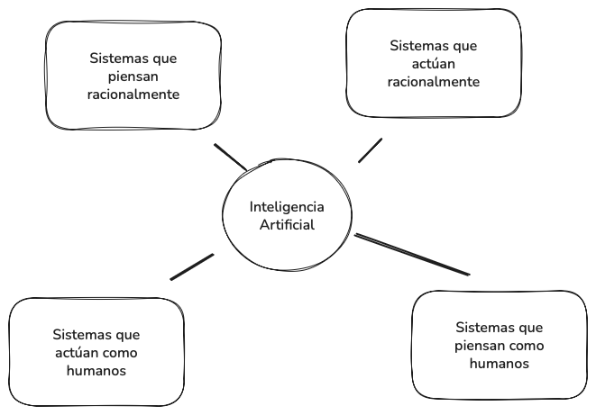

# 1. Definiciones y conceptos clave

La inteligencia artificial (IA) es un campo de la informática que busca diseñar sistemas capaces de ejecutar tareas que, si fueran realizadas por seres humanos, requerirían inteligencia. Esta definición amplia abre la puerta a un debate sobre qué entendemos por “inteligencia” y hasta qué punto puede trasladarse a una máquina.

## Inteligencia e inteligencia artificial: diferencias y similitudes

La **inteligencia humana** se manifiesta en la capacidad de razonar, aprender de la experiencia, adaptarse a entornos cambiantes y resolver problemas novedosos. La **inteligencia artificial**, en cambio, no reproduce la conciencia ni la experiencia subjetiva, sino que simula algunos procesos cognitivos mediante algoritmos y modelos computacionales. Ambas comparten la finalidad de lograr conductas adaptativas y eficaces frente a problemas, pero difieren en los mecanismos subyacentes: mientras la inteligencia humana emerge de la interacción compleja entre biología y cultura, la IA se apoya en reglas formales, aprendizaje automático y capacidad de cómputo.

## Un "mapa" de la inteligencia artificial

La **inteligencia artificial** no es un campo homogéneo, sino un conjunto amplio de aproximaciones que buscan reproducir o simular distintos aspectos de la inteligencia. Una de sus ramas históricas es la **IA simbólica**, que representa el conocimiento mediante reglas lógicas y sistemas expertos capaces de razonar de forma explícita. Junto a ella se encuentra la **IA evolutiva**, inspirada en procesos biológicos como la selección natural o la cooperación en enjambres, aplicada sobre todo a problemas de optimización. En paralelo, la **IA probabilística** ofrece un marco matemático para tratar la incertidumbre mediante redes bayesianas y modelos estadísticos.

Dentro de este panorama aparece el **aprendizaje automático (machine learning)**, que constituye hoy la rama más dinámica de la IA. Su característica distintiva es que no se basa en reglas fijas, sino en algoritmos que aprenden directamente de los datos. El aprendizaje automático se subdivide en enfoques supervisados, no supervisados y por refuerzo, cada uno con sus propias aplicaciones y técnicas. Finalmente, dentro de este subconjunto encontramos el **aprendizaje profundo (deep learning)**, que utiliza redes neuronales artificiales de múltiples capas capaces de descubrir representaciones jerárquicas y muy complejas. El deep learning ha dado lugar a avances como el reconocimiento de imágenes, los sistemas de traducción automática o los **Large Language Models (LLMs)** que impulsan los chatbots actuales.

Este marco de clasificación permite entender que la IA es más amplia que el machine learning, y que a su vez el deep learning constituye solo una parte de este último, coexistiendo con otras corrientes igualmente válidas que abordan el problema de la inteligencia desde perspectivas simbólicas, evolutivas o probabilísticas.

## Algunos conceptos básicos: agente, entorno, percepción, racionalidad, razonamiento

En el estudio de la inteligencia artificial resulta esencial la noción de **agente**. Un agente es toda entidad capaz de **percibir su entorno** mediante sensores y de **actuar sobre él** a través de actuadores. Esta definición es amplia porque abarca tanto a los robots físicos, como un dron que usa cámaras y motores para volar, como a los sistemas virtuales, como un asistente de recomendación que procesa clics de usuarios y devuelve sugerencias personalizadas.

El **entorno** es el espacio donde el agente se desenvuelve y que establece las condiciones de sus acciones. Puede ser **determinista**, cuando cada acción tiene siempre la misma consecuencia (como en un tablero de ajedrez), o **estocástico**, cuando las mismas acciones pueden generar resultados distintos según el momento o las circunstancias (como ocurre en la conducción real). Asimismo, algunos entornos son **totalmente observables**, ya que el agente tiene acceso a toda la información necesaria para decidir, mientras que otros son **parcialmente observables**, obligando al agente a trabajar con incertidumbre y deducir lo que no ve.

> **Ejemplo de entorno físico**: la conducción autónoma representa un entorno estocástico y parcialmente observable. El coche no puede anticipar con exactitud las decisiones de otros conductores y sus sensores están expuestos a condiciones cambiantes como niebla o lluvia.
>
> **Ejemplo de entorno virtual**: un sistema de recomendación en una plataforma de vídeo se enfrenta a un entorno dinámico. La percepción se limita a los historiales de interacción del usuario, que no siempre revelan de forma completa sus preferencias, y la acción consiste en ofrecer nuevas sugerencias que maximicen la probabilidad de que el usuario siga interactuando.

La **percepción** constituye el vínculo entre el entorno y el agente. No siempre es exacta: puede ser incompleta o estar afectada por ruido, lo que obliga al agente a manejar incertidumbre. Por ejemplo, un coche autónomo que recibe datos de sensores de radar y cámaras debe interpretar correctamente las condiciones del tráfico, aun cuando haya lluvia, niebla o interferencias.

La **racionalidad** se refiere a la capacidad del agente de tomar decisiones orientadas a un fin, buscando maximizar el éxito esperado de acuerdo con sus objetivos. Ser racional no significa ser perfecto, sino actuar de la mejor forma posible según la información disponible y los recursos computacionales de los que dispone. Un agente puede ser racional incluso con percepciones parciales, siempre que adopte estrategias que incrementen su probabilidad de éxito en ese escenario limitado.

El **razonamiento**, por su parte, alude al proceso interno mediante el cual el agente selecciona y justifica sus acciones. Este razonamiento puede adoptar diferentes formas: en la **IA simbólica**, se realiza mediante la aplicación de reglas lógicas y motores de inferencia; en la **IA probabilística**, se basa en cálculos estadísticos que estiman la probabilidad de éxito de cada opción; en la **IA conexionista**, se apoya en modelos que aprenden patrones de comportamiento a partir de datos. Cada uno de estos enfoques ofrece ventajas y limitaciones, y en la práctica muchos sistemas modernos combinan más de uno para lograr un comportamiento más robusto.

## Qué es un modelo de IA y cómo se caracteriza

Un **modelo de inteligencia artificial** puede entenderse como una **abstracción matemática o computacional** que trata de capturar los patrones esenciales de un problema para producir soluciones útiles. Igual que un mapa no es el territorio, pero sirve para orientarse, un modelo no reproduce toda la complejidad de la realidad, sino que la simplifica para hacerla manejable.

La **estructura matemática** de un modelo depende del enfoque. En un sistema simbólico puede estar formada por reglas lógicas y bases de conocimiento; en el aprendizaje automático adopta la forma de funciones que se ajustan a datos; y en las redes neuronales se representa como capas de nodos y conexiones ponderadas.

El **tipo de datos de entrada** es otro rasgo definitorio. Algunos modelos trabajan con texto (procesamiento de lenguaje natural), otros con imágenes (visión artificial), señales numéricas, o incluso con información combinada de distintas fuentes. Lo importante es que los datos proporcionan la materia prima a partir de la cual el modelo reconoce patrones.

En cuanto a los **métodos de aprendizaje**, encontramos modelos entrenados de manera **supervisada**, que aprenden a partir de ejemplos con la respuesta correcta ya conocida (como un clasificador de correos spam/no spam); modelos **no supervisados**, que buscan estructuras ocultas en datos sin etiquetar (como un algoritmo de agrupamiento de clientes en marketing); y modelos de **aprendizaje por refuerzo**, donde un agente mejora su estrategia interactuando con un entorno y recibiendo recompensas o penalizaciones.

El **tipo de salida** define qué ofrece el modelo una vez entrenado. Puede tratarse de una etiqueta (por ejemplo, “positivo” o “negativo” en un análisis de sentimientos), un valor numérico (como la predicción del precio de una vivienda), una acción (girar a la izquierda en un coche autónomo) o incluso contenido nuevo (como un texto generado por un modelo de lenguaje o una imagen creada por una red generativa).

En definitiva, un modelo de IA actúa como una **simplificación operativa de la realidad**: no pretende captarla en toda su complejidad, sino representarla lo suficiente como para resolver un problema concreto de forma automatizada y con un grado de eficacia medible.

> **Ejemplo**: Un sistema de detección de fraude en transacciones bancarias utiliza como entrada los registros de pagos (cantidad, lugar, hora, dispositivo). A través de un modelo supervisado, aprende a distinguir entre operaciones normales y sospechosas. Su salida es una etiqueta que clasifica la operación como “legítima” o “fraudulenta”. Aunque el modelo no entiende el contexto social ni la psicología del fraude, su abstracción matemática es suficiente para reducir riesgos en la práctica.

------

**Para reflexionar...**

> **¿En qué sentido un agente artificial puede considerarse “racional” si su conocimiento del entorno es incompleto o incierto?**
> piensa en la diferencia entre actuar con certeza y actuar maximizando la probabilidad de éxito con información limitada.

## Hacia una definición definitiva de Inteligencia Artificial

La inteligencia artificial ha sido definida de distintas formas a lo largo de su historia, y ninguna definición única ha logrado imponerse de manera definitiva. Esto se debe a que la IA es un campo en constante evolución, que combina fundamentos teóricos, desarrollos tecnológicos y aplicaciones prácticas.

### Primeras definiciones y aportaciones históricas

El término **“inteligencia artificial”** fue acuñado en 1956 por **John McCarthy**, quien la describió como *“la ciencia e ingeniería de hacer máquinas inteligentes, especialmente programas de cómputo inteligentes”*. Su definición pone el acento en la construcción de sistemas con capacidad de resolver problemas que normalmente requerirían inteligencia humana.

Antes de McCarthy, el matemático británico **Alan Turing** ya había sentado las bases teóricas de la computación moderna. En 1936 introdujo la idea de la **máquina de Turing**, una abstracción capaz de ejecutar cualquier cálculo siguiendo reglas lógicas. En 1950, en su famoso artículo *Computing Machinery and Intelligence*, propuso el **Test de Turing**: un experimento para evaluar si una máquina puede comportarse de forma indistinguible de un humano en una conversación. Turing fue pionero en la pregunta de si las máquinas podían “pensar”, mientras que McCarthy impulsó el desarrollo de la IA como disciplina independiente y práctica, creando además el lenguaje de programación **LISP**, fundamental en la investigación simbólica.

Así, mientras **Turing** ofreció las bases filosóficas y teóricas, **McCarthy** consolidó la IA como un campo autónomo de investigación, con un enfoque en la representación del conocimiento y el razonamiento simbólico.

### La clasificación de Russell y Norvig

Décadas más tarde, los investigadores **Stuart Russell y Peter Norvig**, autores del influyente libro *Artificial Intelligence: A Modern Approach (AIMA)*, ampliaron la perspectiva distinguiendo dos grandes ejes:

- **Enfoques orientados a la imitación humana** (sistemas que piensan o actúan como humanos).
- **Enfoques orientados a la racionalidad** (sistemas que piensan o actúan racionalmente).

Esta clasificación nos permite entender que la IA no se limita a reproducir la mente humana, sino que también busca diseñar **agentes racionales**, es decir, sistemas que toman decisiones óptimas de acuerdo con el contexto.

En este marco, Russell y Norvig proponen **cuatro definiciones clásicas** de IA:

#### **Sistemas que piensan como humanos.**

Buscan replicar procesos cognitivos humanos, como la resolución de problemas.

> **Ejemplo:** las **redes neuronales convolucionales** imitan, de forma muy simplificada, el funcionamiento de las neuronas en la visión humana para identificar patrones en imágenes.

#### **Sistemas que actúan como humanos.**

Reproducen conductas observables de las personas, como la interacción por voz o el movimiento en robots.

> **Ejemplo:** los asistentes virtuales como **Siri o Alexa** interpretan órdenes de voz y responden como lo haría un humano en una conversación básica.

#### Sistemas que piensan racionalmente.

Se basan en la lógica formal y las reglas matemáticas para llegar a conclusiones óptimas.

> **Ejemplo:** **DENDRAL**, sistema experto de los años 60, ayudaba a químicos a deducir estructuras moleculares a partir de espectros de masas utilizando reglas lógicas.

#### **Sistemas que actúan racionalmente.**

Se conciben como **agentes inteligentes** que buscan maximizar recompensas en función de su entorno.

> **Ejemplo:** los sistemas de conducción autónoma evalúan constantemente el tráfico y eligen acciones que optimicen seguridad y eficiencia.

**Para reflexionar...**

> **Pregunta:** ¿qué significa ser “racional” en un entorno complejo?
> **Clave:** un coche autónomo puede enfrentarse a dilemas éticos donde la decisión más segura no siempre coincide con la más justa.

### Una definición operativa: AI Watch (UE)

La **Comisión Europea**, a través de la iniciativa **AI Watch**, ha ofrecido una definición práctica de IA que propone un **enfoque operativo diferente** y que se basa en una **línea de acción orientada a objetivos**:

Con este enfoque se buecaría la **solución más óptima a un problema**, sin importar cómo los humanos lo resuelven. La metodología sería pues secundaria, priorizando la solución inteligente y óptima al problema. Al final, el **objetivo constante de la IA sería la creación de agentes inteligentes para la mayor cantidad posible de tareas diferentes**. Dada la diversidad de tareas, los métodos de la IA son igualmente variados.

Para la iniciativa, son de particular interés en la IA los **agentes de aprendizaje**, que son capaces de modificarse a sí mismos a partir de ejemplos de entrenamiento o retroalimentación (positiva o negativa), de tal manera que la utilidad promedio de sus acciones aumente con el tiempo.

En resumen, a diferencia de otras definiciones, en esta se enfatizan tres rasgos esenciales:

- **Autonomía:** capacidad de ejecutar tareas sin intervención humana directa.
- **Adaptabilidad:** habilidad de mejorar el rendimiento a medida que aprende de los datos.
- **Interacción:** posibilidad de comunicarse y colaborar eficazmente con personas y otros sistemas.

> **Ejemplo:** los **cobots industriales** trabajan junto a operarios humanos, ajustando su comportamiento mediante sensores de proximidad, aprendizaje continuo y comunicación intuitiva.

### Una definición integradora

Teniendo en cuenta todo lo anterior podríamos elaborar una definición de Inteligencia Artifical que nos de una idea integrada y actual del término.

> La **inteligencia artificial** es el campo que se ocupa del desarrollo de sistemas computacionales y agentes inteligentes con la capacidad de percibir su entorno, procesar información, tomar decisiones y ejecutar tareas de forma **autónoma y adaptativa**. Estos sistemas pueden imitar la cognición o el comportamiento humano, pero su objetivo principal es **actuar de manera racional**, optimizando resultados y resolviendo problemas complejos a través del aprendizaje y la interacción.

Vemos como esta definición abarcaría desde algoritmos que replican procesos biológicos hasta robots que colaboran con personas en entornos industriales.

---

Tabla comparativa de la evolución del término IA

| **Autor / Fuente**          | **Definición / Enfoque**                                     | **Aportación clave**                                         | **Ejemplo ilustrativo**                                      |
| --------------------------- | ------------------------------------------------------------ | ------------------------------------------------------------ | ------------------------------------------------------------ |
| **Alan Turing (1950)**      | Pregunta si las máquinas pueden *pensar* y propone el **Test de Turing** como criterio. | Bases teóricas de la computación y primera aproximación a la inteligencia en términos de comportamiento. | Una máquina que conversa de forma indistinguible de un humano. |
| **John McCarthy (1956)**    | “La ciencia e ingeniería de hacer máquinas inteligentes, especialmente programas de cómputo inteligentes”. | Acuña el término “IA”, promueve el enfoque simbólico y crea el lenguaje **LISP**. | Sistemas expertos que razonan con reglas lógicas.            |
| **Russell & Norvig (1995)** | Cuatro definiciones según si piensan/actúan como humanos o racionalmente. | Amplían el marco conceptual y proponen la visión de **agentes inteligentes**. | Asistentes virtuales (actúan como humanos) o sistemas expertos (piensan racionalmente). |
| **AI Watch (UE, 2019)**     | Definición operativa: IA como sistemas con **autonomía, adaptabilidad e interacción**. | Perspectiva práctica y política para guiar el desarrollo responsable en Europa. | Cobots industriales que colaboran con humanos.               |

