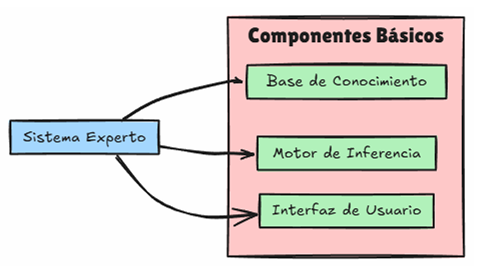
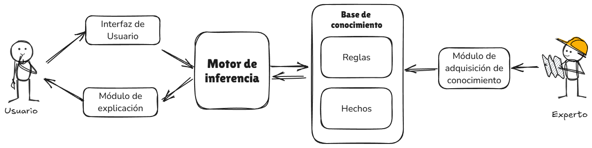
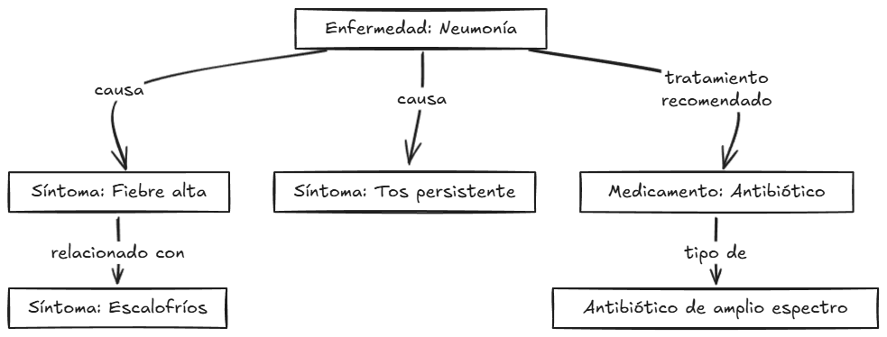
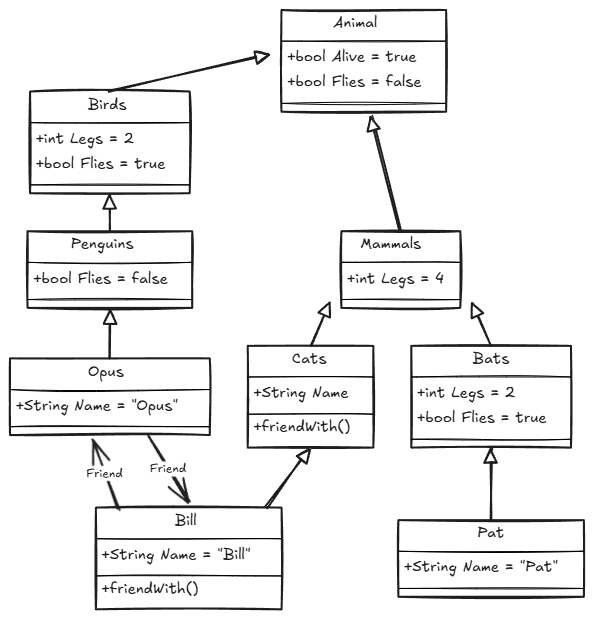
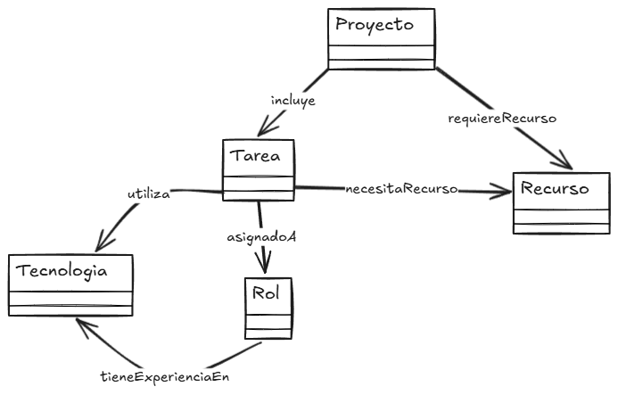
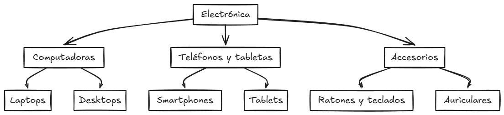
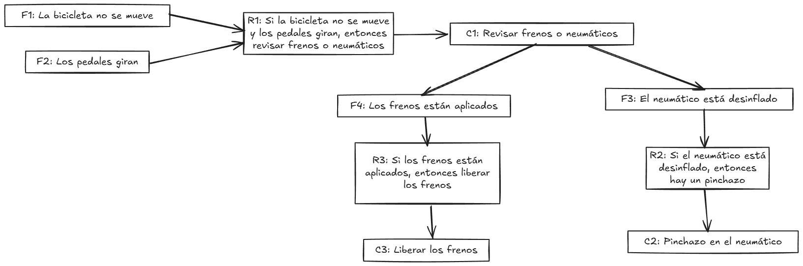
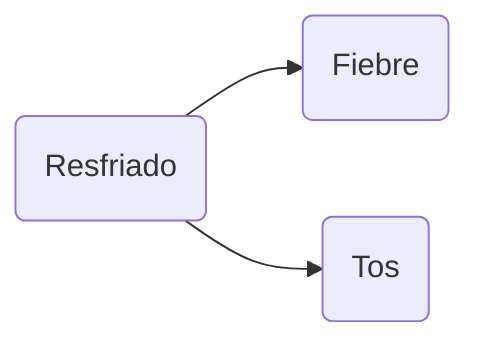
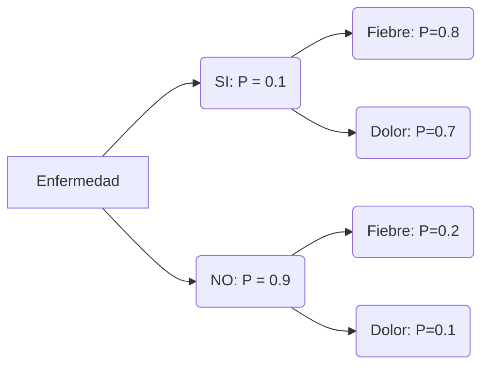
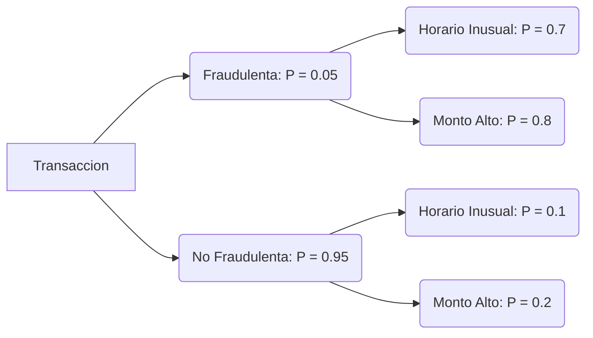

# Tema 2. Representación del conocimiento

> 1. Introducción a la representación del conocimiento
> 1. Sistemas expertos
> 1. Razonamiento impreciso

---

Representación del conocimiento y razonamiento: introducción
===

## Qué significa “representar conocimiento”

En el ámbito de la inteligencia artificial, hablar de **representación del conocimiento** significa mucho más que acumular datos en una base. Se trata de **modelar un fragmento del mundo real** de manera que una máquina pueda **entenderlo y operar con él**. Esto implica traducir hechos, conceptos, relaciones y reglas a un **formato formal y computable** que permita al sistema **razonar**, es decir, **derivar conclusiones nuevas a partir de la información existente**.

### La clave está en la semántica

La diferencia esencial respecto al manejo de datos en bruto es la **semántica**. Mientras que los datos describen observaciones aisladas, el conocimiento incorpora **significado**: identifica entidades, establece vínculos entre ellas y fija condiciones en las que ciertos fenómenos ocurren. Es decir, cuando decimos que una representación de conocimiento incorpora **semántica**, nos referimos a que no solo guarda símbolos, palabras o números, sino también su **significado dentro de un contexto**. La semántica convierte un conjunto de datos dispersos en una **estructura comprensible y útil** para el razonamiento automático.

Por ejemplo, los siguientes datos están desprovistos de semántica

```
“38.5”, “tos”, “paciente_123”
```

Se trata de valores aislados: un número (que podría ser una temperatura), una palabra (tos) y una etiqueta de identificación.

Por contra, a continuación se presentan datos provistos de semántica

```
temperatura(paciente_123, 38.5)
síntoma(paciente_123, tos)
```

Aquí no solo tenemos los valores, sino también su **significado**: la temperatura es un atributo de un paciente, y la tos es un síntoma que él presenta. La semántica, por tanto, es la que hace posible que el sistema **entienda** las relaciones: que 38.5 corresponde a una **temperatura corporal elevada**, que “tos” no es cualquier palabra sino un **síntoma clínico**, y que ambos juntos pueden asociarse a un **estado patológico**.

En el campo de la Inteligencia Artificial, se podría afirmar que la semántica aparece en tres niveles diferenciados: **léxico, estructural y pragmático.**

El **nivel léxico** se ocupa del **significado individual de los símbolos**. Es el primer paso: asignar a cada palabra, término o etiqueta una interpretación que sea coherente con el dominio donde se aplica el sistema.

Por ejemplo, el término **“fiebre”** podría ser entendido por una máquina de muchas maneras: como una palabra sin contexto, como un nombre propio, incluso como parte de una canción. Pero en un sistema médico, el nivel léxico fija que “fiebre” es un **síntoma clínico** que indica temperatura corporal elevada.

Este nivel asegura que el sistema **entienda de qué se está hablando** cuando aparece una palabra o símbolo, evitando ambigüedades iniciales.

Por su parte, el **nivel estructural** se centra en **cómo se relacionan los elementos entre sí**. No basta con saber que existen símbolos, sino que hay que capturar sus vínculos y dependencias lógicas.

Por ejemplo, la regla:
$$
\textbf{Fiebre} \land \textbf{Tos} \rightarrow \textbf{Posible\_Gripe}
$$
establece una **dependencia lógica**: la coincidencia de fiebre y tos aumenta la probabilidad de que el paciente tenga gripe. Aquí los conceptos ya no aparecen de forma aislada, sino como partes de un **sistema de relaciones** que permiten generar conocimiento nuevo.

Así pues, el nivel estructural es clave para pasar de los datos a la **inferencia**, es decir, para deducir o inducir conclusiones que no estaban explícitas en los hechos originales.

Por último, el **nivel pragmático** se ocupa de **cómo se usa la información en contextos reales de acción**. En este nivel la semántica deja de ser un simple mapa de significados o reglas abstractas, para convertirse en una **guía práctica** que orienta decisiones.

Siguiendo el mismo ejemplo: si el sistema detecta que el paciente presenta fiebre y tos, el razonamiento pragmático se traduce en **acciones concretas**, como recomendar una prueba adicional, sugerir aislamiento domiciliario o derivar al especialista. Aquí el conocimiento ya no solo explica, sino que **decide y actúa**, cerrando el ciclo de percepción–razonamiento–acción propio de los sistemas inteligentes.

Visto lo anterior puede afirmarse que estos tres niveles se **acumulan** y se necesitan mutuamente:

- El **léxico** da significado a las palabras básicas.
- El **estructural** organiza esos conceptos en reglas y relaciones.
- El **pragmático** los pone en práctica en un entorno real.

Un sistema de IA que solo se quede en el primer nivel será un mero **almacén de etiquetas**. Si llega al segundo, podrá **razonar**, pero solo al integrar el tercero será capaz de **apoyar decisiones útiles en el mundo real**.

> **Ejemplo**: Un chatbot médico no puede limitarse a reconocer que la palabra “fiebre” aparece en el mensaje (nivel léxico). Debe relacionarla con otros síntomas como “tos” para inferir un posible diagnóstico (nivel estructural), y finalmente ofrecer una acción coherente como recomendar una consulta médica (nivel pragmático).

> **Para reflexionar…**
>
> ¿Qué riesgos puede tener un sistema que se queda solo en el nivel léxico, por ejemplo un buscador que trata “fiebre” como cualquier palabra sin contexto?
>
> ¿Qué ventajas competitivas pueden obtener empresas o instituciones que logran alcanzar el nivel pragmático en la representación del conocimiento?
>

------

Es fundamental usar algún tipo de representación cuando manejamos la semántica de los sistemas inteligentes. Se necesita **ir más allá de los datos aislados** y manejar el **significado de los conceptos**, y para ello se utilizan **representaciones semánticas**. Estas representaciones son formas estructuradas de organizar el conocimiento que facilitan el razonamiento automático y la interpretación en contextos reales. Lo importante es que el sistema **entienda el papel que cada concepto desempeña y cómo se relaciona con los demás**, lo que lo acerca a un conocimiento más próximo al humano.

> **Ejemplo**:
> Un motor de búsqueda que encuentra “jaguar” debe decidir si se refiere a:
>
> - un **animal** (semántica biológica),
> - una **marca de coches** (semántica industrial),
> - o un **equipo de fútbol** (semántica cultural).
>
> Sin semántica, el sistema solo ve una cadena de texto; con semántica, puede **desambiguar** en función del contexto.

Vamos ahora a ocuparnos de las tres formas principales de representar el conocimiento en sistemas de IA: Las ontologías, los grafos de conocimiento y los marcos y redes semánticas.

#### Ontologías

Una **ontología** puede entenderse como un **mapa conceptual formalizado**, cuyo propósito es describir con precisión qué entidades existen en un dominio y cómo se relacionan entre sí. La idea es sencilla pero poderosa: si distintos sistemas o especialistas usan la misma ontología, todos comparten un mismo “vocabulario estructurado” y, por tanto, pueden **intercambiar conocimiento sin ambigüedades**.

A diferencia de una lista de términos o un diccionario, una ontología no solo nombra los conceptos, sino que los **organiza jerárquicamente**. Así, un concepto general puede englobar a otros más específicos: “animal” incluye a “mamífero”, que a su vez incluye a “perro” o “gato”. Pero la ontología no se limita a clasificar; también establece **relaciones semánticas** entre conceptos, como “es parte de”, “causa”, “se asocia con” o “requiere”.

Lo que hace que una ontología sea especialmente útil en inteligencia artificial es su carácter **formal**. Esto significa que no se trata solo de diagramas comprensibles para humanos, sino de estructuras escritas en lenguajes normalizados que las máquinas pueden procesar directamente. En este sentido, una ontología actúa como un **puente entre el conocimiento humano y la interpretación automática**, asegurando que lo que para una persona es intuitivo también pueda ser comprendido y manipulado por un sistema de IA.

Una ontología suele estar formada por tres piezas fundamentales: **conceptos, relaciones y restricciones**.

Los **conceptos** son las **unidades básicas** de la ontología. Representan las entidades principales del dominio, organizadas de lo más general a lo más específico. En cierto modo funcionan como “clases” que agrupan individuos con características comunes. Por ejemplo, en una ontología sobre animales, el concepto general *Animal* puede dividirse en *Mamífero*, *Ave* o *Reptil*, y cada uno de ellos puede subdividirse todavía más, hasta llegar a instancias concretas como *Perro* o *Gato*. Esta organización jerárquica permite **ubicar cada entidad en un nivel de generalidad adecuado**, y facilita que el sistema razone en distintos grados de detalle.

Pero los conceptos por sí solos son poco útiles si no están conectados. Por eso las ontologías definen también **relaciones** que explican cómo se vinculan unos con otros. Estas relaciones tienen un significado semántico explícito: no son simples enlaces arbitrarios, sino conexiones con un papel claro.

Algunos ejemplos frecuentes son:

- **“es un tipo de” (is-a)**: *Perro* es un tipo de *Mamífero*.
- **“forma parte de” (part-of)**: *Corazón* forma parte de *Ser humano*.
- **“está asociado con”**: *Diabetes* está asociada con *Insulina*.

Gracias a estas relaciones, el sistema puede ir más allá de los hechos aislados y **deducir información nueva**. Si sabe que “todo mamífero es un animal” y que “un perro es un mamífero”, puede concluir que “un perro es un animal” sin necesidad de que alguien lo indique expresamente.

Por último, el tercer componente que estructura una ontología, son las **restricciones**, que actúan como condiciones adicionales para garantizar que el conocimiento representado sea **coherente y preciso**. No basta con decir que “un ser humano tiene progenitores”; también es necesario precisar que los progenitores deben ser exactamente dos, y además del mismo tipo (seres humanos).

Las restricciones pueden limitar el número de relaciones permitidas, el tipo de conceptos que pueden vincularse o las propiedades que deben cumplirse en un contexto. En términos prácticos, funcionan como **reglas de consistencia** que ayudan a evitar contradicciones dentro de la ontología.

Al combinar **conceptos, relaciones y restricciones**, la ontología se convierte en un marco robusto para representar el conocimiento de un dominio. Los conceptos proporcionan las piezas, las relaciones marcan cómo se conectan y las restricciones aseguran que todo encaje sin inconsistencias. De este modo, lo que a primera vista parece solo un catálogo jerárquico se convierte en una **infraestructura lógica**, capaz de servir de base para el razonamiento automático y la interoperabilidad entre sistemas.

> **Ejemplo:**
>
> Si construimos una ontología sobre el ámbito educativo, podríamos empezar con un concepto amplio como *persona*, que se divide en *profesor* y *estudiante*. Entre ambos aparecería la relación *enseña a* o *aprende de*. Al definir formalmente estos conceptos y relaciones, el sistema ya puede razonar con ellos: si “Ana es profesora” y “Ana enseña a Juan”, la ontología le permite entender que “Juan es estudiante”.

A la hora de trabajar con ontologías existen toda una serie de herramientas de diseño y manejo de las mismas. Estas herramientas cumplen un papel doble: sirven de **soporte técnico** para la representación formal y de **puente práctico** para que expertos de distintos dominios colaboren en la construcción del conocimiento compartido.

Una de las plataformas más utilizadas a nivel mundial es **Protégé**, desarrollada por la Universidad de Stanford. Se trata de un entorno de software libre que permite crear, visualizar y editar ontologías en formatos estándar como OWL (Web Ontology Language) o RDF (Resource Description Framework). Su principal ventaja es que combina un interfaz accesible con funciones avanzadas, de modo que lo pueden utilizar tanto investigadores en informática como profesionales de otros campos que necesiten representar su conocimiento de forma formalizada. Protégé incluye, además, herramientas de validación que ayudan a comprobar la coherencia de las relaciones definidas.

En paralelo, existen **librerías en distintos lenguajes de programación** que facilitan el trabajo directo con ontologías. En Python, por ejemplo, destaca `OWLready2`, que facilita la integración de ontologías OWL con aplicaciones de IA. Estas librerías resultan útiles cuando se busca combinar la potencia del razonamiento semántico con modelos de aprendizaje automático o sistemas expertos implementados en código.

> Las ontologías son, en definitiva, una forma de **poner orden en el conocimiento**, no solo para clasificarlo, sino para hacerlo **explícito, compartido y utilizable** por sistemas inteligentes. Constituyen una de las piedras angulares de la IA simbólica, porque convierten el lenguaje humano, lleno de matices y ambigüedades, en una representación estructurada que admite razonamiento automático.

------

##### Para reflexionar…

1. ¿Por qué crees que organizar el conocimiento en jerarquías y relaciones explícitas facilita el razonamiento automático?
2. ¿Qué diferencias encuentras entre un diccionario, que simplemente define palabras, y una ontología, que busca capturar un dominio completo de forma estructurada?

#### Grafos de conocimiento

Un **grafo de conocimiento** es una manera de organizar la información inspirada en cómo los seres humanos entendemos las conexiones entre ideas. En lugar de almacenar datos en tablas rígidas, como ocurre en las bases de datos tradicionales, un grafo representa a las **entidades como nodos** y a sus **relaciones como aristas**. Así, cada nodo puede corresponder a una persona, un objeto, un lugar o incluso a un concepto abstracto, mientras que cada arista indica el vínculo que une esas entidades: “trabaja en”, “es parte de”, “causa”, “se trata con”.

La diferencia fundamental es que los grafos de conocimiento no solo dicen *qué datos existen*, sino que también muestran *cómo están conectados* y qué significan esas conexiones. Esto los convierte en estructuras con un enorme valor para la inteligencia artificial, porque permiten que un sistema no se limite a buscar coincidencias de palabras, sino que pueda **razonar con relaciones semánticas**.

Un ejemplo sencillo puede verse en el ámbito de la salud. Supongamos que un grafo contiene la información de que *Juan padece diabetes tipo 2* y que la *diabetes tipo 2 se trata con metformina*. Aunque no lo digamos explícitamente, el sistema puede deducir que *Juan está relacionado con la metformina como tratamiento*. Aquí no se trata solo de unir datos, sino de construir un entramado de significados que facilita inferencias.

Este tipo de grafos destacan por tres cualidades. En primer lugar, su **flexibilidad**: es fácil añadir nuevas entidades y relaciones sin alterar la estructura existente. En segundo lugar, su **capacidad de inferencia**, que permite descubrir vínculos indirectos entre elementos. Y en tercer lugar, su **escalabilidad**, que hace posible construir desde pequeños grafos de dominio —por ejemplo, para gestionar el conocimiento dentro de un pequeño negocio— hasta grafos de alcance global que organizan millones de entidades para mejorar las búsquedas en Internet.

En la práctica, los grafos de conocimiento se aplican en buscadores, asistentes virtuales, sistemas de recomendación, investigación biomédica y ciudades inteligentes, entre otros muchos contextos. Además, en la IA moderna se integran cada vez más con modelos de aprendizaje automático, sobre todo con los grandes modelos de lenguaje (LLMs). De esta combinación surge un equilibrio poderoso: los LLM generan hipótesis y respuestas de manera flexible, mientras que el grafo aporta **anclaje semántico y verificabilidad**. En definitiva, los grafos de conocimiento son la forma en que la inteligencia artificial se acerca a un **entendimiento estructurado del mundo**, conectando datos dispersos en una red que puede ser explorada, ampliada y utilizada para razonar.

Uno de los ejemplos más conocidos de grafos de conocimiento en uso real es el **Google Knowledge Graph**. Se trata de una enorme base de datos semántica que organiza información sobre personas, lugares, objetos, obras y conceptos, vinculándolos entre sí mediante relaciones explícitas.

Su objetivo principal es que el buscador de Google no solo encuentre páginas con palabras coincidentes, sino que **entienda el significado de las consultas**. Gracias a esto, el sistema puede responder de manera más precisa y contextualizada.

> **Ejemplo**: Si escribimos en el buscador “Jaguar”, el sistema no se limita a mostrar páginas que contengan esa palabra. El Knowledge Graph le permite distinguir si nos referimos al animal, a la marca de coches o a un equipo deportivo, en función del contexto y de nuestras búsquedas previas.

El funcionamiento se basa en una gran red de **nodos** (entidades como “Albert Einstein”, “Relatividad”, “Premio Nobel”) y **relaciones** (“descubrió”, “recibió”, “nació en”). De este modo, una consulta puede resolverse no solo con coincidencias de texto, sino con **razonamiento semántico**: relacionando conceptos y trayendo información estructurada.

Esta herramienta tiene aplicaciones que van más allá de las búsquedas en Internet. También se utiliza para alimentar asistentes virtuales como Google Assistant, para mejorar sistemas de recomendación y para integrar información procedente de distintas fuentes en un mismo marco semántico. En definitiva,**Google Knowledge Graph** es un ejemplo de cómo los grafos de conocimiento pueden escalar a nivel global, convirtiéndose en la **infraestructura invisible** que permite que un buscador “entienda” de qué hablamos y no solo “qué palabras” usamos.

> **Neo4j y los grafos de conocimiento**
>
> Para trabajar con grafos en inteligencia artificial necesitamos herramientas capaces de almacenar entidades y relaciones de forma nativa. **Neo4j** es una de las bases de datos orientadas a grafos más extendidas, y se ha convertido en un referente porque permite representar la información directamente en forma de **nodos** (entidades) y **aristas** (relaciones).
>
> A diferencia de las bases de datos relacionales tradicionales, que organizan los datos en tablas, Neo4j se centra en la **conectividad**. Esto hace que consultas complejas sobre relaciones —por ejemplo, “qué medicamentos están relacionados con qué enfermedades y a través de qué síntomas”— puedan resolverse de manera mucho más eficiente. Su lenguaje de consulta, llamado **Cypher**, está diseñado específicamente para navegar por grafos, lo que facilita extraer patrones y dependencias entre elementos.
>
> Aunque Neo4j puede aplicarse en campos tan diversos como redes sociales, logística o detección de fraude, en inteligencia artificial ha cobrado especial importancia como soporte para la construcción de **grafos de conocimiento**. Estos grafos organizan entidades y sus vínculos de forma semántica, permitiendo que un sistema no solo almacene datos, sino que también entienda **cómo se relacionan entre sí**.
>
> Por ejemplo, en el ámbito biomédico, un grafo de conocimiento en Neo4j podría enlazar genes, proteínas y enfermedades, de modo que un investigador pueda explorar de manera intuitiva posibles conexiones relevantes para un diagnóstico o una terapia. En buscadores y sistemas de recomendación ocurre algo similar: Neo4j facilita el almacenamiento y la exploración de grafos que vinculan productos, usuarios, intereses o contextos.
>
> En resumen, Neo4j no es en sí mismo una herramienta exclusiva de grafos de conocimiento, pero por su estructura, lenguaje y flexibilidad, se ha convertido en una de las plataformas más utilizadas para **construir, consultar y explotar grafos de conocimiento** en aplicaciones reales.

#### Marcos y redes semánticas

Además de los grafos de conocimiento, la inteligencia artificial también ha desarrollado otras estructuras diseñadas para capturar el **significado en contextos concretos**. Entre ellas destacan los **marcos** y las **redes semánticas**, cuyo objetivo es representar **escenas o situaciones típicas** de la vida cotidiana.

Un **marco** funciona como una plantilla que organiza los elementos y roles habituales de una situación. Pensemos en la escena “ir a un restaurante”: el marco incluiría papeles como cliente, camarero, menú, comida y cuenta. Cada vez que un sistema se enfrenta a una descripción relacionada con esta situación, puede activar el marco correspondiente y anticipar qué actores y objetos deben intervenir.

Las **redes semánticas** amplían esta idea conectando marcos y conceptos a través de relaciones explícitas, formando una estructura de nodos y enlaces. Estas redes permiten que el sistema **interprete frases ambiguas** o incompletas basándose en el contexto. Si alguien dice “el camarero trajo la cuenta”, el sistema entiende que se trata de la situación del restaurante y que la “cuenta” se refiere al pago de la comida, no a un número abstracto.

La fuerza de marcos y redes semánticas reside en su **capacidad para aportar contexto**. No se limitan a procesar palabras aisladas, sino que representan **conocimiento estructurado de escenas típicas**, lo que ayuda a la IA a anticipar acciones y desambiguar significados. Aunque hoy en día han sido parcialmente sustituidos por modelos conexionistas y grandes modelos de lenguaje, siguen siendo una referencia fundamental en la evolución de la IA simbólica y aún se utilizan en ámbitos donde el contexto estructurado es esencial.

Aunque los **marcos** y las **redes semánticas** surgieron como propuestas específicas dentro de la IA simbólica, en la práctica las herramientas empleadas para su diseño y gestión coinciden con las utilizadas en otras formas de **representación del conocimiento**. Entornos como **Protégé**, las **bases de datos de grafos** (por ejemplo, Neo4j) o las librerías de Python para manejar RDF y ontologías se aplican indistintamente para construir marcos, grafos de conocimiento u ontologías formales. Esto se debe a que, en el fondo, todas estas estructuras comparten la misma lógica: organizar entidades, roles y relaciones de manera que sean comprensibles tanto para un humano como para un sistema automático.

------

> **Para reflexionar…**
>
> ¿Hasta qué punto un modelo actual de lenguaje (como ChatGPT) realmente “comprende” la semántica, y hasta qué punto solo maneja correlaciones estadísticas?
>
> ¿Qué riesgos pueden surgir si un sistema de IA **pierde el contexto semántico** (ej. al tomar decisiones médicas o legales)?
>

### Los objetivos de una representación adecuada

Se puede intuir entonces que representar el conocimiento en IA no tiene como meta acumular símbolos, sino **hacerlos operativos**. En la práctica, esto se traduce en dos grandes objetivos: **explicar** y **decidir**.

**Explicar** significa que el sistema sea capaz de **dar razones** de por qué una conclusión se sostiene o por qué una acción es adecuada. Esta capacidad es clave en entornos profesionales donde la **justificación es tan importante como la respuesta**: medicina, derecho, ingeniería crítica, etc.

Por ejemplo, en un **sistema experto médico**, no basta con indicar que un paciente tiene “posible gripe”. El valor añadido está en que pueda argumentar: “La conclusión se debe a la presencia de fiebre y tos persistente, combinadas con el antecedente de exposición reciente”. En un **sistema financiero**, una recomendación de inversión tiene que ir acompañada de explicaciones sobre los indicadores que han motivado la decisión (riesgo, volatilidad, tendencia del mercado).

De esta forma, la representación no es solo un **mecanismo de cálculo interno**, sino también un **lenguaje de comunicación** entre la máquina y el humano

El otro gran objetivo es la **acción**: tomar decisiones de forma autónoma en función del conocimiento disponible. Decidir supone pasar de “saber algo” a **hacer algo con ello**.

Ilustremos lo anterior con un par de ejemplos. En un **sistema de control industrial**, la regla *“Si la presión del tanque supera cierto umbral, activar válvula de seguridad”* es una decisión automática basada en conocimiento representado formalmente. En el caso de un **robot autónomo**, la representación del entorno permite decidir “gira a la derecha” porque sabe que hay un obstáculo delante y un camino libre a la derecha.

La clave es que la representación esté diseñada no solo para **describir la realidad**, sino para **guíar la acción en ella**.

En la práctica, **explicar y decidir no son objetivos independientes**, sino complementarios. Un sistema que **explica sin decidir** se convierte en un observador pasivo: útil para analizar, pero inoperante en situaciones dinámicas. Por su parte, un sistema que **decide sin explicar** puede ser eficiente, pero genera desconfianza y falta de control (es lo que hoy llamamos “caja negra” en IA). Por eso, los modelos de representación buscan equilibrar ambos propósitos: dar soporte a la **acción autónoma** y, a la vez, mantener la **capacidad de justificar** el razonamiento.

------

> **Ejemplo**: Un asistente virtual para emergencias médicas debe decidir si recomienda administrar un medicamento. Esa decisión debe estar apoyada por una explicación clara: “Se recomienda paracetamol porque el paciente presenta fiebre de 39 °C, no hay alergias registradas y no se han identificado contraindicaciones en su historial”.
>
> Aquí la representación cumple su doble rol: la **decisión inmediata** y la **explicación justificativa**.

------

> **Para reflexionar…**
>
> ¿En qué ámbitos debería darse más peso a la capacidad de **explicar** frente a la de **decidir**?
>
> ¿Qué consecuencias puede tener en la práctica un sistema que **decide muy bien pero no sabe explicar** por qué lo hace?

---

### Criterios de una buena representación

Una representación de conocimiento no es útil por el mero hecho de almacenar símbolos. Para que un sistema pueda **razonar de manera eficaz**, esa representación debe cumplir ciertos **criterios de calidad**.

El primero es la **expresividad**: la capacidad de decir lo que realmente importa en el dominio. Una lógica muy básica puede resultar demasiado limitada para expresar relaciones complejas, mientras que una lógica muy rica puede volverse inabordable en términos de cómputo.

El segundo criterio es la **eficiencia computacional**. Un formalismo no solo debe ser capaz de representar ideas, sino también permitir que un sistema **razone en un tiempo aceptable**. Una representación demasiado pesada o con inferencias inabarcables pierde utilidad práctica.

La **modularidad y mantenibilidad** también son esenciales. El conocimiento debe poder **actualizarse o ampliarse** sin necesidad de reescribirlo todo. En sistemas expertos, por ejemplo, esta cualidad facilita que un especialista humano añada o modifique reglas sin romper la consistencia general.

Otro criterio es la **interpretabilidad**: el sistema debe poder **explicar sus decisiones** de manera que resulten comprensibles para un humano. Sin esta capacidad, aunque la decisión sea correcta, el usuario puede no confiar en ella.

Por último, la representación debe mostrar **robustez ante la incertidumbre**. El mundo real rara vez se presenta en blanco y negro; por eso es importante que el formalismo pueda gestionar información incompleta, imprecisa o conflictiva.

En la práctica, siempre existe un **compromiso**: cuanto más expresivo es un sistema, más costosa suele ser la inferencia. Diseñar una buena representación significa buscar un **equilibrio** entre potencia y viabilidad.

## Conocimiento declarativo y procedimental

Aparte de lo visto hasta ahora, en inteligencia artificial resulta fundamental distinguir entre dos maneras de representar el saber: el **conocimiento declarativo** y el **conocimiento procedimental**. Esta diferencia marca el modo en que un sistema puede explicar lo que sabe y utilizarlo para resolver problemas.

### Conocimiento declarativo: “lo que es”

El conocimiento declarativo expresa **hechos, definiciones y relaciones** que se consideran verdaderos dentro de un dominio. Se representa habitualmente en forma de **reglas, lógicas u ontologías**. Gracias a su estructura explícita, permite a un sistema **explicar sus conclusiones**, verificar su coherencia y ser actualizado por expertos de manera controlada.

> **Ejemplo**:
> En medicina, una regla declarativa podría ser:
> *“Si el paciente tiene fiebre y tos persistente, entonces posible gripe.”*
>
> Aquí, el sistema no solo almacena datos, sino que los **estructura con semántica** para poder razonar sobre ellos.

Su principal ventaja es la **interpretabilidad**: cada paso del razonamiento puede justificarse. Su mayor limitación es la **rigidez**: el conocimiento declarativo requiere un esfuerzo de ingeniería y no se adapta bien a entornos cambiantes o con alta incertidumbre.

### Conocimiento procedimental: “cómo se hace”

El conocimiento procedimental no describe hechos estáticos, sino **estrategias, planes y métodos** para actuar o calcular. Se centra en el *saber hacer*, que puede plasmarse en algoritmos, planes de acción o, en el caso del aprendizaje automático, en **parámetros aprendidos** que guían la conducta del sistema.

> **Ejemplo**:
> En un modelo de aprendizaje por refuerzo, una política $\pi(s)$ especifica qué acción elegir en cada estado $s$.
> En una red neuronal, los **pesos internos** representan cómo transformar una imagen en una clasificación (“neumonía” o “no neumonía”).

La ventaja del conocimiento procedimental es su **eficacia** en problemas complejos y su **capacidad de adaptación**. La limitación está en que suele ser opaco: difícil de leer y justificar, lo que da lugar a las llamadas “cajas negras”.

### La complementariedad entre ambos

En la práctica, los sistemas más robustos combinan las dos perspectivas. El **declarativo** aporta un marco normativo, semántico y explicativo. El **procedimental** aporta adaptabilidad, eficiencia y capacidad de manejar la variabilidad de los datos.

Por ejemplo, en el ámbito de la **banca**, un modelo procedimental calcula la probabilidad de impago, pero reglas declarativas establecen límites legales: *“Nunca aprobar un crédito sin comprobación de ingresos”*. En cuanto al ámbito **sanitario**, un modelo de deep learning detecta patrones en radiografías, pero un grafo de conocimiento declarativo podría garantizar que las recomendaciones respeten protocolos clínicos.

> **Para reflexionar…**
>
> ¿Imagina una disciplina en la que aplicar modelos de IA. ¿Qué aspectos de la misma requieren más **explicaciones transparentes** y cuáles más **decisiones rápidas y adaptativas**?
>
> ¿Qué riesgos tendría delegar todo a modelos procedimentales sin el respaldo de reglas declarativas claras?

## Determinismo e incertidumbre

En los primeros sistemas de inteligencia artificial se asumía que el mundo podía describirse de forma **determinista**: las cosas eran verdaderas o falsas, sin puntos intermedios. Así, una regla como

$$
\textbf{Fiebre} \land \textbf{Tos} \rightarrow \textbf{Posible\_Gripe}
$$

se aplicaba siempre que se cumplieran las condiciones, y el sistema llegaba a una conclusión inequívoca.

Sin embargo, la realidad rara vez se comporta de forma tan clara. Los síntomas pueden aparecer de manera parcial. En sistemas automáticos los sensores pueden fallar y en muchos almacenes de datos, estos suelen estar incompletos. En estos casos surge la **incertidumbre**.

> **Ejemplo**: no todos los pacientes con fiebre y tos tienen gripe; algunos pueden tener una infección distinta o incluso una alergia. Si el sistema tratara esta regla como determinista, daría diagnósticos erróneos.

Para manejar la incertidumbre, la IA ha desarrollado herramientas que permiten asignar **grados de confianza** a las conclusiones en lugar de limitarse al “sí o no”. Una de las más conocidas es la **probabilidad**, que mide hasta qué punto una hipótesis es plausible a partir de la evidencia.

La idea esencial es que, cuando aparece nueva información, un sistema no solo debería **aplicar reglas rígidas**, sino también **actualizar su nivel de certeza** sobre lo que ocurre.

Imagina que queremos saber si un paciente tiene gripe al observar que tiene fiebre. Si sabemos que la gripe produce fiebre en la mayoría de los casos, podemos asignar una **probabilidad alta** a la hipótesis. Pero si también sabemos que la fiebre aparece en muchas otras enfermedades, la probabilidad no será del 100 %.

La **fórmula de Bayes**, que estudiaremos más adelante con detalle, permite actualizar estas creencias de manera formal y consistente. Por ahora basta con entender que la probabilidad ofrece un **lenguaje para hablar de la incertidumbre**.

En conclusion, el enfoque **determinista** simplifica el razonamiento, pero se queda corto en dominios reales. La **incertidumbre** es la norma en la vida real: sensores que fallan, síntomas ambiguos, datos incompletos… En el dominio de la incertidumbre la **probabilidad** es la herramienta más extendida para representar la información cuando trabajamos con IA.

**Para reflexionar…**

¿Qué ejemplos cotidianos conoces en los que un sistema humano o técnico debe decidir **con información incompleta**?

¿Qué riesgos puede tener confiar en sistemas deterministas en entornos donde predomina la incertidumbre?

------

## Del conocimiento al razonamiento

Representar conocimiento no tendría demasiado sentido si ese conocimiento no pudiera usarse para **pensar**. La verdadera utilidad de una representación aparece cuando se convierte en la base de un proceso de **razonamiento**, es decir, cuando un sistema es capaz de ir más allá de lo que ya sabe para **deducir nuevas conclusiones**, **proponer explicaciones plausibles** o **tomar decisiones**.

En inteligencia artificial se distinguen varias formas de razonar. La **deducción** es la más estricta: se trata de derivar consecuencias que son necesariamente verdaderas si lo son las premisas. Es el tipo de razonamiento que se aplica en lógica formal. Si sabemos que todos los pacientes con gripe tienen fiebre, y sabemos que Juan tiene gripe, entonces podemos concluir con certeza que Juan tiene fiebre. La deducción aporta rigor y fiabilidad, pero resulta rígida: depende por completo de la validez de las reglas iniciales.

Más flexible es la **abducción**, que no busca certezas, sino explicaciones razonables para lo que observamos. Si vemos que un paciente tiene fiebre y tos, una hipótesis plausible es que padezca gripe. No es una conclusión garantizada, pero sirve como punto de partida para una investigación o un diagnóstico. La abducción es el razonamiento que mejor refleja la práctica clínica y, en general, cualquier tarea en la que haya que interpretar síntomas, indicios o huellas.

La **inducción**, por su parte, sigue la vía contraria: a partir de varios casos concretos, generaliza una regla que podría aplicarse a situaciones futuras. Si en distintos pacientes la fiebre y la tos se han asociado repetidamente a un diagnóstico de gripe, el sistema generaliza que esos síntomas suelen indicar la enfermedad. Aquí se abre la puerta al aprendizaje automático, que formaliza este proceso inductivo a gran escala mediante algoritmos entrenados con grandes cantidades de datos.

Estas formas de razonar son de importancia fundamental en los denominados **sistemas expertos**. En ellos, estas formas de razonar se implementan de manera operativa mediante dos estrategias clásicas. Por un lado, el proceso denominado **encadenamiento hacia adelante**. Esta forma de proceder comienza con los hechos disponibles y va aplicando reglas de manera progresiva hasta llegar a una conclusión. Si el sistema registra fiebre y tos, aplicará la regla que los relaciona con una posible gripe y derivará ese diagnóstico como resultado. En el otro lado se tienen los procedimientos de **encadenamiento hacia atrás**. En ellos en cambio, se parte de una hipótesis y se buscan las pruebas que la sustenten. En el caso del paciente con posible gripe, el sistema indagará si hay fiebre, tos u otros síntomas asociados.

Estas estrategias permiten que el conocimiento almacenado en forma de hechos y reglas deje de ser un catálogo estático y se convierta en una **máquina de inferencias**, capaz de responder preguntas o apoyar decisiones.

> **Ejemplo:**
>
> Imaginemos que en una base de conocimiento figuran dos reglas: “si hay fiebre y tos, entonces posible gripe” y “si además aparece dolor muscular, se refuerza el diagnóstico de gripe”. Cuando el sistema recibe los síntomas de un paciente —fiebre, tos y dolor muscular—, un encadenamiento hacia adelante activará las dos reglas y generará como conclusión el diagnóstico de posible gripe reforzado por evidencia adicional. Y si, en lugar de tratar el problema como determinista, añadimos probabilidades a los síntomas, se podría llegar a la conclusión final teniendo en cuenta que la gripe es más o menos probable según la prevalencia en la población y los patrones de aparición de los síntomas.

Al final de este apartado, se ha pasado de hablar de **representar conocimiento** a entender cómo se convierte en un proceso de **razonamiento efectivo**. El siguiente paso en nuestro recorrido será estudiar los dos grandes pilares que históricamente han materializado estas ideas: los **sistemas expertos**, que se apoyan en reglas y deducción, y el **razonamiento probabilístico**, que introduce la flexibilidad necesaria para manejar la incertidumbre.

# Sistemas expertos

## Introducción a los sistemas expertos

### Concepto y origen

Los sistemas expertos son una categoría particular de modelos dentro de la inteligencia artificial, que está compuesta por sistemas que emulan la toma de decisiones de un experto humano en dominios específicos. A diferencia de otros sistemas informáticos convencionales, estos se caracterizan por su capacidad de almacenar y utilizar conocimiento especializado, permitiendo que se realicen inferencias lógicas sobre problemas complejos y específicos. Esta capacidad se fundamenta en un proceso de razonamiento que imita la forma en que los especialistas humanos abordarían estos problemas, utilizando reglas y criterios basados en experiencia y conocimiento técnico. **El objetivo principal de un sistema experto es replicar, de forma automatizada, la experiencia y juicio de un experto en tareas que requieren una interpretación profunda y contextualizada de datos.**

#### Origen histórico y evolución

La historia de los sistemas expertos se entrelaza estrechamente con el desarrollo general de la inteligencia artificial, un campo que ya hemos visto cómo surgió formalmente a mediados del siglo XX y que ha experimentado diversas fases de desarrollo e innovación a lo largo de su historia. La idea de que las máquinas puedan simular ciertos aspectos del pensamiento humano, particularmente el razonamiento lógico, comenzó a tomar forma en los años 50, cuando un grupo de investigadores en el marco de la Conferencia de Dartmouth, en 1956, estableció las bases de la inteligencia artificial como disciplina independiente dentro del contexto de las ciencias de la computación. Este evento marcó el inicio de un movimiento intelectual que buscaba diseñar sistemas capaces de resolver problemas y tomar decisiones de manera similar a un humano. Aunque en sus primeras etapas la IA abordaba problemas generales de lógica y computación, con el tiempo surgió un interés particular en crear sistemas que pudieran manejar conocimientos específicos de ciertas disciplinas, como lo haría un experto humano en esos campos. Esta visión dio lugar al desarrollo de los primeros sistemas expertos.

Durante las décadas de 1960 y 1970, los investigadores comenzaron a trabajar en el diseño de programas que emularan el proceso de toma de decisiones en áreas técnicas especializadas, como la medicina o la química. Uno de los primeros sistemas expertos de relevancia fue **Dendral**, desarrollado en los años 60 por Edward Feigenbaum, Bruce Buchanan y Joshua Lederberg en la Universidad de Stanford. Este sistema fue creado para ayudar a los químicos a identificar estructuras moleculares complejas a partir de datos de espectrometría de masas. Su diseño se basaba en la implementación de reglas específicas del dominio químico, y logró resultados sorprendentes, demostrando que un sistema computacional podía, efectivamente, operar a nivel de un experto humano en un ámbito específico. Dendral no solo constituyó una prueba de concepto importante en el ámbito de la IA, sino que también sentó las bases de lo que más tarde se conocería como la **ingeniería del conocimiento**, el proceso de extraer y estructurar el conocimiento experto en un conjunto de reglas y datos que un sistema informático pudiera procesar.

A partir del éxito de Dendral, otros investigadores se interesaron en aplicar la IA a dominios donde la experiencia y el juicio humano eran fundamentales. En la década de los 70, el desarrollo del sistema experto **MYCIN**, también en la Universidad de Stanford, fue un avance significativo en el campo médico. MYCIN fue diseñado para ayudar a los médicos en el diagnóstico y tratamiento de infecciones bacterianas, y utilizaba un conjunto de reglas basadas en el conocimiento médico para emitir recomendaciones de diagnóstico. Aunque nunca se implementó en la práctica clínica, MYCIN demostró el potencial de los sistemas expertos en la asistencia sanitaria y puso de manifiesto un aspecto clave de estos sistemas: su capacidad para manejar la incertidumbre. Los desarrolladores de MYCIN implementaron el uso de factores de certeza, permitiendo que el sistema operara en situaciones donde la información podía ser incompleta o incierta, un desafío común en la práctica médica.

El éxito de estos primeros sistemas expertos impulsó una creciente inversión en el campo de la IA durante los años 80, época en la que los sistemas expertos se consolidaron como una tecnología prometedora para la automatización del conocimiento especializado. Varias empresas comenzaron a adoptar sistemas expertos en áreas como la planificación, el diagnóstico o la gestión de inventarios. En el sector industrial, se destacaron aplicaciones en el mantenimiento predictivo de equipos y en la optimización de procesos, donde el conocimiento experto era clave para la toma de decisiones. A medida que avanzaba la tecnología, surgieron también los primeros entornos de desarrollo de sistemas expertos o ***shells***, que permitían a los ingenieros construir sistemas personalizados sin necesidad de programar cada componente desde cero. Herramientas como EMYCIN (una versión de MYCIN adaptada para otros usos), OPS5 y CLIPS facilitaron la creación de sistemas expertos en un amplio rango de aplicaciones industriales y comerciales.

Sin embargo, el entusiasmo en torno a los sistemas expertos comenzó a disminuir a finales de los años 80, cuando se hizo evidente que estos sistemas enfrentaban limitaciones significativas. Uno de los desafíos principales era la adquisición y actualización del conocimiento: la creación de un sistema experto requería un extenso proceso de recopilación de conocimientos de expertos humanos y su traducción a un formato estructurado. Esto se traducía en un costo elevado, tanto en tiempo como en recursos, lo que dificultaba la escalabilidad de los sistemas y su adaptación a cambios rápidos en el conocimiento del dominio. Además, la dependencia de reglas explícitas hacía que los sistemas expertos fueran rígidos y poco adaptables a nuevas situaciones o a datos no previstos en su diseño inicial.

A pesar de estos problemas, la investigación en sistemas expertos no se detuvo. A lo largo de los años 90, la comunidad de IA comenzó a explorar métodos que permitieran a los sistemas adaptarse y aprender de los datos, lo que llevó al desarrollo de enfoques híbridos que combinaban reglas con técnicas estadísticas y de aprendizaje automático. Estas innovaciones marcaron el comienzo de una nueva generación de sistemas expertos más flexibles y adaptables, capaces de integrarse con otras tecnologías de IA, como las redes bayesianas o los algoritmos de aprendizaje profundo. En este contexto, los sistemas expertos evolucionaron hacia sistemas de apoyo a la decisión y herramientas analíticas que continúan siendo relevantes en la actualidad, especialmente en sectores como la salud, la ingeniería y la logística.

Hoy en día, los sistemas expertos representan una de las aplicaciones clásicas de la IA y son una muestra de la evolución de esta disciplina. Su desarrollo inicial, impulsado por la necesidad de automatizar el conocimiento especializado, sentó las bases para muchas de las técnicas que ahora se utilizan en inteligencia artificial. Aunque los sistemas expertos tradicionales han sido superados en algunos aspectos por las tecnologías de aprendizaje automático, su capacidad para estructurar y aplicar el conocimiento en forma de reglas continúa siendo un recurso valioso en aplicaciones **donde la transparencia y la explicabilidad son esenciales**. Sin duda, los sistemas expertos han dejado una huella duradera en el campo de la inteligencia artificial, y su historia refleja la evolución y los desafíos constantes de la IA en la búsqueda de emular el pensamiento humano.

### Características principales

La característica distintiva de los sistemas expertos es su habilidad para emular el razonamiento humano en tareas altamente especializadas. A través de un proceso de inferencia lógica y análisis de datos, estos sistemas pueden interpretar la información del mismo modo que lo haría un experto humano, tomando decisiones informadas basadas en el conocimiento específico del dominio. Esta emulación del razonamiento humano es especialmente valiosa en sectores donde las decisiones requieren precisión y están fundamentadas en el análisis profundo de una situación, como en la medicina, la ingeniería o las finanzas.

Para lograr esta capacidad de análisis, los sistemas expertos estructuran su funcionamiento en torno a la representación del conocimiento y la toma de decisiones. La representación del conocimiento, normalmente mediante una serie de reglas y hechos, permite que el sistema almacene y recupere información clave del dominio en el que opera. La toma de decisiones se sustenta en la capacidad del sistema para aplicar estas reglas y hechos en contextos específicos, ejecutando procesos de razonamiento que simulan el proceso de pensamiento de un experto humano.

Los componentes básicos de un sistema experto, que facilitan tanto la representación del conocimiento como la toma de decisiones, son el motor de inferencia y la base de conocimiento. La base de conocimiento es el repositorio central de datos, reglas y hechos del dominio, recopilados y estructurados para ser fácilmente accesibles y aplicables. Esta base de conocimiento puede incluir desde información categórica hasta reglas condicionales complejas que permiten al sistema realizar inferencias de alto nivel. Por su parte, el motor de inferencia es el mecanismo que permite al sistema aplicar las reglas de la base de conocimiento a situaciones concretas, produciendo así conclusiones y recomendaciones. A través de una serie de métodos de razonamiento, como el encadenamiento hacia adelante y hacia atrás, el motor de inferencia puede analizar los datos disponibles y generar una respuesta lógica o recomendación basada en el contexto.

Además de estos elementos, algunos sistemas expertos incluyen un módulo de explicación, que permite al sistema justificar sus decisiones de manera comprensible para el usuario. Este módulo es especialmente útil en aplicaciones sensibles, como el diagnóstico médico o el asesoramiento financiero, donde los usuarios necesitan comprender cómo y por qué se llegó a una determinada conclusión.



## Arquitectura de los sistemas expertos

En un sistema experto podemos identificar varios módulos clave que trabajan en conjunto para simular el proceso de toma de decisiones de un experto humano en un dominio específico. Esta estructura o arquitectura permite al sistema capturar, procesar y aplicar el conocimiento necesario para resolver problemas complejos de manera eficiente. Los componentes principales incluyen la base de conocimiento, el motor de inferencia, un módulo de explicación y la interfaz de usuario, además de un módulo opcional de adquisición de conocimiento. El cómo se represente el conocimiento jugará un papel crucial en la eficacia del sistema, ya que define cómo se estructuran y manipulan los datos.




La **base de conocimiento** es el repositorio central donde se almacenan los hechos y reglas que describen el dominio de aplicación. Este conocimiento se organiza de forma que permita un acceso y actualización eficientes, y puede incluir tanto información declarativa como procedimental. La calidad de la base de conocimiento es un factor determinante en la precisión y efectividad del sistema. En este sentido, la representación del conocimiento puede adoptar distintas formas, ya sea como reglas de producción, marcos, redes semánticas u ontologías. La elección de dicha representación influirá en la eficiencia de las operaciones de búsqueda e inferencia y en la capacidad del sistema para manejar datos complejos.

El **motor de inferencia** es el mecanismo que procesa la base de conocimiento para aplicar reglas y llegar a conclusiones lógicas. Emplea métodos como el encadenamiento hacia adelante o hacia atrás para simular el razonamiento humano. Dependiendo del problema, el motor de inferencia puede usar factores de certeza para manejar la incertidumbre, proporcionando respuestas probabilísticas en lugar de decisiones estrictamente binarias.

El **módulo de explicación** es un componente que permite que el sistema justifique sus recomendaciones o conclusiones al usuario. Ofrece una trazabilidad de las reglas y datos utilizados durante el proceso de inferencia, aumentando la transparencia y la confianza en el sistema. Las explicaciones pueden adaptarse según el nivel de detalle que requiera el usuario, desde un resumen general hasta un análisis detallado.

La **interfaz de usuario** es la vía a través de la cual los usuarios interactúan con el sistema. Una interfaz bien diseñada facilita la entrada de datos y la comprensión de las respuestas y explicaciones proporcionadas por el sistema. En sistemas complejos, es esencial que la interfaz sea intuitiva para usuarios con distintos niveles de especialización.

Por último, el **módulo de adquisición de conocimiento**, aunque puede ser opcional, es fundamental en sistemas que necesitan actualizar su base de conocimiento con regularidad. Permite la incorporación de nueva información sin necesidad de una reprogramación completa, adaptando el sistema a los cambios en el dominio.

> Al final, la arquitectura de un sistema experto integra de manera coordinada estos módulos para **simular el proceso de razonamiento humano y ofrecer soluciones en dominios específicos**. La combinación de una base de conocimiento sólida y un motor de inferencia eficaz, junto con módulos de explicación y adquisición de conocimiento, permite a los sistemas expertos proporcionar recomendaciones precisas y adaptarse a nuevos escenarios.

### Base de conocimiento

La base de conocimiento es el componente fundamental en un sistema experto, encargada de almacenar la información y las reglas que representan el conocimiento del dominio específico en el que opera el sistema. Su diseño y estructura son críticos para garantizar que el sistema pueda acceder, interpretar y aplicar este conocimiento de manera eficiente al resolver problemas y tomar decisiones.

#### Características de la base de conocimiento

La base de conocimiento no se limita a ser un simple almacenamiento de datos; es un repositorio estructurado que contiene tanto hechos como reglas, permitiendo que el sistema simule el razonamiento de un experto humano. Los elementos que componen una base de conocimiento se pueden clasificar en dos categorías principales. Por un lado el denominado **conocimiento declarativo**, que Incluye **hechos y descripciones estáticas sobre el dominio**. Estos datos representan información específica que el sistema puede utilizar directamente, del tipo "la fiebre es una temperatura corporal superior a 37 grados Celsius". Por otro lado se dispone del **conocimiento procedimental**, consistente en un conjunto de instrucciones que indican cómo actuar o proceder en situaciones específicas. Por ejemplo, una regla del tipo “si la fiebre supera los 39 grados, recomendar medicamentos antipiréticos” formaría parte del conocimiento procedimental, ya que guía la acción a tomar en función de los datos disponibles.

#### Representación del conocimiento

Ya se ha comentado que el modo en que se representa el conocimiento en la base de conocimiento afecta directamente la capacidad del sistema para realizar inferencias de manera eficiente. Existen varias técnicas de representación del conocimiento que se enumeran a continuación

En primer lugar se dispone de las denominadas **reglas de producción**. Estas son estructuras del tipo “si-entonces” que permiten modelar el conocimiento en forma de condiciones y acciones. Por ejemplo, "si un paciente presenta tos seca y fiebre alta, entonces sospechar una infección viral". Las reglas de producción son ideales para sistemas expertos porque simulan de manera natural el proceso de razonamiento humano, descomponiendo problemas complejos en decisiones más pequeñas y manejables.

Los **hechos** representan información concreta y verificable, como "la presión arterial alta es aquella superior a 140/90 mm Hg". Estos hechos actúan como entradas que el motor de inferencia utiliza para evaluar y aplicar las reglas de producción.

Por otro lado están los **marcos**. Estructuras que agrupan atributos y valores relacionados con un objeto o concepto específico. Los marcos se utilizan cuando es necesario organizar datos complejos, permitiendo que cada marco contenga subcampos y propiedades que describan en detalle un tema. Por ejemplo, un marco que describe un paciente puede incluir atributos como “edad”, “síntomas” y “historial médico”.

Por último se pueden citar las **redes semánticas**. Una representación gráfica en la que los nodos representan conceptos y los enlaces muestran las relaciones entre ellos. Este enfoque es útil para capturar relaciones complejas entre términos, facilitando la comprensión y visualización de cómo los conceptos están interconectados.

> **Ejemplo**: En un sistema experto diseñado para el diagnóstico de enfermedades respiratorias, la base de conocimiento podría incluir hechos como “tos productiva” o “saturación de oxígeno por debajo de 90%”, y reglas como “si el paciente tiene tos productiva y fiebre alta, entonces considerar neumonía”. Estos elementos se basan en el conocimiento aportado por especialistas médicos y literatura científica.

#### Fuentes de la base de conocimiento

El conocimiento almacenado en la base proviene de diversas fuentes, entre las que se encuentran fundamentalmente los expertos humanos, la documentación técnica o en algunos casos los propios datos empíricos.

En el caso de los **expertos** en el dominio su participación es fundamental, ya que es necesario capturar conocimiento implícito que no siempre está documentado. Este proceso puede incluir entrevistas, observaciones y talleres donde se extraen las estrategias y criterios que los expertos utilizan al tomar decisiones.

Por su parte, la **documentación y los manuales** en forma de libros de texto, artículos académicos o manuales técnicos son fuentes valiosas de información verificable que se pueden traducir en hechos y reglas para la base de conocimiento.

Y también, en algunos casos, la **experiencia empírica** puede servir para construir o refinar la base de conocimiento. En este sentido, el análisis de datos históricos y patrones observados en casos previos puede ser de mucha utilidad. Este enfoque es común en sistemas expertos que aprenden y adaptan su base de conocimiento con el tiempo.

#### Mantenimiento y actualización de la base de conocimiento

El mantenimiento de la base de conocimiento es un aspecto clave para la eficacia continua del sistema experto. Primeramente debe existir una **actualización periódica** que permita reflejar los cambios en el dominio, en forma de nuevos descubrimientos o procedimientos actualizados. Esto es especialmente relevante en campos en rápida evolución, como la medicina o la tecnología. A medida que se incorporan nuevas reglas y hechos, es crucial garantizar que no se introduzcan inconsistencias o contradicciones a través de un proceso de **verificación de consistencia**. En este sentido, un sistema de gestión de la base de conocimiento podría ayudar a automatizar esta verificación, asegurando que las nuevas entradas no comprometan la integridad del sistema.

Algunos sistemas expertos avanzados incluyen módulos de **adquisición de conocimiento automatizada**, que permiten la adquisición automática de nuevo conocimiento mediante el análisis de datos y la integración de información actualizada. Estos módulos pueden ayudar a mantener la relevancia del sistema sin una intervención manual muy extensa.

#### Importancia de la calidad del conocimiento

Evidentemente la efectividad de un sistema experto depende en gran parte de la calidad del conocimiento almacenado en la base. Un conocimiento incompleto o mal estructurado puede llevar a inferencias incorrectas, afectando la confianza del usuario en el sistema. Por ello, es fundamental que el proceso de captura y validación del conocimiento sea riguroso y se enfoque en obtener información relevante, precisa y bien organizada.

> La base de conocimiento es el pilar sobre el que se construye un sistema experto. Su diseño debe ser lo suficientemente flexible para permitir actualizaciones y adaptaciones, y lo suficientemente robusto para garantizar la precisión y la confiabilidad de las respuestas que proporciona el sistema.

### Motor de inferencia

El motor de inferencia es un componente crítico en la arquitectura de un sistema experto, encargado de procesar la información almacenada en la base de conocimiento para generar conclusiones, recomendaciones o decisiones. Este módulo **simula el razonamiento humano aplicando reglas y evaluando hechos**, lo que permite al sistema experto resolver problemas de manera similar a un especialista en el dominio.

Si bien el motor de inferencia aporta la capacidad de replicar el razonamiento de un experto humano y la posibilidad de manejar un gran volumen de reglas y datos, hay que tener en cuenta también que la **complejidad computacional** es un factor a tener muy en cuenta ya que, a medida que la base de conocimiento crece, el número de reglas y hechos que el motor debe procesar puede aumentar exponencialmente, afectando el rendimiento del sistema. Es crucial optimizar los algoritmos de búsqueda y las estrategias de control de la agenda para mantener la eficiencia.

El motor de inferencia funciona mediante la aplicación de reglas lógicas que se encuentran en la base de conocimiento, combinando estas con los datos proporcionados por el usuario o los hechos conocidos. Existen dos principales enfoques para el proceso de inferencia: el encadenamiento hacia adelante (*forward chaining*) y el encadenamiento hacia atrás (*backward chaining*).

#### Encadenamiento hacia adelante y hacia atrás: una primera aproximación

Los sistemas expertos necesitan un mecanismo para **poner en marcha las reglas de su base de conocimiento**. Dos de las estrategias más utilizadas son el **encadenamiento hacia adelante** y el **encadenamiento hacia atrás**, que se diferencian en el punto de partida de su razonamiento.

En el **encadenamiento hacia adelante**, el sistema comienza con los datos disponibles y va aplicando reglas de manera sucesiva, generando nuevos hechos y conclusiones a medida que avanza. Este enfoque resulta muy útil cuando se desea **explorar todas las posibilidades** a partir de un estado inicial. Por eso es frecuente en contextos de diagnóstico o monitoreo, donde se espera que el sistema detecte problemas o proponga hipótesis sin necesidad de fijar de antemano un objetivo concreto.

El **encadenamiento hacia atrás**, en cambio, funciona como un razonamiento “a la inversa”. El sistema parte de una **hipótesis o meta** y busca en la base de conocimiento qué hechos y reglas serían necesarios para confirmarla. Si no dispone de la información directamente, intenta descomponer la hipótesis en subobjetivos hasta encontrar las pruebas que necesita. Este enfoque es especialmente adecuado cuando se quiere **verificar un resultado concreto**, como en sistemas legales o de planificación, donde interesa comprobar si se cumplen determinadas condiciones normativas o de procedimiento.

En resumen, el encadenamiento hacia adelante se caracteriza por su **exploración amplia** a partir de los datos, mientras que el encadenamiento hacia atrás ofrece una **búsqueda enfocada** hacia la validación de hipótesis. Ambos enfoques constituyen la base operativa de los sistemas expertos, y en apartados posteriores del tema los estudiaremos en detalle, con ejemplos prácticos y análisis comparativo de sus ventajas y limitaciones.

> **Ejemplo**: Un sistema experto en el ámbito jurídico puede comenzar con la hipótesis de que un contrato es válido. Luego, el motor de inferencia retrocede para verificar las reglas relacionadas, como "si ambas partes han firmado el contrato y no hay cláusulas ilegales, entonces el contrato es válido". Si alguna condición no se cumple, el sistema buscará hechos o reglas adicionales que puedan confirmar o refutar el objetivo.

---


> La elección entre encadenamiento hacia adelante y hacia atrás depende de la naturaleza del problema que el sistema experto debe resolver. El encadenamiento hacia adelante es ideal para explorar datos y descubrir nuevas conclusiones, mientras que el encadenamiento hacia atrás es más adecuado para confirmar hipótesis específicas y trabajar de manera más eficiente en entornos con reglas extensas.
>

#### Componentes del motor de inferencia

En el motor de inferencia, a su vez, pueden identificarse varios subcomponentes que trabajan en conjunto para interactuar con la base de conocimiento y llevar a cabo inferencias. Uno de los más importantes es el **motor de búsqueda**, que se encarga de explorar la base de conocimiento y aplicar ciertos algoritmos de búsqueda según el enfoque de encadenamiento seleccionado. Para gestionar este componente el motor de inferencia cuenta con una **agenda de reglas**, una estructura de control que organiza y prioriza las reglas aplicables según el contexto, permitiendo al motor de inferencia elegir las más pertinentes en situaciones donde múltiples reglas pueden coincidir. Este proceso se complementa con el **mecanismo de control de conflictos**, encargado de resolver los casos en los que varias reglas podrían aplicarse al mismo tiempo. Para decidir cuál regla ejecutar primero, algunos sistemas expertos implementan estrategias de priorización que consideran la especificidad de la regla o el orden de llegada.

Existen escenarios donde la incertidumbre es un factor relevante, y en ellos el motor de inferencia incorpora lo que se denomina **un gestor de certeza**. Este componente calcula el grado de certeza de las conclusiones basándose en medidas como la probabilidad o factores de certeza. Así, el sistema puede ofrecer respuestas más flexibles y realistas cuando los datos no son completamente precisos o están incompletos. Este componente lo encontraremos fundamentalmente en sistema imprecisos.

#### Tipos de mecanismos de razonamiento

Un motor de inferencia puede implementar dos tipos básicos de mecanismos de razonamiento: el **razonamiento determinista** y el **razonamiento con incertidumbre**.

El **razonamiento determinista** se basa en reglas y hechos que conducen a conclusiones absolutas. Cada vez que se cumplen las condiciones de una regla, la conclusión es siempre la misma. Este tipo de razonamiento es adecuado para dominios donde los datos son precisos y no hay ambigüedad.

El **razonamiento con incertidumbre** utiliza medidas probabilísticas o factores de certeza para manejar datos incompletos o ambiguos. Este tipo de razonamiento es común en sistemas expertos médicos o financieros, donde los datos no siempre son exactos o completos. Las técnicas como la lógica difusa, las redes bayesianas o factores de certeza permiten al motor de inferencia modelar el grado de confianza en las conclusiones. Es importante tener en cuenta que el razonamiento en escenario de incertidumbre puede volverse complicado al tratar con múltiples fuentes de incertidumbre. En estos casos la implementación de modelos como redes bayesianas es necesaria para garantizar respuestas precisas y confiables.

> **Ejemplo**: Un sistema experto en finanzas puede usar factores de certeza para evaluar la probabilidad de que una inversión sea rentable. Si los datos sobre el mercado son inciertos, el motor de inferencia puede calcular un porcentaje de certeza que indique la confiabilidad de la recomendación.

> El motor de inferencia es el corazón del sistema experto, actuando como un intermediario que aplica las reglas de la base de conocimiento a los datos para simular el razonamiento humano. Sus mecanismos de encadenamiento hacia adelante y hacia atrás permiten diferentes enfoques de resolución de problemas, y la capacidad de manejar incertidumbre lo hace adaptable a situaciones reales donde los datos no son perfectos. La eficacia de un sistema experto depende en gran medida de la capacidad de su motor de inferencia para procesar datos de manera eficiente y precisa, aplicando el conocimiento almacenado en la base de conocimiento para ofrecer conclusiones fiables y útiles.
>

**Para reflexionar...**  

> **¿Qué mecanismos de inferencia consideras más adecuados para un sistema experto en diagnóstico médico?** 
> (Reflexiona sobre la utilidad del encadenamiento hacia adelante para explorar síntomas y el encadenamiento hacia atrás para confirmar un diagnóstico específico)

### Módulo de explicación

El módulo de explicación es un elemento esencial en los sistemas expertos, especialmente en aquellos donde la transparencia y la confianza en las decisiones son primordiales. Su función principal es proporcionar al usuario una justificación detallada de cómo el sistema llegó a una conclusión, permitiendo una trazabilidad clara de las reglas y datos que se aplicaron durante el proceso de inferencia. Esta capacidad de explicación es particularmente valiosa en sectores como la medicina, la asesoría financiera o el ámbito legal, donde los profesionales necesitan comprender y confiar en las recomendaciones del sistema antes de actuar sobre ellas. Un módulo de explicación bien diseñado contribuye al aprendizaje del usuario, ya que facilita la comprensión de las reglas subyacentes y del proceso de toma de decisiones del sistema.

Otro aspecto fundamental del módulo de explicación es la mejora de la confianza en el sistema. Los usuarios tienden a confiar más en un sistema experto si pueden entender el razonamiento detrás de sus recomendaciones. Esta confianza es un factor clave en la adopción y uso sostenido de la tecnología. Por ejemplo, un médico que utiliza un sistema de diagnóstico asistido por IA es más probable que siga sus sugerencias si puede ver claramente cómo se llegaron a las conclusiones y qué datos se utilizaron.

#### Tipos de explicaciones

El módulo de explicación puede ofrecer distintos niveles de detalle y tipos de respuestas, según las necesidades del usuario y la complejidad de la aplicación. Estas pueden ser principalmente de tres tipos:

Las **explicaciones descriptivas** proporcionan una visión general de las razones que llevaron a la conclusión, mostrando de forma simplificada las reglas y los hechos relevantes. Son adecuadas para usuarios que necesitan un resumen rápido y claro de las decisiones del sistema sin entrar en detalles técnicos.

Las **explicaciones detalladas** son útiles en situaciones donde se requiere un mayor nivel de profundidad. El módulo de explicación puede ofrecer un desglose completo del proceso de inferencia, incluyendo todas las reglas aplicadas y los hechos consultados. Estas explicaciones son útiles para usuarios técnicos o expertos en el dominio que buscan validar y entender a fondo el comportamiento del sistema.

Por último, las **explicaciones paso a paso** detallan cada etapa del proceso de inferencia, mostrando cómo se aplicaron las reglas y cómo se derivaron los nuevos hechos. Resultan útiles en entornos educativos o en sistemas donde es fundamental seguir la lógica de manera secuencial.

#### Implementación del módulo de explicación

La implementación de un módulo de explicación eficaz requiere un diseño cuidadoso que equilibre la cantidad de detalle ofrecido con la claridad y accesibilidad de la información. Es común que los sistemas expertos utilicen técnicas como el almacenamiento de rastros de ejecución, que registran los pasos y las decisiones tomadas por el motor de inferencia durante el proceso. Este rastro permite al módulo de explicación reconstruir el razonamiento en un formato comprensible para el usuario.

Otra técnica común es la **justificación de reglas**, en la que el sistema resalta qué reglas específicas de la base de conocimiento se aplicaron y cómo estas contribuyeron a la conclusión. Este enfoque es especialmente útil en sistemas basados en reglas de producción, donde las decisiones son el resultado de aplicar secuencias complejas de condiciones y acciones.

En sistemas más avanzados, la generación de explicaciones puede incluir técnicas de visualización que permiten a los usuarios ver gráficos de las relaciones entre los hechos y las reglas aplicadas. Estas herramientas visuales facilitan la comprensión de la estructura lógica del proceso de inferencia, haciendo que las explicaciones sean más intuitivas.

#### Beneficios y desafíos

El módulo de explicación ofrece beneficios claros en términos de confianza, transparencia y aceptación del sistema. Sin embargo, también presenta desafíos. Uno de los más notables es el **balance entre detalle y comprensión**: ofrecer explicaciones demasiado técnicas puede ser abrumador para usuarios no especializados, mientras que explicaciones demasiado simplificadas pueden carecer de la información necesaria para ser útiles.

Otro posible desafío es el que tiene que ver con el **rendimiento del sistema**. La generación de explicaciones detalladas y rastreos de la inferencia puede aumentar la carga computacional, especialmente en sistemas complejos con múltiples reglas y hechos. Para superar este problema, los diseñadores de sistemas expertos deben encontrar un equilibrio entre la riqueza de las explicaciones y la eficiencia operativa del sistema.

> **Ejemplo**: Un sistema experto en diagnóstico médico puede proporcionar explicaciones de por qué sugirió un diagnóstico de neumonía. El módulo de explicación podría detallar que la conclusión se basó en la presencia de síntomas como fiebre alta, tos productiva y dolor en el pecho, mostrando también la regla que aplicó: "si fiebre alta, tos y dolor en el pecho, entonces considerar neumonía". Además, podría indicar que esta regla fue aplicada con un 90% de certeza basado en datos históricos.

En conclusión, el módulo de explicación es vital para la aceptación y confianza en los sistemas expertos. Su capacidad para proporcionar justificativos comprensibles y adaptados a diferentes niveles de usuario convierte a los sistemas expertos en herramientas más transparentes y efectivas, permitiendo a los usuarios tomar decisiones mejor informadas y, al mismo tiempo, aprender del proceso de inferencia del sistema.

### Interfaz de usuario y módulo de adquisición de conocimiento

#### Interfaz de usuario

La interfaz de usuario es un componente crucial en cualquier sistema experto, ya que define el punto de interacción entre el usuario y el sistema. Una interfaz bien diseñada permite no solo la entrada de datos, sino también el acceso a las recomendaciones, conclusiones y explicaciones que el sistema proporciona. En entornos industriales, médicos o financieros, donde se manejan datos complejos y las decisiones tienen un impacto significativo, la claridad y la accesibilidad de la interfaz se vuelven esenciales. 

Una interfaz de usuario eficaz en un sistema experto debe garantizar la usabilidad y la comprensión de sus funciones. Es importante que sea **intuitiva**, permitiendo al usuario operar el sistema con facilidad y sin necesidad de una capacitación excesiva, lo cual es especialmente relevante en entornos donde el personal puede no contar con experiencia técnica avanzada. La **interactividad** es otra característica esencial, ya que un diseño interactivo posibilita la entrada de datos, el ajuste de parámetros y la realización de consultas de forma dinámica. Las interfaces modernas mejoran la experiencia del usuario al incorporar elementos gráficos como menús desplegables, cuadros de diálogo y gráficos interactivos.

La **presentación de los resultados** también juega un papel crítico. Las recomendaciones y conclusiones deben mostrarse de manera clara y relevante, con formatos que se adapten a las necesidades del usuario, ya sea mediante tablas, gráficos o texto. Por último es importante un aspecto de la interfaz como es su **capacidad de proporcionar acceso al módulo de explicación**. Este recurso permite que los usuarios comprendan las razones detrás de las decisiones o recomendaciones del sistema, lo cual incrementa la transparencia y la confianza en su uso.

> **Ejemplo**: Un sistema experto para el mantenimiento preventivo de maquinaria industrial puede tener una interfaz que muestre alertas cuando ciertas condiciones se cumplan (por ejemplo, vibraciones anormales en un motor). El usuario puede hacer clic en la alerta para ver una explicación detallada que incluya los datos monitoreados y las reglas aplicadas.

#### Módulo de adquisición de conocimiento

El módulo de adquisición de conocimiento es otra pieza fundamental de los sistemas expertos, especialmente en dominios que requieren actualización continua de información. Este módulo facilita la incorporación de nuevos datos y reglas en la base de conocimiento, asegurando que el sistema permanezca actualizado sin necesidad de reprogramaciones exhaustivas.

El módulo de adquisición de conocimiento desempeña funciones esenciales que permiten mantener la relevancia y precisión de un sistema experto. La **capacidad de actualización automática** es fundamental en sistemas que integran fuentes de datos externas, como bases de datos de investigación o sensores en tiempo real. Esta característica permite que el módulo procese y actualice la base de conocimiento sin intervención manual, adaptando el sistema a nuevos estudios y recomendaciones, como en el caso de sistemas médicos que incorporan avances y directrices recientes de asociaciones profesionales.

La **curación y validación del conocimiento adquirido** es otro aspecto vital. No toda la información que se obtiene automáticamente es apta para ser integrada directamente en la base de conocimiento. Por esta razón, el módulo incluye mecanismos de validación que aseguran la coherencia y precisión de los datos, los cuales pueden ser verificados mediante algoritmos automáticos o revisiones por expertos humanos. Esta validación es crucial para mantener la consistencia del sistema y evitar la incorporación de información errónea o contradictoria.

La **capacidad de adaptación** del módulo a nuevos contextos le confiere flexibilidad al sistema experto, lo cual es indispensable en dominios en constante cambio. Implica la habilidad del sistema para ajustar su comportamiento y sus reglas en respuesta a cambios en el entorno del dominio o en las condiciones bajo las que opera. Esta capacidad es más amplia que la actualización, ya que no solo se trata de agregar nuevos datos, sino de modificar y ajustar los procesos de inferencia, reglas de decisión y patrones de razonamiento para que el sistema mantenga su eficacia frente a nuevos contextos o escenarios. Por ejemplo, en el sector financiero, el módulo puede ajustar las reglas y los datos del sistema conforme se modifican las políticas económicas o se introducen nuevos indicadores de riesgo, asegurando que el sistema permanezca relevante y actualizado.

Otro elemento a tener en cuenta en cualquier módulo enfocado a la adquisición conocimiento es el de las **metodologías**. Existe diversidad en el uso de las mismas. Por ejemplo, la **extracción manual** es una de las formas más tradicionales de recopilar y estructurar información que luego se formaliza en la base de conocimiento. Esta metodología se basa en la colaboración de los expertos a través de entrevistas y talleres. En otros casos, la **adquisición automática** permite que el sistema utilice técnicas avanzadas de procesamiento de lenguaje natural y aprendizaje automático para extraer y organizar conocimiento a partir de grandes volúmenes de datos no estructurados, como documentos y publicaciones científicas.

Evidentemente la **retroalimentación** de los usuarios también juega un papel importante en la adquisición de conocimiento. En sistemas como los que se implementan para asistencia en diagnósticos médicos, los profesionales pueden proporcionar evaluaciones y retroalimentación que enriquecen y optimizan la base de conocimiento, adaptando el sistema a prácticas y experiencias reales que mejoran su rendimiento con el tiempo.

En cualquier caso, el proceso de adquisición de conocimiento no está exento de retos. Uno de los principales es la **veracidad y consistencia de la información**: incorporar datos de múltiples fuentes puede resultar en inconsistencias o contradicciones en la base de conocimiento. Además, es necesario garantizar la **seguridad de los datos**, especialmente en sectores como la salud, donde se maneja información sensible. Otro desafío es la **gestión de la sobrecarga de datos**. Cuando el sistema recibe grandes volúmenes de nueva información, el módulo debe ser capaz de priorizar qué datos son relevantes y cómo integrarlos de manera eficiente sin degradar el rendimiento del sistema.

**Para reflexionar...** 

> **¿Qué ventajas aporta un módulo de adquisición de conocimiento en un sistema experto para mantenimiento preventivo en una planta industrial?** 
> **Clave**: Considera la necesidad de actualizar las reglas y datos del sistema conforme se introducen nuevos equipos y se identifican nuevas fallas o patrones de desgaste.

### Representación del conocimiento en sistemas expertos

La representación del conocimiento otro de los elementos esenciales en un sistema experto, ya que define cómo se estructura, almacena y accede a la información en la base de conocimiento. Una representación eficaz no solo permite que el motor de inferencia acceda y procese datos de forma eficiente, sino que también facilita la comprensión y actualización de la base de conocimiento. Dependiendo de la naturaleza del problema a resolver, se pueden emplear diferentes métodos de representación, cada uno con sus propias ventajas y limitaciones.

#### Representación basada en reglas

La representación basada en reglas es uno de los métodos más utilizados en sistemas expertos debido a su simplicidad y efectividad en la modelización de conocimientos que pueden expresarse en términos de condiciones y acciones. Este enfoque se organiza mediante reglas de producción que siguen un esquema del tipo “si-entonces” (IF-THEN), donde la parte “si” (premisa o antecedente) especifica las condiciones bajo las cuales se activa la regla, y la parte “entonces” (consecuencia) define la acción o conclusión que debe tomarse si se cumplen las condiciones.

##### Estructura y características de las reglas de producción

Una regla de producción en un sistema experto se representa generalmente de la siguiente manera:

```pseudocode
SI <condición1> Y/O <condición2> ENTONCES <acción o conclusión>
```

Cada regla puede ser evaluada de forma independiente, y el motor de inferencia se encarga de analizar todas las reglas relevantes para determinar cuáles deben aplicarse en función de los hechos presentes en la base de conocimiento. Las reglas de producción son particularmente útiles para sistemas que requieren tomar decisiones basadas en un conjunto definido de condiciones lógicas.

> **Ejemplo**: Considere un sistema experto de diagnóstico médico que evalúa los síntomas de un paciente para identificar posibles enfermedades. Una regla de producción para detectar una infección respiratoria podría ser:
>
> ```pseudocode
> SI el paciente tiene fiebre alta Y tos persistente ENTONCES considerar una infección respiratoria.
> ```
>
> En este caso, la premisa está compuesta por dos condiciones: fiebre alta y tos persistente. Si ambas se cumplen al evaluar los hechos del paciente, el sistema concluye que debe considerarse la posibilidad de una infección respiratoria.

##### Procesamiento y evaluación de reglas

El motor de inferencia utiliza las reglas de producción para evaluar y derivar nuevas conclusiones a partir de los hechos conocidos. Ya hemos visto que este proceso puede implementarse mediante dos enfoques principales: **encadenamiento hacia adelante** (*forward chaining*) y **encadenamiento hacia atrás** (*backward chaining*). En el encadenamiento hacia adelante, el sistema parte de los hechos iniciales y aplica las reglas para derivar nuevos hechos y conclusiones. En el encadenamiento hacia atrás, el sistema parte de una hipótesis o conclusión y busca validar las condiciones necesarias que la sustentan.

El procesamiento de las reglas puede ser complejo cuando existen muchas reglas potencialmente aplicables al mismo tiempo. Para gestionar esta complejidad, se utilizan mecanismos de resolución de conflictos que ayudan al motor de inferencia a decidir qué regla aplicar primero. Estos mecanismos pueden incluir estrategias de priorización basadas en criterios como la especificidad de la regla, el orden de llegada o el uso de pesos asignados a cada regla.

##### Ventajas y limitaciones de la representación basada en reglas

Este enfoque presenta varias ventajas. Es fácil de entender y de programar, ya que cada regla actúa como una unidad lógica independiente que se puede añadir, modificar o eliminar sin afectar significativamente al resto del sistema. Esto facilita el mantenimiento y la escalabilidad del sistema. Además, las reglas de producción permiten modelar el razonamiento humano de manera natural, haciendo que la lógica de inferencia sea transparente y explicable para los usuarios.

Otra ventaja es la flexibilidad en la creación de sistemas expertos en dominios donde el conocimiento es explícito y bien definido, como en sistemas de diagnóstico médico, control de calidad industrial o sistemas de asistencia en la toma de decisiones financieras.

Pero a pesar de sus beneficios, la representación basada en reglas tiene limitaciones. Cuando el dominio es altamente complejo y existen muchas reglas, el sistema puede volverse difícil de gestionar y mantener. La cantidad de combinaciones posibles de reglas y hechos puede crecer exponencialmente, lo que puede afectar al rendimiento y hacer que el sistema se vuelva menos eficiente.

Otro problema es la falta de capacidad para manejar incertidumbre o datos ambiguos. Las reglas tradicionales del tipo “si-entonces” generalmente asumen que las condiciones son absolutas, lo que puede no ser adecuado en situaciones donde la información es incompleta o incierta. Para abordar este problema, se pueden integrar mecanismos de manejo de incertidumbre, como factores de certeza o probabilidades, pero esto añade complejidad al sistema.

##### Ejemplo detallado: Sistema experto para control de inventario

Consideremos un sistema experto para la gestión de inventarios en una tienda minorista. El objetivo es optimizar la reposición de productos basándose en las condiciones de inventario y la demanda esperada. Las reglas de producción podrían incluir:

```pseudocode
Regla 1:
SI el inventario de un producto es menor a 20 unidades Y la demanda semanal proyectada es alta ENTONCES hacer un pedido de reposición.

Regla 2:
SI el inventario de un producto es mayor a 100 unidades Y la demanda semanal proyectada es baja ENTONCES suspender nuevos pedidos de ese producto.

Regla 3:
SI el inventario de un producto está entre 20 y 100 unidades Y la demanda semanal proyectada es media ENTONCES monitorear y evaluar nuevamente en tres días.

```

Estas reglas permiten que el sistema tome decisiones automáticas para gestionar el inventario de manera eficiente. Cada regla evalúa condiciones específicas de la base de conocimiento (el inventario actual y la demanda proyectada) y realiza una acción que optimiza el proceso de reposición.

En situaciones donde múltiples reglas pueden aplicarse, el motor de inferencia necesita un mecanismo para resolver conflictos y priorizar qué regla ejecutar. Por ejemplo, si un producto tiene un inventario de 19 unidades y la demanda proyectada es media, podrían aplicarse tanto la regla 1 como la regla 3. Un mecanismo de resolución de conflictos podría priorizar la regla 1 debido a su mayor especificidad o a un peso asignado previamente que indique su importancia relativa.

> [!important]
>
> La representación basada en reglas, por tanto, es una herramienta poderosa para modelar sistemas expertos que requieren decisiones basadas en lógica condicional clara y bien definida. Sin embargo, su eficacia depende de una gestión cuidadosa de las reglas y de la capacidad del motor de inferencia para manejar conflictos y aplicar las reglas de manera eficiente.

#### Redes semánticas y marcos

Las **redes semánticas** son una representación gráfica del conocimiento que utiliza nodos y enlaces para ilustrar la relación entre conceptos dentro de un dominio específico. Esta representación se asemeja a un grafo, donde los nodos corresponden a conceptos o entidades, y los enlaces representan las relaciones entre ellos. Por ejemplo, en una red semántica que describe enfermedades y tratamientos, un nodo podría representar el concepto de “neumonía”, mientras que otro nodo representa el “antibiótico”, y el enlace entre ellos podría describir una relación de “tratamiento recomendado”.

> **Ejemplo**: En un sistema de análisis de redes sociales, una red semántica puede utilizarse para representar a los usuarios como nodos y las interacciones entre ellos como enlaces. Las etiquetas en los enlaces pueden indicar el tipo de interacción, como “comentó”, “reaccionó a” o “compartió”, permitiendo al sistema deducir patrones de influencia y conexiones clave en la red.

Una de las ventajas principales de las redes semánticas es su capacidad para capturar relaciones complejas que van más allá de una simple asociación. Los enlaces pueden etiquetarse para indicar diferentes tipos de relaciones, como "causa", "parte de", "es un tipo de", o "afecta a". Esto proporciona un nivel de granularidad y contexto que es difícil de lograr con representaciones más simples, como las basadas solo en reglas. Por ejemplo, una red semántica en un sistema experto médico podría mostrar cómo la “diabetes” se relaciona con “complicaciones cardíacas” a través de un enlace etiquetado como “factor de riesgo”.

Las redes semánticas son especialmente útiles para la visualización de relaciones complejas y para la inferencia de nuevos hechos a partir de los datos existentes. El motor de inferencia puede navegar la red para deducir asociaciones indirectas que no están explícitamente representadas. Por ejemplo, si una red muestra que “X” causa “Y” y “Y” está relacionado con “Z”, el sistema puede inferir que “X” podría estar indirectamente relacionado con “Z”.

Esta capacidad de inferencia es particularmente valiosa en sistemas expertos que operan en dominios con un alto nivel de interconexión de conceptos, como la medicina, la biología o el análisis de riesgos financieros. Sin embargo, un desafío importante en el uso de redes semánticas es el mantenimiento y la gestión de la red, especialmente en sistemas que deben incorporar constantemente nuevos datos y relaciones. La escalabilidad se puede ver comprometida a medida que crece el número de nodos y enlaces, lo que puede requerir herramientas especializadas y algoritmos optimizados para mantener la eficiencia del sistema.

> **Ejemplo**: Red semántica en formato gráfico que podría usarse en la ayuda al diagnóstico de la nueumonía
>
> 
>
> - El nodo **"Enfermedad: Neumonía"** es el concepto central de la red.
> - Hay enlaces que indican que la neumonía **"causa"** síntomas como fiebre alta y tos persistente.
> - Se incluye un nodo de **"tratamiento recomendado"** que conecta la enfermedad con un **"Medicamento: Antibiótico"**.
> - Se detalla que el antibiótico pertenece al tipo **"Antibiótico de amplio espectro"**.
> - Se añade una relación adicional que muestra que la **"fiebre alta"** está **"relacionada con"** otro síntoma, los escalofríos.
>
> Este ejemplo ilustra cómo una red semántica permite representar conceptos y sus relaciones de forma visual y estructurada, facilitando la inferencia y el análisis de datos en sistemas expertos.

---

Los **marcos** son otra técnica de representación que proporciona una estructura para organizar atributos y valores asociados con un objeto o concepto específico. Esta metodología es útil para representar entidades complejas que tienen múltiples propiedades. Un marco es, esencialmente, una estructura de datos que agrupa información en forma de atributos (también conocidos como ranuras o “slots”) y valores.

> **Ejemplo**: En un sistema de tutoría inteligente, un marco para un estudiante podría incluir atributos como “nivel de conocimiento”, “temas completados”, “resultados de evaluaciones” y “objetivos de aprendizaje”. Esto permitiría al sistema adaptar las recomendaciones de estudio basándose en la información almacenada en el marco.

Por ejemplo, en un sistema experto médico, un marco para un paciente puede incluir atributos como “nombre”, “edad”, “síntomas”, “historial médico” y “diagnósticos previos”. Cada uno de estos atributos tiene un valor asociado que puede actualizarse o consultarse durante el proceso de inferencia. Esta forma de representación permite que la información esté organizada de manera que el sistema pueda acceder y modificar los datos de forma eficiente y coherente.

Una de las características más destacadas de los marcos es su capacidad para representar jerarquías y herencia de atributos. Por ejemplo, un marco “paciente” podría heredar atributos comunes de un marco “persona”, como “nombre” y “edad”, mientras que atributos específicos como “síntomas” y “diagnósticos” podrían definirse solo en el marco “paciente”. Esta capacidad de herencia permite la reutilización de estructuras de datos, lo que facilita la gestión y actualización de la base de conocimiento.

Los marcos también permiten definir procedimientos (o “demonios”) que se ejecutan cuando se accede o modifica un atributo. Estos procedimientos pueden realizar cálculos, validar datos o activar otras acciones en el sistema experto. Por ejemplo, un sistema de mantenimiento predictivo podría tener un marco que represente una máquina industrial con un atributo “estado”. Al cambiar el valor del atributo “estado” a “fallo”, un demonio podría activarse automáticamente para registrar el evento y notificar a un operador.


> **Ejemplo:** Representación mediante **marcos** de las relaciones entre distintas entidades que forman parte de un sistema experto. Pueden asimilarse a los esquemas de representación en la programación orientada a objetos4
>
> 

A pesar de sus múltiples ventajas, el uso de marcos puede presentar desafíos, especialmente en la representación de relaciones complejas que no se ajustan fácilmente a una estructura jerárquica. Los marcos están bien adaptados para modelar entidades con atributos definidos y relaciones simples, pero pueden tener dificultades para representar interacciones complejas entre múltiples entidades, como las que se modelan más fácilmente con redes semánticas.

Otro desafío es la gestión de la consistencia de los datos. A medida que un sistema experto crece y la cantidad de marcos se expande, asegurar que los datos y atributos se mantengan actualizados y consistentes puede requerir una revisión y mantenimiento continuos.

##### Uso combinado de redes semánticas y marcos

En la práctica, las redes semánticas y los marcos no son mutuamente excluyentes y, de hecho, pueden complementarse para aprovechar las fortalezas de ambos enfoques. Las redes semánticas pueden utilizarse para modelar las relaciones y asociaciones entre conceptos, mientras que los marcos pueden representar en detalle las características y propiedades de cada entidad. Este uso combinado proporciona una representación más rica y flexible del conocimiento, permitiendo a los sistemas expertos manejar tanto la estructura como las conexiones entre los datos de forma más eficiente.

> **Ejemplo combinado**: Un sistema experto en diagnóstico médico puede usar una red semántica para mapear las relaciones entre enfermedades, síntomas y tratamientos, y marcos para representar la información detallada de cada paciente y sus condiciones particulares. Esta combinación permite que el sistema explore asociaciones complejas y gestione información detallada de manera estructurada, facilitando un diagnóstico más preciso y adaptable.

#### Ontologías y taxonomías en sistemas expertos

Las **ontologías** son una de las formas más avanzadas de representación del conocimiento en los sistemas expertos. Estas estructuras permiten describir de manera explícita no solo los conceptos de un dominio, sino también las propiedades, restricciones y relaciones entre dichos conceptos. Una ontología es más que un simple esquema de datos; es una representación formal y lógica que permite que un sistema no solo almacene conocimiento, sino que también lo interprete, deduzca nueva información y valide la coherencia de los datos. Por ejemplo, en un sistema de asesoría legal, una ontología podría representar términos clave como “contrato”, “parte demandante” o “parte demandada”, incluyendo las propiedades que los definen (como la fecha de inicio o las obligaciones) y las relaciones entre ellos (por ejemplo, “un contrato tiene una parte demandante y una parte demandada”).

El uso de ontologías en sistemas expertos permite una **inferencia lógica más avanzada**, ya que el motor de inferencia puede aplicar reglas complejas definidas en la ontología para deducir nuevas conclusiones. Esto es posible gracias a que las ontologías incluyen axiomas, que son reglas lógicas que definen restricciones y comportamientos. Un sistema de diagnóstico médico basado en una ontología podría, por ejemplo, inferir que si una enfermedad pertenece a la categoría de “infección viral” y un paciente presenta ciertos síntomas, existe una alta probabilidad de que esté enfermo de una infección que se clasifica dentro de esa categoría. La capacidad de manejar y deducir información a partir de axiomas y relaciones permite que el sistema sea mucho más robusto y adaptable frente a nuevos escenarios.

Una ontología se compone de varios elementos esenciales que permiten su funcionamiento efectivo. Se enumeran a continuación:

- **Clases (conceptos)**: Representan las entidades del dominio, como “Paciente”, “Tratamiento” o “Enfermedad”.
- **Propiedades (atributos)**: Detallan las características de las clases. Por ejemplo, la clase “Paciente” podría tener atributos como “edad” y “género”.
- **Relaciones**: Describen cómo las clases interactúan entre sí. Por ejemplo, la relación “es tratado por” podría vincular un “Paciente” con un “Tratamiento”.
- **Axiomas y restricciones**: Son reglas lógicas que definen cómo deben comportarse los conceptos y las relaciones en la ontología. Por ejemplo, un axioma podría indicar que “todo tratamiento requiere un diagnóstico previo”.
- **Individuos (instancias)**: Son las representaciones concretas de las clases. Por ejemplo, un individuo podría ser un paciente específico con un nombre y un historial médico.

La implementación de ontologías proporciona al sistema experto la capacidad de responder preguntas complejas y validar la coherencia de la información, asegurando que los datos cumplan con las restricciones definidas.

> **Ejemplo:** Sistema experto para gestión de proyectos de software
>
> La ontología de este sistema se podría construir para modelar los conceptos relacionados con proyectos, tareas, roles, tecnologías y recursos, así como las relaciones y propiedades entre ellos.
>
> 
>
> Los axiomas de esta ontología podrían ser los siguientes:
>
> - Si una **Tarea** utiliza una **Tecnología**, debe estar asignada a un **Rol** que tenga experiencia en esa tecnología.
> - Un **Proyecto** no puede completarse hasta que todas sus **Tareas** estén asignadas a un **Rol**.
>
> En un sistema experto de gestión de proyectos, esta ontología permitiría validar si un proyecto tiene todos los recursos necesarios antes de su inicio y si cada tarea está debidamente asignada con los recursos y roles adecuados. Por ejemplo, si una tarea de desarrollo requiere un servidor de pruebas como recurso, el sistema verificaría que este recurso esté disponible antes de permitir que la tarea comience.

---

Las **taxonomías** son estructuras jerárquicas que organizan el conocimiento de manera que los conceptos se clasifican en niveles de generalidad o especialización. Una taxonomía puede considerarse una representación más simple en comparación con una ontología, pero es altamente útil para categorizar y clasificar conceptos de forma clara y eficiente. Las taxonomías son esenciales para organizar grandes volúmenes de datos y conceptos en sistemas expertos que necesitan una jerarquización del conocimiento.

Por ejemplo, en un sistema experto de diagnóstico médico, una taxonomía podría clasificar enfermedades en diferentes niveles, comenzando con una categoría general como “enfermedades infecciosas” y dividiéndose en subcategorías más específicas como “infecciones bacterianas” o “infecciones virales”. Esta clasificación permite que el sistema navegue de manera eficiente por el conocimiento, buscando y aplicando reglas y hechos a partir de categorías generales hacia niveles más específicos. Además, una taxonomía bien estructurada permite al sistema realizar búsquedas más rápidas y aplicar inferencias basadas en relaciones de herencia, como “si algo es verdadero para ‘enfermedades infecciosas’, también es cierto para ‘infecciones virales’”.

> **Ejemplo:** Taxonomía en un sistema experto de comercio electrónico
>
> ###### **Contexto del sistema**
>
> El sistema experto se utiliza para organizar y clasificar los productos de un catálogo en un sitio de comercio electrónico. La taxonomía ayuda a categorizar los productos en diferentes niveles de especialización, facilitando la navegación, la búsqueda de productos y la toma de decisiones sobre inventarios y estrategias de marketing.
>
> ##### Estructura de la taxonomía
>
> La taxonomía se organiza jerárquicamente, con categorías generales en la parte superior y subcategorías más específicas en los niveles inferiores.
>
> - Categoría principal: Electrónica
>   - Subcategoría: Computadoras
>     - **Subcategoría específica**: Laptops
>     - **Subcategoría específica**: Desktops
>   - Subcategoría: Teléfonos y tabletas
>     - **Subcategoría específica**: Smartphones
>     - **Subcategoría específica**: Tablets
>   - Subcategoría: Accesorios
>     - **Subcategoría específica**: Ratones y teclados
>     - **Subcategoría específica**: Auriculares
>
> 
>
> En esta taxonomía, los productos electrónicos se dividen en categorías generales y luego se desglosan en subcategorías más específicas:
>
> - **Electrónica** es la categoría general que agrupa todos los productos relacionados con la tecnología electrónica.
> - **Computadoras** es una subcategoría que incluye tanto **Laptops** como **Desktops**, permitiendo al sistema experto clasificar los productos en función de sus características y funciones.
> - **Teléfonos y tabletas** es otra subcategoría que contiene **Smartphones** y **Tablets**, facilitando la búsqueda de estos productos por parte de los usuarios y la organización de inventarios.
> - **Accesorios** abarca productos periféricos como **Ratones y teclados** y **Auriculares**, que son elementos complementarios en el ecosistema de productos electrónicos.
>
> El sistema experto puede usar esta taxonomía para tareas como:
>
> 1. **Clasificación automática de productos**: Cuando un nuevo producto se añade al inventario, el sistema lo clasifica automáticamente en la categoría correspondiente. Por ejemplo, si se introduce un nuevo modelo de **Smartphone**, el sistema lo clasifica bajo **Teléfonos y tabletas > Smartphones**.
> 2. **Recomendaciones de productos**: Basándose en la categoría de productos que un usuario ha navegado o comprado, el sistema puede recomendar productos de la misma subcategoría o de categorías relacionadas.
> 3. **Gestión de inventario**: La taxonomía permite al sistema experto analizar la cantidad de productos en cada subcategoría y ayudar en la toma de decisiones sobre el reabastecimiento o la promoción de productos específicos.

##### Diferencias y sinergias entre ontologías y taxonomías

Si bien las taxonomías y las ontologías comparten la característica de organizar el conocimiento, difieren en su capacidad y complejidad. Las taxonomías proporcionan una clasificación simple y jerárquica, lo que las hace fáciles de implementar y mantener. Sin embargo, carecen de la capacidad de representar relaciones complejas y reglas lógicas que sí pueden incluirse en una ontología. Por otro lado, las ontologías son más ricas y detalladas, permitiendo la modelización de interacciones y comportamientos complejos, pero su implementación y mantenimiento requieren un esfuerzo considerablemente mayor, así como el uso de herramientas especializadas como ***OWL (Web Ontology Language)*** o editores de ontologías como ***Protégé***.

Un sistema experto puede beneficiarse de un enfoque híbrido, en el cual la taxonomía se utilice para estructurar el conocimiento en un primer nivel de categorización, mientras que una ontología aporte el detalle y las reglas necesarias para realizar inferencias complejas. Por ejemplo, un sistema de gestión del conocimiento en una empresa puede usar una taxonomía para clasificar documentos y una ontología para modelar las relaciones entre los conceptos tratados en esos documentos, como “proyectos”, “clientes” y “tecnologías utilizadas”.

##### Desafíos en la implementación de ontologías y taxonomías

La creación y mantenimiento de ontologías presenta varios desafíos, entre los que destacan la complejidad en la definición de las relaciones y restricciones, y la necesidad de que estas sean consistentes y completas. Además, a medida que la ontología crece, se incrementa la dificultad de garantizar la coherencia del sistema y evitar contradicciones. Por su parte, las taxonomías, aunque más simples, pueden presentar limitaciones en cuanto a la profundidad del conocimiento que pueden representar, lo cual puede ser un obstáculo en dominios que requieren una mayor sofisticación para realizar inferencias precisas.

#### Conclusiones finales: Consideraciones y desafíos en la representación del conocimiento

Cada enfoque de representación del conocimiento presenta ventajas y desafíos específicos. Las representaciones basadas en reglas son claras y fáciles de gestionar, pero pueden volverse difíciles de mantener en sistemas de gran escala. Las redes semánticas y los marcos proporcionan flexibilidad y facilidad de visualización, pero pueden requerir una gestión más compleja. Las ontologías y taxonomías, aunque altamente organizadas y detalladas, demandan un esfuerzo considerable en su creación y actualización, y pueden requerir herramientas especializadas para su gestión.

La elección del método de representación dependerá en gran medida del dominio de aplicación y de los requisitos específicos del sistema experto. Un enfoque híbrido que combine varios métodos puede ser necesario para abordar dominios particularmente complejos y garantizar que el sistema experto sea lo suficientemente robusto y flexible para adaptarse a distintos tipos de problemas y datos.

## Razonamiento en sistemas expertos

Los mecanismos de razonamiento en los sistemas expertos son el conjunto de métodos y estrategias que permiten al sistema procesar el conocimiento almacenado en la base y llegar a conclusiones o recomendaciones. Estos mecanismos buscan **emular el razonamiento humano** en la resolución de problemas específicos, ya sea mediante la aplicación de reglas directas o el manejo de incertidumbre cuando la información es incompleta o ambigua. En esta sección, exploraremos tres tipos principales de razonamiento empleados en sistemas expertos: el razonamiento hacia adelante, el razonamiento hacia atrás y el razonamiento probabilístico, abordando sus características, aplicaciones y métodos de implementación.

### Razonamiento hacia adelante (*forward chaining*)

El encadenamiento hacia adelante es el método de inferencia que comienza con los datos iniciales y aplica reglas de manera secuencial para derivar nuevos hechos o conclusiones. Este enfoque es ideal para sistemas expertos donde el objetivo es explorar un conjunto de datos y obtener posibles soluciones basadas en condiciones y reglas aplicadas en un orden determinado.

Este procedimiento presenta algunas ventajas:

- **Exploración amplia**: Es particularmente útil en aplicaciones de diagnóstico y monitoreo, donde se necesita explorar todas las posibles conclusiones a partir de un conjunto de datos inicial.
- **Facilidad de implementación**: La implementación de un motor de encadenamiento hacia adelante suele ser más sencilla, ya que no requiere definir una hipótesis de partida.
- **Respuestas progresivas**: Genera una secuencia de conclusiones a medida que avanza, lo cual es útil en sistemas que necesitan proporcionar actualizaciones en tiempo real.

Este enfoque es común en sistemas expertos de diagnóstico médico, monitoreo de condiciones industriales y sistemas de recomendación. Por ejemplo, un sistema experto que monitorea una planta de energía puede usar encadenamiento hacia adelante para analizar cambios en los sensores y determinar posibles fallos antes de que ocurran problemas graves.

> **Ejemplo**: Un sistema experto para detección de enfermedades comienza con los hechos “temperatura corporal de 39°C” y “tos persistente”. Aplica la regla “si la temperatura es alta y hay tos persistente, entonces sospechar infección”, derivando la conclusión de que el paciente puede tener una infección.

#### Implementación básica del mecanismo

Como se ha comentado más arriba el encadenamiento hacia adelante es un mecanismo de razonamiento utilizado en sistemas expertos, particularmente en aquellos que descansan sobre reglas "Si... entonces...". Este proceso comienza con un conjunto de hechos conocidos y aplica las reglas para obtener nuevas conclusiones. En esencia, **el sistema avanza desde los datos disponibles hacia las conclusiones**.

El mecanismo de encadenamiento hacia adelante es un proceso iterativo que se repite hasta que uno: se alcanza una meta específica o dos: no se pueden obtener más conclusiones a partir de los hechos y reglas existentes.

Los pasos que seguiríamos en este proceso de iteración podrían enumerarse como sigue:

1. **Identificación de hechos:** El sistema identifica los hechos iniciales que son ciertos, los cuales pueden ser proporcionados por el usuario o estar almacenados en la base de conocimientos.
2. **Búsqueda de reglas aplicables:** El motor de inferencia busca reglas cuyas premisas coincidan con los hechos conocidos.
3. **Aplicación de reglas:** Si se encuentra una regla cuyas premisas son ciertas, la conclusión de la regla se añade a la base de hechos como un nuevo hecho.
4. **Repetición:** El proceso vuelve al paso 2 y continúa hasta que no se puedan encontrar más reglas aplicables o se alcance la meta deseada.

> **Ejemplo**
>
> Supongamos que tenemos un sistema experto para diagnosticar enfermedades de las plantas. La base de conocimientos contiene las siguientes reglas:
>
> - **Regla 1:** Si las hojas tienen manchas marrones, entonces la planta tiene la enfermedad X.
> - **Regla 2:** Si la planta tiene la enfermedad X, entonces necesita el tratamiento Y.
>
> El usuario observa que las hojas de su planta tienen manchas marrones. El sistema identifica este hecho como cierto. Luego, busca reglas aplicables y encuentra la Regla 1. Como la premisa de la Regla 1 es cierta (las hojas tienen manchas marrones), la conclusión también es cierta (la planta tiene la enfermedad X). Este nuevo hecho se añade a la base de hechos. A continuación, el sistema busca nuevas reglas aplicables y encuentra la Regla 2. Como la premisa de la Regla 2 es ahora cierta (la planta tiene la enfermedad X), la conclusión también es cierta (la planta necesita el tratamiento Y). El sistema ha llegado a una meta (diagnosticar la enfermedad y recomendar un tratamiento) y el proceso de encadenamiento hacia adelante termina.

#### Optimización del mecanismo

Una vez que se conocen los fundamentos del encadenamiento hacia adelante es como mecanismo de razonamiento en los sistemas expertos, cabe hacer algunas consideraciones sobre cómo optimizar dicho proceso en determinadas situaciones. En efecto, es habitual que cuando la base de conocimiento crece en tamaño y complejidad, surgen problemas derivados de que el sistema explore caminos lógicos **irrelevantes**. Ello afectará tanto al rendimiento como a la eficiencia del razonamiento. Optimizar este proceso es esencial para garantizar que las conclusiones se alcancen de manera precisa y oportuna, especialmente en contextos donde el tiempo y los recursos computacionales son limitados.

##### Priorización de reglas relevantes

Una de las estrategias clave para optimizar el razonamiento es **priorizar reglas relevantes en función de los hechos disponibles**. Esto se puede lograr mediante la asignación de un nivel de importancia a cada regla según su especificidad o frecuencia de uso. Reglas más específicas, que se aplican a situaciones concretas, tienden a ser más útiles que reglas generales en la mayoría de los escenarios.

> **Ejemplo**:
>
> Consideremos un sistema experto para el diagnóstico de problemas mecánicos en bicicletas. La base de conocimiento contiene las siguientes reglas:
>
> 1. **Regla 1**: Si el neumático está desinflado, entonces el problema es un pinchazo.
> 2. **Regla 2**: Si los frenos no funcionan, entonces revisar las pastillas de freno.
> 3. **Regla 3**: Si la bicicleta no se mueve al pedalear y los pedales giran, entonces revisar la transmisión.
> 4. **Regla 4**: Si la bicicleta no se mueve al pedalear y los pedales no giran, entonces revisar la cadena.
>
> Supongamos que el usuario informa los siguientes hechos iniciales:
>
> - La bicicleta no se mueve al pedalear.
> - Los pedales no giran.
>
> En este caso, el sistema debe priorizar las reglas más específicas y directamente relacionadas con los hechos observados, en lugar de evaluar todas las reglas de manera secuencial.
>
> ##### Proceso de priorización y razonamiento
>
> 1. **Hecho inicial**: "La bicicleta no se mueve al pedalear" activa la posibilidad de evaluar tanto la **Regla 3** como la **Regla 4**. Sin embargo, el segundo hecho, "los pedales no giran", es más específico y coincide con la premisa de la **Regla 4**.
> 2. **Evaluación de relevancia**: La **Regla 4** se prioriza porque cumple exactamente con ambas condiciones observadas. Al aplicarla, el sistema concluye: "El problema es la cadena."
> 3. **Evitar evaluaciones irrelevantes**: Dado que la **Regla 4** lleva directamente a una conclusión relevante, las otras reglas (como la **Regla 3**, que requiere condiciones distintas) no se evalúan en este ciclo. Esto ahorra tiempo y recursos computacionales.
>
> Si el sistema hubiese evaluado todas las reglas sin priorización, habría explorado caminos innecesarios, como investigar posibles problemas en la transmisión o frenos, los cuales no son pertinentes a los hechos iniciales. La priorización permite al sistema centrarse en las reglas más relevantes para resolver el problema de manera rápida y eficiente, mejorando su rendimiento incluso en bases de conocimiento más grandes y complejas.
>
> Este enfoque puede mejorarse aún más con técnicas adicionales, como la asignación de pesos a las reglas según su frecuencia de uso o relevancia en contextos similares, lo que optimiza aún más el proceso de inferencia en sistemas expertos dinámicos.
>
> El contexto del problema también puede ser un factor determinante en la selección de reglas prioritarias. En este sentido, las reglas relacionadas directamente con los hechos observados deben evaluarse antes que aquellas que solo tienen una relación indirecta con el problema. Este enfoque evita que el sistema desperdicie recursos procesando reglas que no contribuyen a la solución inmediata.

##### Uso de índices de búsqueda

Otra técnica fundamental es la **organización eficiente de la base de conocimiento mediante el uso de índices de búsqueda**. Estas estructuras permiten acceder rápidamente a las reglas pertinentes a partir de los hechos iniciales. Por ejemplo, una tabla hash puede asociar cada condición evaluada con un conjunto de reglas relevantes, permitiendo que el motor de inferencia acceda directamente a las reglas aplicables en lugar de revisar toda la base de conocimiento. De manera similar, la organización jerárquica de las reglas puede facilitar la evaluación primero de las categorías generales antes de explorar niveles más específicos, reduciendo así el espacio de búsqueda.

> **Ejemplo**:
>
> En un sistema experto como **BikeXpert**, que diagnostica problemas en bicicletas, la base de conocimiento puede crecer significativamente a medida que se añaden reglas y hechos. Para optimizar el proceso de búsqueda en el encadenamiento hacia adelante, podemos utilizar **índices de búsqueda** que asocien condiciones específicas con las reglas relevantes, reduciendo la necesidad de explorar toda la base de conocimiento.
>
> ###### Escenario
>
> La base de conocimiento incluye las siguientes reglas:
>
> 1. **Regla 1**: Si el neumático está desinflado, entonces el problema es un pinchazo.
> 2. **Regla 2**: Si los frenos no funcionan, entonces revisar las pastillas de freno.
> 3. **Regla 3**: Si la bicicleta no se mueve al pedalear y los pedales giran, entonces revisar la transmisión.
> 4. **Regla 4**: Si la bicicleta no se mueve al pedalear y los pedales no giran, entonces revisar la cadena.
>
> Los hechos iniciales son:
>
> - La bicicleta no se mueve al pedalear.
> - Los pedales no giran.
>
> ###### Índices de búsqueda en acción
>
> Para evitar revisar cada regla de manera secuencial, los hechos se indexan y se vinculan con las reglas que dependen de ellos. Esto se implementa creando un mapa o tabla hash donde las condiciones de las reglas se asocian con los hechos pertinentes:
>
> | **Hecho clave**              | **Reglas asociadas** |
> | ---------------------------- | -------------------- |
> | La bicicleta no se mueve     | Regla 3, Regla 4     |
> | Los pedales no giran         | Regla 4              |
> | El neumático está desinflado | Regla 1              |
> | Los frenos no funcionan      | Regla 2              |
>
> #### Proceso de inferencia con índices
>
> 1. **Consulta inicial**: Cuando se reciben los hechos "la bicicleta no se mueve" y "los pedales no giran", el motor de inferencia consulta el índice.
> 2. **Selección de reglas**: El índice filtra rápidamente las reglas relevantes. En este caso, "los pedales no giran" apunta directamente a la **Regla 4**. No es necesario explorar la **Regla 3**, ya que no coincide con el hecho adicional.
> 3. **Evaluación específica**: La **Regla 4** se evalúa inmediatamente porque ambas condiciones se cumplen, concluyendo que "el problema es la cadena."
> 4. **Evita exploraciones innecesarias**: Las reglas como la **Regla 1** y la **Regla 2**, relacionadas con hechos irrelevantes, no son consideradas en este ciclo.
>
> ###### Ventajas del uso de índices
>
> - **Reducción del espacio de búsqueda**: Los índices eliminan rápidamente las reglas que no aplican al caso, disminuyendo la cantidad de evaluaciones necesarias.
> - **Eficiencia en bases de conocimiento extensas**: En sistemas con cientos de reglas, los índices permiten identificar de inmediato las reglas relacionadas con los hechos actuales.
> - **Adaptabilidad a nuevas reglas**: Al añadir una nueva regla, solo es necesario actualizar el índice para mantener la eficiencia del sistema.
>
> ###### Introducción de nuevas reglas
>
> Si se introduce una nueva regla, como:
>
> - **Regla 5**: Si los pedales no giran y la cadena está rota, entonces el problema es una cadena rota.
>
> El índice se actualiza automáticamente para incluir esta asociación:
>
> | **Hecho clave**      | **Reglas asociadas** |
> | -------------------- | -------------------- |
> | Los pedales no giran | Regla 4, Regla 5     |
>
> Cuando el hecho "los pedales no giran" se presenta nuevamente, el índice filtra ambas reglas relacionadas para evaluar la más pertinente, garantizando un razonamiento rápido y eficiente.
>
> Este método ilustra cómo los índices optimizan el encadenamiento hacia adelante al mantener una estructura organizada y accesible, esencial para sistemas expertos con bases de conocimiento en constante crecimiento.

El uso de índices en una base de conocimiento presenta la limitación de que requiere **conocer previamente el conjunto de hechos o las condiciones** más probables que se evaluarán en el sistema. Esto puede ser un desafío en sistemas expertos diseñados para operar en dominios dinámicos o con entradas altamente variadas. Sin embargo, existen estrategias y enfoques que permiten mitigar este problema y aprovechar las ventajas de los índices sin que se conviertan en una barrera. 

Por ejemplo, en sistemas donde los hechos no son completamente predecibles, **el índice puede generarse y actualizarse de manera dinámica a medida que se añaden hechos nuevos**. En este caso, el sistema no parte de un índice predefinido, sino que lo construye en tiempo de ejecución. Es decir, cuando se introduce un nuevo hecho, el sistema busca en la base de conocimiento todas las reglas que contienen condiciones relevantes relacionadas con ese hecho. A continuación el hecho y las reglas asociadas se añaden al índice para refinar el índice y mejorar la eficiencia en iteraciones posteriores. Es cierto que lo anterior implica un costo inicial de construcción del índice para los primeros ciclos de inferencia, pero a medida que se procesan más hechos, el rendimiento mejora.

Otra opción es **construir índices parciales basados en los hechos y condiciones más comunes o probables dentro del dominio**. Este enfoque funciona bien en sistemas que tienen un núcleo de problemas recurrentes. Los hechos menos frecuentes o inesperados pueden manejarse mediante un procesamiento estándar, es decir, sin consultar el índice. Por ejemplo, en **BikeXpert**, los hechos como "los pedales no giran" o "el neumático está desinflado" pueden ser incluidos en el índice porque son problemas comunes. Si surge un hecho raro, como "la luz trasera no enciende", el sistema puede buscar reglas asociadas manualmente en la base de conocimiento.

También es posible, en sistemas donde se pueden anticipar ciertos patrones o conjuntos de hechos, que **los índices se construyan jerárquicamente**. En este enfoque, los índices se organizan por categorías, lo que permite que el sistema navegue primero por los hechos más probables y luego por aquellos menos frecuentes. De nuevo, en nuestro sistema experto para diagnóstico de bicicletas, una categoría de índice puede priorizar problemas mecánicos comunes como "pedales", "frenos" o "cadena". Otra categoría puede manejar problemas eléctricos más raros como "luces" o "batería".

Por último, y para sistemas que registran sus propios patrones de uso, se puede utilizar un enfoque de **aprendizaje automático** para analizar los datos históricos de consultas y construir índices optimizados para los hechos y reglas más utilizados. Este enfoque se adaptaría automáticamente al uso real del sistema, mejorando el rendimiento en función del comportamiento observado. Por ejemplo, si los usuarios de **BikeXpert** frecuentemente reportan problemas relacionados con los frenos, el sistema puede reorganizar su índice para priorizar hechos y reglas relacionados con ese componente.

##### Modelado mediante grafos

En sistemas más avanzados, el modelado lógico de las reglas mediante grafos dirigidos puede ser una solución poderosa para optimizar el razonamiento. Cada nodo del grafo representa un hecho o conjunto de hechos, mientras que los enlaces definen las relaciones entre estos hechos y las reglas que los conectan. Este modelo no solo ayuda a identificar los caminos más relevantes para alcanzar una conclusión, sino que también permite la paralelización del razonamiento, evaluando simultáneamente reglas independientes. Por ejemplo, en un sistema experto para el diagnóstico de redes informáticas, un grafo dirigido podría conectar el hecho "falla en la conectividad de un dispositivo" con posibles causas como "problema en el router" o "problema en el servidor", permitiendo al sistema analizar cada una de estas rutas de manera eficiente.

Además de estas técnicas, es importante considerar el impacto del mantenimiento continuo de la base de conocimiento en la optimización del razonamiento. La incorporación de nuevas reglas y hechos debe gestionarse cuidadosamente para garantizar que no se introduzcan redundancias o inconsistencias que compliquen el proceso de inferencia. Por ello, es recomendable integrar procesos de validación y actualización que mantengan la coherencia de la base de conocimiento a lo largo del tiempo.

> **Ejemplo**:
>
> El sistema experto intenta diagnosticar un problema en función de hechos conocidos y reglas aplicables. El grafo incluye nodos que representan hechos (F) y conclusiones (C), y aristas dirigidas que muestran la relación entre hechos, reglas y conclusiones.
>
> 
>
> Este ejemplo ilustra cómo un **grafo dirigido** puede ayudar a visualizar y estructurar el proceso de razonamiento hacia adelante en un sistema experto. Los nodos representan el flujo de información, mientras que las aristas dirigidas indican el avance lógico desde los hechos iniciales hacia las conclusiones finales.

#### Ventajas y limitaciones del encadenamiento hacia adelante

El encadenamiento hacia adelante ofrece varias ventajas que lo convierten en una técnica útil en muchos sistemas expertos. Su proceso de razonamiento es intuitivo y sencillo de entender, lo que facilita su implementación y seguimiento. Además, resulta eficaz en situaciones de monitoreo continuo, ya que permite a los sistemas tomar decisiones en tiempo real a medida que se reciben nuevos datos. Otra característica destacada es su capacidad para generar nuevas conclusiones a partir de hechos conocidos, proporcionando un enfoque exploratorio valioso en contextos donde se busca inferir nueva información.

Sin embargo, esta técnica también presenta limitaciones importantes que deben considerarse. Una de ellas es su posible ineficiencia al explorar caminos de razonamiento que no son relevantes para alcanzar un objetivo específico, lo que se agrava en sistemas con bases de conocimiento extensas. Además, puede ser menos adecuada para problemas que requieren el manejo de metas complejas o razonamientos que involucren múltiples etapas, ya que no está diseñada específicamente para enfocarse en un objetivo determinado desde el inicio del proceso. Estas limitaciones subrayan la importancia de elegir cuidadosamente el método de inferencia en función del problema a resolver y del contexto del sistema experto.

### Razonamiento hacia atrás (*backward chaining*)

El encadenamiento hacia atrás es un método que **parte de una hipótesis o conclusión potencial** y trabaja en sentido inverso para comprobar si los hechos y reglas de la base de conocimiento pueden validar esa hipótesis. Así, este tipo de razonamiento, adopta **un enfoque centrado en las metas**, en contraposición al razonamiento hacia adelante, que parte de los datos iniciales.

Este método es particularmente útil cuando el sistema debe validar una conclusión específica o alcanzar un objetivo predeterminado, trabajando de manera estructurada desde la meta hacia los hechos necesarios para sustentarla. Aunque comparten fundamentos lógicos, *backward* y *forward chaining* difieren sustancialmente en su aplicación.

La implementación de este mecanismo se basa en un esquema recursivo, donde el motor de inferencia selecciona una meta o hipótesis y trabaja para comprobar si las condiciones necesarias para alcanzarla están satisfechas. Si no están presentes de manera directa, se crean submetas que deben resolverse antes de validar la hipótesis inicial. Es decir, si alguno de los hechos no está disponible, el sistema recurre a nuevas reglas relacionadas con el hecho en cuestión, creando una cadena de razonamiento que converge hacia los datos iniciales o hacia un punto donde la meta no pueda ser probada.

Este mecanismo de inferencia presenta sus ventajas:

- **Búsqueda enfocada**: Es eficiente para confirmar objetivos específicos, ya que evita recorrer toda la base de conocimiento y se enfoca en las reglas relevantes para la hipótesis.
- **Ahorro de recursos**: Al trabajar hacia atrás desde una conclusión, el sistema no necesita procesar todas las reglas y hechos disponibles, lo que puede reducir el tiempo de cómputo en escenarios con muchas reglas.
- **Flexibilidad en la toma de decisiones**: Permite que el sistema descomponga problemas complejos en subproblemas más manejables, validando cada uno de ellos antes de concluir la hipótesis principal.

Podremos encontrar motores construidos bajo este enfoque en sistemas expertos de asesoramiento y planificación, como por ejemplo sistemas legales que verifican si un caso cumple con ciertos criterios de ley.

> **Ejemplo:** Diagnóstico de bicicletas en **BikeXpert**
>
> Supongamos que un usuario consulta el sistema experto **BikeXpert** para determinar **por qué la bicicleta no se mueve**. El razonamiento hacia atrás comenzará desde la meta planteada y buscará validar las condiciones necesarias para alcanzarla.
>
> **Meta:** Determinar la causa de que la bicicleta no se mueva.
>
> ###### Base de conocimiento relevante
>
> - **Regla 1:** Si la bicicleta no se mueve y los pedales no giran, entonces el problema está en la cadena.
> - **Regla 2:** Si la bicicleta no se mueve y los pedales giran, entonces revisar los frenos o la transmisión.
> - **Regla 3:** Si los frenos están aplicados, entonces revisar la tensión de las pastillas de freno.
> - **Regla 4:** Si la transmisión está dañada, entonces revisar el desviador o el cassette.
>
> ###### Hechos iniciales
>
> El sistema aún no tiene hechos registrados y deberá validarlos solicitando información al usuario o derivándolos de reglas previas.
>
> ###### Pasos del razonamiento hacia atrás
>
> 1. **Definir la meta inicial:** La meta es determinar por qué "la bicicleta no se mueve". El sistema busca en la base de conocimiento reglas cuyas conclusiones coincidan con esta meta.
> 2. **Evaluar la primera regla aplicable:** La **Regla 1** establece que, si los pedales no giran, el problema está en la cadena. El sistema formula una submeta: verificar si "los pedales no giran".
> 3. **Validar la submeta "los pedales no giran":** El sistema solicita al usuario información sobre esta submeta.
>    - Usuario: "No, los pedales giran".
>    - Resultado: La submeta es **falsa** y, por lo tanto, la **Regla 1** no es aplicable.
> 4. **Revisar otras reglas relevantes:** La **Regla 2** establece que, si los pedales giran, debe revisarse la transmisión o los frenos. El sistema crea dos submetas:
>    - **Submeta 1:** Verificar si los frenos están aplicados.
>    - **Submeta 2:** Verificar si la transmisión está dañada.
> 5. **Validar la submeta "los frenos están aplicados":** El sistema pregunta al usuario: "¿Los frenos están aplicados?"
>    - Usuario: "Sí, los frenos están aplicados."
>    - Resultado: La submeta es **verdadera**.
> 6. **Aplicar la Regla 3:** Dado que los frenos están aplicados, la **Regla 3** requiere revisar la tensión de las pastillas de freno. El sistema plantea una nueva submeta:
>    - **Submeta 3:** Verificar si las pastillas de freno tienen la tensión adecuada.
> 7. **Validar la submeta "tensión adecuada de las pastillas de freno":** El sistema solicita al usuario información:
>    - Usuario: "No, las pastillas están demasiado flojas."
>    - Resultado: La submeta es **falsa**.
> 8. **Concluir el razonamiento:** El sistema determina que la causa del problema es la falta de tensión en las pastillas de freno. Esta conclusión satisface la meta inicial: "La bicicleta no se mueve debido a que las pastillas de freno están demasiado flojas."
>
> ###### Flujo del razonamiento
>
> El razonamiento hacia atrás permitió llegar a la conclusión enfocándose exclusivamente en las reglas y submetas relevantes para validar la hipótesis. No se exploraron reglas innecesarias ni hechos no relacionados, optimizando el proceso de inferencia.
>
> **Representación gráfica del flujo**
>
> 

> **Ejemplo:**
>
> En un sistema experto de mantenimiento industrial, la pregunta "¿Es necesaria una revisión de los sensores?" se puede abordar identificando las condiciones bajo las cuales se recomienda esta acción, tales como lecturas fuera de rango o señales intermitentes. A partir de esta meta, el sistema valida las condiciones en orden inverso, explorando si se han detectado anomalías o si los diagnósticos previos ya sugieren posibles problemas.

#### Optimización en el mecanismo de razonamiento hacia atrás

El razonamiento hacia atrás, al igual que el razonamiento hacia adelante, puede beneficiarse de **estrategias de optimización**. Si bien comparte algunos elementos con el forward chaining, la naturaleza del backward chaining, que parte de una meta o hipótesis y trabaja hacia los hechos, introduce optimizaciones que son particulares a este enfoque. Vamos a enumerar los aspectos más relevantes.

La primera opción es abordar la priorización de metas y submetas. En efecto, en sistemas con múltiples metas posibles, es crítico determinar cuáles submetas abordar primero para minimizar el número de evaluaciones. Esto puede lograrse asignando **pesos o prioridades** a metas más probables, basados en datos históricos, frecuencia de uso o reglas contextuales.

> **Ejemplo**: En el caso de **BikeXpert**, si una gran proporción de consultas históricas está relacionada con frenos defectuosos, las reglas asociadas con problemas de frenos deberían priorizarse sobre otras reglas menos frecuentes, como problemas en la transmisión.

También el **uso de índices inversos** es muy últil. En el forward chaining, los índices de búsqueda asocian hechos con reglas relevantes. En el backward chaining, se pueden construir **índices inversos**, donde cada meta o conclusión está enlazada con las reglas que podrían validarla. Estos índices permiten identificar rápidamente qué reglas investigar en función de la meta planteada.

> **Ejemplo en BikeXpert**: Para la meta "La bicicleta no se mueve", el índice inverso podría asociarla con:
>
> - **Regla 1:** Pedales no giran → Problema en la cadena.
> - **Regla 2:** Pedales giran → Revisar transmisión o frenos.
>
> Cuando se selecciona una regla, las condiciones necesarias se validan directamente, en lugar de explorar todas las reglas posibles.

En sistemas complejos, muchas condiciones se comparten entre distintas reglas. La **evaluación anticipada de condiciones comunes** evita redundancias. Si una submeta ya ha sido validada en un paso anterior, su resultado puede reutilizarse sin recalcularse.

> **Ejemplo**: Si el hecho "Los pedales no giran" ya ha sido evaluado como verdadero, las reglas que dependen de esta condición no necesitan volver a verificar este hecho. Esto reduce significativamente el número de evaluaciones en sistemas grandes.

Por último, se pueden considerar **estrategias de *poda*** (***pruning***). La poda es una técnica para descartar caminos lógicos que, de forma anticipada, se sabe que no llevarán a la conclusión deseada. Esto puede lograrse mediante una **evaluación temprana de inconsistencias** o por **limitación de profundidad.** En el primer caso, si una submeta requiere condiciones mutuamente excluyentes, ese camino lógico se descarta de inmediato. En el segundo, si una regla requiere un número excesivo de submetas anidadas, puede ser más eficiente detener el razonamiento y replantear el enfoque.

En resumen, aunque el razonamiento hacia atrás y hacia adelante comparten algunos principios básicos, las optimizaciones en backward chaining están **más orientadas a minimizar la búsqueda mediante enfoques dirigidos a metas**. Esto permite que el sistema experto sea más eficiente en contextos donde las metas y submetas tienen relaciones complejas o probabilísticas.

### Implementación computacional de motores de inferencia

La implementación computacional de motores de inferencia en sistemas expertos es un aspecto esencial para convertir los conceptos teóricos en herramientas funcionales. Estos motores son responsables de procesar reglas y hechos para derivar conclusiones de manera automatizada.

En la actualidad, lenguajes de programación como **Python** ofrecen bibliotecas y herramientas versátiles para implementar motores de inferencia. Aunque no están diseñados específicamente para sistemas expertos, su flexibilidad y popularidad los convierten en una opción viable para construir sistemas personalizados.

Uno de los enfoques más comunes en Python es la representación de reglas como funciones y el uso de estructuras de datos como listas o diccionarios para almacenar hechos y reglas. A continuación, se presenta un ejemplo básico de un motor de inferencia en Python que utiliza encadenamiento hacia adelante:

> **Ejemplo en Python**: Motor de inferencia simple
>
> ```python
> # Hechos iniciales
> hechos = {"neumatico_desinflado": True, "pedales_giran": True}
> 
> # Reglas de producción
> reglas = [
>  {"si": ["neumatico_desinflado"], "entonces": "posible_pinchazo"},
>  {"si": ["pedales_giran", "neumatico_desinflado"], "entonces": "revisar_neumaticos"}
> ]
> 
> # Motor de inferencia
> conclusiones = set()
> 
> for regla in reglas:
>  if all(hechos.get(cond, False) for cond in regla["si"]):
>      conclusiones.add(regla["entonces"])
> 
> print("Conclusiones derivadas:", conclusiones)
> ```
>
> En este ejemplo, el motor evalúa las reglas basándose en los hechos iniciales, derivando las conclusiones que cumplen con las condiciones especificadas.

Python se destaca como una herramienta flexible y versátil para la implementación de motores de inferencia en sistemas expertos, ofreciendo múltiples ventajas tanto para desarrolladores principiantes como avanzados. Su capacidad para integrarse con tecnologías modernas, como bases de datos y servicios web, lo convierte en una opción adecuada para construir sistemas expertos de mayor complejidad. Esta integración permite que los motores de inferencia se conecten de forma fluida con otras aplicaciones, lo que facilita la creación de soluciones completas que combinan diferentes fuentes de datos y funcionalidades.

Además, Python cuenta con bibliotecas complementarias diseñadas específicamente para el desarrollo de sistemas expertos, como **PyKnow** y **Experta**. Estas herramientas simplifican la gestión de hechos y reglas al proporcionar estructuras predefinidas y mecanismos integrados para realizar inferencias. Por ejemplo, **Experta** permite declarar reglas de manera declarativa, automatizando gran parte del trabajo relacionado con la evaluación y el seguimiento de hechos, lo que reduce significativamente el esfuerzo de programación.

Otro aspecto destacado de Python es su accesibilidad. Su sintaxis intuitiva, junto con la amplia documentación disponible y la activa comunidad de usuarios, facilita que desarrolladores de distintos niveles de experiencia puedan utilizarlo de manera eficaz. Esta accesibilidad no solo acelera el proceso de aprendizaje, sino que también promueve la colaboración y el intercambio de soluciones en proyectos de sistemas expertos.

En conjunto, estas características hacen de Python una opción ideal para implementar motores de inferencia, especialmente en proyectos donde se busca combinar la simplicidad de desarrollo con la capacidad de escalar y adaptarse a necesidades más complejas.

> **Ejemplo con Experta**
>
> ```python
> from experta import *
> 
> class DiagnosticoBicicleta(KnowledgeEngine):
>  @Rule(Fact(neumatico="desinflado"))
>  def detectar_pinchazo(self):
>      print("Posible pinchazo detectado.")
> 
> # Crear el motor de inferencia
> motor = DiagnosticoBicicleta()
> motor.reset()
> motor.declare(Fact(neumatico="desinflado"))
> motor.run()
> ```
>
> En este caso, **Experta** gestiona automáticamente los hechos y las reglas, reduciendo la complejidad del desarrollo.

> Al implementar motores de inferencia, es crucial optimizar el procesamiento de reglas y hechos para evitar ineficiencias en sistemas con bases de conocimiento grandes. Además, seleccionar el lenguaje o framework adecuado dependerá del nivel de experiencia del equipo y de los requisitos del sistema. Mientras que lenguajes como CLIPS y Prolog ofrecen eficiencia y herramientas especializadas, Python destaca por su versatilidad y facilidad de integración con otras tecnologías modernas.
>
> En el contexto de sistemas expertos avanzados, combinar lenguajes especializados con herramientas modernas puede proporcionar un equilibrio entre rendimiento y flexibilidad, permitiendo construir soluciones que aprovechen lo mejor de ambos mundos.

Desde un punto de vista técnico, el razonamiento hacia atrás requiere un diseño específico del motor de inferencia para manejar estructuras de búsqueda inversa y gestionar submetas de manera eficiente. Esto se logra generalmente, al igual que en el caso del razonamiento hacia adelante, a través de lenguajes y frameworks diseñados para manejar este tipo de razonamiento.

---

### Razonamiento probabilístico y manejo de incertidumbre

Los razonamientos lógico y probabilístico representan enfoques complementarios en la construcción de sistemas expertos. Mientras que el **encadenamiento hacia adelante** y el **encadenamiento hacia atrás** se basan en reglas deterministas para derivar o validar conclusiones, el razonamiento probabilístico permite manejar incertidumbre mediante herramientas como por ejemplo **redes bayesianas**. La integración de ambos paradigmas da lugar a sistemas expertos híbridos, capaces de abordar problemas complejos y dinámicos de manera efectiva.

Hemos visto a lo largo de esta sección cómo el **razonamiento lógico** es ideal en dominios con un conocimiento estructurado y explícito. Tanto el encadenamiento hacia adelante como hacia atrás dependen de reglas del tipo "si-entonces", donde las condiciones y las conclusiones son absolutas. Sin embargo, en **situaciones donde los datos son incompletos o ambiguos**, su aplicabilidad puede limitarse, incluso al incorporar factores de certeza.

Sin embargo, como ya se vio en el tema dedicado a los sistemas imprecisos, el **razonamiento probabilístico**, ejemplificado sobre todo por las redes bayesianas, permite modelar relaciones condicionales entre variables. Este enfoque era especialmente útil en dominios como la medicina, el análisis de riesgos o la planificación estratégica, donde los factores interactúan dinámicamente y la incertidumbre es inherente. Las redes bayesianas calculan probabilidades condicionales, actualizándolas automáticamente conforme se incorpora nueva información.

> **Ejemplo**: En un sistema experto médico, una regla lógica basada en encadenamiento hacia adelante podría afirmar:
>
> - "Si el paciente tiene fiebre y tos, entonces **podría** tener una infección respiratoria".
>
> Sin embargo, una red bayesiana puede modelar la probabilidad de una infección respiratoria como un 80% si el paciente presenta fiebre y tos, ajustando esta probabilidad si se añaden síntomas adicionales, como dolor torácico o congestión nasal.

#### Grados de certeza en razonamiento lógico

Cuando se introduce incertidumbre en el razonamiento lógico, es posible asignar **factores de certeza** a hechos y reglas. Esto permite cuantificar el nivel de confianza en las conclusiones derivadas.

Los factores de certeza se combinan mediante funciones específicas, ajustando la confianza final en las conclusiones del sistema.

> **Ejemplo**
> En un sistema experto de diagnóstico de bicicletas:
>
> - Regla: "Si los pedales no giran, entonces el problema es la cadena (certeza: 0.9)."
> - Hecho: "Los pedales no giran (certeza: 0.8)."
> - Resultado: La confianza en que el problema sea la cadena sería 0.72 (0.9 × 0.8).

Esta aproximación es útil en sistemas donde la incertidumbre es moderada, si bien no alcanza la complejidad y flexibilidad del razonamiento probabilístico.

#### Redes bayesianas: un enfoque probabilístico

Las **redes bayesianas** representan relaciones condicionales entre variables mediante nodos (hechos o conclusiones) y aristas (probabilidades condicionales). Este modelo permite inferir tanto hacia adelante (causas hacia efectos) como hacia atrás (efectos hacia causas), adaptándose dinámicamente a nuevos datos.

Así, podrían enumerarse las características principales que definen las redes bayesianas:

- Modelan la incertidumbre de manera estructurada.
- Calculan probabilidades conjuntas y actualizan las conclusiones en tiempo real mediante el teorema de Bayes.
- Ofrecen una representación visual que facilita la comprensión de relaciones complejas.

> **Ejemplo**
> En un sistema experto para diagnóstico médico:
>
> - Un nodo podría representar la probabilidad de fiebre alta (causa), que afecta la probabilidad de infección respiratoria (efecto).
> - La adición de datos, como la ausencia de congestión nasal, ajustaría automáticamente las probabilidades en el sistema.

#### Sistemas expertos híbridos

La combinación de lógica determinista y probabilidad da lugar a sistemas expertos híbridos, especialmente útiles en contextos donde coexisten datos estructurados e incertidumbre inherente. Estos sistemas integran motores de inferencia basados en reglas con modelos probabilísticos, como redes bayesianas, para ofrecer soluciones más completas y adaptativas.

> Un ejemplo típico de sistemas híbridos podría ser la planificación en salud pública. En este caso:
>
> - El **razonamiento lógico** puede derivar conclusiones iniciales a partir de hechos conocidos, como el número de casos reportados en una región.
> - Las **redes bayesianas** evalúan probabilidades de transmisión en función de factores inciertos, como la tasa de contacto social o la efectividad de las medidas preventivas.
> - El sistema prioriza recomendaciones cuando las probabilidades superan ciertos umbrales establecidos por reglas lógicas.

Los sistemas expertos híbridos destacan por su capacidad para integrar enfoques deterministas y probabilísticos, ofreciendo así una perspectiva más completa y adaptativa en el razonamiento. Una de sus principales fortalezas es la **capacidad de razonamiento holístico**, que combina inferencias basadas en reglas lógicas con cálculos probabilísticos, permitiendo abordar problemas desde múltiples ángulos. Además, estos sistemas son **más robustos**, ya que pueden ajustar sus conclusiones de manera dinámica a medida que se incorpora nueva información. Su **flexibilidad** les permite operar eficazmente tanto en contextos donde el conocimiento está claramente estructurado como en aquellos caracterizados por altos niveles de incertidumbre.

Sin embargo, a pesar de sus ventajas, los sistemas híbridos presentan desafíos significativos que deben ser abordados para garantizar su eficacia. Un aspecto crucial es la necesidad de mantener **consistencia entre los modelos probabilísticos y las reglas lógicas**, evitando contradicciones que puedan afectar la fiabilidad del sistema. Asimismo, la implementación de técnicas como redes bayesianas puede ser computacionalmente exigente, especialmente en dominios con un gran número de variables interdependientes. Por último, es esencial que los usuarios estén debidamente capacitados para interpretar tanto las conclusiones basadas en reglas como las probabilidades derivadas, lo que maximiza el valor práctico y la utilidad de estos sistemas en la toma de decisiones.

## Desarrollo y aplicación de sistemas expertos

El desarrollo de sistemas expertos implica un proceso detallado y estructurado que abarca desde la identificación del problema hasta la validación del sistema. Este proceso garantiza que el sistema resultante pueda emular el razonamiento de un experto humano de manera efectiva, operando dentro de un dominio específico con un alto grado de precisión y confiabilidad. En esta sección se describe el ciclo de desarrollo de un sistema experto y se presentan aplicaciones prácticas en distintos sectores industriales, ilustrando cómo estas herramientas pueden mejorar la toma de decisiones en entornos profesionales complejos.

### Ciclo de desarrollo de un sistema experto

El desarrollo de un sistema experto es un proceso meticuloso que permite capturar, organizar y aplicar el conocimiento experto de manera automatizada. Este ciclo incluye una serie de etapas interrelacionadas que aseguran que el sistema pueda operar de forma eficiente y confiable en su dominio específico, proporcionando soluciones de calidad equiparables a las de un experto humano. Cada etapa del desarrollo es clave para garantizar que el sistema no solo funcione correctamente, sino que sea adaptable y escalable según las necesidades del entorno en el que se implementará. Se podrían distinguir varias etapas en el ciclo de desarrollo de todo sistema experto:

- Identificación del problema y definición de requisitos
- Adquisición y representación del conocimiento
- Diseño del motor de inferencia y optimización del razonamiento
- Validación, pruebas y refinamiento

Para ilustrar en la práctica cada una de las etapas del ciclo de desarrollo vamos a suponer un sistema experto que ayude a diagnosticar y resolver fallos en instalaciones fotovoltaicas de energía solar (**SolarExpert**)

#### Identificación del problema y definición de requisitos

La primera etapa, la identificación del problema, establece las bases del sistema experto. Aquí se busca definir claramente qué tipo de problema resolverá el sistema, quiénes serán sus usuarios y cuáles son las decisiones críticas que debe apoyar. Este análisis inicial requiere una comprensión profunda del dominio y de las tareas específicas que realizan los expertos humanos. Una definición precisa de los **requisitos funcionales y técnicos** permite establecer el alcance del sistema y priorizar las funcionalidades esenciales.

En esta fase también se analizan las limitaciones y los desafíos del dominio, como la variabilidad en los datos disponibles o la necesidad de adaptar el sistema a diferentes escenarios. Por ejemplo, en un sistema experto para logística, los requisitos podrían incluir la capacidad de planificar rutas óptimas considerando restricciones como tiempos de entrega, tráfico y costos. Estos requisitos guiarán todas las decisiones técnicas y de diseño posteriores.

##### Para reflexionar...

> **¿Cómo influye la complejidad del dominio en la identificación de requisitos para un sistema experto?**
> **Clave**: Considera factores como la diversidad de datos, las posibles excepciones y la necesidad de personalización según los usuarios finales.

##### Aplicación práctica: Identificación del problema y definición de requisitos en SolarExpert

El sistema experto **SolarExpert** será diseñado para asistir a técnicos y operadores en la detección y resolución de fallos en instalaciones fotovoltaicas. El sistema debe ser capaz de diagnosticar problemas comunes en instalaciones fotovoltaicas, como disminución de eficiencia, errores de configuración o fallos en componentes específicos. El objetivo principal es reducir el tiempo necesario para identificar y solucionar fallos, optimizando la producción energética y minimizando los tiempos de inactividad.

Los **requisitos funcionales** pueden incluir:

- Identificación precisa de fallos comunes, como sombras, conexiones sueltas o degradación de módulos.
- Recomendación de pasos correctivos claros y ordenados.
- Capacidad para manejar datos de monitoreo en tiempo real, como la tensión y la corriente de los paneles.

Los **requisitos técnicos** comprenden:

- Integración con sensores y sistemas SCADA (supervisión, control y adquisición de datos) que recopilan datos operativos.
- Interfaz accesible para técnicos de diferentes niveles de experiencia.

#### Adquisición y representación del conocimiento

El siguiente paso consiste en capturar y estructurar el conocimiento necesario para resolver el problema definido. La **adquisición de conocimiento** es un proceso multidimensional que puede incluir entrevistas con expertos, análisis de documentos técnicos o la observación de tareas reales. Este conocimiento se organiza en una **base de conocimiento**, la cual representa tanto hechos específicos como reglas y patrones generales que el sistema utilizará para inferir soluciones.

Un desafío recurrente en esta etapa es **capturar el conocimiento tácito**, aquel que los expertos aplican de manera intuitiva y que puede no estar formalizado. Por ejemplo, un experto en mantenimiento industrial podría identificar patrones complejos en el comportamiento de una máquina basándose en su experiencia acumulada, pero expresar esta intuición en términos formales puede ser complicado. Para superar este obstáculo, se recurre a técnicas como entrevistas iterativas y validación continua del conocimiento capturado.

La representación del conocimiento también es crucial en esta etapa. Técnicas como las **reglas de producción**, los **marcos** o las **redes semánticas** permiten estructurar y almacenar la información de forma que pueda ser accedida y utilizada eficientemente por el sistema. La elección de la técnica adecuada dependerá de la naturaleza del problema y de las relaciones entre los conceptos del dominio.

##### Aplicación práctica: Adquisición de conocimiento en SolarExpert

La base de conocimiento se construirá a partir de información obtenida de manuales técnicos, entrevistas con ingenieros especializados y registros históricos de fallos en instalaciones fotovoltaicas. Se capturarán tanto reglas explícitas como conocimiento implícito que los expertos aplican de manera intuitiva.

Por ejemplo:

- **Conocimiento explícito**: "Si la corriente de un módulo es significativamente menor que la esperada y no hay sombreado, el problema podría ser una conexión suelta."
- **Conocimiento implícito**: Patrones relacionados con la degradación de módulos que solo pueden identificarse tras años de experiencia.

Se utilizarán técnicas como:

- **Entrevistas estructuradas** para extraer reglas claras.
- **Análisis de casos históricos** para identificar patrones recurrentes.
- **Observación directa** en instalaciones fotovoltaicas para validar hipótesis.

#### Diseño del motor de inferencia y optimización del razonamiento

Con el conocimiento capturado y estructurado, el diseño del **motor de inferencia** define cómo el sistema aplicará la base de conocimiento para resolver problemas en escenarios concretos. Este componente central del sistema utiliza métodos de razonamiento como el encadenamiento hacia adelante o hacia atrás, seleccionando aquel que mejor se adapte a las necesidades del dominio. Por ejemplo, en un sistema de diagnóstico técnico, el encadenamiento hacia atrás puede ser más adecuado para verificar hipótesis específicas, mientras que el encadenamiento hacia adelante resulta útil en tareas de monitoreo continuo.

La optimización del razonamiento es una consideración clave en esta etapa. Métodos como la priorización de reglas o el uso de índices de búsqueda pueden mejorar significativamente la eficiencia del motor, especialmente en sistemas con bases de conocimiento extensas. Adicionalmente, en dominios donde la incertidumbre es un factor crítico, el motor puede incorporar técnicas probabilísticas, como factores de certeza o redes bayesianas, para gestionar datos incompletos o ambiguos.

##### Aplicación práctica: Diseño y desarrollo de la base de conocimiento y motor de inferencia para SolarExpert

La **base de conocimiento** estará compuesta por reglas de producción que relacionan parámetros operativos con posibles causas de fallos. Estas reglas incluirán tanto relaciones deterministas como factores probabilísticos para manejar la incertidumbre en los datos.

> **Ejemplo de reglas:**
>
> - **Regla 1**: Si el voltaje del sistema está por debajo de un umbral y la radiación solar es adecuada, entonces verificar los inversores.
> - **Regla 2**: Si hay un descenso en la corriente de un string y los módulos no están sombreados, entonces revisar conexiones eléctricas.

El **motor de inferencia** utilizará un **enfoque de encadenamiento hacia adelante** para monitorear los datos en tiempo real y detectar patrones que indiquen posibles fallos. Adicionalmente, se integrará un modelo probabilístico, como una red bayesiana, para manejar factores de certeza asociados a las reglas.

> **Ejemplo**: Si el sistema detecta voltajes anómalos y un aumento en la temperatura de los inversores, el motor de inferencia aplicará las reglas y calculará la probabilidad de que el fallo esté relacionado con un sobrecalentamiento.

#### Validación, prueba y refinamiento

La validación del sistema experto es una etapa iterativa donde se verifica su precisión y confiabilidad en escenarios prácticos. En este proceso, se comparan las decisiones del sistema con las de expertos humanos, evaluando su capacidad para llegar a conclusiones correctas y relevantes. Se utilizan casos de prueba reales o simulados para identificar errores y ajustar tanto la base de conocimiento como el motor de inferencia.

Este refinamiento puede implicar la adición de nuevas reglas, la modificación de las existentes o la actualización del conocimiento para reflejar cambios en el dominio. En sistemas avanzados, la validación también incluye pruebas de escalabilidad, asegurando que el sistema mantenga su rendimiento al manejar mayores volúmenes de datos o casos más complejos.

##### Aplicación práctica: Validación y pruebas del sistema en SolarExpert

El sistema será validado comparando sus diagnósticos con los realizados por expertos humanos en casos históricos y en pruebas controladas. También se implementará en una planta piloto para evaluar su desempeño en condiciones reales.

La validación incluirá:

- **Pruebas de precisión**: Comparar los fallos detectados por el sistema con los identificados manualmente por expertos.
- **Pruebas de eficiencia**: Medir el tiempo necesario para identificar y resolver problemas con y sin el uso del sistema.
- **Pruebas de escalabilidad**: Evaluar cómo el sistema maneja un aumento en el volumen de datos, como los generados por múltiples plantas.

> **Resultado esperado**: Por ejemplo "una reducción del 30% en los tiempos de diagnóstico y un aumento en la eficiencia energética global de la instalación".

**SolarExpert** no solo reduce costos y tiempos de inactividad, sino que también promueve un uso más eficiente de los recursos energéticos, contribuyendo a la sostenibilidad. Este caso práctico resalta cómo los sistemas expertos pueden transformar sectores críticos al combinar conocimientos expertos con tecnologías avanzadas, como la integración de sensores y el razonamiento probabilístico.

> **Para reflexionar...**
>
> ¿Qué limitaciones podrían surgir al implementar este sistema en instalaciones fotovoltaicas ubicadas en regiones con condiciones climáticas altamente variables?
>
> **Clave**: Considera el impacto de la incertidumbre en los datos y la necesidad de adaptar el sistema a diferentes contextos operativos.

#### Aplicaciones y lecciones del ciclo de desarrollo

El ciclo de desarrollo de un sistema experto no solo produce una herramienta funcional, sino que también ofrece un marco valioso para comprender y formalizar el conocimiento de un dominio. Este proceso puede adaptarse a sectores tan diversos como la medicina, la ingeniería o el comercio, destacando la versatilidad de los sistemas expertos para resolver problemas complejos.

En cada etapa del ciclo, la colaboración estrecha entre expertos en el dominio y desarrolladores del sistema es fundamental para garantizar que el producto final sea tanto técnicamente sólido como útil para sus usuarios finales. Este enfoque colaborativo también facilita la identificación temprana de limitaciones y la implementación de soluciones efectivas, asegurando que el sistema pueda cumplir sus objetivos con un alto grado de precisión y confiabilidad.

### Aplicaciones de sistemas expertos en la industria

Los sistemas expertos tienen una amplia gama de aplicaciones en diversas industrias, donde su capacidad para procesar grandes cantidades de datos y aplicar conocimiento especializado los convierte en herramientas valiosas para la toma de decisiones.

En el campo de la **medicina**, los sistemas expertos se utilizan para apoyar el diagnóstico y tratamiento de enfermedades, ayudando a los médicos a identificar patrones y correlaciones en los síntomas de los pacientes. Un ejemplo típico es el uso de sistemas expertos en el diagnóstico de enfermedades infecciosas, donde el sistema analiza síntomas, historial del paciente y factores de riesgo para sugerir posibles diagnósticos.

En **finanzas**, los sistemas expertos desempeñan un papel importante en la evaluación de riesgos, el análisis de crédito y la toma de decisiones de inversión. Estos sistemas son capaces de analizar datos financieros, tendencias de mercado y perfiles de clientes para emitir recomendaciones sobre préstamos o inversiones, proporcionando una evaluación basada en el conocimiento especializado de la industria financiera.

La **manufactura** también se beneficia de los sistemas expertos, particularmente en áreas como el mantenimiento preventivo y la optimización de procesos. Un sistema experto puede monitorear el estado de las máquinas y predecir fallas antes de que ocurran, ayudando a minimizar los tiempos de inactividad y maximizar la eficiencia operativa. Este enfoque permite a las empresas industriales realizar un mantenimiento más eficaz y reducir costos.

En el área de **atención al cliente**, los sistemas expertos permiten a las empresas mejorar la experiencia del usuario mediante recomendaciones personalizadas y la resolución de problemas comunes. Por ejemplo, un sistema experto en atención al cliente puede guiar a un usuario en la resolución de problemas técnicos mediante una serie de preguntas y respuestas, basándose en el conocimiento acumulado de incidencias pasadas y soluciones.

Cada una de estas aplicaciones ilustra tanto los beneficios como las limitaciones de los sistemas expertos. En términos de beneficios, estas herramientas ofrecen una mayor eficiencia y precisión en la toma de decisiones, facilitando la automatización de tareas complejas y ahorrando tiempo a los profesionales. Sin embargo, entre las limitaciones se encuentra la dependencia de una base de conocimiento específica y la dificultad de actualizar el sistema a medida que cambia el conocimiento en el dominio.

**Para reflexionar...** 

> **¿Cuáles crees que son los factores que limitan la implementación de sistemas expertos en entornos industriales de rápido cambio?** 
> (Considera los costos de adquisición y actualización del conocimiento, la adaptación a nuevas normativas o tecnologías, y la necesidad de recalibrar el sistema para mantener su efectividad en el tiempo).

## Desafíos y tendencias en los sistemas expertos

Los sistemas expertos enfrentan una serie de desafíos inherentes a su diseño y aplicación, que limitan su eficacia en ciertos contextos. Al mismo tiempo, la inteligencia artificial está impulsando la evolución de estos sistemas hacia enfoques más integrados y adaptativos. En esta sección, se analizarán las principales limitaciones de los sistemas expertos y se explorarán las tendencias actuales que están moldeando su desarrollo.

### Limitaciones de los sistemas expertos

Aunque los sistemas expertos representan herramientas efectivas en la captura y aplicación de conocimiento experto, también enfrentan limitaciones significativas. Estas limitaciones abarcan la adquisición y actualización del conocimiento, problemas de escalabilidad y dependencia de expertos humanos, y restricciones en adaptabilidad y flexibilidad.

Una de las barreras más destacadas en el desarrollo de sistemas expertos es **la adquisición de conocimiento especializado**. La creación de estos sistemas depende de la capacidad para extraer, formalizar y estructurar el conocimiento tácito de los expertos humanos. Este proceso, conocido como ingeniería del conocimiento, es intensivo y requiere una estrecha colaboración entre ingenieros de conocimiento y especialistas en el dominio. El conocimiento experto en muchas áreas no está completamente documentado ni estructurado, lo que añade complejidad a este proceso. Además, la actualización del conocimiento es esencial para mantener la efectividad del sistema en campos dinámicos como la medicina o la tecnología, donde la información cambia rápidamente. La necesidad de actualizaciones frecuentes implica costos adicionales y puede limitar la vida útil del sistema.

Los sistemas expertos también enfrentan **problemas de escalabilidad**, especialmente en aplicaciones que requieren grandes volúmenes de conocimiento o donde el conocimiento es fragmentado y especializado. A medida que se expande la base de conocimiento, el sistema puede volverse más complejo y difícil de gestionar, impactando su rendimiento y capacidad de respuesta. La dependencia de expertos humanos para la creación y actualización de estas bases de conocimiento supone un desafío adicional. La disponibilidad limitada de expertos y la dificultad de capturar su experiencia en un formato estructurado limitan la capacidad de los sistemas para escalar o adaptarse a nuevos dominios de aplicación. En sectores donde el conocimiento es ambiguo o está en constante evolución, como las ciencias sociales o los estudios jurídicos, la escalabilidad se ve comprometida por la dificultad de integrar conocimientos contradictorios o altamente contextualizados.

**La rigidez inherente** a los sistemas expertos tradicionales constituye otra limitación crítica. Estos sistemas, diseñados en torno a reglas fijas y conocimiento explícito, funcionan bien en entornos predecibles y bien definidos. Sin embargo, esta estructura limita su capacidad para adaptarse a situaciones nuevas o excepcionales. En el diagnóstico médico, por ejemplo, un sistema experto puede procesar síntomas comunes y bien documentados, pero podría tener dificultades si enfrenta combinaciones de síntomas atípicas o poco frecuentes. La flexibilidad limitada implica que, para hacer frente a estos casos, el sistema debe actualizarse manualmente o ampliarse mediante la adición de nuevas reglas, lo cual es un proceso laborioso y propenso a errores.

**Para reflexionar...**

> **¿Qué estrategias crees que podrían aplicarse para hacer que los sistemas expertos sean más flexibles y adaptativos en entornos cambiantes?** 
> (Piensa en la integración de técnicas de aprendizaje automático y la posibilidad de actualizar las bases de conocimiento de forma semiautomática).

### Tendencias y evolución de los sistemas expertos

Para abordar algunas de las limitaciones descritas, los sistemas expertos han comenzado a evolucionar hacia enfoques híbridos que incorporan otras tecnologías de inteligencia artificial. Estas tendencias buscan ampliar la aplicabilidad de los sistemas expertos, haciendo que sus métodos de razonamiento sean más adaptativos y flexibles frente a la incertidumbre y la variabilidad de datos. Las tendencias más relevantes incluyen la integración de machine learning y NLP, la evolución hacia sistemas de apoyo a la decisión y la construcción de sistemas híbridos.

Una de las tendencias más significativas es la **integración de sistemas expertos con técnicas de aprendizaje automático (machine learning) y procesamiento del lenguaje natural (NLP)**. El aprendizaje automático permite que los sistemas aprendan de los datos, ajusten su conocimiento y mejoren sus resultados a partir de patrones identificados. Este enfoque es particularmente valioso en dominios donde el volumen de datos es elevado y donde los patrones pueden variar con el tiempo, como en el sector de la salud o las finanzas. La incorporación de NLP también amplía el alcance de los sistemas expertos, permitiéndoles procesar y analizar información textual, algo crítico en áreas como la atención al cliente, donde el sistema debe interpretar solicitudes y consultas en lenguaje natural.

La combinación de estos enfoques permite a los sistemas expertos superar la rigidez de las reglas fijas, ya que pueden ajustar sus inferencias en función de los datos y aprender de nuevas situaciones. En el ámbito médico, por ejemplo, un sistema experto que integre machine learning podría actualizar sus criterios de diagnóstico en base a estudios recientes o a datos acumulados en tiempo real, ofreciendo recomendaciones que reflejan la información más actualizada.

Por último es interesante comentar como los sistemas expertos **están evolucionando hacia un modelo de apoyo a la decisión**, que combina el conocimiento estructurado con capacidades de aprendizaje adaptativas. Estos sistemas híbridos se basan en el conocimiento explícito y estructurado, propio de los sistemas expertos, pero incluyen módulos de aprendizaje automático que permiten refinar y ajustar las recomendaciones. A diferencia de los sistemas expertos tradicionales, que proporcionan una respuesta directa, los sistemas de apoyo a la decisión sugieren posibles acciones, dejando al usuario la decisión final. Esta orientación es especialmente útil en sectores como el legal o el de políticas públicas, donde la precisión es esencial y donde los expertos humanos requieren una guía sin delegar totalmente la responsabilidad en la máquina.

#### Impacto de los sistemas expertos en el futuro de la inteligencia artificial

En el contexto actual de la inteligencia artificial, los sistemas expertos conservan su importancia como herramientas especializadas que facilitan la automatización de tareas complejas. A pesar de las limitaciones, la estructura basada en reglas de estos sistemas sigue siendo fundamental en aplicaciones que requieren transparencia y explicabilidad, cualidades que no siempre están presentes en modelos de aprendizaje profundo. La tendencia hacia sistemas híbridos, que integran tanto el conocimiento explícito como la capacidad de adaptación, posiciona a los sistemas expertos como una tecnología clave en el desarrollo de soluciones de IA confiables y explicativas. Su evolución hacia modelos más integrados y adaptativos sugiere que, en el futuro, estos sistemas desempeñarán un papel esencial en la toma de decisiones complejas, combinando precisión, adaptabilidad y claridad en los procesos de inferencia.

**Para reflexionar...**

> **¿De qué manera crees que los sistemas expertos podrían integrarse con el aprendizaje automático para mejorar la toma de decisiones en sectores como la salud o las finanzas?** 
> **Clave**: Considera cómo el machine learning podría aportar flexibilidad y actualización continua, mientras los sistemas expertos mantienen la estructura y claridad en la toma de decisiones.

# Sistemas de razonamiento impreciso

Definición y contexto dentro de la Inteligencia Artificial
---

----

Los **sistemas de razonamiento impreciso** son una de las herramientas más fascinantes de la inteligencia artificial (IA) moderna, diseñados para enfrentar un reto que es común en el mundo real: la **incertidumbre**. Todos los días tomamos decisiones con información incompleta o ambigua, y aunque nosotros, como humanos, podemos intuir o razonar en estos escenarios, los sistemas tradicionales de IA, que dependen de reglas estrictas y datos precisos, pueden tener dificultades. Aquí es donde entran en juego los sistemas de razonamiento impreciso, que permiten a las máquinas tomar decisiones en cierto modo más inteligentes, incluso cuando no tienen toda la información.

En el contexto de la **Inteligencia Artificial (IA)**, el razonamiento impreciso es crucial para abordar problemas en los que la toma de decisiones no puede basarse exclusivamente en datos deterministas. Muchos sistemas, especialmente aquellos que operan en entornos dinámicos, necesitan procesar información ambigua o poco clara para tomar decisiones en tiempo real. En estos casos, técnicas como la **lógica difusa**, las **redes bayesianas** o la **teoría de la posibilidad** son especialmente útiles, ya que proporcionan un marco matemático robusto para manejar la incertidumbre.

La IA tradicional, que sigue reglas predefinidas y estructuradas, funciona bien en entornos controlados donde todo es predecible. Sin embargo, en la vida real, rara vez tenemos todos los datos necesarios para una decisión perfecta. Pensemos en algo tan sencillo como el control de la temperatura en una habitación. Un sistema tradicional podría decidir que si la temperatura es mayor a 25°C, el aire acondicionado debe encenderse al máximo. Pero, ¿qué sucede si la temperatura es de 24.9°C? ¿Es necesario que el aire acondicionado se quede apagado por completo? Aquí es donde los sistemas de razonamiento impreciso, como la **lógica difusa**, ofrecen una solución más sofisticada. En lugar de tomar decisiones binarias —encendido o apagado— la lógica difusa permite que el aire acondicionado funcione a media potencia si la temperatura está cerca de los 25°C, ajustándose suavemente según sea necesario.

Otro enfoque poderoso que se utiliza en el razonamiento impreciso son las **redes bayesianas**, que emplean la probabilidad para gestionar la incertidumbre. Imaginemos el caso de un diagnóstico médico: si un paciente tiene fiebre y tos, un médico puede sospechar que tiene gripe, pero ¿y si también tiene dolor de cabeza o fatiga? Las redes bayesianas permiten calcular la probabilidad de que el paciente tenga gripe en función de estos y otros síntomas. A medida que se recopila más información —como el resultado de una prueba médica— la red ajusta automáticamente sus predicciones, haciendo el diagnóstico más preciso.

El último enfoque propio del razonamiento impreciso que se tratará en este capítulo es la **teoría de la posibilidad**, que surge como alternativa a la probabilidad para manejar la **incertidumbre y la imprecisión**. Mientras que la probabilidad mide con qué frecuencia puede ocurrir un evento, la posibilidad evalúa hasta qué punto un evento es **compatible con la información disponible**. Pensemos, por ejemplo, en un pronóstico meteorológico. Si decimos que es “muy posible” que mañana llueva, no estamos dando una cifra exacta como un 70 % de probabilidad, sino transmitiendo un grado de plausibilidad basado en evidencias parciales (nubosidad, humedad, patrones recientes). Esta teoría resulta especialmente útil en contextos donde los datos son escasos o ambiguos, y donde necesitamos razonar con afirmaciones cualitativas como “posible”, “probable” o “casi seguro”, sin exigir la precisión matemática de un modelo probabilístico.

> Los sistemas de razonamiento impreciso pueden actuar en situaciones donde los datos son imprecisos o incompletos, algo que enfrentamos constantemente en la vida cotidiana. Este enfoque imita, en cierto sentido, nuestra capacidad humana para manejar la incertidumbre y hacer suposiciones razonables, lo que hace que los sistemas de razonamiento impreciso sean esenciales para construir modelos de IA más robustos y adaptables. Como en muchos otros avances de la inteligencia artificial, lo impreciso se convierte en la clave para lograr decisiones más precisas.

Así pues, hemos visto como los **sistemas basados en reglas** fueron uno de los primeros enfoques de la IA para la toma de decisiones automatizada. Estos sistemas funcionan mediante un conjunto de reglas predefinidas del tipo "si-entonces", donde se especifica exactamente qué acción tomar en función de las entradas del sistema. Este enfoque es eficaz en entornos bien definidos, donde los datos de entrada son precisos y se pueden definir reglas claras para todas las situaciones posibles.

Sin embargo, los sistemas basados en reglas tienen dificultades cuando los datos de entrada son inciertos o ambiguos. Si una entrada no coincide exactamente con ninguna regla predefinida, el sistema puede fallar o producir resultados incorrectos. Además, la creación de un conjunto de reglas exhaustivo puede ser extremadamente compleja y difícil de mantener en sistemas grandes.

En contraste, los **sistemas de razonamiento impreciso** permiten gestionar esta incertidumbre al utilizar técnicas que pueden evaluar la probabilidad o el grado de pertenencia de una entrada a un conjunto de posibles respuestas.

### Importancia y relevancia en problemas con incertidumbre

Como se ha comentado, la **incertidumbre** es omnipresente en muchos problemas del mundo real. En situaciones donde los datos son incompletos, ruidosos o ambiguos, los sistemas tradicionales de IA basados en reglas o aprendizaje supervisado pueden tener dificultades para proporcionar resultados fiables. Aquí es donde los sistemas de razonamiento impreciso se vuelven interesantes, ya que permiten a los sistemas de IA tomar decisiones sólidas a pesar de la falta de certeza.

Algunos de los dominios más relevantes donde el razonamiento impreciso juega un papel crucial incluyen:

- **Diagnóstico médico**: Los médicos suelen enfrentarse a situaciones en las que los síntomas no son concluyentes o se superponen entre varias enfermedades. Los sistemas de razonamiento impreciso, como las redes bayesianas, permiten evaluar la probabilidad de diferentes diagnósticos basados en información parcial, mejorando la precisión en el diagnóstico y la confianza del médico en el sistema.

- **Robótica**: Los robots que operan en entornos dinámicos y no controlados deben ser capaces de manejar datos sensoriales ruidosos o incompletos. La lógica difusa permite que los robots tomen decisiones graduales en lugar de decisiones binarias, ajustando su comportamiento en tiempo real según la calidad de la información disponible.

- **Sistemas de recomendación**: En plataformas como Amazon o Netflix, los sistemas de recomendación deben hacer predicciones sobre los gustos del usuario basándose en información incompleta o incierta. Utilizando razonamiento probabilístico, estos sistemas pueden ofrecer recomendaciones personalizadas basadas en grados de similitud o afinidad.

- **Control de procesos industriales**: Los sistemas de control basados en lógica difusa son esenciales en entornos donde las condiciones no siempre son predecibles. Por ejemplo, en el control de temperatura en una planta de fabricación, la lógica difusa puede ajustar continuamente los parámetros del sistema sin requerir umbrales precisos.

> **Ejemplo**: Imaginemos un vehículo autónomo que circula por una carretera y sus sensores detectan un objeto no identificado. Si el sistema de control fuera completamente determinista, podría tomar decisiones equivocadas si no tiene una regla específica para manejar esta situación. Sin embargo, un sistema de razonamiento impreciso puede calcular la probabilidad de que el objeto sea peligroso (como una roca en la carretera) y ajustar su comportamiento en consecuencia, como reducir la velocidad o desviarse ligeramente.

---

**Para reflexionar...**

> **¿En qué situaciones un sistema basado en reglas podría fallar al manejar la incertidumbre de los datos, y cómo podría un sistema de razonamiento impreciso mejorar el resultado?**  
> (Reflexiona sobre escenarios como el diagnóstico médico o la toma de decisiones en robótica, donde los datos pueden ser ambiguos o incompletos)

### Principales modelos de razonamiento impreciso

Cualquiera de los enfoques citados a la hora de diseñar un sistema de razonamiento impreciso ofrece herramientas matemáticas para modelar problemas en los que la información es incierta, incompleta o ambigua. Así pues, los **modelos** aparecen como **estructuras matemáticas y conceptuales diseñadas para representar situaciones o fenómenos donde la información es incierta, incompleta o imprecisa**. Estos modelos permiten realizar razonamientos y tomar decisiones a pesar de la falta de claridad o precisión en los datos. A diferencia de los modelos deterministas, que operan con información exacta y determinada, los modelos de razonamiento impreciso gestionan grados de incertidumbre y ambigüedad de manera efectiva.

Por tanto, podemos afirmar que las características principales de cualquier modelo de razonamiento impreciso son tres. Primera, su capacidad de **representación de la incertidumbre**. Los modelos en sistemas de razonamiento impreciso están diseñados para manejar la incertidumbre inherente a muchos problemas del mundo real. La incertidumbre puede surgir debido a la naturaleza incompleta o ruidosa de los datos, o porque no es posible describir con exactitud todas las variables que afectan una situación. Segunda, son capaces de **manejar información parcial o ambigua**. A menudo, los datos que alimentan a los sistemas de razonamiento impreciso no son precisos o completos. En estos casos, los modelos permiten tomar decisiones razonables basadas en la información disponible, incluso si esta información es incierta o imprecisa. Tercera y última, son capaces de asignar **grados de pertenencia y probabilidades**. En efecto, a diferencia de los modelos deterministas, que asignan valores absolutos (como "verdadero" o "falso"), los modelos de razonamiento impreciso suelen utilizar grados de pertenencia o probabilidades para expresar la relación entre los datos observados y los posibles resultados. En el caso de la lógica difusa, por ejemplo, se emplean **funciones de pertenencia** para definir el grado en que un elemento pertenece a un conjunto determinado. En modelos probabilísticos, se usan **distribuciones de probabilidad** para reflejar las posibilidades de que un evento ocurra bajo condiciones inciertas.

Como se ha comentado al principio de la sección, podemos encontrar tres tipos de modelos de razonamiento impreciso que son lo más habituales

**Modelos basados en lógica difusa**: Se construyen utilizando la lógica difusa. Útiles en situaciones donde no es posible definir límites claros entre categorías, y se requiere una evaluación continua o gradual. Un modelo difuso está compuesto por conjuntos difusos, reglas difusas (del tipo "si-entonces") y funciones de pertenencia que permiten razonamientos en situaciones ambiguas.

**Modelos probabilísticos**: Utilizan la teoría de la probabilidad para gestionar la incertidumbre y se basan en la idea de que los eventos tienen una probabilidad asociada que puede calcularse a partir de los datos disponibles. Las **redes bayesianas** son un ejemplo típico de este tipo de modelo. Permiten representar y manipular relaciones de dependencia entre múltiples variables, actualizando las probabilidades a medida que se dispone de nueva información.

**Modelos basados en teoría de la posibilidad**: A diferencia de los modelos probabilísticos, están diseñados para capturar la noción de que algunos eventos son más "posibles" que otros, sin requerir un conocimiento detallado sobre la probabilidad de cada evento. Estos modelos son útiles cuando se dispone de información limitada o cuando las probabilidades exactas no están disponibles.

Modelos basados en lógica difusa
---

---

La **lógica difusa**, desarrollada por Lotfi Zadeh en 1965, surge como una extensión de la **lógica clásica** para manejar conceptos vagos o imprecisos, que no pueden ser representados adecuadamente por valores binarios (verdadero o falso). A diferencia de la lógica clásica, que se basa en un principio de exclusión mutua (algo es o verdadero o falso), la lógica difusa permite la existencia de grados de verdad, ofreciendo una representación más flexible y matizada de la realidad.

Este enfoque es particularmente útil en problemas donde las fronteras entre categorías no son claras, como por ejemplo cuando hablamos de "temperatura cálida", "nivel de satisfacción", o "distancia cercana". En estos casos, la precisión absoluta de los valores es difícil de definir, lo que convierte a la lógica difusa en una herramienta eficaz para la toma de decisiones basada en información ambigua o incompleta.

### Comparación con la lógica clásica: verdadero/falso vs. grados de verdad

En la **lógica clásica**, cualquier afirmación o proposición solo puede tomar dos valores: verdadero ($1$) o falso ($0$). Esto es útil para modelar situaciones donde los límites son claramente definidos. Sin embargo, en muchos problemas del mundo real, la información es más matizada y no se puede representar con esta rigidez binaria.

La **lógica difusa** expande este marco permitiendo que una afirmación tome cualquier valor dentro del intervalo $[0, 1]$, donde $0$ representa completamente falso, $1$ representa completamente verdadero, y cualquier valor intermedio representa un grado de verdad parcial. Por ejemplo, la afirmación "la temperatura es alta" puede tener un grado de verdad de $0.7$, lo que significa que la temperatura es "bastante alta" pero no completamente.

Este enfoque es especialmente útil en sistemas donde las decisiones no son estrictamente binarias, sino que requieren una evaluación gradual.

> **Ejemplo**: Consideremos el control de la temperatura de un aire acondicionado. En lugar de definir reglas estrictas como "si la temperatura es mayor a $25^\circ C$, encender el aire acondicionado", se puede usar lógica difusa para ajustar gradualmente la potencia del aire acondicionado según el grado de temperatura percibido, con reglas como "si la temperatura es moderadamente alta, reducir ligeramente la temperatura".

### Concepto de conjunto difuso: definición y ejemplos

Un **conjunto difuso** es una generalización del concepto clásico de conjunto. En la teoría de conjuntos clásica, un elemento pertenece o no pertenece a un conjunto, pero en un conjunto difuso, cada elemento tiene un grado de pertenencia que varía entre $0$ y $1$. Este grado de pertenencia refleja en qué medida un elemento es parte del conjunto.

> **Ejemplo:** En un sistema clásico, una persona es considerada "alta" o "baja" en función de un umbral claramente definido. Alguien que mida más de 1,80 metros es clasificado como "alto", mientras que quienes miden menos, pertenecen al conjunto de los "bajos". En este enfoque, no se permiten grados de pertenencia; una persona pertenece solo a un conjunto y no al otro.

La **función de pertenencia** de un conjunto difuso asigna un valor a cada elemento, indicando su grado de pertenencia al conjunto. Por ejemplo, en el conjunto difuso "temperatura cálida", una temperatura de $20^\circ C$ podría tener un grado de pertenencia de $0.2$, mientras que una temperatura de $30^\circ C$ podría tener un grado de pertenencia de $0.9$.

> **Ejemplo**: En un sistema de control de velocidad para un automóvil, el conjunto difuso "velocidad rápida" puede incluir velocidades que varían de manera continua, con un grado de pertenencia de $0.2$ para $60$ km/h y de $0.8$ para $120$ km/h, en lugar de definir una velocidad fija como "rápida".

### Funciones de pertenencia: tipos y aplicaciones

Una **función de pertenencia** es el componente clave de un conjunto difuso, ya que define **matemáticamente** el grado de pertenencia de cada elemento al conjunto. 

Existen varias formas típicas de funciones de pertenencia, cada una adecuada para diferentes tipos de aplicaciones:

Las **funciones trapezoidales y triangulares** son las funciones de pertenencia más comunes y son útiles para situaciones donde los límites de una categoría son graduales. Una función trapezoidal, por ejemplo, define un intervalo central donde la pertenencia es $1$, pero tiene transiciones suaves en los extremos.

Por su parte, las **funciones gaussianas**  son más adecuadas para representar fenómenos naturales donde la transición entre categorías sigue una curva normal. Las funciones gaussianas se utilizan en sistemas donde las transiciones entre estados deben ser muy suaves.

Por último, las **funciones sigmoides** se utilizan para representar situaciones donde hay un cambio rápido entre dos estados. Son útiles en casos donde el cambio de una categoría a otra ocurre de manera abrupta.

> **Ejemplo**: En el control de la ventilación de un edificio, una función de pertenencia trapezoidal podría definir **la temperatura "confortable"**, con un intervalo entre $20^\circ C$ y $25^\circ C$, pero con transiciones graduales en los extremos (entre $15^\circ C$ y $30^\circ C$).

> **Ejemplo:**  En el control de la humedad en una bodega de vinos, una función de pertenencia **gaussiana** podría definir el **nivel de humedad "óptimo"** alrededor del 60%. La función tendría un pico máximo en 60% de humedad, y caería gradualmente en ambas direcciones a medida que la humedad se aleja de ese valor. Por ejemplo, a medida que la humedad desciende a 50% o sube a 70%, la pertenencia al conjunto "óptimo" disminuye suavemente, reflejando una transición más natural entre niveles aceptables y no aceptables para la conservación del vino.

> **Ejemplo:** En el control del nivel de iluminación en un entorno de oficina, una función de pertenencia **sigmoide** podría representar **la transición entre "poca luz" y "mucha luz"**. Para niveles bajos de luz, por ejemplo, por debajo de 300 lux, la pertenencia al conjunto "poca luz" sería cercana a 1. A medida que la iluminación aumenta, la pertenencia disminuye gradualmente, siguiendo la curva sigmoide, hasta que, alrededor de los 600 lux, la pertenencia al conjunto "mucha luz" empieza a predominar, garantizando una transición suave en la intensidad de la iluminación según las necesidades del entorno de trabajo.


> Una **función gaussiana** es una función matemática en forma de campana, que se utiliza frecuentemente en teoría de probabilidad y lógica difusa debido a su capacidad para representar una transición suave y gradual entre valores. Esta función es simétrica y tiene un único pico en su centro, disminuyendo progresivamente a medida que nos alejamos de dicho punto, lo que la hace útil para modelar incertidumbre y variaciones continuas.
>
> Matemáticamente, la **función de pertenencia gaussiana** se expresa como:
>
> $$
> G(x) = e^{-\frac{(x - \mu)^2}{2\sigma^2}}
> $$
> Donde:
>
> - $ x $ es la variable de entrada.
> - $\mu$ es el valor central o la media de la función (el punto donde la función alcanza su valor máximo).
> - $\sigma$ es la desviación estándar, que controla el ancho de la curva; cuanto mayor es $\sigma$, más ancha es la campana.
>
> En lógica difusa, la función gaussiana se utiliza para representar conjuntos donde el grado de pertenencia de un elemento disminuye gradualmente a medida que nos alejamos del valor central. Esto es útil en situaciones donde las transiciones entre categorías son difusas, sin límites claro.
>
> Una **función sigmoide** es una función matemática que tiene una forma de "S" suave y es ampliamente utilizada en diversos campos, incluida la inteligencia artificial y el aprendizaje automático. La característica principal de una función sigmoide es que convierte valores de entrada de un rango amplio en una salida que se encuentra dentro de un rango limitado, generalmente entre 0 y 1, lo que la hace útil para modelar transiciones suaves entre estados. Matemáticamente, una de las formas más comunes de la función sigmoide es la **sigmoide logística**, que se expresa como:
> $$
> S(x) = \frac{1}{1 + e^{-x}}
> $$
> Esta función se utiliza frecuentemente en redes neuronales, donde ayuda a modelar probabilidades o a activar neuronas, y en sistemas de control difuso, donde es útil para representar transiciones suaves entre diferentes estados.

#### Ejemplos de cálculo de función de pertenencia

En el contexto de sistemas difusos, una **función de pertenencia** define el grado en el que un elemento pertenece a un conjunto difuso. Este grado, que varía entre 0 y 1, permite asignar una valoración continua de pertenencia que se emplea en lógica difusa para modelar situaciones de incertidumbre o aproximación.

##### Ejemplo 1: Función de pertenencia trapezoidal para "temperatura alta"

Consideramos el siguiente modelo de función de pertenencia trapezoidal para "temperatura alta":

- Temperatura baja: valores de 20 °C o menos, con una pertenencia de 0.
- Temperatura alta: comienza a partir de 25 °C y llega al valor máximo de pertenencia (1) a 30 °C.
- A partir de 35 °C o más, la pertenencia sigue siendo 1.

La función de pertenencia trapezoidal, μ(x), para la temperatura alta se define como:

$$
\mu_{\text{temp-alta}}(x) =
\begin{cases} 
0, & x \leq 20 \\
\frac{x - 20}{5}, & 20 < x < 25 \\
1, & 25 \leq x \leq 35 \\
\frac{40 - x}{5}, & 35 < x < 40 \\
0, & x \geq 40
\end{cases}
$$

**Cálculo de grados de pertenencia**

Ahora, calcularemos el grado de pertenencia para diferentes temperaturas:

1. **Si la temperatura es 22 °C**:
   - Aplicamos la regla: $\mu_{\text{alta}}(x) = \frac{x - 20}{5}$
   - Sustituyendo: $\mu_{\text{alta}}(22) = \frac{22 - 20}{5} = 0.4$
   - La pertenencia de 22 °C a "temperatura alta" es 0.4.

2. **Si la temperatura es 28 °C**:
   - Como 28 °C está entre 25 y 35, su pertenencia es máxima.
   - Por tanto, $\mu_{\text{alta}}(28) = 1$

3. **Si la temperatura es 38 °C**:
   - Aplicamos la regla: $\mu_{\text{alta}}(x) = \frac{40 - x}{5}$
   - Sustituyendo: $\mu_{\text{alta}}(38) = \frac{40 - 38}{5} = 0.4$
   - La pertenencia de 38 °C a "temperatura alta" es 0.4.

##### Ejemplo 2: Cálculo de función de pertenencia sigmoide para “persona joven”

En sistemas difusos, las funciones de pertenencia sigmoides son útiles para representar conceptos difusos con transiciones suaves en los extremos. Estas funciones tienen una forma en "S" y son ideales para representar conjuntos donde la pertenencia aumenta o disminuye gradualmente en lugar de hacerlo abruptamente.

Consideremos un ejemplo en el que queremos definir el grado de pertenencia al conjunto difuso de "persona joven", usando una función sigmoide. Definimos la función de pertenencia sigmoide para "persona joven" en función de la edad, donde:

- A medida que la edad aumenta, el grado de pertenencia a "persona joven" disminuye gradualmente.
- La función sigmoide que usaremos es:

$$
\mu_{\text{joven}}(x) = \frac{1}{1 + e^{-(x - a) / b}}
$$

donde:

- \( x \) es la edad de la persona.
- \( a \) es el valor de inflexión o centro de la función, que representa la edad a partir de la cual el grado de pertenencia disminuye notablemente. En este caso, consideremos \( a = 30 \).
- \( b \) es un parámetro que controla la pendiente de la transición; cuanto mayor es \( b \), más gradual es la transición. Aquí usaremos \( b = 5 \).

**Cálculo de grados de pertenencia**

Vamos a calcular el grado de pertenencia para diferentes edades usando esta función sigmoide:

**Si la persona tiene 20 años**, sustituyendo en la función: 
$$
\mu_{\text{joven}}(20) = \frac{1}{1 + e^{-(20 - 30) / 5}} \approx 0.12
$$

Es decir, la pertenencia de 20 años a "persona joven" es aproximadamente 0.12.

**Si la persona tiene 30 años**:

$$
\mu_{\text{joven}}(30) = \frac{1}{1 + e^{-(30 - 30) / 5}} = \frac{1}{1 + e^0} = 0.5
$$
   La pertenencia de 30 años a "persona joven" es 0.5, reflejando una transición.

**Si la persona tiene 40 años**, sustituyendo en la función:
$$
   \mu_{\text{joven}}(40) = \frac{1}{1 + e^{-(40 - 30) / 5}} \approx 0.88
$$
   La pertenencia de 40 años a "persona joven" es aproximadamente 0.88.

En este ejemplo vemos cómo la función de pertenencia sigmoide permite modelar la pertenencia al conjunto "persona joven" con una transición gradual en torno a los 30 años. Este tipo de función es especialmente útil para representar conceptos con bordes suaves, donde no existe una distinción clara entre pertenecer o no al conjunto.

### Reglas difusas: estructura y ejemplos

En lógica difusa, una **regla difusa** es una instrucción que conecta condiciones imprecisas con conclusiones o acciones de forma aproximada, utilizando expresiones del lenguaje natural. Su propósito es trasladar el conocimiento humano, que a menudo se formula en términos vagos como “alto”, “bajo” o “moderado”, a un sistema formal que pueda procesarlo automáticamente.

Una **regla difusa** se estructura en términos de "si-entonces", pero en lugar de trabajar con valores exactos, las reglas difusas utilizan grados de pertenencia para manejar la incertidumbre. La forma general de una regla difusa es:
$$
\text{Si \textbf{x} es \textbf{A} entonces \textbf{y} es \textbf{B}}
$$
Donde $x$ y $y$ son variables difusas, y $A$ y $B$ son conjuntos difusos definidos por funciones de pertenencia. El proceso de toma de decisiones se basa en la inferencia difusa, que evalúa estas reglas y produce una salida basada en los grados de verdad de las condiciones.

> **Ejemplo**: En un sistema de control de velocidad, una regla difusa podría ser: "Si la inclinación de la carretera es leve y la velocidad es alta, entonces reducir la velocidad ligeramente". En este caso, las entradas (inclinación y velocidad) son variables difusas y la salida es una acción difusa (reducir la velocidad en un grado determinado).

> **Ejemplo**: En un sistema de climatización, una regla difusa podría ser: "Si la temperatura exterior es baja y la humedad es alta, entonces reducir la ventilación". Aquí, las entradas (temperatura exterior y humedad) son variables difusas, mientras que la salida es una acción difusa (ajustar la ventilación en función de estas condiciones).

> **Ejemplo**: En un sistema de iluminación inteligente, una regla difusa sería: "Si la luz natural es baja y la ocupación de la habitación es alta, entonces aumentar la intensidad de la luz". En este caso, las variables difusas de entrada son la luz natural y la ocupación, mientras que la salida difusa controla la intensidad de la luz.

### Operaciones en conjuntos difusos: unión, intersección, y complementos

Al igual que en la teoría de conjuntos clásica, en los conjuntos difusos se pueden realizar **operaciones** como la unión, intersección y complemento, aunque de manera generalizada para considerar los grados de pertenencia. ¿Por que es importante conocer cómo funcionan estas operaciones? Porque las operaciones con conjuntos difusos son la base para **combinar y manipular la información ambigua en reglas de lógica difusa**.

Hemos visto en la sección anterior como en un sistema de lógica difusa, las reglas del tipo "Si… Entonces…" combinan diferentes conjuntos. Por ejemplo, en un sistema para el control de temperatura, se podría tener una regla del tipo
$$
\text{"Si la temperatura es \textbf{alta} y la humedad es \textbf{baja}, entonces la ventilación debe ser \textbf{media}"}
$$
Para aplicar esta regla, es necesario operar entre los conjuntos difusos "alta" y "baja". Las operaciones como la **intersección (AND)** y **unión (OR)** permiten combinar conjuntos difusos y establecer relaciones entre ellos en las reglas, lo que es crucial para definir la lógica del sistema. Para aplicar estas operaciones hay que realizar un proceso de **inferencia difusa** (o *fuzzyficación*), quiere decir que, por ejemplo el operador **AND** determinará **el grado mínimo de pertenencia** y que el operador **OR**, **el grado máximo**.

En lógica difusa, los operadores **AND** y **OR** tienen una relación directa con las operaciones de **intersección** y **unión** de conjuntos difusos, respectivamente. Esta relación permite combinar diferentes grados de pertenencia de los conjuntos, simulando el razonamiento humano en situaciones de incertidumbre o imprecisión. Así, en lógica difusa, el operador **AND** corresponde a la operación de **intersección** entre conjuntos difusos. Cuando tenemos una regla que implica condiciones conjuntas, como "Si `A` y `B`", estamos evaluando la intersección entre los conjuntos `A` y `B`. Matemáticamente, la intersección se define tomando el **mínimo** de los grados de pertenencia de los conjuntos involucrados. Esto se expresa así:
$$
\mu_{\text{A AND B}}(x) = \min(\mu_A(x), \mu_B(x))
$$
Esto significa que el grado de pertenencia del elemento `x` al conjunto `A AND B` será el valor más bajo entre sus grados de pertenencia individuales en los conjuntos `A` y `B`. Este enfoque refleja el concepto de **restricción conjunta**, donde ambas condiciones deben cumplirse simultáneamente.

En cuanto al operador **OR**, tenemos que en lógica difusa corresponde a la operación de **unión** entre conjuntos difusos. Cuando una regla difusa implica una condición alternativa, como "Si `A` o `B`", se está evaluando la unión entre los conjuntos `A` y `B`.

Matemáticamente, la unión en lógica difusa se define como el **máximo** de los grados de pertenencia de los conjuntos involucrados:
$$
\mu_{\text{A OR B}}(x) = \max(\mu_A(x), \mu_B(x))
$$
Y esto significa que el grado de pertenencia del elemento `x` al conjunto `A OR B` será el mayor de sus grados de pertenencia en `A` o `B`. Este enfoque refleja el concepto de **alternativa permisiva**, donde basta con que una de las condiciones se cumpla.

> **Ejemplo**: Imaginemos un sistema difuso que evalúa la temperatura y la humedad en un invernadero, donde:
>
> - `Temperatura ALTA` tiene un grado de pertenencia de 0.7.
> - `Humedad ALTA` tiene un grado de pertenencia de 0.4.
>
> **Intersección (AND)**: Para evaluar "Si la temperatura es ALTA **y** la humedad es ALTA", aplicamos la intersección:
> $$
> \mu_{\text{ALTA AND ALTA}} = \min(0.7, 0.4) = 0.4
> $$
>
> Esto indica que el grado de pertenencia combinado de cumplir ambas condiciones simultáneamente es 0.4.
>
> **Unión (OR)**: Para evaluar "Si la temperatura es ALTA **o** la humedad es ALTA", aplicamos la unión:
> $$
> \mu_{\text{ALTA OR ALTA}} = \max(0.7, 0.4) = 0.7
> $$
>
> Aquí, el grado de pertenencia combinado es 0.7, reflejando que basta con que una de las dos condiciones se cumpla en mayor medida.

Por último señalar que también existe un relación de equivalencia entre la **operación de complemento difuso** y el operador **NOT**. En lógica difusa, la operación de complemento permite representar la idea de "no pertenencia" de un elemento a un conjunto difuso, similar a cómo la negación indica que una proposición no es verdadera.

La fórmula para calcular el complemento de un grado de pertenencia $ \mu_A(x) $ es:
$$
\mu_{\text{NOT A}}(x) = 1 - \mu_A(x)
$$
donde:

- $ \mu_A(x) $ es el grado de pertenencia del elemento $ x $ en el conjunto difuso $ A $,
- $ \mu_{\text{NOT A}}(x) $ es el grado de pertenencia de $ x $ en el conjunto complementario de $ A $.

> **Ejemplo:** Supongamos que tenemos un conjunto difuso que representa "temperatura ALTA", y para una temperatura de 25 °C, el grado de pertenencia a "temperatura ALTA" es 0.7. El complemento difuso de "temperatura ALTA" representaría "temperatura NO ALTA", y su cálculo sería:
> $$
> \mu_{\text{NO ALTA}}(25) = 1 - 0.7 = 0.3
> $$
>
> Esto significa que el grado de pertenencia de 25 °C a "temperatura NO ALTA" es 0.3, indicando que 25 °C pertenece en un 30 % al conjunto de temperaturas que no son altas.

> **Ejemplo**: Imaginemos un sistema de lógica difusa para evaluar el riesgo de inversión basado en dos entradas: la **volatilidad del mercado** (baja, media, alta) y el **rendimiento esperado** (bajo, medio, alto). Para crear un modelo de evaluación de riesgo:
>
> - Utilizaríamos operaciones de **intersección** para definir reglas como "Si la volatilidad es **alta** y el rendimiento esperado es **alto**, entonces el riesgo es **alto**."
> - Las operaciones de **unión** podrían permitir reglas que flexibilicen la evaluación, como "Si la volatilidad es **media** o el rendimiento esperado es **alto**, entonces el riesgo es **medio**."
>
> Sin las operaciones de conjuntos difusos, sería imposible combinar estas condiciones y realizar una inferencia adecuada, limitando la capacidad del modelo para representar situaciones complejas. Por lo tanto, estas operaciones son esenciales para que los modelos de lógica difusa simulen el razonamiento humano y proporcionen respuestas adaptativas en escenarios inciertos.

### Elaboración de modelos basados en lógica difusa

Hemos visto como los **modelos basados en lógica difusa** son sistemas diseñados para manejar incertidumbre y vaguedad en situaciones donde los datos no son claros o están incompletos. Asimismo hemos introducido los elementos básicos que forman parte de cualquier modelo de este tipo. Queda ahora entender el proceso de elaboración del correspondiente modelo. Para ello hay que tener en cuenta que el núcleo funcional de cualquier modelo basado en lógica difusa es el **mecanismo de inferencia difusa**. En esencia, este mecanismo es el **conjunto de pasos y cálculos lógicos que el modelo aplica para realizar inferencias a partir de datos imprecisos o ambiguos**. Estos pasos permiten que el modelo tome decisiones o proporcione respuestas que reflejan la incertidumbre y gradualidad del conocimiento humano. Sin el mecanismo de inferencia, el modelo sería solo una colección de reglas y funciones de pertenencia, pero no podría procesar datos en tiempo real ni hacer inferencias.

En un modelo de lógica difusa, el mecanismo de inferencia emula la capacidad del pensamiento humano de evaluar escenarios inciertos. Mediante la evaluación de reglas y la combinación de grados de pertenencia, el modelo puede simular decisiones similares a las humanas en entornos complejos. Esta relación entre el mecanismo de inferencia y el modelo permite que el sistema trabaje con conceptos graduales o difusos que son difíciles de cuantificar en sistemas lógicos tradicionales.

Además, el mecanismo de inferencia difusa le otorga al modelo flexibilidad y adaptabilidad. La capacidad de manejar datos ambiguos mediante el uso de funciones de pertenencia y operadores lógicos hace que el modelo sea adecuado para aplicaciones en las que los datos son inciertos o variables. 

#### Fases del ciclo de inferencia

Como se ha comentado, el ciclo de inferencia el proceso que permite a un sistema de lógica difusa transformar entradas imprecisas en una salida precisa. Este ciclo se compone de cuatro fases principales: **fuzzificación**, **evaluación de reglas**, **agregación de resultados** y **desfuzzificación**. A continuación, se explica cada fase y su papel en el conjunto del modelo.

La **fuzzificación** es el primer paso del ciclo de inferencia difusa y se encarga de convertir las entradas concretas en valores difusos, asignándoles un grado de pertenencia en conjuntos difusos predefinidos. El objetivo de esta fase es permitir que el modelo de lógica difusa interprete entradas precisas en términos vagos o imprecisos, como "bajo", "medio" o "alto". Cada entrada es evaluada en relación con una o varias funciones de pertenencia para determinar su grado de pertenencia a cada conjunto difuso relevante.

> **Ejemplo**: Si una entrada representa una temperatura de 28 °C, la fuzzificación determinará su grado de pertenencia a los conjuntos difusos "temperatura baja", "temperatura media" y "temperatura alta". En este caso, la temperatura de 28 °C podría tener un grado de pertenencia de 0.3 a "media" y de 0.7 a "alta".

La **evaluación de reglas** es el proceso en el que se aplican las reglas difusas del sistema para combinar los valores difusos de las entradas y generar una salida difusa preliminar.

Aplicar las reglas de inferencia difusa, generalmente del tipo "Si... Entonces...", permite evaluar cómo se relacionan las condiciones de entrada y cómo influyen en las salidas. Cada regla combina los grados de pertenencia de las entradas mediante operadores difusos como **AND** (mínimo), **OR** (máximo) o **NOT** (complemento).

> **Ejemplo**: Supongamos una regla que dice: "Si la temperatura es ALTA y la humedad es BAJA, entonces la velocidad del ventilador es ALTA." Con un grado de pertenencia de 0.7 en "temperatura ALTA" y 0.5 en "humedad BAJA", el operador AND tomaría el mínimo de ambos, 0.5, como el grado de cumplimiento de la regla para "velocidad ALTA".

En la **agregación de resultados**, las salidas difusas de todas las reglas evaluadas se combinan en un solo conjunto difuso que representa la salida global del sistema. La idea de esta fase es consolidar la influencia de todas las reglas en una sola salida difusa. Para ello se utiliza una operación de unión (generalmente el **máximo**) para combinar los resultados de todas las reglas aplicables. La agregación permite que el sistema considere múltiples reglas al mismo tiempo y genere una salida integrada que refleje todas las posibles combinaciones de las entradas.

> **Ejemplo**: Si tenemos varias reglas que resultan en "velocidad del ventilador ALTA" con grados de pertenencia de 0.5 y 0.7, la operación de agregación combinará estos resultados y el conjunto "velocidad ALTA" tendrá una pertenencia final de 0.7 (el máximo de los valores).

La **desfuzzificación** es la fase final y convierte la salida difusa agregada en un valor concreto que el sistema puede usar para tomar una decisión o ejecutar una acción específica. La desfuzzificación es básica porque, aunque la lógica difusa es adecuada para trabajar con conceptos vagos o imprecisos, la mayoría de los sistemas de control o aplicaciones prácticas **requieren salidas concretas y definidas para interactuar efectivamente con el entorno**. Sin el proceso de desfuzzificación, los resultados del sistema de inferencia difusa serían difíciles de aplicar en situaciones prácticas, ya que se limitarían a una representación ambigua. La desfuzzificación aporta precisión y permite a los sistemas basados en lógica difusa tomar decisiones específicas, cerrando el ciclo de razonamiento difuso desde la entrada hasta la salida.

Al final de lo que se trata es de transformar el conjunto difuso de salida en un valor preciso, lo cual permite que el sistema interactúe con el entorno de manera específica. Para ejecutar esta transformación existen una serie de métodos matemáticos, de entre los cuales podemos destacar los siguientes:

**Centro de Gravedad (o Centroide): ** Es el método de más utilizado. Calcula el "centro de masa" del área bajo la curva de la función de pertenencia de la salida difusa. La fórmula para calcular el centro de gravedad es:
$$
z^* = \frac{\int z \cdot \mu_{\text{salida}}(z) \, dz}{\int \mu_{\text{salida}}(z) \, dz}
$$
donde $z^*$ es el valor desfuzzificado, y $\mu_{\text{salida}}(z)$ representa el grado de pertenencia en el conjunto de salida.

Este método es preciso y produce un valor medio representativo, por lo que es ideal para sistemas de control que requieren decisiones suaves y continuas.

**Media de los Máximos (MOM):** Este método toma la media de todos los valores con el grado de pertenencia más alto en la función de salida difusa. Es una forma simplificada que no calcula el área bajo la curva, sino que se enfoca en los puntos con máxima pertenencia. Computacionalmente menos costoso y rápido, y por tanto útil en sistemas donde el tiempo de respuesta es crítico.

**Máximo de Altura (o Máximo Simple)**: Este método toma el valor $z$ en el que la función de pertenencia de la salida difusa alcanza su valor máximo. Es el método más sencillo y rápido de calcular, ya que solo requiere identificar el máximo valor de pertenencia sin promediar.

### Aplicaciones y ejemplos de los modelos difusos: Sistemas de control

Los **modelos de lógica difusa** se utilizan en una amplia gama de aplicaciones, especialmente en sistemas de control y toma de decisiones. Estos sistemas son populares en entornos donde los modelos clásicos fallan debido a la incertidumbre inherente o la vaguedad de los datos. 

El **control difuso** es una de las aplicaciones más destacadas y prácticas de la lógica difusa en el campo de la ingeniería y la automatización. Su principal ventaja radica en su capacidad para manejar situaciones en las que los sistemas no pueden ser modelados con precisión o cuando el comportamiento del sistema está influido por múltiples factores que no son fáciles de describir mediante ecuaciones exactas. A diferencia de los controladores tradicionales, que requieren un modelo matemático exacto del sistema, el control difuso permite utilizar el conocimiento empírico y la experiencia humana, traducido en reglas difusas, para tomar decisiones de control en tiempo real.

> **Ejemplo:** en un sistema de calefacción, en lugar de decir "si la temperatura es inferior a 18°C, encender la calefacción", el control difuso puede definir reglas más flexibles como "si la temperatura es algo baja, aumentar un poco la calefacción". Este enfoque permite realizar ajustes más suaves y graduales, mejorando la eficiencia energética y el confort.

La **inferencia difusa** que se utiliza en los controladores difusos es similar a la **inferencia en sistemas expertos**, donde se aplican reglas para obtener conclusiones basadas en un conjunto de entradas. Sin embargo, a diferencia de los sistemas basados en reglas clásicas, donde las decisiones son categóricas (verdadero/falso), en el control difuso las decisiones son graduales, lo que permite una mayor flexibilidad y adaptabilidad al entorno.

Claro, veamos un ejemplo simplificado de elaboración de un modelo de este tipo.

#### Ejemplo de cálculo de control difuso en un sistema de calefacción

Supongamos un sistema de lógica difusa que controla el **nivel de calefacción** en función de la **temperatura ambiente**. La variable de entrada es la **temperatura**, y la variable de salida es el **nivel de calefacción**. Ambas están definidas en términos de conjuntos difusos simples.

1. **Temperatura** (entrada) tiene tres conjuntos difusos: "Baja", "Media" y "Alta".
2. **Calefacción** (salida) tiene tres conjuntos difusos: "Bajo", "Medio" y "Alto".

Veamos cuales son las funciones de pertenencia.

**Para la temperatura (entrada del modelo)** tendremos un rango entre 0 °C y 30 °C, y las correspondientes funciones par cada conjunto se definen como sigue:

- **Temperatura Baja**: Triangular, con máximo en 0 °C y baja en 15 °C.

$$
  \mu_{\text{Baja}}(T) = 
  \begin{cases}
      1 - \frac{T}{15} & \text{si } 0 \leq T \leq 15 \\
      0 & \text{si } T > 15
  \end{cases}
$$

- **Temperatura Media**: Triangular, centrada en 15 °C con un valor de 0 en 0 °C y 30 °C.

$$
  \mu_{\text{Media}}(T) = 
  \begin{cases}
      \frac{T}{15} & \text{si } 0 \leq T \leq 15 \\
      1 - \frac{T - 15}{15} & \text{si } 15 < T \leq 30 \\
      0 & \text{en otro caso}
  \end{cases}
$$

- **Temperatura Alta**: Triangular, con mínimo en 15 °C y máximo en 30 °C.

$$
\mu_{\text{Alta}}(T) = 
  \begin{cases}
      \frac{T - 15}{15} & \text{si } 15 \leq T \leq 30 \\
      0 & \text{si } T < 15
  \end{cases}
$$

**Para la calefacción** tenemos un rango de 0 % a 100 % de potencia. Para simplificar, definimos cada función de pertenencia como constante de tal modo que para cada uno de los conjuntos difusos tenemos que

- **Calefacción Baja**: 20 %
- **Calefacción Media**: 50 %
- **Calefacción Alta**: 80 %

Dados los conjuntos difusos y las funciones de pertenencia podemos abordar la fase de **fuzzificación**. Para ello tendríamos que partir de un valor concreto de la variable de entrada (temperatura). Supongamos que dicha temperatura es de **10 °C**. Calculamos el grado de pertenencia de esta temperatura en cada conjunto de temperatura:

1. **Temperatura Baja**: $\mu_{\text{Baja}}(10) = 1 - \frac{10}{15} = 0.33$.
2. **Temperatura Media**: $\mu_{\text{Media}}(10) = \frac{10}{15} = 0.67$
3. **Temperatura Alta**: $\mu_{\text{Alta}}(10) = 0$ (ya que 10 °C está fuera del rango de "Alta")

A partir de aquí tendríamos que aplicar las reglas difusas para el control de calefacción. En nuestro caso las reglas de las que partimos son las siguientes:

1. **Regla 1**: Si la temperatura es **Baja**, entonces la calefacción es **Alta**.
2. **Regla 2**: Si la temperatura es **Media**, entonces la calefacción es **Media**.
3. **Regla 3**: Si la temperatura es **Alta**, entonces la calefacción es **Baja**.

Para nuestra temperatura de 10 °C:

- **Regla 1**: La temperatura es Baja con un grado de pertenencia de 0.33, así que la calefacción **Alta** se activa a 0.33.
- **Regla 2**: La temperatura es Media con un grado de pertenencia de 0.67, así que la calefacción **Media** se activa a 0.67.
- **Regla 3**: La temperatura es Alta con un grado de pertenencia de 0, por lo que la calefacción **Baja** no se activa.

Esto nos da los siguientes grados de pertenencia para cada nivel de calefacción:

- **Calefacción Baja**: 0
- **Calefacción Media**: 0.67
- **Calefacción Alta**: 0.33

Por último abordaríamos el proceso de **desfuzzificación**. Podremos aplicar alguno de los métodos reseñados más arriba. En concreto haremos uso del método del centroide. Así pues aplicamos la fórmula correspondiente:
$$
z^* = \frac{\sum z_i \cdot \mu_{\text{salida}}(z_i)}{\sum \mu_{\text{salida}}(z_i)}
$$
Donde $z_i$ es el valor de calefacción en cada conjunto, y $\mu_{\text{salida}}(z_i)$ es el grado de pertenencia asociado:

- Calefacción Alta (80 %) con grado de pertenencia 0.33
- Calefacción Media (50 %) con grado de pertenencia 0.67
- Calefacción Baja (20 %) con grado de pertenencia 0

Entonces:
$$
z^* = \frac{(80 \times 0.33) + (50 \times 0.67) + (20 \times 0)}{0.33 + 0.67 + 0}
$$
Calculamos cada término:

1. $80 \times 0.33 = 26.4$
2. $0 \times 0.67 = 33.5$
3. $20 \times 0 = 0$

Sumamos los valores:
$$
z^* = \frac{26.4 + 33.5 + 0}{0.33 + 0.67} = \frac{59.9}{1} = 59.9
$$

Hemos obtenido el valor final de salida. El nivel de calefacción, tras la desfuzzificación, es aproximadamente **60 %**. Este valor concreto se puede utilizar para ajustar el sistema de calefacción de manera precisa, proporcionando una respuesta final que tiene en cuenta los diferentes grados de pertenencia y reglas del sistema.

---

#### Ventajas del control difuso frente a otros controles

Uno de los puntos fuertes del control difuso es su capacidad para manejar sistemas complejos sin necesidad de un modelo matemático detallado. Esto es especialmente útil en sistemas dinámicos complejos, o cuando las condiciones cambian constantemente.

El **control difuso** no requiere ningún tipo de conocimiento previo detallado. En lugar de eso, se basa en reglas sencillas que pueden derivarse de la experiencia de operadores humanos. Este enfoque es particularmente útil en situaciones donde el modelo exacto del sistema es difícil de obtener, como en la robótica autónoma o en sistemas con múltiples variables de entrada y salida que interactúan de manera no lineal.

> **Ejemplo**: Un robot que navega en un entorno desconocido puede tener reglas difusas como: "Si la distancia al obstáculo es pequeña, reducir la velocidad rápidamente", o "Si la distancia al obstáculo es moderada, reducir la velocidad ligeramente". Estas reglas permiten que el robot ajuste su comportamiento de manera suave y adaptativa sin necesidad de un modelo matemático preciso del entorno.

#### Integración en sistemas más amplios de IA

El **control difuso** se puede integrar con otros enfoques de IA para formar **sistemas híbridos**. Por ejemplo, un robot autónomo podría utilizar redes neuronales para aprender de su entorno y mejorar su rendimiento con el tiempo, mientras que simultáneamente usa control difuso para tomar decisiones en tiempo real, como ajustar su velocidad o trayectoria en función de la distancia a obstáculos.

Este enfoque híbrido aprovecha las fortalezas de diferentes técnicas de IA. La **lógica difusa** proporciona la flexibilidad y robustez necesarias para manejar la incertidumbre, mientras que otros enfoques como el **aprendizaje automático** permiten que el sistema mejore su rendimiento y se adapte a entornos dinámicos.

En conclusión, el control difuso es una herramienta poderosa dentro de la lógica difusa, y su capacidad para manejar sistemas complejos sin modelos exactos lo convierte en una solución eficiente en una amplia variedad de aplicaciones, desde la automatización industrial hasta la robótica avanzada. 

> Los **modelos basados en lógica difusa** proporcionan un marco poderoso para abordar problemas complejos en situaciones donde la información es incierta o imprecisa, ya que la lógica difusa proporciona un mecanismo para modelar conceptos imprecisos y realizar inferencias en sistemas donde normalmente los modelos tradicionales fallan. 
>
> Los modelos difusos ofrecen **flexibilidad** y **adaptabilidad**, permitiendo manejar información inexacta de manera natural. Sin embargo, una limitación clave es la **subjetividad en la definición de las funciones de pertenencia**. Aunque estas funciones permiten modelar la vaguedad, su diseño depende en gran medida del conocimiento experto y puede introducir sesgos.

### Ventajas y limitaciones de la lógica difusa

La **lógica difusa** tiene múltiples ventajas que la hacen adecuada para aplicaciones que requieren flexibilidad y adaptabilidad. Su capacidad para manejar incertidumbre y ambigüedad permite tomar decisiones en contextos del mundo real donde las situaciones rara vez son estrictamente binarias. En estos entornos, la lógica difusa sobresale al representar conceptos imprecisos como "ligeramente", "moderadamente" o "muy", sin la rigidez de los modelos clásicos. Además, los sistemas difusos son relativamente simples de diseñar e implementar, especialmente en aplicaciones de control, donde la simplicidad y el bajo coste de implementación son factores clave.

Esta flexibilidad también hace que los sistemas basados en lógica difusa se adapten con facilidad a distintas situaciones, lo que permite realizar ajustes en las reglas y funciones sin una reprogramación completa. No obstante, para que estos sistemas funcionen plenamente, es necesario contar con hardware capaz de interpretar señales modulares o variables, como los sistemas de control de velocidad o válvulas de flujo ajustables. La lógica difusa ofrece un rendimiento óptimo cuando el hardware de salida puede responder a señales de control gradual, lo que permite ajustes en niveles de potencia, velocidad o temperatura de manera continua en lugar de limitada a estados fijos de encendido y apagado.

A pesar de estas ventajas, existen algunas limitaciones importantes. La elección de las funciones de pertenencia es un aspecto crucial que afecta directamente al rendimiento del sistema; en muchos casos, su definición es subjetiva y depende de la experiencia humana, lo que introduce un grado de imprecisión en los resultados. Además, la lógica difusa no siempre resulta la opción más adecuada para sistemas de gran escala o con numerosas variables. Cuando los problemas tienen muchas variables o interacciones complejas, los modelos difusos pueden volverse difíciles de manejar y menos eficaces, requiriendo una mayor complejidad en la implementación o un hardware capaz de gestionar grandes cantidades de reglas y combinaciones, lo que limita su aplicabilidad en escenarios industriales o de sistemas a gran escala.

## Modelos probabilísticos

En inteligencia artificial, el **razonamiento probabilístico** es otro enfoque clave para trabajar con incertidumbre e información incompleta. Permite que los modelos tomen decisiones basadas en probabilidades, evaluando múltiples resultados posibles y sus probabilidades asociadas.

El razonamiento probabilístico resulta esencial en inteligencia artificial porque permite **manejar la incertidumbre** de manera sistemática. Gracias a este enfoque, los sistemas no solo trabajan con certezas absolutas, sino que son capaces de asignar y actualizar **grados de confianza** a sus conclusiones.

Su utilidad se aprecia en varios frentes: en el **reconocimiento de patrones**, donde ayuda a interpretar datos incompletos o ambiguos; en la **toma de decisiones dinámicas**, como ocurre en vehículos autónomos o asistentes virtuales que actúan en entornos cambiantes; en la **actualización de creencias** mediante el teorema de Bayes, que permite mejorar predicciones conforme se reciben nuevos datos; y en la **modelización de relaciones complejas** a través de redes bayesianas, donde facilita inferencias en escenarios con múltiples variables interdependientes.

En definitiva, el razonamiento probabilístico dota a la IA de la capacidad de **razonar con dudas y matices**, acercándola al modo en que los humanos enfrentamos la incertidumbre en la vida real.

En este apartado exploraremos los **fundamentos teóricos de la probabilidad** y cómo aplicarlos para manejar incertidumbre en sistemas de IA. Nos enfocaremos en definir conceptos clave, como la **probabilidad condicionada** o la **independencia estadística**, para entender la base matemática detrás de los modelos probabilísticos. Progresivamente, llegaremos al **teorema de Bayes**, una herramienta fundamental para la actualización de creencias basada en nueva evidencia, y a modelos avanzados de inferencia probabilística, como las redes bayesianas o los modelos ocultos de Markov.

El objetivo final es ofrecer una visión clara de cómo el razonamiento probabilístico permite crear modelos de IA que no sólo realizan inferencias con datos completos, sino que también son capaces de **adaptarse a situaciones ambiguas o datos incompletos**. La lógica de la probabilidad aplicada a estos sistemas permite mejorar la robustez y flexibilidad de la IA en entornos dinámicos.

### Conceptos Fundamentales de Probabilidad

Para entender el razonamiento probabilístico, es clave conocer los conceptos que forman su marco matemático. Esto nos permite modelar sistemas donde el resultado es incierto y los sucesos posibles se tratan como eventos aleatorios.

#### Experimento Aleatorio y Espacio Muestral

Un **experimento aleatorio** es un proceso cuyo resultado no se puede predecir con certeza, pero que se puede repetir bajo condiciones controladas. A diferencia de los procesos deterministas, cada realización puede dar un resultado distinto.

Por ejemplo, lanzar una moneda es un experimento aleatorio. El **espacio muestral** ($S$) es el conjunto de todos los resultados posibles. En el caso de la moneda, $S = \{\text{cara, cruz}\}$. Para experimentos más complejos, el espacio muestral puede ser mucho más grande, y conocerlo es fundamental.

#### **Cálculo de Probabilidad: La Regla de Laplace**

La forma más sencilla y común de calcular la probabilidad de un evento ($ A $) es a través de la **regla de Laplace**, que se aplica cuando todos los resultados en el espacio muestral son igualmente probables. 

$$
P(A) = \frac{\text{Número de casos favorables}}{\text{Número total de resultados posibles}}
$$
Por ejemplo, si lanzas un dado de seis caras, cada número tiene la misma probabilidad de salir. La probabilidad de obtener un 4 es de $1/6$, ya que hay un solo resultado favorable de seis posibles.

#### **Eventos y Operaciones entre Eventos**

Un **evento** es cualquier subconjunto del espacio muestral que nos interese. Los eventos pueden ser **simples** (un solo resultado, como $A=\{4\}$) o **compuestos** (varios resultados, como $B=\{2, 4, 6\}$).

##### Unión de Eventos

La **unión** de dos eventos, $A$ y $B$, son los resultados que están en $A$, en $B$, o en ambos. Representa la ocurrencia de al menos uno de los dos eventos.

$$
P(A \cup B) = P(A) + P(B) - P(A \cap B)
$$

> **Ejemplo:** En un dado, sea $ A $: obtener un número par ($A=\{2,4,6\}$) y $B$: obtener un número mayor que 4 ($B=\{5,6\}$). La **intersección** es $A \cap B = \{6\}$.
> Usando la regla de Laplace, $P(A) = 3/6$, $P(B) = 2/6$, y $P(A \cap B) = 1/6$.
> Entonces, $P(A \cup B) = \frac{3}{6} + \frac{2}{6} - \frac{1}{6} = \frac{4}{6} = \frac{2}{3}$.

##### Intersección de Eventos

La **intersección** de los eventos $ A $ y $B$ son los resultados que están en ambos. Representa la ocurrencia simultánea de ambos eventos.

$$
P(A \cap B)
$$
**Ejemplo:** Si $ A $ es obtener un número par y $B$ es obtener un número mayor que 3, la intersección es $A \cap B = \{4, 6\}$. Por la regla de Laplace, $P(A \cap B) = 2/6 = 1/3$.

##### Complemento de un Evento

El **complemento** de un evento $ A $ son los resultados en el espacio muestral que no están en $ A $. Representa la no ocurrencia de $ A $.

$$
P(A^c) = 1 - P(A)
$$

#### Definición de función de probabilidad y axiomas de Kolmogorov

Los **axiomas de Kolmogórov** (1933) son la base matemática que define qué entendemos por **función de probabilidad** en la teoría moderna. Lo que hacen es establecer las propiedades mínimas que debe cumplir cualquier asignación de probabilidades sobre un espacio de sucesos.

De forma formal, si $\Omega$ es el espacio muestral (el conjunto de todos los resultados posibles) y $\mathcal{F}$ es la colección de sucesos (subconjuntos de $\Omega$), una **función de probabilidad** es una aplicación:

$$
P : \mathcal{F} \rightarrow [0,1]
$$

que satisface tres axiomas:

1. **No negatividad:**
   Para todo evento $A \in \mathcal{F}$,
   $$
   P(A) \geq 0
   $$
   
2. **Normalización:**
   El suceso seguro (todo el espacio muestral) tiene probabilidad 1,
   $$
   P(\Omega) = 1
   $$
   
3. **Aditividad numerable (o σ-aditividad):**
   Si $A_1, A_2, A_3, \dots, A_n$ son sucesos mutuamente excluyentes (disjuntos), entonces
   $$
   P\Big(\bigcup_{i=1}^{n} A_i\Big) = \sum_{i=1}^{n} P(A_i)
   $$

Estos axiomas establecen las bases de la teoría de probabilidad y permiten realizar cálculos con eventos simples y compuestos en experimentos aleatorios. En IA, estos conceptos son cruciales para modelar y manejar la incertidumbre en la toma de decisiones.

### Probabilidad condicionada

La **probabilidad condicionada** es una extensión fundamental de la probabilidad que permite evaluar la ocurrencia de un evento **cuando ya se conoce cierta información sobre el resultado del experimento**. Esta herramienta es esencial en el análisis de dependencia e independencia entre eventos y es utilizada ampliamente en inferencia estadística y modelos de IA para ajustar probabilidades en función de nueva información.

#### Definición de probabilidad condicionada

La probabilidad condicionada de un evento $A$ dado que otro evento $B$ ha ocurrido (denotada como $P(A|B)$ ) mide la probabilidad de que ocurra $A$ bajo la condición de que $B$ ya ha sucedido. La fórmula general para la probabilidad condicionada es:

$$
P(A|B)=\frac{P(A \cap B)}{P(B)}
$$

donde $P(A \cap B)$ es la probabilidad de que ambos eventos $A$ y $B$ ocurran simultáneamente, y $P(B)$ es la probabilidad de que ocurra $B$. Esta definición es válida solo cuando $P(B)>0$, ya que no es posible condicionar sobre un evento de probabilidad cero.

> **Ejemplo**: Supongamos que tenemos un mazo de 52 cartas, y seleccionamos una carta al azar. Definimos los siguientes eventos:
>
> - **Evento A**: La carta seleccionada es un as.
> - **Evento B**: La carta seleccionada es negra.
>
> Sabemos que hay 4 ases en total, de los cuales 2 son negros (de picas y tréboles). **La probabilidad de obtener un as (evento $A$) sabiendo que la carta es negra (evento $B$)** sería:
>
> - $P(B)=\frac{26}{52}=\frac{1}{2}$, ya que la mitad del mazo son cartas negras.
> - $P(A \cap B)=\frac{2}{52}=\frac{1}{26}$, porque hay 2 ases negros en el mazo de 52 cartas.
>
> Aplicando la fórmula de probabilidad condicionada:
>
> $$
> P(A|B)=\frac{P(A \cap B)}{P(B)}=\frac{\frac{1}{26}}{\frac{1}{2}}=\frac{1}{13}
> $$
>
> Por lo tanto, la probabilidad de que la carta seleccionada sea un as, sabiendo que es negra, es $\frac{1}{13}$.

#### Regla de la multiplicación

La **regla de la multiplicación** es una propiedad fundamental que permite descomponer la probabilidad conjunta de dos eventos en términos de sus probabilidades condicionadas:

$$
P(A \cap B)=P(A|B) \cdot P(B)
$$

Esta propiedad es especialmente útil en el cálculo de probabilidades conjuntas y en la descomposición de probabilidades complejas en probabilidades más manejables.

> **Ejemplo**: Supongamos que un 30% de los estudiantes de una clase estudian matemáticas y que, de esos estudiantes, el 20% también estudian física. Si elegimos un estudiante al azar, la probabilidad de que estudie tanto matemáticas como física es:
>
> - $P(\text{Matemáticas})=0.3$
> - $P(\text{Física | Matemáticas})=0.2$
>
> Aplicando la regla de la multiplicación:
>
> $$
> P(\text{Física} \cap \text{Matemáticas})=P(\text{Física | Matemáticas}) \cdot P(\text{Matemáticas})=0.2 \cdot 0.3=0.06
> $$
>
> Así, la probabilidad de que un estudiante al azar estudie tanto matemáticas como física es 0.06 o 6%.


### Independencia y dependencia entre eventos

La **independencia entre eventos** es un concepto central en teoría de probabilidad que simplifica el cálculo de probabilidades conjuntas. Dos eventos son independientes si la ocurrencia de uno no afecta la probabilidad de ocurrencia del otro. Esta propiedad es clave en muchos modelos probabilísticos, ya que permite descomponer problemas complejos en componentes más manejables.

#### Independencia de eventos

Dos eventos $A$ y $B$ son **independientes** si la probabilidad de que ambos ocurran es igual al producto de sus probabilidades individuales. En términos matemáticos, esto se expresa como:

$$
P(A \cap B)=P(A) \cdot P(B)
$$

Otra forma de expresar independencia es a través de la **probabilidad condicionada**. Si $A$ y $B$ son independientes, entonces la probabilidad de que ocurra $A$ dado que $B$ ha ocurrido es simplemente la probabilidad de $A$:

$$
P(A|B)=P(A)
$$

Esta propiedad también se cumple en sentido inverso: $P(B|A)=P(B)$. La independencia es útil en el cálculo de probabilidades porque permite simplificar las expresiones conjuntas, lo que facilita el análisis de sistemas complejos.

> **Ejemplo**: En un experimento donde lanzamos dos dados, el resultado del primer dado no influye en el resultado del segundo dado. Por lo tanto, el evento de obtener un "3" en el primer dado es independiente del evento de obtener un "5" en el segundo dado. Si la probabilidad de obtener un "3" en el primer dado es $\frac{1}{6}$ y la probabilidad de obtener un "5" en el segundo dado es $\frac{1}{6}$, la probabilidad conjunta de obtener un "3" en el primer dado y un "5" en el segundo es:
>
> $$
> P(\text{3 en el primer dado} \cap \text{5 en el segundo dado})=\frac{1}{6} \cdot \frac{1}{6}=\frac{1}{36}
> $$

#### Dependencia de eventos

Dos eventos son **dependientes** si la ocurrencia de uno afecta la probabilidad de ocurrencia del otro. En este caso, la probabilidad de la intersección de $A$ y $B$ no se puede descomponer como el producto de sus probabilidades individuales. En términos de probabilidad condicionada, si $A$ y $B$ son dependientes, entonces $P(A|B) \neq P(A)$

> **Ejemplo**: Supongamos que en una bolsa hay 5 bolas rojas y 5 bolas azules. Si extraemos una bola al azar sin reemplazo, el evento de sacar una bola roja afecta la probabilidad de sacar una bola azul en la siguiente extracción, ya que ahora habrá menos bolas en la bolsa. Esto hace que los eventos "sacar una bola roja" y "sacar una bola azul" en extracciones consecutivas sean dependientes.

#### Independencia condicional

La **independencia condicional** es un concepto clave en modelos probabilísticos más avanzados, como las redes bayesianas. Dos eventos $A$ y $B$ son condicionalmente independientes dado un tercer evento $C$ si, al conocer la ocurrencia de $C$, la ocurrencia de $A$ no afecta la probabilidad de $B$, y viceversa. Matemáticamente, la independencia condicional se expresa como:

$$
P(A \cap B | C)=P(A | C) \cdot P(B | C)
$$

Esto implica que, bajo la condición de $C$, los eventos $A$ y $B$ pueden tratarse como si fueran independientes. Este principio es fundamental en la construcción de modelos de inferencia probabilística, donde se descomponen probabilidades complejas en relaciones condicionales más simples.

> **Ejemplo**: Supongamos que tenemos información sobre la probabilidad de que un estudiante apruebe un examen (evento $A$), la probabilidad de que haya estudiado (evento $B$), y sabemos si ha asistido a clases (evento $C$). Si sabemos que el estudiante ha asistido a clases, entonces el evento de haber estudiado puede ser condicionalmente independiente del evento de aprobar. Esto quiere decir que, dado el conocimiento de que el estudiante asistió a clase, el hecho de que haya estudiado ya no afecta directamente la probabilidad de aprobar.

La independencia condicional permite que modelos como las redes bayesianas simplifiquen cálculos al representar sólo las dependencias directas, lo que hace más eficiente el manejo de grandes cantidades de variables interrelacionadas.

### El Teorema de Bayes y su importancia en la IA

El **Teorema de Bayes** es uno de los fundamentos clave en el razonamiento probabilístico y es esencial en la IA para manejar la incertidumbre. **Permite actualizar las probabilidades de eventos a medida que se obtiene nueva información,** ajustando las creencias previas en función de la evidencia observada.

> [!tip]
>
> Imagina que observas un animal a lo lejos que parece tener rayas, pero las condiciones de observación no permiten identificarlo con certeza. Sabes que, en general, es **mucho más probable ver un caballo que una cebra** debido a la frecuencia de ambos animales en la zona.
>
> En este caso, tienes dos posibles hipótesis:
>
> 1. **Hipótesis H1**: El animal es un caballo.
> 2. **Hipótesis H2**: El animal es una cebra.
>
> Inicialmente, antes de observar cualquier detalle específico, estás inclinado a pensar que el animal es un caballo, ya que, por ejemplo, un 99% de los animales en el área son caballos, mientras que solo un 1% son cebras. Esta es tu **probabilidad a priori**.
>
> Ahora, al observar el detalle de las **rayas**, surge un dato interesante. Aunque las rayas son un indicador claro de una cebra, es posible (aunque poco común) que un caballo pueda parecer que las tiene debido a sombras, pintura o un patrón inusual. Este detalle, aunque no definitivo, se convierte en una **evidencia** que modifica tu evaluación inicial.
>
> **El teorema de Bayes te permite actualizar tus probabilidades iniciales al considerar esta nueva información. Aunque la observación de rayas aumenta la probabilidad de que sea una cebra, la probabilidad de ver caballos sigue siendo alta en comparación, y esto se tiene en cuenta en el cálculo.**
>
> En resumen, aunque el hecho de observar rayas hace que la hipótesis de que el animal sea una cebra sea más probable que antes, tus probabilidades iniciales (que favorecen ver un caballo) siguen siendo relevantes. Así, la evidencia de las rayas ajusta tu perspectiva, pero no necesariamente cambia tu hipótesis inicial de manera radical si los caballos siguen siendo abrumadoramente más comunes.

#### Definición y explicación del Teorema de Bayes

El Teorema de Bayes establece una relación entre las probabilidades condicionadas de eventos, proporcionando una forma de "invertir" el orden de la probabilidad condicionada. Dado un evento $A$ y un evento $B$, la probabilidad de $A$ dado $B$, denotada $P(A|B)$, se puede expresar en términos de la probabilidad de $B$ dado $A$ y las probabilidades individuales de $A$ y $B$.

##### Enunciado del Teorema de Bayes

Matemáticamente, el Teorema de Bayes se expresa como:

$$
P(A|B)=\frac{P(B|A) \cdot P(A)}{P(B)}
$$

donde:

- $P(A|B)$ es la **probabilidad posterior** de $A$ dado $B$, es decir, la probabilidad de $A$ actualizada en función de la ocurrencia de $B$.
- $P(B|A)$ es la **probabilidad de verosimilitud** de $B$ dado $A$, que mide la probabilidad de observar $B$ si se supone que $A$ es verdadero.
- $P(A)$ es la **probabilidad a priori** de $A$, o la probabilidad inicial que teníamos sobre $A$ antes de observar $B$.
- $P(B)$ es la **probabilidad marginal** de $B$, que representa la probabilidad total de observar $B$ y se puede descomponer en función de los eventos posibles.

##### Derivación del Teorema de Bayes

La derivación del Teorema de Bayes parte de la definición de probabilidad condicionada. Sabemos que:

$$
P(A|B)=\frac{P(A \cap B)}{P(B)}
$$

y, de manera similar:

$$
P(B|A)=\frac{P(A \cap B)}{P(A)}
$$

Al despejar $P(A \cap B)$ en ambas ecuaciones, obtenemos:

$$
P(A \cap B)=P(A|B) \cdot P(B)=P(B|A) \cdot P(A)
$$

Igualando las expresiones, llegamos a la forma del Teorema de Bayes:

$$
P(A|B)=\frac{P(B|A) \cdot P(A)}{P(B)}
$$

##### Interpretación del Teorema de Bayes: Evidencia y creencias

El Teorema de Bayes se interpreta como un mecanismo de actualización de **creencias** en función de **nueva evidencia**. En el contexto de IA, esta interpretación es útil para ajustar las probabilidades en problemas de diagnóstico, predicción o clasificación, donde se deben adaptar las probabilidades de diferentes hipótesis al recibir nueva información.

> **Ejemplo**: Supongamos que queremos diagnosticar si un paciente tiene una enfermedad $D$ en función de un síntoma $S$ (por ejemplo, fiebre). Inicialmente, sabemos que la probabilidad de que cualquier persona tenga la enfermedad (probabilidad previa) es $P(D)=0.01$. También sabemos que si alguien tiene la enfermedad, hay una alta probabilidad de que presente fiebre, es decir, $P(S|D)=0.8$. Además, conocemos que la probabilidad de fiebre en la población general es $P(S)=0.1$.
>
> Aplicando el Teorema de Bayes, podemos calcular la **probabilidad a posteriori** de que un paciente tenga la enfermedad dado que presenta fiebre:
>
> $$
> P(D|S)=\frac{P(S|D) \cdot P(D)}{P(S)}=\frac{0.8 \cdot 0.01}{0.1}=0.08
> $$
>
> Esto significa que, dado que el paciente presenta fiebre, la probabilidad de que tenga la enfermedad se actualiza al 8%. Esta técnica de actualización de creencias permite a los modelos de IA mejorar sus predicciones al incorporar nueva información relevante.

### Aplicaciones del Teorema de Bayes: El clasificador Naïve Bayes

El Teorema de Bayes es una herramienta fundamental en la inteligencia artificial, especialmente útil en problemas de clasificación, inferencia probabilística, diagnóstico médico y toma de decisiones en situaciones con incertidumbre. Su capacidad para actualizar la probabilidad de un evento a partir de evidencia observada permite a los modelos de IA adaptarse y responder de manera dinámica a la nueva información. A efectos del presente curso vamos a exponer una de las aplicaciones más comunes en IA: **El clasificador Naïve Bayes**

El **clasificador Naive Bayes** es un modelo probabilístico simple, basado en el teorema de Bayes, que se utiliza para resolver problemas de clasificación. La premisa clave del clasificador es la suposición de **independencia condicional** entre las características, es decir, que cada característica es independiente de las demás dado el valor de la clase. A pesar de esta simplificación (que raramente se cumple en el mundo real), el clasificador Naive Bayes ofrece buenos resultados en muchos casos prácticos y es eficiente para grandes conjuntos de datos.

#### Fundamento teórico del clasificador Naive Bayes

Dado un conjunto de datos con instancias (o ejemplos) y sus características asociadas, el clasificador Naive Bayes utiliza la probabilidad para predecir la clase de una instancia desconocida. La predicción se basa en el **teorema de Bayes**, que calcula la probabilidad de una clase específica $C$ dada una instancia con características $X=(x_1, x_2, \ldots, x_n)$.

El teorema de Bayes establece que:

$$
P(C|X)=\frac{P(X|C) \cdot P(C)}{P(X)}
$$

donde:

- $P(C|X)$ es la **probabilidad posterior** de la clase $C$ dado el conjunto de características $X$.
- $P(X|C)$ es la **verosimilitud** o la probabilidad de observar $X$ dado que la clase es $C$.
- $P(C)$ es la **probabilidad a priori** de la clase $C$.
- $P(X)$ es la **probabilidad marginal** de observar el conjunto de características $X$, independientemente de la clase.

Para el clasificador Naive Bayes, queremos encontrar la clase $C$ que **maximiza la probabilidad posterior** $P(C|X)$, lo cual se expresa como:

$$
\hat{C}=\arg \max_C P(C|X)
$$

Al aplicar el teorema de Bayes, podemos reescribir esta expresión como:

$$
\hat{C}=\arg \max_C \frac{P(X|C) \cdot P(C)}{P(X)}
$$

Dado que $P(X)$ es constante para todas las clases, se puede simplificar:

$$
\hat{C}=\arg \max_C P(X|C) \cdot P(C)
$$

#### Suposición de independencia condicional

Para simplificar el cálculo de $P(X|C)$, el clasificador Naive Bayes asume que **cada característica $i$ es independiente de las demás dado el valor de la clase $C$.** Bajo esta suposición, la verosimilitud se descompone en el producto de las probabilidades individuales de cada característica $i$ dada la clase $C$:

$$
P(X|C)=P(x_1, x_2, \ldots, x_n|C)=\prod_{i=1}^n P(x_i|C)
$$

La fórmula final para el clasificador Naive Bayes es:

$$
\hat{C}=\arg \max_C P(C) \cdot \prod_{i=1}^n P(x_i|C)
$$

La simplicidad del clasificador Naive Bayes lo hace eficiente y efectivo en muchos escenarios, aunque su rendimiento puede verse afectado cuando la suposición de independencia condicional no se cumple. Sin embargo, es ampliamente utilizado en aplicaciones de texto (como filtrado de spam y análisis de sentimiento) y ofrece buenos resultados en conjuntos de datos de gran dimensión.

#### Entrenamiento del clasificador Naive Bayes

Para entrenar el clasificador Naive Bayes, se debe:

1. **Calcular las probabilidades a priori** $P(C)$ para cada clase $C$. Esto se hace contando la frecuencia de cada clase en el conjunto de entrenamiento y dividiendo por el número total de instancias.

2. **Calcular las probabilidades condicionales** $P(x_i|C)$ para cada característica $i$ dada cada clase $C$. El método de cálculo depende del tipo de características:
   - **Características categóricas**: Se calcula la probabilidad condicional contando la frecuencia de cada valor de $i$ en cada clase $C$.
   - **Características continuas**: Se asume generalmente una **distribución normal** y se calcula $P(x_i|C)$ usando la función de densidad de probabilidad normal con la media y varianza estimadas a partir de los datos de entrenamiento.

#### Clasificación de una nueva instancia

Para clasificar una nueva instancia con características $X=(x_1, x_2, \ldots, x_n)$:

1. Para cada clase $C$, se calcula el valor $P(C) \cdot \prod_{i=1}^n P(x_i|C)$.
2. La clase predicha $\hat{C}$ es aquella que maximiza este valor.

> **Ejemplo**: Supongamos que tenemos un conjunto de datos para predecir si un correo es "spam" o "no spam" basado en las palabras que contiene (por ejemplo, "gratis", "oferta", "urgente").
>
> - Calculamos $P(\text{spam})$ y $P(\text{no spam})$ como la frecuencia de correos spam y no spam en los datos.
> - Para cada palabra relevante, calculamos $P(\text{"gratis"}|\text{spam})$, $P(\text{"oferta"}|\text{spam})$, y así sucesivamente, y hacemos lo mismo para los correos no spam.
> - Para clasificar un correo que contiene las palabras "gratis" y "urgente", calculamos:
>
> $$
> P(\text{spam}) \cdot P(\text{"gratis"}|\text{spam}) \cdot P(\text{"urgente"}|\text{spam})
> $$
>
> y
>
> $$
> P(\text{no spam}) \cdot P(\text{"gratis"}|\text{no spam}) \cdot P(\text{"urgente"}|\text{no spam})
> $$
>
> La categoría que dé el valor mayor será la predicción del clasificador Naive Bayes.


#### Ejemplo resuelto de aplicación del algoritmo Naïve Bayes

Vamos a resolver de forma manual un ejemplo relacionado con un caso de clasificación siguiendo el algoritmo Naïve Bayes. Supongamos que queremos usar dicho algoritmo para saber si podemos jugar o no al golf. Imaginemos un conjunto de datos en el que cada registro representa un día y contiene las siguientes características:

- **Tiempo**: Puede ser soleado, nublado o lluvioso.
- **Temperatura**: Puede ser alta, templada o baja.
- **Humedad**: Puede ser alta o normal.
- **Viento**: Puede estar presente o no.

La variable de salida (*target*) es **Jugar al Golf**, que indica si el día fue adecuado para jugar al golf (sí o no). A continuación, un ejemplo de conjunto de datos:

| Tiempo   | Temperatura | Humedad | Viento | Jugar al Golf |
| -------- | ----------- | ------- | ------ | ------------- |
| Soleado  | Alta        | Alta    | No     | No            |
| Soleado  | Alta        | Alta    | Sí     | No            |
| Nublado  | Alta        | Alta    | No     | Sí            |
| Lluvioso | Templada    | Alta    | No     | Sí            |
| Lluvioso | Baja        | Normal  | No     | Sí            |
| Lluvioso | Baja        | Normal  | Sí     | No            |
| Nublado  | Baja        | Normal  | Sí     | Sí            |
| Soleado  | Templada    | Alta    | No     | No            |
| Soleado  | Baja        | Normal  | No     | Sí            |
| Lluvioso | Templada    | Normal  | No     | Sí            |
| Soleado  | Templada    | Normal  | Sí     | Sí            |
| Nublado  | Templada    | Alta    | Sí     | Sí            |
| Nublado  | Alta        | Normal  | No     | Sí            |
| Lluvioso | Templada    | Alta    | Sí     | No            |

**Objetivo:** Supongamos que queremos predecir si alguien jugará al golf en un día que tiene las siguientes condiciones:

- **Tiempo**: Soleado
- **Temperatura**: Alta
- **Humedad**: Alta
- **Viento**: No

Primero, debemos calcular las probabilidades a priori observando cuántos días se clasificaron como "Jugar al Golf = Sí" y "Jugar al Golf = No".

- Total de días = 14
- Días en que se juega al golf (Sí) = 9
- Días en que no se juega al golf (No) = 5

Probabilidades iniciales (a priori):

$$
P(\text{Sí}) = \frac{9}{14}, \quad P(\text{No}) = \frac{5}{14}
$$

A continuación, calculamos las probabilidades condicionadas para cada característica en las condiciones dadas, por ejemplo, $P(\text{Tiempo} = \text{Soleado}|\text{Sí})$ y $P(\text{Tiempo} = \text{Soleado}|\text{No})$.

1. **Tiempo = Soleado**
   - $P(\text{Tiempo} = \text{Soleado}|\text{Sí}) = \frac{2}{9}$
   - $P(\text{Tiempo} = \text{Soleado}|\text{No}) = \frac{3}{5}$

2. **Temperatura = Alta**
   - $P(\text{Temperatura} = \text{Alta}|\text{Sí}) = \frac{3}{9}$
   - $P(\text{Temperatura} = \text{Alta}|\text{No}) = \frac{2}{5}$

3. **Humedad = Alta**
   - $P(\text{Humedad} = \text{Alta}|\text{Sí}) = \frac{3}{9}$
   - $P(\text{Humedad} = \text{Alta}|\text{No}) = \frac{4}{5}$

4. **Viento = No**
   - $P(\text{Viento} = \text{No}|\text{Sí}) = \frac{6}{9}$
   - $P(\text{Viento} = \text{No}|\text{No}) = \frac{2}{5}$

Para predecir si se jugará al golf en un día con las condiciones dadas, calculamos la probabilidad de "Sí" y "No" usando el teorema de Bayes.

**Calcular $P(\text{Sí}|\text{Condiciones})$**

$$
P(\text{Sí}|\text{Condiciones}) \propto P(\text{Sí}) \cdot P(\text{Tiempo} = \text{Soleado}|\text{Sí}) \cdot P(\text{Temperatura} = \text{Alta}|\text{Sí}) \cdot P(\text{Humedad} = \text{Alta}|\text{Sí}) \cdot P(\text{Viento} = \text{No}|\text{Sí})
$$

Sustituyendo valores:

$$
P(\text{Sí}|\text{Condiciones}) \propto \frac{9}{14} \cdot \frac{2}{9} \cdot \frac{3}{9} \cdot \frac{3}{9} \cdot \frac{6}{9}
$$

**Calcular $P(\text{No}|\text{Condiciones})$**

$$
P(\text{No}|\text{Condiciones}) \propto P(\text{No}) \cdot P(\text{Tiempo} = \text{Soleado}|\text{No}) \cdot P(\text{Temperatura} = \text{Alta}|\text{No}) \cdot P(\text{Humedad} = \text{Alta}|\text{No}) \cdot P(\text{Viento} = \text{No}|\text{No})
$$

Sustituyendo valores:

$$
P(\text{No}|\text{Condiciones}) \propto \frac{5}{14} \cdot \frac{3}{5} \cdot \frac{2}{5} \cdot \frac{4}{5} \cdot \frac{2}{5}
$$

Comparando los valores resultantes de $P(\text{Sí}|\text{Condiciones})$ y $P(\text{No}|\text{Condiciones})$, la opción con el mayor valor será la predicción final. En este caso, si $P(\text{Sí}|\text{Condiciones})$ es mayor, **concluimos que es probable que se juegue al golf en estas condiciones**.

Este ejemplo de Naive Bayes ilustra cómo combinar la información de múltiples características para realizar una predicción probabilística en un problema de clasificación.

### Redes bayesianas: representación gráfica de probabilidades

Las **redes bayesianas** son un tipo de modelo probabilístico que representa relaciones de dependencia condicional entre variables a través de **un grafo dirigido y acíclico**. Estos modelos permiten estructurar y organizar la información probabilística de forma gráfica, lo que facilita la interpretación y el cálculo de probabilidades conjuntas en sistemas complejos.

Las redes bayesianas se utilizan ampliamente en inteligencia artificial para representar y analizar dependencias probabilísticas en sistemas con múltiples variables. Estos modelos ofrecen una manera intuitiva de visualizar y razonar sobre las relaciones entre variables, además de simplificar cálculos complejos que serían inabordables si se trataran las dependencias de forma directa.

#### Definición de red bayesiana

Una red bayesiana es una estructura de grafo dirigida y acíclica donde cada **nodo** representa una variable aleatoria, y cada **arista** (o flecha) representa una relación de dependencia probabilística entre dos nodos. La orientación de las flechas en el grafo indica la dirección de la influencia entre variables y se basa en la probabilidad condicional. Los modelos bayesianos utilizan el Teorema de Bayes y las propiedades de independencia condicional para descomponer las probabilidades conjuntas en componentes más sencillos de calcular.

Una red bayesiana se define por los siguientes elementos:

- **Nodos**: Cada nodo representa una variable aleatoria que puede tomar distintos valores. Por ejemplo, en un sistema de diagnóstico médico, un nodo puede representar la variable "enfermedad" y otro nodo, la variable "síntoma".

- **Aristas (flechas)**: Las flechas entre nodos representan dependencias condicionales entre las variables. Si existe una flecha desde el nodo $A$ hacia el nodo $B$, esto indica que $A$ afecta directamente la probabilidad de $B$.

- **Probabilidades condicionales**: Para cada nodo, se especifica una tabla de probabilidad condicional (CPT, por sus siglas en inglés) que detalla la probabilidad de cada valor de la variable dado el valor de sus nodos padres. Si un nodo no tiene padres, la probabilidad que se define es simplemente su probabilidad marginal.

> **Ejemplo:** Red bayesiana de cuatro nodos
>
> ```mermaid
> graph LR
>  A[Condiciones Ambientales]
>  B[Síntoma B]
>  C[Síntoma C]
>  D[Diagnóstico]
> 
>  A --> B
>  A --> C
>  B --> D
>  C --> D
> ```
>
> - **Condiciones Ambientales (A)** actúa como nodo raíz, influenciando tanto a **Síntoma B** como a **Síntoma C**.
> - **Síntoma B** y **Síntoma C** son nodos hijos de **Condiciones Ambientales (A)**, pero ambos afectan al **Diagnóstico (D)**.
> - **Diagnóstico (D)** se calcula en función de las probabilidades condicionales de **Síntoma B** y **Síntoma C**.
>
> Esta red bayesiana ilustra cómo las dependencias entre variables pueden influir en la probabilidad de un diagnóstico basado en factores observables (síntomas) y condiciones ambientales.

#### Interpretación probabilística en una red bayesiana

Una red bayesiana permite descomponer la **probabilidad conjunta** de un conjunto de variables en términos de las probabilidades condicionales de cada nodo dado sus nodos padres. Para un conjunto de variables $X_1, X_2, \dots, X_n $, la probabilidad conjunta se expresa como:

$$
P(X_1, X_2, \dots, X_n) = \prod_{i=1}^n P(X_i | \text{padres}(X_i))
$$

Esta descomposición facilita los cálculos al aprovechar las dependencias condicionales y permite evaluar la probabilidad de eventos complejos de forma eficiente. La estructura gráfica de una red bayesiana también hace explícitas las independencias condicionales entre variables, lo que ayuda a simplificar el análisis y reducir la complejidad del modelo.

> **Ejemplo**: Supongamos una red bayesiana simple para un sistema de diagnóstico médico, con tres nodos: "Enfermedad" (D), "Fiebre" (F) y "Dolor" (P). La estructura de la red tiene una flecha de "Enfermedad" hacia "Fiebre" y otra hacia "Dolor".
>
> ```mermaid
> graph LR
> D(Enfermedad) --> F(Fiebre)
> D --> P(Dolor)
> 
> ```
>
> 
>
> Esto indica que tanto "Fiebre" como "Dolor" dependen de la presencia de "Enfermedad". La probabilidad conjunta para estos tres eventos se expresa como:
>
> $$
> P(D, F, P) = P(D) \cdot P(F|D) \cdot P(P|D)
> $$
>
> En esta red, la probabilidad de observar fiebre y dolor puede calcularse en función de la probabilidad de tener la enfermedad y las probabilidades condicionales de presentar fiebre o dolor si se tiene la enfermedad. Esta descomposición permite al sistema calcular probabilidades de manera más eficiente y facilita la interpretación del impacto de cada variable en el diagnóstico.

Las redes bayesianas son herramientas poderosas en el análisis probabilístico, especialmente en IA, porque permiten representar de manera gráfica y comprensible relaciones de dependencia condicional en sistemas complejos. Además, su estructura modular permite actualizar las probabilidades a medida que se incorpora nueva evidencia, lo que las hace altamente adaptativas y eficaces en el razonamiento bajo incertidumbre.

#### Construcción de redes bayesianas

La construcción de una **red bayesiana** implica identificar las variables relevantes de un sistema, establecer las relaciones de dependencia condicional entre ellas, y definir las probabilidades que modelan dichas relaciones. Este proceso permite representar de forma estructurada el conocimiento sobre un problema, facilitando la inferencia y actualización de creencias en sistemas con incertidumbre.

##### Ejemplo de construcción de una red bayesiana simple

Imaginemos que queremos construir una red bayesiana para diagnosticar si una persona está resfriada, basado en los síntomas de fiebre y tos. Identificamos las variables:

- **Resfriado (R)**: Variable que indica si la persona tiene un resfriado o no.
- **Fiebre (F)**: Indica si la persona tiene fiebre.
- **Tos (T)**: Indica si la persona presenta tos.

En esta red, **Resfriado** es la causa probable de los síntomas **Fiebre** y **Tos**. Entonces, el grafo dirigido sería:



##### Importancia de la independencia condicional

Un principio fundamental en la construcción de redes bayesianas es la **independencia condicional**, que permite simplificar los cálculos al evitar la necesidad de especificar todas las probabilidades conjuntas posibles. En el ejemplo anterior, si sabemos que una persona tiene resfriado, la probabilidad de fiebre es independiente de la probabilidad de tos, ya que ambas dependen únicamente de **Resfriado**. 

En términos matemáticos, esto permite expresar la probabilidad conjunta de las tres variables como:

$$
P(R, F, T) = P(R) \cdot P(F|R) \cdot P(T|R)
$$

Esta independencia condicional reduce la complejidad del modelo, haciendo innecesario el cálculo de probabilidades conjuntas más extensas.

##### Pasos para establecer las probabilidades a partir de tablas de probabilidad condicional

Los pasos a seguir a la hora de articular una red bayesiana son los siguientes:

###### **Definir las probabilidades marginales**

Especificar las probabilidades individuales para las variables que no tienen nodos padres en el grafo. En este caso, la probabilidad de **Resfriado** $P(R)$ debe estar definida, ya que **Resfriado** es la causa inicial de los síntomas.

###### **Establecer las probabilidades condicionales**

Para cada variable que tiene nodos padres, definimos la **tabla de probabilidad condicional** (CPT) en función de los valores de su(s) padre(s). En este ejemplo:

- La probabilidad de **Fiebre** dado **Resfriado** $P(F|R)$ debe estar especificada en una tabla que incluya los valores de **Fiebre** cuando hay resfriado y cuando no lo hay.
- Similarmente, para **Tos** dado **Resfriado**, debemos definir $P(T|R)$ en función de si hay o no resfriado.

> **Ejemplo**: Supongamos que conocemos las siguientes probabilidades:
>
> - $P(R = \text{sí}) = 0.1$ (probabilidad de tener resfriado).
> - $P(F = \text{sí} | R = \text{sí}) = 0.8$ y $P(F = \text{sí} | R = \text{no}) = 0.2$ (probabilidad de fiebre con y sin resfriado).
> - $P(T = \text{sí} | R = \text{sí}) = 0.7$ y $P(T = \text{sí} | R = \text{no}) = 0.1$ (probabilidad de tos con y sin resfriado).
>
> Con estos valores, podemos calcular la probabilidad conjunta de cada combinación posible de **Resfriado**, **Fiebre** y **Tos**, simplificando los cálculos y permitiendo que el modelo opere de forma eficiente. 

### Inferencia en redes bayesianas

La **inferencia bayesiana** es un método para actualizar probabilidades en función de nueva evidencia, proporcionando un mecanismo de ajuste de creencias iniciales (probabilidades a priori) mediante el cálculo de probabilidades a posteriori. Este enfoque, basado en el **Teorema de Bayes**, se utiliza ampliamente en sistemas de IA para ajustar hipótesis y mejorar predicciones en contextos de incertidumbre.

En una red bayesiana, la inferencia bayesiana permite calcular la probabilidad de un nodo objetivo condicionado a la observación de otros nodos relacionados, respetando la estructura de dependencias probabilísticas del modelo. Esto permite, por ejemplo, en diagnósticos o predicciones, que la probabilidad de una hipótesis inicial se ajuste en función de síntomas o comportamientos observados, lo que permite actualizar las probabilidades sin recalcular todo el modelo.

La inferencia bayesiana es crítica en IA porque permite una integración flexible y continua de nueva información en sistemas predictivos, adaptándose a datos cambiantes sin necesidad de reconstruir el modelo. Esto es esencial para aplicaciones que requieren decisiones en tiempo real y con información incompleta, como sistemas de recomendación, detección de fraudes o diagnóstico médico, donde los modelos se enriquecen y refinan a medida que reciben nuevas evidencias.

#### Ejemplos de inferencia en redes bayesianas simples

##### Ejemplo: Probabilidad en red de dos nodos

Supongamos que tenemos dos variables:

1. **Lluvia (R)**: Que representa si ha llovido o no.
2. **Césped mojado (W)**: Que representa si el césped está mojado o no.

La estructura de nuestra red es simple: la variable **Lluvia (R)** afecta la probabilidad de que el **Césped esté mojado (W)**.

###### Probabilidades

Supongamos que conocemos las siguientes probabilidades:

- Probabilidad a priori de que haya lluvia:

  - $P(R = \text{sí}) = 0.3$
  - $P(R = \text{no}) = 0.7$

- Probabilidades condicionales de que el césped esté mojado dependiendo de si ha llovido o no:

  - $P(W = \text{sí} | R = \text{sí}) = 0.9$
  - $P(W = \text{sí} | R = \text{no}) = 0.1$

###### Inferencia Bayesiana

Queremos calcular la probabilidad de que haya llovido **dado que observamos que el césped está mojado**, es decir, $P(R = \text{sí} | W = \text{sí})$.

Usamos el **Teorema de Bayes** para actualizar la probabilidad de lluvia a partir de la evidencia observada (césped mojado):

$$
P(R = \text{sí} | W = \text{sí}) = \frac{P(W = \text{sí} | R = \text{sí}) \cdot P(R = \text{sí})}{P(W = \text{sí})}
$$

Donde $P(W = \text{sí})$ es la **probabilidad marginal** de que el césped esté mojado, que podemos calcular sumando las probabilidades de todas las formas en que el césped puede estar mojado:

$$
P(W = \text{sí}) = P(W = \text{sí} | R = \text{sí}) \cdot P(R = \text{sí}) + P(W = \text{sí} | R = \text{no}) \cdot P(R = \text{no})
$$

Sustituyendo los valores:

$$
P(W = \text{sí}) = (0.9 \cdot 0.3) + (0.1 \cdot 0.7) = 0.27 + 0.07 = 0.34
$$

Ahora, aplicamos el Teorema de Bayes:

$$
P(R = \text{sí} | W = \text{sí}) = \frac{0.9 \cdot 0.3}{0.34} = \frac{0.27}{0.34} \approx 0.794
$$

###### Interpretación

Dado que hemos observado que el césped está mojado, la probabilidad de que haya llovido **aumenta a aproximadamente 79.4%** en comparación con la probabilidad inicial del 30%. Este proceso de inferencia bayesiana permite ajustar nuestras creencias iniciales sobre la lluvia al tener en cuenta la nueva evidencia del césped mojado.

##### Ejemplo: Probabilidad de síntomas en enfermedad

Supongamos una red bayesiana que representa el diagnóstico de una **Enfermedad (E)** en función de los síntomas **Fiebre (F)** y **Dolor (D)**.

**Objetivo:** Queremos calcular la probabilidad de que una persona tenga fiebre dado que presenta dolor, es decir, $P(F | D) $.

Partimos de los siguientes datos:

- $P(E = \text{sí}) = 0.1$ y $P(E = \text{no}) = 0.9$.
- $P(F = \text{sí} | E = \text{sí}) = 0.8$ y $P(F = \text{sí} | E = \text{no}) = 0.2$.
- $P(D = \text{sí} | E = \text{sí}) = 0.7$ y $P(D = \text{sí} | E = \text{no}) = 0.1$.

En forma de grafo es más fácil visualizar los datos del problema



Esta red indica que la **Enfermedad** es la causa probable de **Fiebre** y **Dolor**. La inferencia paso a paso es la siguiente:

**Inferencia bayesiana**

1. **Descomponer la probabilidad deseada**: Para calcular $P(F | D) $, utilizamos la definición de probabilidad condicional:

   $$
    P(F | D) = \frac{P(F \cap D)}{P(D)}
   $$

2. **Expresar la probabilidad conjunta en términos de la red**: En una red bayesiana, la probabilidad conjunta de las variables se descompone en probabilidades condicionales. Así, para esta red tenemos:

   $$
    P(F, D) = \sum_{E} P(F | E) \cdot P(D | E) \cdot P(E)
   $$

    Sumamos las probabilidades conjuntas para cada posible valor de $E$:

   $$
    P(F \cap D) = P(F = \text{sí}, D = \text{sí}) = (0.8 \cdot 0.7 \cdot 0.1) + (0.2 \cdot 0.1 \cdot 0.9) = 0.056 + 0.018 = 0.074
   $$

3. **Calcular $P(D) $**: Sumamos las probabilidades de que haya dolor en ambos casos de $E$:

   $$
    P(D = \text{sí}) = P(D = \text{sí} | E = \text{sí}) \cdot P(E = \text{sí}) + P(D = \text{sí} | E = \text{no}) \cdot P(E = \text{no})
   $$

    Sustituyendo:

   $$
    P(D = \text{sí}) = (0.7 \cdot 0.1) + (0.1 \cdot 0.9) = 0.07 + 0.09 = 0.16
   $$

4. **Calcular $P(F | D) $**: Finalmente, aplicamos la fórmula de probabilidad condicional:

   $$
    P(F | D) = \frac{P(F = \text{sí}, D = \text{sí})}{P(D = \text{sí})} = \frac{0.074}{0.16} \approx 0.4625
   $$

En conclusión, la probabilidad de fiebre dado que la persona presenta dolor es aproximadamente 46.25%. Este tipo de cálculo facilita la inferencia en redes bayesianas, lo que permite realizar diagnósticos o tomar decisiones en función de la probabilidad condicional en un sistema con dependencias probabilísticas.

Aquí tienes un ejemplo de inferencia en una red bayesiana en el contexto de la **detección de fraudes financieros**.

##### Ejemplo 2: Detección de fraude financiero

Supongamos una red bayesiana para analizar si una **Transacción (T)** es fraudulenta, en función de dos variables relacionadas: si la transacción ocurre en un **Horario inusual (H)** y si el **Monto (M)** es elevado.

**Objetivo:** Calcular la probabilidad de que una transacción sea en un horario inusual dado que el monto es elevado, es decir, $P(H | M) $.

Los datos son los siguientes:

- $P(T = \text{fraudulenta}) = 0.05$ y $P(T = \text{no fraudulenta}) = 0.95$
- $P(H = \text{sí} | T = \text{fraudulenta}) = 0.7$ y $P(H = \text{sí} | T = \text{no fraudulenta}) = 0.1$
- $P(M = \text{alto} | T = \text{fraudulenta}) = 0.8$ y $P(M = \text{alto} | T = \text{no fraudulenta}) = 0.2$

En forma de grafo se representa así:



Esta red indica que la **Transacción** (T) puede afectar la probabilidad de que ocurra en un **Horario inusual** (H) o tenga un **Monto alto** (M). A continuación, calcularemos $P(H | M)$ usando inferencia bayesiana.

**Inferencia bayesiana**

1. **Descomposición de la probabilidad deseada**: Queremos calcular $P(H | M)$ usando probabilidad condicional:

   $$
    P(H | M) = \frac{P(H \cap M)}{P(M)}
   $$

2. **Expresión de la probabilidad conjunta en términos de la red**: Utilizamos la descomposición en la red:

   $$
    P(H, M) = \sum_{T} P(H | T) \cdot P(M | T) \cdot P(T)
   $$

3. **Cálculo de $P(H \cap M) $**: Sumamos las probabilidades conjuntas para cada valor de $T$:

   $$
    P(H = \text{sí}, M = \text{alto}) = (0.7 \cdot 0.8 \cdot 0.05) + (0.1 \cdot 0.2 \cdot 0.95) = 0.028 + 0.019 = 0.047
   $$

4. **Cálculo de $P(M) $**: Sumamos las probabilidades de que el monto sea alto en ambos casos de $T$:

   $$
    P(M = \text{alto}) = P(M = \text{alto} | T = \text{fraudulenta}) \cdot P(T = \text{fraudulenta}) + P(M = \text{alto} | T = \text{no fraudulenta}) \cdot P(T = \text{no fraudulenta})
   $$

    Sustituyendo:

   $$
    P(M = \text{alto}) = (0.8 \cdot 0.05) + (0.2 \cdot 0.95) = 0.04 + 0.19 = 0.23
   $$

5. **Cálculo de $P(H | M) $**: Finalmente, aplicamos la fórmula de probabilidad condicional:

   $$
    P(H | M) = \frac{P(H = \text{sí}, M = \text{alto})}{P(M = \text{alto})} = \frac{0.047}{0.23} \approx 0.204
   $$

La probabilidad de que una transacción ocurra en un horario inusual dado que el monto es elevado es aproximadamente 20.4%. Esta inferencia es útil para sistemas de detección de fraudes, ya que permite calcular probabilidades condicionales y evaluar la presencia de indicios de fraude en función de patrones de datos.

##### Ejemplo 3: Verosimilitud en la inferencia bayesiana

Imagina que tienes una urna que puede ser de dos tipos:

1. **Tipo A**: Contiene un 70% de bolas rojas y un 30% de bolas azules.
2. **Tipo B**: Contiene un 30% de bolas rojas y un 70% de bolas azules.

No sabemos de qué tipo es la urna, pero tenemos una **hipótesis inicial (a priori)** de que la urna tiene un 50% de probabilidad de ser del tipo A y un 50% de probabilidad de ser del tipo B.

Decidimos extraer una bola al azar y observamos que es **roja**.

###### **Paso 1: Definir las probabilidades iniciales (a priori)**

- $P(\text{A}) = 0.5$ (probabilidad de que la urna sea de tipo A).
- $P(\text{B}) = 0.5$ (probabilidad de que la urna sea de tipo B).

###### **Paso 2: Calcular la verosimilitud**

La **verosimilitud** mide la probabilidad de observar el dato (en este caso, extraer una bola roja) bajo cada una de las hipótesis (A o B). Es decir:

- Si la urna es de tipo A, la probabilidad de extraer una bola roja es **alta**, $P(\text{roja} | \text{A}) = 0.7$.
- Si la urna es de tipo B, la probabilidad de extraer una bola roja es **baja**, $P(\text{roja} | \text{B}) = 0.3$.

Estas probabilidades se interpretan como la **verosimilitud** de observar el evento "bola roja" bajo cada hipótesis sobre el tipo de urna.

###### **Paso 3: Aplicar el teorema de Bayes para actualizar las creencias**

Ahora usamos el teorema de Bayes para calcular la **probabilidad posterior** de cada hipótesis tras observar que la bola extraída es roja.

1. **Calcular el término de evidencia** $P(\text{roja})$, que es la probabilidad total de sacar una bola roja, sumando las probabilidades para cada tipo de urna:

   $$
    P(\text{roja}) = P(\text{roja} | \text{A}) \cdot P(\text{A}) + P(\text{roja} | \text{B}) \cdot P(\text{B})
   $$

    Sustituyendo los valores:

   $$
    P(\text{roja}) = (0.7 \cdot 0.5) + (0.3 \cdot 0.5) = 0.35 + 0.15 = 0.5
   $$

2. **Calcular las probabilidades posteriores** para cada tipo de urna:

- Para la hipótesis **A** (urna de tipo A):

$$
P(\text{A} | \text{roja}) = \frac{P(\text{roja} | \text{A}) \cdot P(\text{A})}{P(\text{roja})} = \frac{0.7 \cdot 0.5}{0.5} = 0.7
$$

   - Para la hipótesis **B** (urna de tipo B):

$$
P(\text{B} | \text{roja}) = \frac{P(\text{roja} | \text{B}) \cdot P(\text{B})}{P(\text{roja})} = \frac{0.3 \cdot 0.5}{0.5} = 0.3
$$

###### **Interpretación**

- La **verosimilitud** de la observación de una bola roja era mayor bajo la hipótesis de que la urna es de tipo A ($P(\text{roja} | \text{A}) = 0.7$) que bajo la hipótesis de que es de tipo B ($P(\text{roja} | \text{B}) = 0.3$).
- Después de actualizar nuestras creencias usando el teorema de Bayes, la **probabilidad posterior** de que la urna sea de tipo A ha aumentado a 0.7, mientras que la de que sea de tipo B ha disminuido a 0.3.

Este ejemplo muestra cómo la verosimilitud afecta la probabilidad posterior y ayuda a ajustar nuestra creencia inicial en función de la probabilidad de observar el dato bajo cada hipótesis.

### Aplicaciones de los Enfoques Probabilísticos en IA

Los enfoques probabilísticos son herramientas fundamentales en inteligencia artificial, especialmente para manejar incertidumbre y realizar inferencias en entornos complejos. Esta sección explora algunas de las aplicaciones más destacadas de los modelos probabilísticos, abarcando ejemplos en áreas como la clasificación de texto, diagnóstico médico o la toma de decisiones en entornos dinámicos. Sin embargo, es importante destacar que los ejemplos que se presentan no agotan todas las posibilidades de aplicación. La versatilidad de estos métodos permite su integración en una amplia gama de problemas, desde sistemas de recomendación hasta análisis predictivo en finanzas o la optimización en procesos industriales.

A lo largo de las próximas subsecciones, se verán aplicaciones concretas de algoritmos como el clasificador **Naïve Bayes** en el filtrado de spam o el uso de **redes bayesianas** para modelar relaciones de causalidad en el diagnóstico médico. Cada ejemplo ilustra el poder de los enfoques probabilísticos para representar dependencias e incertidumbres inherentes a diversos contextos de la IA. Estos modelos permiten a los sistemas de IA adaptarse a cambios y generar predicciones informadas, haciendo de la probabilidad una herramienta clave para resolver problemas reales con precisión y flexibilidad.

#### Clasificación de Documentos y Filtrado de Correo Spam

El **teorema de Bayes** se utiliza ampliamente en la clasificación de documentos y en el **filtrado de correo spam**. Uno de los métodos más comunes es el clasificador **Naïve Bayes**, que aplica el teorema de Bayes asumiendo independencia condicional entre características. En el caso del correo electrónico, este clasificador evalúa la probabilidad de que un mensaje sea spam dado el contenido de sus palabras.

La idea básica es calcular la probabilidad de que un correo sea spam en función de la presencia de ciertas palabras clave. Dado un correo con palabras $w_1, w_2, \ldots, w_n $, el clasificador calcula la probabilidad posterior de cada clase (spam y no spam) según:

$$
P(\text{Spam} | w_1, w_2, \ldots, w_n) \propto P(\text{Spam}) \prod_{i=1}^n P(w_i | \text{Spam})
$$

El clasificador Naïve Bayes permite identificar automáticamente patrones característicos de correos spam. Por ejemplo, palabras como “gratis” o “urgente” pueden aumentar la probabilidad de clasificar un correo como spam. Una vez entrenado con ejemplos etiquetados, el modelo puede clasificar nuevos correos basándose en las probabilidades de cada palabra.

#### Sistemas de Diagnóstico y Asistencia Médica

Los modelos probabilísticos son herramientas fundamentales en el desarrollo de **sistemas de diagnóstico médico** y **asistencia sanitaria**. Mediante redes bayesianas, es posible representar relaciones causales entre síntomas y enfermedades, proporcionando un marco para inferir el diagnóstico más probable en función de los síntomas observados.

En un sistema de diagnóstico, una red bayesiana modela la relación entre síntomas observables (fiebre, tos, dolor) y enfermedades (gripe, neumonía, etc.). Cada nodo en la red representa una variable, y las conexiones entre nodos indican dependencias causales. Con estas probabilidades, se puede calcular la probabilidad de cada enfermedad dada la observación de ciertos síntomas.

> **Ejemplo**: Si un paciente presenta fiebre y tos, un sistema de diagnóstico basado en una red bayesiana podría calcular la probabilidad de enfermedades como gripe o neumonía, y sugerir el diagnóstico más probable. Al ajustar las probabilidades basándose en datos históricos, estos sistemas se vuelven más precisos y útiles en la asistencia médica.

#### Toma de Decisiones en Entornos Dinámicos

En entornos dinámicos, como la robótica y la planificación autónoma, es esencial contar con sistemas capaces de realizar inferencias bajo condiciones de incertidumbre. Las **redes bayesianas** se emplean en estos casos para ayudar en la toma de decisiones adaptativas y en la predicción de cambios en el entorno.

En la **planificación autónoma**, las redes bayesianas también se usan para prever la ocurrencia de ciertos eventos y adaptar decisiones basadas en probabilidad. En la robótica avanzada, estos enfoques probabilísticos permiten a los robots realizar movimientos de forma segura y eficiente, ajustándose dinámicamente a los cambios en el entorno.

Fundamentos teóricos de la teoría de la posibilidad
---

La **teoría de la posibilidad** es un marco matemático que, al igual que la **teoría de la probabilidad**, se utiliza para modelar incertidumbre, pero con un enfoque diferente. Desarrollada inicialmente también por **Lotfi Zadeh** en 1978, la teoría de la posibilidad surge como una extensión natural de la lógica difusa y proporciona una herramienta adicional para el razonamiento impreciso. Mientras que la probabilidad mide la incertidumbre relacionada con la frecuencia de eventos en el largo plazo, la teoría de la posibilidad se centra en cómo evaluar la plausibilidad de eventos individuales cuando la información disponible es incompleta o ambigua.

Esta teoría es útil en situaciones donde no se dispone de suficientes datos para hacer predicciones probabilísticas robustas, pero se cuenta con información cualitativa sobre la posibilidad de que ciertos eventos ocurran. En lugar de trabajar con distribuciones de probabilidad bien definidas, la teoría de la posibilidad permite manejar grados de posibilidad, lo que ofrece una mayor flexibilidad en escenarios de incertidumbre profunda o cuando se trata de decisiones basadas en conocimiento impreciso.

### Principios básicos de la teoría de la posibilidad

La teoría de la posibilidad se basa en dos elementos clave: **la función de posibilidad** y **la función de necesidad**. Ambas permiten evaluar de manera diferente el grado en que un evento puede o debe ocurrir.

#### **Función de posibilidad ($\Pi$)**

La función de posibilidad mide cuán plausible es que un evento ocurra, dado el conocimiento disponible. Se define sobre un conjunto de eventos posibles y toma valores en el intervalo $[0, 1]$, donde $0$ significa que el evento es imposible y $1$ significa que el evento es completamente posible.

La función de posibilidad de un evento $A$, denotada como $\Pi(A)$, representa el grado en que se considera posible que el evento ocurra. A diferencia de la probabilidad, la posibilidad no necesita sumar $1$ para todos los eventos posibles, lo que le otorga mayor flexibilidad para modelar incertidumbre.

Una propiedad clave de la función de posibilidad es que el valor máximo en el conjunto de eventos siempre es $1$, lo que implica que al menos un evento debe ser considerado completamente posible, aunque no todos los eventos deban tener una alta posibilidad.

> **Ejemplo**: Supongamos que se desea evaluar la posibilidad de que llueva mañana basándose en el color de las nubes. En un sistema clásico de probabilidades, se podría asignar una probabilidad concreta basándose en datos históricos. Sin embargo, en un sistema basado en la posibilidad, si las nubes son oscuras, podríamos asignar una posibilidad alta, como $\Pi(\text{lluvia}) = 0.9$, lo que indica que es altamente plausible que llueva, pero no con certeza absoluta

#### Función de necesidad ($N$)

La función de necesidad mide cuán necesario es que un evento ocurra, dados los datos disponibles. Al igual que la función de posibilidad, también toma valores en el intervalo $[0, 1]$. Se define como el grado en que se considera necesario que un evento ocurra para que la descripción de la situación sea coherente con el conocimiento.

Matemáticamente, la función de necesidad de un evento $A$, denotada como $N(A)$, está relacionada con la función de posibilidad a través de la fórmula:

$$
N(A) = 1 - \Pi(\neg A)
$$

Donde $\neg A$ representa el complemento de $A$, es decir, la no ocurrencia del evento. La función de necesidad describe el grado en que se está seguro de que un evento ocurrirá; **si la posibilidad de que no ocurra es baja, entonces la necesidad de que ocurra será alta.**

> **Ejemplo**: Continuando con el ejemplo de la lluvia, si las nubes son bastante oscuras pero hay algo de viento, podríamos considerar que la necesidad de que llueva es menor que su posibilidad. Por ejemplo, podríamos tener $\Pi(\text{lluvia}) = 0.9$, pero $N(\text{lluvia}) = 0.5$, indicando que, aunque es plausible que llueva, no es estrictamente necesario que lo haga.

### Diferencias clave entre probabilidad y posibilidad

La **teoría de la posibilidad** se diferencia de la **teoría de la probabilidad** en varios aspectos fundamentales, aunque ambas comparten el objetivo de manejar la incertidumbre:

La primera diferencia es la que tiene que ver la **interpretación**. En efecto, la probabilidad mide la frecuencia con la que se espera que un evento ocurra en el largo plazo, mientras que la posibilidad mide cuán plausible es que ocurra un evento individual, dada la información incompleta.

> **Ejemplo**: En un sistema probabilístico, se podría decir que la probabilidad de obtener un "5" al lanzar un dado justo es $P(\text{5}) = \frac{1}{6}$. En un sistema de posibilidad, se podría decir que la posibilidad de obtener un "5" es alta si el dado está ligeramente sesgado, pero no tenemos datos suficientes para estimar la probabilidad exacta.

También hay que tener en cuenta que cuando trabajamos con probabilidad, la suma de las probabilidades de todos los eventos mutuamente excluyentes debe ser $1$. En cambio, en la teoría de la posibilidad, no existe tal restricción. Varios eventos pueden tener una alta posibilidad, pero no es necesario que sus sumas sean igual a $1$.

Otra diferencia tiene que ver con la **flexibilidad en la modelización**. La teoría de la posibilidad es más adecuada para situaciones con alta incertidumbre o cuando no se cuenta con datos suficientes para construir un modelo probabilístico confiable.

Por último señalar que la teoría de la posibilidad tiene **una conexión directa con la lógica difusa**, ya que ambas manejan grados de pertenencia e incertidumbre. De hecho, las funciones de pertenencia de los conjuntos difusos pueden interpretarse como funciones de posibilidad, lo que permite integrar estos dos enfoques de manera natural.

> **Ejemplo:** Podemos distinguir entre la **función de posibilidad** y la **función de probabilidad** si intentamos predecir la asistencia de una persona a un evento social, basándonos en información incompleta. Imaginemos que queremos predecir si Juan asistirá a una fiesta esta noche. Sabemos que, en general, cuando Juan está cansado, es poco probable que asista. También sabemos que, si está descansado, generalmente va a este tipo de eventos. Sin embargo, no tenemos datos exactos sobre cuántas veces ha asistido o no en situaciones similares (es decir, no tenemos suficientes datos históricos para calcular probabilidades precisas). 
>
> Basándonos en estas premisas, podemos usar tanto **probabilidad** como **posibilidad** para modelar su asistencia.
>
> **La probabilidad** se basa en datos históricos, por lo que necesitaríamos información precisa sobre cuántas veces Juan ha asistido a fiestas cuando ha estado cansado y cuántas veces ha asistido cuando ha estado descansado. Si tuviéramos esos datos, podríamos estimar algo como:
>
> - La probabilidad de que Juan asista si está descansado es $P(\text{asistir}|\text{descansado}) = 0.8$.
> - La probabilidad de que Juan asista si está cansado es $P(\text{asistir}|\text{cansado}) = 0.2$.
>
> Estas probabilidades son calculadas a partir de un conjunto de datos sobre cuántas veces ha asistido en el pasado bajo estas condiciones específicas. **La probabilidad refleja una frecuencia relativa en el largo plazo**.
>
> Para calcular **la posibilidad**, no necesitamos un conjunto de datos tan detallado o histórico. En lugar de eso, nos basamos en una evaluación subjetiva o cualitativa de cuán plausible es cada escenario, basándonos en el conocimiento disponible.
>
> - Podemos asignar una **posibilidad** alta de que Juan asista si está descansado: $\Pi(\text{asistir}|\text{descansado}) = 1$. Esto indica que es completamente posible que asista si está descansado.
> - También podemos asignar una **posibilidad** baja de que asista si está cansado: $\Pi(\text{asistir}|\text{cansado}) = 0.4$. Esto refleja que, aunque es menos plausible, todavía existe alguna posibilidad de que asista.
>
> En este caso, estamos evaluando la **plausibilidad** de la asistencia de Juan sin requerir datos históricos detallados. La posibilidad mide cuán compatible es cada situación con la información que tenemos, no cuántas veces ha sucedido algo en el pasado, como haría la probabilidad.
>
> El enfoque probabilístico se apoya en datos cuantitativos y busca precisión numérica, mientras que el enfoque basado en la posibilidad ofrece una evaluación más cualitativa y es útil cuando la información es limitada o imprecisa.


> La **teoría de la posibilidad** proporciona un enfoque alternativo a la **teoría de la probabilidad** para modelar la incertidumbre en situaciones donde la información es incompleta o ambigua. A través de las funciones de **posibilidad** y **necesidad**, este enfoque permite gestionar grados de plausibilidad de manera más flexible que los enfoques probabilísticos tradicionales, lo que lo convierte en una herramienta poderosa para la toma de decisiones en sistemas difusos y en contextos donde el conocimiento es limitado.
>
> Si bien la **teoría de la probabilidad** sigue siendo la elección predominante en muchos campos, la **teoría de la posibilidad** se ha consolidado como un complemento valioso, especialmente en sistemas basados en lógica difusa y en escenarios donde la incertidumbre es difícil de cuantificar. Como parte de los **sistemas de razonamiento impreciso**, esta teoría aporta una dimensión adicional al manejo de incertidumbre, haciendo posible resolver problemas complejos en áreas tan diversas como la ingeniería, la medicina y las finanzas.


### Principios de incertidumbre y sus representaciones matemáticas

La **incertidumbre** es una característica omnipresente en los sistemas de inteligencia artificial (IA) que trabajan con datos del mundo real. Los sistemas de IA enfrentan incertidumbre debido a la complejidad, la imprecisión y la naturaleza incompleta de la información disponible. Comprender y manejar adecuadamente la incertidumbre es crucial para diseñar modelos capaces de tomar decisiones precisas en condiciones de ambigüedad.

#### Tipos y fuentes de incertidumbre

Podemos hablar de dos tipos principales de incertidumbre en la IA:

Por un lado la denominada **incertidumbre epistémica**, también conocida como **incertidumbre del conocimiento**. Surge cuando existe falta de conocimiento o información sobre el modelo o el fenómeno que estamos intentando modelar. Esta incertidumbre puede reducirse o eliminarse adquiriendo más datos o mejorando el modelo. Por ejemplo, si no tenemos suficiente información sobre el comportamiento de un sistema, nuestras predicciones estarán cargadas de incertidumbre epistémica.

Por otro lado hemos de tener en cuenta la llamada **incertidumbre aleatoria** o **incertidumbre inherente**. Está relacionada con la naturaleza intrínsecamente impredecible o caótica de ciertos fenómenos. En este caso, incluso con información completa, no podemos eliminarla. Un ejemplo sería el lanzamiento de una moneda, donde el resultado es aleatorio aunque sepamos todas las condiciones del experimento.

Las fuentes de incertidumbre en IA suelen incluir datos incompletos o ruidosos, modelado impreciso, y entornos dinámicos o cambiantes. La representación de esta incertidumbre puede variar dependiendo del tipo de modelo que se utilice, desde modelos probabilísticos hasta enfoques difusos.

#### Representaciones matemáticas de la incertidumbre

Los **modelos probabilísticos** son una de las formas más comunes de representar la incertidumbre, especialmente cuando esta tiene un carácter aleatorio. Utilizan la teoría de la probabilidad para asignar grados de creencia a distintos eventos, basados en la frecuencia esperada de ocurrencia o en información previa. Sin embargo, cuando la incertidumbre es más cualitativa, como en el caso de conceptos vagos o imprecisos, los modelos basados en la **lógica difusa** y la **teoría de la posibilidad** se vuelven más apropiados.

Hemos visto como en lógica difusa, la incertidumbre se modela mediante funciones de pertenencia que permiten asignar grados intermedios entre verdadero y falso (es decir, entre 0 y 1), capturando así la vaguedad de los conceptos. Por su parte, la teoría de la posibilidad asigna valores de plausibilidad a los eventos, ofreciendo una alternativa a la probabilidad cuando no se dispone de información suficiente para realizar estimaciones cuantitativas.

Incertidumbre y entropía

El concepto de **incertidumbre** tiene una fuerte conexión con el de **entropía**, particularmente desde el punto de vista de la **teoría de la información**. En este contexto, la entropía es una medida cuantitativa de la incertidumbre en un sistema y, por tanto, está directamente relacionada con cómo representamos y gestionamos la incertidumbre en los modelos de inteligencia artificial (IA).

En términos simples, la **entropía** mide cuánta información o incertidumbre existe en un conjunto de datos. Se utiliza en diversos campos para evaluar cuán predecible o impredecible es un sistema. En la teoría de la información, la **entropía de Shannon** se utiliza para cuantificar la cantidad de incertidumbre en una variable aleatoria. Matemáticamente, la entropía \(H(X)\) de una variable aleatoria \(X\) con posibles valores $x_1, x_2, \dots, x_n$ y probabilidades asociadas $p(x_1), p(x_2), \dots, p(x_n)$ se expresa como:

$$
H(X) = -\sum_{i=1}^{n} p(x_i) \log_2 p(x_i)
$$

Cuanto mayor es la entropía, mayor es la incertidumbre asociada a la variable \(X\). Por ejemplo, una moneda perfectamente equilibrada tiene una entropía más alta (1 bit) que una moneda sesgada que tiene una alta probabilidad de caer en "cara" (menor entropía).

En los modelos de IA, la entropía se utiliza para medir la incertidumbre en la predicción de un sistema. En **modelos probabilísticos**, como las redes bayesianas, la entropía se emplea para evaluar la **distribución de probabilidad** sobre los estados del sistema o las posibles decisiones. Cuanto mayor es la entropía, más incierto es el resultado, lo que sugiere la necesidad de más información o datos adicionales para reducir la incertidumbre.

En **sistemas de razonamiento impreciso**, como aquellos que usan **teoría de la posibilidad** o **lógica difusa**, aunque no se mide directamente con la entropía de Shannon, se busca capturar el concepto de incertidumbre a través de grados de pertenencia o niveles de posibilidad, los cuales también reflejan la imprevisibilidad o el grado de información incompleta en el sistema

Comparación con otros enfoques de IA
---

---

Los **sistemas de razonamiento impreciso**, como las **redes bayesianas**, la **lógica difusa** y los **modelos basados en la teoría de la posibilidad**, proporcionan herramientas potentes para gestionar la incertidumbre en situaciones donde la información es incompleta, ruidosa o ambigua. En esta sección, se comparan estos modelos con otros enfoques de la **Inteligencia Artificial (IA)**, como el **aprendizaje automático** y los **sistemas expertos**, y se exploran las posibles integraciones con enfoques híbridos.

### Ventajas y desventajas en comparación con los modelos de aprendizaje automático

Los sistemas de razonamiento impreciso y los **modelos de aprendizaje automático** (ML) presentan diferencias significativas tanto en su enfoque como en sus aplicaciones, lo que los hace adecuados para diferentes tipos de problemas.

#### Ventajas de los sistemas de razonamiento impreciso

Mientras que los modelos de ML pueden manejar cierto grado de incertidumbre, **los sistemas de razonamiento impreciso están diseñados específicamente para modelar la incertidumbre** de manera formal. Las redes bayesianas, por ejemplo, permiten gestionar probabilidades condicionales, mientras que la lógica difusa maneja grados de verdad y conjuntos borrosos, lo que los hace ideales para problemas donde la incertidumbre es un componente clave, como el diagnóstico médico o la toma de decisiones en tiempo real.

En muchos dominios, la **explicabilidad** es crítica. **Los sistemas de razonamiento impreciso suelen ser más fáciles de interpretar que los modelos de ML**, especialmente los modelos más complejos como las redes neuronales profundas. Un modelo bayesiano puede proporcionar una explicación clara de por qué se ha tomado una decisión en función de las probabilidades condicionales, y un sistema basado en lógica difusa puede mostrar cómo los grados de pertenencia influyen en las decisiones. Esto es particularmente importante en sectores regulados como el sanitario o el financiero, donde la transparencia en la toma de decisiones es esencial.

Por último es interesante destacar que **los modelos de razonamiento impreciso no necesitan grandes cantidades de datos para funcionar de manera efectiva**. Por ejemplo, una red bayesiana puede manejar bien situaciones donde solo se dispone de un conjunto limitado de datos de entrenamiento, siempre que las relaciones entre las variables estén bien modeladas. Esto contrasta con los modelos de ML, que suelen requerir grandes volúmenes de datos para obtener buenos resultados.

#### Desventajas de los sistemas de razonamiento impreciso

No todo son ventajas a la hora de utilizar los sistemas de razonamiento impreciso. Por ejemplo, las redes bayesianas, pueden tener problemas de **escalabilidad** en redes con un gran número de variables o interdependencias. A medida que crece la complejidad del problema, el costo computacional de la inferencia exacta en redes bayesianas crece exponencialmente. Aunque los métodos de inferencia aproximada, como el muestreo de Monte Carlo, pueden aliviar esta limitación, siguen siendo más lentos que los algoritmos de aprendizaje automático en problemas de gran escala

Por otro lado, los modelos de aprendizaje automático, particularmente las redes neuronales profundas, han demostrado un gran éxito en la generalización a partir de datos complejos, como imágenes o lenguaje natural, gracias a su capacidad para **aprender representaciones jerárquicas**. En cambio, los sistemas de razonamiento impreciso son más adecuados para situaciones donde las relaciones entre las variables son conocidas de antemano y no requieren una compleja extracción de características a partir de los datos.

> **Ejemplo**: En la clasificación de imágenes, las redes neuronales convolucionales (CNN), un tipo de modelo de ML, son muy efectivas debido a su capacidad para extraer automáticamente características relevantes de las imágenes. Por otro lado, un sistema basado en razonamiento impreciso sería difícil de aplicar a este problema, ya que requeriría definir explícitamente las relaciones entre los diferentes elementos de la imagen.

### Relación con los sistemas expertos

Los **sistemas expertos** fueron una de las primeras aplicaciones exitosas de la IA y, al igual que los sistemas de razonamiento impreciso, están diseñados para representar y utilizar el conocimiento humano. Sin embargo, hay diferencias clave en su enfoque y aplicabilidad.

#### Reglas explícitas vs probabilidades y grados de verdad  

Los sistemas expertos tradicionales se basan en reglas explícitas del tipo "si-entonces", donde se define claramente cómo actuar en cada situación. Este enfoque es útil en dominios bien estructurados, como el diagnóstico médico basado en reglas o los sistemas de control industrial con parámetros conocidos. Sin embargo, estos sistemas no gestionan bien la incertidumbre y suelen fallar en situaciones donde los datos son incompletos o ambiguos.

En contraste, los sistemas de razonamiento impreciso, como las redes bayesianas o la lógica difusa, permiten modelar de manera explícita la incertidumbre y el grado en que ciertos hechos son ciertos. Esto permite una mayor flexibilidad en la toma de decisiones y una capacidad para manejar escenarios más complejos.

Tanto los sistemas expertos como los sistemas de razonamiento impreciso ofrecen un alto grado de **explicabilidad**, ya que es posible ver cómo las reglas o probabilidades influyen en las decisiones del sistema. Sin embargo, los sistemas expertos pueden ser más transparentes en entornos donde las reglas explícitas son más intuitivas para los humanos.

> **Ejemplo**: Un sistema experto puede estar diseñado para diagnosticar una enfermedad mediante reglas como "si fiebre y tos, entonces posible gripe". Por otro lado, un sistema basado en redes bayesianas modelaría la probabilidad de que el paciente tenga gripe dada la fiebre y la tos, ajustando las probabilidades según los síntomas adicionales o resultados de pruebas que se obtengan.

### Posibles integraciones con otros enfoques híbridos de IA

Una tendencia emergente en el campo de la IA es la integración de diferentes enfoques en **sistemas híbridos** que combinan las fortalezas de múltiples técnicas para abordar problemas complejos. Los sistemas de razonamiento impreciso se pueden combinar con modelos de aprendizaje automático y sistemas expertos para crear soluciones más robustas.

#### **Combinación con aprendizaje automático**

En muchos casos, los **modelos de aprendizaje automático** pueden proporcionar un primer paso de predicción basado en grandes volúmenes de datos, mientras que los **sistemas de razonamiento impreciso** pueden refinar esa predicción incorporando el conocimiento experto o manejando la incertidumbre. Un enfoque híbrido podría utilizar una red neuronal para extraer características de los datos, como en el reconocimiento de patrones en imágenes, y luego utilizar una red bayesiana para tomar decisiones probabilísticas basadas en esas características y otros factores inciertos.

> **Ejemplo**: En un sistema de diagnóstico médico avanzado, un enfoque híbrido podría utilizar un modelo de aprendizaje profundo para analizar imágenes de resonancias magnéticas, mientras que una red bayesiana podría tomar la decisión final sobre el diagnóstico, incorporando no solo los resultados de la imagen, sino también los antecedentes médicos del paciente y otros factores inciertos.

#### **Integración con sistemas expertos**

Un sistema experto puede beneficiarse de la integración de modelos de razonamiento impreciso para gestionar casos donde las reglas estrictas no son suficientes debido a la presencia de incertidumbre. Por ejemplo, en un sistema de control basado en reglas, se podría incorporar un componente de lógica difusa para manejar las condiciones cambiantes de los sensores que proporcionan información ruidosa o ambigua.

> **Ejemplo**: En la automatización industrial, un sistema basado en reglas podría controlar un proceso de fabricación, pero con la adición de lógica difusa para ajustar las decisiones de control cuando los datos de los sensores no son exactos, como en el caso de variaciones graduales en la temperatura o la presión.

> Los **sistemas de razonamiento impreciso** ofrecen una solución poderosa para gestionar la incertidumbre, complementando las capacidades de los modelos de aprendizaje automático y los sistemas expertos. Aunque tienen limitaciones en cuanto a escalabilidad y generalización a partir de datos complejos, su capacidad para manejar la incertidumbre explícitamente y proporcionar decisiones explicables los convierte en una opción valiosa para una amplia gama de aplicaciones. La integración de estos enfoques en **sistemas híbridos** abre nuevas posibilidades para abordar problemas complejos que requieren tanto aprendizaje a partir de datos como la capacidad de gestionar incertidumbre y variabilidad en las decisiones.

## Tendencias futuras en los sistemas de razonamiento impreciso

---

El campo del **razonamiento impreciso** continúa su evolución impulsado por el crecimiento en **capacidad computacional**, el desarrollo de **algoritmos avanzados**, y la incorporación de tecnologías emergentes como por ejemplo la **computación cuántica**. Ello marcará la tendencia de este tipo de sistemas de IA en el futuro, tanto desde una perspectiva teórica como aplicada.

### Nuevas aproximaciones en el razonamiento impreciso

Las aproximaciones tradicionales, como las **redes bayesianas** y la **lógica difusa**, han demostrado ser esenciales para gestionar incertidumbre en diversos dominios. Sin embargo, emergen técnicas innovadoras para superar las limitaciones de estos métodos clásicos, especialmente en entornos de alta complejidad y con grandes volúmenes de datos.

#### Redes bayesianas profundas

Un avance importante es la combinación de **redes neuronales** con **redes bayesianas**, creando lo que se conoce como **redes bayesianas profundas**. Este enfoque permite aprovechar la capacidad de las redes neuronales para aprender representaciones complejas a partir de grandes volúmenes de datos y la de las redes bayesianas para gestionar la incertidumbre de manera probabilística. Estas redes ofrecen una estimación más precisa de la incertidumbre en las predicciones, crucial en aplicaciones de alto riesgo, como la conducción autónoma y el diagnóstico médico.

> **Ejemplo**: En vehículos autónomos, las redes bayesianas profundas se emplean para predecir eventos en el entorno, como la aparición de peatones, gestionando la incertidumbre en las mediciones de sensores y proporcionando predicciones más confiables.

#### Modelos de razonamiento probabilístico más eficientes

Otra tendencia clave es la investigación en **algoritmos de inferencia probabilística más eficientes**. Métodos como el muestreo de Monte Carlo y el muestreo de Gibbs continúan mejorando en eficiencia computacional, permitiendo aplicar sistemas de razonamiento impreciso a problemas de mayor escala. Además, se desarrollan **métodos variacionales** que aproximan las distribuciones de probabilidad de manera más rápida y eficiente, facilitando el uso de modelos bayesianos en aplicaciones con millones de parámetros, como el análisis de redes sociales o sistemas de recomendación en línea.

### Avances en la computación cuántica

Un desarrollo con gran potencial para el razonamiento impreciso es el impacto de la **computación cuántica**. Los ordenadores cuánticos podrían revolucionar el razonamiento probabilístico, ya que permiten realizar cálculos complejos de forma exponencialmente más rápida que los ordenadores clásicos.

#### Redes bayesianas cuánticas

Las **redes bayesianas cuánticas** son un área emergente que combina la teoría cuántica de la información con redes bayesianas convencionales. Aprovechando propiedades como la **superposición** y el **entrelazamiento cuántico**, estas redes podrían realizar inferencias probabilísticas mucho más rápidamente que los métodos clásicos, permitiendo su uso en dominios que requieren velocidad y precisión en tiempo real.

> **Ejemplo**: En sistemas financieros, una red bayesiana cuántica permitiría un análisis de riesgos en tiempo real con una precisión y velocidad sin precedentes, evaluando probabilidades de eventos adversos en mercados complejos.

#### Optimización cuántica en inferencia probabilística

Otra área de interés es el uso de **algoritmos de optimización cuántica** para acelerar métodos de inferencia aproximada, como el muestreo de Gibbs o de Monte Carlo. Los algoritmos cuánticos pueden explorar más rápido el espacio de probabilidad en estos métodos, permitiendo realizar inferencias en redes bayesianas grandes de forma más eficiente.

> Aunque la computación cuántica está en sus primeras etapas, los experimentos iniciales muestran resultados prometedores. Se espera que las primeras aplicaciones comerciales de algoritmos cuánticos en razonamiento impreciso surjan en los próximos años.

### Impacto del aumento en la capacidad computacional en la implementación de estos sistemas

El crecimiento continuo en **capacidad computacional** —tanto en hardware como en software— está transformando la implementación y el uso de sistemas de razonamiento impreciso. Este aumento permite abordar problemas de mayor complejidad, realizar inferencias más precisas y aplicar estos sistemas en tiempo real, lo cual era impracticable hace solo una década.

#### Inferencia en tiempo real

Con la mejora en procesamiento, los sistemas de razonamiento impreciso podrán ser aplicados en contextos críticos que requieren **inferencias en tiempo real**, como la conducción autónoma, la ciberseguridad o el control industrial. Esto no solo aumenta la eficiencia de las inferencias, sino que también permite gestionar grandes volúmenes de datos provenientes de sensores o fuentes externas en tiempo real.

> **Ejemplo**: Un sistema de monitoreo de pacientes en un hospital puede emplear redes bayesianas en tiempo real para detectar signos de deterioro de salud, ajustando continuamente las probabilidades de diagnóstico a medida que se actualizan los signos vitales y proporcionando recomendaciones al equipo médico de inmediato.

#### Mayor precisión en modelos complejos

El aumento de capacidad computacional permite que los sistemas de razonamiento impreciso sean más **precisos y detallados**. Los modelos que antes requerían simplificación para poder procesarse ahora pueden manejar redes con millones de variables, capturando relaciones complejas entre datos. Este avance es especialmente relevante en la predicción financiera o la gestión de riesgos, donde la precisión es crucial.

> **Ejemplo**: En sistemas de predicción meteorológica, modelos bayesianos previamente limitados por la capacidad de procesamiento ahora pueden integrar múltiples variables climáticas, proporcionando predicciones más precisas sobre fenómenos extremos como huracanes o sequías.

#### Desarrollo de infraestructuras distribuidas y en la nube

La adopción de **infraestructuras distribuidas** y servicios en **la nube** permite que los sistemas de razonamiento impreciso aprovechen el procesamiento paralelo en entornos distribuidos para realizar inferencias probabilísticas a gran escala. Plataformas como Google AI y AWS AI facilitan la implementación y escalabilidad de estos modelos, haciéndolos accesibles para empresas de diferentes tamaños.


------

### 2.5. Herramientas y entornos prácticos


- **Neo4j y RDF:** construcción de grafos de conocimiento.
- **Ejemplos sencillos de redes bayesianas** con librerías como `pgmpy`.

