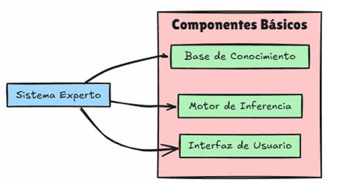
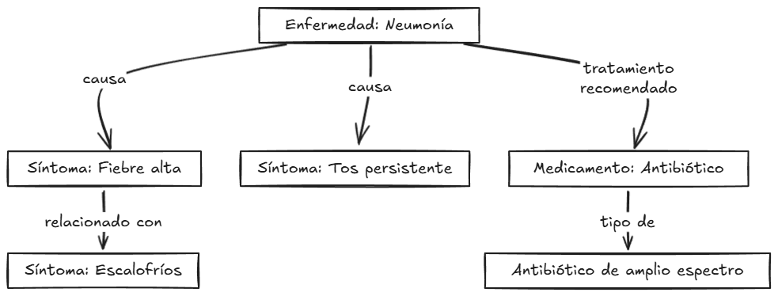
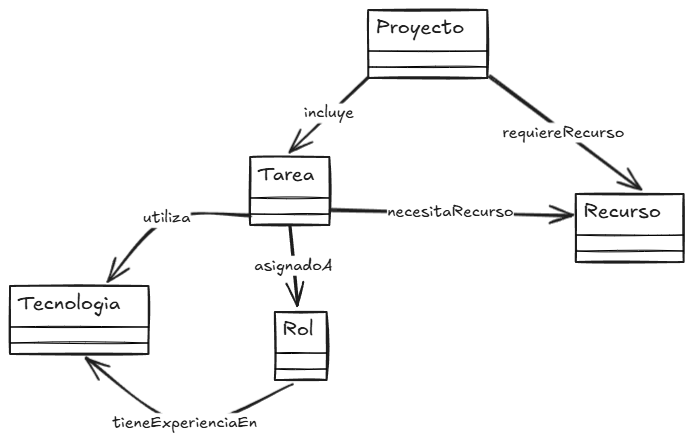

# 2. Sistemas expertos

## Introducción a los sistemas expertos

### Concepto y origen

Los sistemas expertos son una categoría particular de modelos dentro de la inteligencia artificial, que está compuesta por sistemas que emulan la toma de decisiones de un experto humano en dominios específicos. A diferencia de otros sistemas informáticos convencionales, estos se caracterizan por su capacidad de almacenar y utilizar conocimiento especializado, permitiendo que se realicen inferencias lógicas sobre problemas complejos y específicos. Esta capacidad se fundamenta en un proceso de razonamiento que imita la forma en que los especialistas humanos abordarían estos problemas, utilizando reglas y criterios basados en experiencia y conocimiento técnico. **El objetivo principal de un sistema experto es replicar, de forma automatizada, la experiencia y juicio de un experto en tareas que requieren una interpretación profunda y contextualizada de datos.**

#### Origen histórico y evolución

La historia de los sistemas expertos se entrelaza estrechamente con el desarrollo general de la inteligencia artificial, un campo que ya hemos visto cómo surgió formalmente a mediados del siglo XX y que ha experimentado diversas fases de desarrollo e innovación a lo largo de su historia. La idea de que las máquinas puedan simular ciertos aspectos del pensamiento humano, particularmente el razonamiento lógico, comenzó a tomar forma en los años 50, cuando un grupo de investigadores en el marco de la Conferencia de Dartmouth, en 1956, estableció las bases de la inteligencia artificial como disciplina independiente dentro del contexto de las ciencias de la computación. Este evento marcó el inicio de un movimiento intelectual que buscaba diseñar sistemas capaces de resolver problemas y tomar decisiones de manera similar a un humano. Aunque en sus primeras etapas la IA abordaba problemas generales de lógica y computación, con el tiempo surgió un interés particular en crear sistemas que pudieran manejar conocimientos específicos de ciertas disciplinas, como lo haría un experto humano en esos campos. Esta visión dio lugar al desarrollo de los primeros sistemas expertos.

Durante las décadas de 1960 y 1970, los investigadores comenzaron a trabajar en el diseño de programas que emularan el proceso de toma de decisiones en áreas técnicas especializadas, como la medicina o la química. Uno de los primeros sistemas expertos de relevancia fue **Dendral**, desarrollado en los años 60 por Edward Feigenbaum, Bruce Buchanan y Joshua Lederberg en la Universidad de Stanford. Este sistema fue creado para ayudar a los químicos a identificar estructuras moleculares complejas a partir de datos de espectrometría de masas. Su diseño se basaba en la implementación de reglas específicas del dominio químico, y logró resultados sorprendentes, demostrando que un sistema computacional podía, efectivamente, operar a nivel de un experto humano en un ámbito específico. Dendral no solo constituyó una prueba de concepto importante en el ámbito de la IA, sino que también sentó las bases de lo que más tarde se conocería como la **ingeniería del conocimiento**, el proceso de extraer y estructurar el conocimiento experto en un conjunto de reglas y datos que un sistema informático pudiera procesar.

A partir del éxito de Dendral, otros investigadores se interesaron en aplicar la IA a dominios donde la experiencia y el juicio humano eran fundamentales. En la década de los 70, el desarrollo del sistema experto **MYCIN**, también en la Universidad de Stanford, fue un avance significativo en el campo médico. MYCIN fue diseñado para ayudar a los médicos en el diagnóstico y tratamiento de infecciones bacterianas, y utilizaba un conjunto de reglas basadas en el conocimiento médico para emitir recomendaciones de diagnóstico. Aunque nunca se implementó en la práctica clínica, MYCIN demostró el potencial de los sistemas expertos en la asistencia sanitaria y puso de manifiesto un aspecto clave de estos sistemas: su capacidad para manejar la incertidumbre. Los desarrolladores de MYCIN implementaron el uso de factores de certeza, permitiendo que el sistema operara en situaciones donde la información podía ser incompleta o incierta, un desafío común en la práctica médica.

El éxito de estos primeros sistemas expertos impulsó una creciente inversión en el campo de la IA durante los años 80, época en la que los sistemas expertos se consolidaron como una tecnología prometedora para la automatización del conocimiento especializado. Varias empresas comenzaron a adoptar sistemas expertos en áreas como la planificación, el diagnóstico o la gestión de inventarios. En el sector industrial, se destacaron aplicaciones en el mantenimiento predictivo de equipos y en la optimización de procesos, donde el conocimiento experto era clave para la toma de decisiones. A medida que avanzaba la tecnología, surgieron también los primeros entornos de desarrollo de sistemas expertos o ***shells***, que permitían a los ingenieros construir sistemas personalizados sin necesidad de programar cada componente desde cero. Herramientas como EMYCIN (una versión de MYCIN adaptada para otros usos), OPS5 y CLIPS facilitaron la creación de sistemas expertos en un amplio rango de aplicaciones industriales y comerciales.

Sin embargo, el entusiasmo en torno a los sistemas expertos comenzó a disminuir a finales de los años 80, cuando se hizo evidente que estos sistemas enfrentaban limitaciones significativas. Uno de los desafíos principales era la adquisición y actualización del conocimiento: la creación de un sistema experto requería un extenso proceso de recopilación de conocimientos de expertos humanos y su traducción a un formato estructurado. Esto se traducía en un costo elevado, tanto en tiempo como en recursos, lo que dificultaba la escalabilidad de los sistemas y su adaptación a cambios rápidos en el conocimiento del dominio. Además, la dependencia de reglas explícitas hacía que los sistemas expertos fueran rígidos y poco adaptables a nuevas situaciones o a datos no previstos en su diseño inicial.

A pesar de estos problemas, la investigación en sistemas expertos no se detuvo. A lo largo de los años 90, la comunidad de IA comenzó a explorar métodos que permitieran a los sistemas adaptarse y aprender de los datos, lo que llevó al desarrollo de enfoques híbridos que combinaban reglas con técnicas estadísticas y de aprendizaje automático. Estas innovaciones marcaron el comienzo de una nueva generación de sistemas expertos más flexibles y adaptables, capaces de integrarse con otras tecnologías de IA, como las redes bayesianas o los algoritmos de aprendizaje profundo. En este contexto, los sistemas expertos evolucionaron hacia sistemas de apoyo a la decisión y herramientas analíticas que continúan siendo relevantes en la actualidad, especialmente en sectores como la salud, la ingeniería y la logística.

Hoy en día, los sistemas expertos representan una de las aplicaciones clásicas de la IA y son una muestra de la evolución de esta disciplina. Su desarrollo inicial, impulsado por la necesidad de automatizar el conocimiento especializado, sentó las bases para muchas de las técnicas que ahora se utilizan en inteligencia artificial. Aunque los sistemas expertos tradicionales han sido superados en algunos aspectos por las tecnologías de aprendizaje automático, su capacidad para estructurar y aplicar el conocimiento en forma de reglas continúa siendo un recurso valioso en aplicaciones **donde la transparencia y la explicabilidad son esenciales**. Sin duda, los sistemas expertos han dejado una huella duradera en el campo de la inteligencia artificial, y su historia refleja la evolución y los desafíos constantes de la IA en la búsqueda de emular el pensamiento humano.

### Características principales

La característica distintiva de los sistemas expertos es su habilidad para emular el razonamiento humano en tareas altamente especializadas. A través de un proceso de inferencia lógica y análisis de datos, estos sistemas pueden interpretar la información del mismo modo que lo haría un experto humano, tomando decisiones informadas basadas en el conocimiento específico del dominio. Esta emulación del razonamiento humano es especialmente valiosa en sectores donde las decisiones requieren precisión y están fundamentadas en el análisis profundo de una situación, como en la medicina, la ingeniería o las finanzas.

Para lograr esta capacidad de análisis, los sistemas expertos estructuran su funcionamiento en torno a la representación del conocimiento y la toma de decisiones. La representación del conocimiento, normalmente mediante una serie de reglas y hechos, permite que el sistema almacene y recupere información clave del dominio en el que opera. La toma de decisiones se sustenta en la capacidad del sistema para aplicar estas reglas y hechos en contextos específicos, ejecutando procesos de razonamiento que simulan el proceso de pensamiento de un experto humano.

Los componentes básicos de un sistema experto, que facilitan tanto la representación del conocimiento como la toma de decisiones, son el motor de inferencia y la base de conocimiento. La base de conocimiento es el repositorio central de datos, reglas y hechos del dominio, recopilados y estructurados para ser fácilmente accesibles y aplicables. Esta base de conocimiento puede incluir desde información categórica hasta reglas condicionales complejas que permiten al sistema realizar inferencias de alto nivel. Por su parte, el motor de inferencia es el mecanismo que permite al sistema aplicar las reglas de la base de conocimiento a situaciones concretas, produciendo así conclusiones y recomendaciones. A través de una serie de métodos de razonamiento, como el encadenamiento hacia adelante y hacia atrás, el motor de inferencia puede analizar los datos disponibles y generar una respuesta lógica o recomendación basada en el contexto.

Además de estos elementos, algunos sistemas expertos incluyen un módulo de explicación, que permite al sistema justificar sus decisiones de manera comprensible para el usuario. Este módulo es especialmente útil en aplicaciones sensibles, como el diagnóstico médico o el asesoramiento financiero, donde los usuarios necesitan comprender cómo y por qué se llegó a una determinada conclusión.



## Arquitectura de los sistemas expertos

En un sistema experto podemos identificar varios módulos clave que trabajan en conjunto para simular el proceso de toma de decisiones de un experto humano en un dominio específico. Esta estructura o arquitectura permite al sistema capturar, procesar y aplicar el conocimiento necesario para resolver problemas complejos de manera eficiente. Los componentes principales incluyen la base de conocimiento, el motor de inferencia, un módulo de explicación y la interfaz de usuario, además de un módulo opcional de adquisición de conocimiento. El cómo se represente el conocimiento jugará un papel crucial en la eficacia del sistema, ya que define cómo se estructuran y manipulan los datos.


La **base de conocimiento** es el repositorio central donde se almacenan los hechos y reglas que describen el dominio de aplicación. Este conocimiento se organiza de forma que permita un acceso y actualización eficientes, y puede incluir tanto información declarativa como procedimental. La calidad de la base de conocimiento es un factor determinante en la precisión y efectividad del sistema. En este sentido, la representación del conocimiento puede adoptar distintas formas, ya sea como reglas de producción, marcos, redes semánticas u ontologías. La elección de dicha representación influirá en la eficiencia de las operaciones de búsqueda e inferencia y en la capacidad del sistema para manejar datos complejos.

El **motor de inferencia** es el mecanismo que procesa la base de conocimiento para aplicar reglas y llegar a conclusiones lógicas. Emplea métodos como el encadenamiento hacia adelante o hacia atrás para simular el razonamiento humano. Dependiendo del problema, el motor de inferencia puede usar factores de certeza para manejar la incertidumbre, proporcionando respuestas probabilísticas en lugar de decisiones estrictamente binarias.

El **módulo de explicación** es un componente que permite que el sistema justifique sus recomendaciones o conclusiones al usuario. Ofrece una trazabilidad de las reglas y datos utilizados durante el proceso de inferencia, aumentando la transparencia y la confianza en el sistema. Las explicaciones pueden adaptarse según el nivel de detalle que requiera el usuario, desde un resumen general hasta un análisis detallado.

La **interfaz de usuario** es la vía a través de la cual los usuarios interactúan con el sistema. Una interfaz bien diseñada facilita la entrada de datos y la comprensión de las respuestas y explicaciones proporcionadas por el sistema. En sistemas complejos, es esencial que la interfaz sea intuitiva para usuarios con distintos niveles de especialización.

Por último, el **módulo de adquisición de conocimiento**, aunque puede ser opcional, es fundamental en sistemas que necesitan actualizar su base de conocimiento con regularidad. Permite la incorporación de nueva información sin necesidad de una reprogramación completa, adaptando el sistema a los cambios en el dominio.

> Al final, la arquitectura de un sistema experto integra de manera coordinada estos módulos para **simular el proceso de razonamiento humano y ofrecer soluciones en dominios específicos**. La combinación de una base de conocimiento sólida y un motor de inferencia eficaz, junto con módulos de explicación y adquisición de conocimiento, permite a los sistemas expertos proporcionar recomendaciones precisas y adaptarse a nuevos escenarios.

### Base de conocimiento

La base de conocimiento es el componente fundamental en un sistema experto, encargada de almacenar la información y las reglas que representan el conocimiento del dominio específico en el que opera el sistema. Su diseño y estructura son críticos para garantizar que el sistema pueda acceder, interpretar y aplicar este conocimiento de manera eficiente al resolver problemas y tomar decisiones.

#### Características de la base de conocimiento

La base de conocimiento no se limita a ser un simple almacenamiento de datos; es un repositorio estructurado que contiene tanto hechos como reglas, permitiendo que el sistema simule el razonamiento de un experto humano. Los elementos que componen una base de conocimiento se pueden clasificar en dos categorías principales. Por un lado el denominado **conocimiento declarativo**, que Incluye **hechos y descripciones estáticas sobre el dominio**. Estos datos representan información específica que el sistema puede utilizar directamente, del tipo "la fiebre es una temperatura corporal superior a 37 grados Celsius". Por otro lado se dispone del **conocimiento procedimental**, consistente en un conjunto de instrucciones que indican cómo actuar o proceder en situaciones específicas. Por ejemplo, una regla del tipo “si la fiebre supera los 39 grados, recomendar medicamentos antipiréticos” formaría parte del conocimiento procedimental, ya que guía la acción a tomar en función de los datos disponibles.

#### Representación del conocimiento

Ya se ha comentado que el modo en que se representa el conocimiento en la base de conocimiento afecta directamente la capacidad del sistema para realizar inferencias de manera eficiente. Existen varias técnicas de representación del conocimiento que se enumeran a continuación

En primer lugar se dispone de las denominadas **reglas de producción**. Estas son estructuras del tipo “si-entonces” que permiten modelar el conocimiento en forma de condiciones y acciones. Por ejemplo, "si un paciente presenta tos seca y fiebre alta, entonces sospechar una infección viral". Las reglas de producción son ideales para sistemas expertos porque simulan de manera natural el proceso de razonamiento humano, descomponiendo problemas complejos en decisiones más pequeñas y manejables.

Los **hechos** representan información concreta y verificable, como "la presión arterial alta es aquella superior a 140/90 mm Hg". Estos hechos actúan como entradas que el motor de inferencia utiliza para evaluar y aplicar las reglas de producción.

Por otro lado están los **marcos**. Estructuras que agrupan atributos y valores relacionados con un objeto o concepto específico. Los marcos se utilizan cuando es necesario organizar datos complejos, permitiendo que cada marco contenga subcampos y propiedades que describan en detalle un tema. Por ejemplo, un marco que describe un paciente puede incluir atributos como “edad”, “síntomas” y “historial médico”.

Por último se pueden citar las **redes semánticas**. Una representación gráfica en la que los nodos representan conceptos y los enlaces muestran las relaciones entre ellos. Este enfoque es útil para capturar relaciones complejas entre términos, facilitando la comprensión y visualización de cómo los conceptos están interconectados.

> **Ejemplo**: En un sistema experto diseñado para el diagnóstico de enfermedades respiratorias, la base de conocimiento podría incluir hechos como “tos productiva” o “saturación de oxígeno por debajo de 90%”, y reglas como “si el paciente tiene tos productiva y fiebre alta, entonces considerar neumonía”. Estos elementos se basan en el conocimiento aportado por especialistas médicos y literatura científica.

#### Fuentes de la base de conocimiento

El conocimiento almacenado en la base proviene de diversas fuentes, entre las que se encuentran fundamentalmente los expertos humanos, la documentación técnica o en algunos casos los propios datos empíricos.

En el caso de los **expertos** en el dominio su participación es fundamental, ya que es necesario capturar conocimiento implícito que no siempre está documentado. Este proceso puede incluir entrevistas, observaciones y talleres donde se extraen las estrategias y criterios que los expertos utilizan al tomar decisiones.

Por su parte, la **documentación y los manuales** en forma de libros de texto, artículos académicos o manuales técnicos son fuentes valiosas de información verificable que se pueden traducir en hechos y reglas para la base de conocimiento.

Y también, en algunos casos, la **experiencia empírica** puede servir para construir o refinar la base de conocimiento. En este sentido, el análisis de datos históricos y patrones observados en casos previos puede ser de mucha utilidad. Este enfoque es común en sistemas expertos que aprenden y adaptan su base de conocimiento con el tiempo.

#### Mantenimiento y actualización de la base de conocimiento

El mantenimiento de la base de conocimiento es un aspecto clave para la eficacia continua del sistema experto. Primeramente debe existir una **actualización periódica** que permita reflejar los cambios en el dominio, en forma de nuevos descubrimientos o procedimientos actualizados. Esto es especialmente relevante en campos en rápida evolución, como la medicina o la tecnología. A medida que se incorporan nuevas reglas y hechos, es crucial garantizar que no se introduzcan inconsistencias o contradicciones a través de un proceso de **verificación de consistencia**. En este sentido, un sistema de gestión de la base de conocimiento podría ayudar a automatizar esta verificación, asegurando que las nuevas entradas no comprometan la integridad del sistema.

Algunos sistemas expertos avanzados incluyen módulos de **adquisición de conocimiento automatizada**, que permiten la adquisición automática de nuevo conocimiento mediante el análisis de datos y la integración de información actualizada. Estos módulos pueden ayudar a mantener la relevancia del sistema sin una intervención manual muy extensa.

#### Importancia de la calidad del conocimiento

Evidentemente la efectividad de un sistema experto depende en gran parte de la calidad del conocimiento almacenado en la base. Un conocimiento incompleto o mal estructurado puede llevar a inferencias incorrectas, afectando la confianza del usuario en el sistema. Por ello, es fundamental que el proceso de captura y validación del conocimiento sea riguroso y se enfoque en obtener información relevante, precisa y bien organizada.

> La base de conocimiento es el pilar sobre el que se construye un sistema experto. Su diseño debe ser lo suficientemente flexible para permitir actualizaciones y adaptaciones, y lo suficientemente robusto para garantizar la precisión y la confiabilidad de las respuestas que proporciona el sistema.

### Motor de inferencia

El motor de inferencia es un componente crítico en la arquitectura de un sistema experto, encargado de procesar la información almacenada en la base de conocimiento para generar conclusiones, recomendaciones o decisiones. Este módulo **simula el razonamiento humano aplicando reglas y evaluando hechos**, lo que permite al sistema experto resolver problemas de manera similar a un especialista en el dominio.

Si bien el motor de inferencia aporta la capacidad de replicar el razonamiento de un experto humano y la posibilidad de manejar un gran volumen de reglas y datos, hay que tener en cuenta también que la **complejidad computacional** es un factor a tener muy en cuenta ya que, a medida que la base de conocimiento crece, el número de reglas y hechos que el motor debe procesar puede aumentar exponencialmente, afectando el rendimiento del sistema. Es crucial optimizar los algoritmos de búsqueda y las estrategias de control de la agenda para mantener la eficiencia.

El motor de inferencia funciona mediante la aplicación de reglas lógicas que se encuentran en la base de conocimiento, combinando estas con los datos proporcionados por el usuario o los hechos conocidos. Existen dos principales enfoques para el proceso de inferencia: el encadenamiento hacia adelante (*forward chaining*) y el encadenamiento hacia atrás (*backward chaining*).

#### Encadenamiento hacia adelante y hacia atrás: una primera aproximación

Los sistemas expertos necesitan un mecanismo para **poner en marcha las reglas de su base de conocimiento**. Dos de las estrategias más utilizadas son el **encadenamiento hacia adelante** y el **encadenamiento hacia atrás**, que se diferencian en el punto de partida de su razonamiento.

En el **encadenamiento hacia adelante**, el sistema comienza con los datos disponibles y va aplicando reglas de manera sucesiva, generando nuevos hechos y conclusiones a medida que avanza. Este enfoque resulta muy útil cuando se desea **explorar todas las posibilidades** a partir de un estado inicial. Por eso es frecuente en contextos de diagnóstico o monitoreo, donde se espera que el sistema detecte problemas o proponga hipótesis sin necesidad de fijar de antemano un objetivo concreto.

El **encadenamiento hacia atrás**, en cambio, funciona como un razonamiento “a la inversa”. El sistema parte de una **hipótesis o meta** y busca en la base de conocimiento qué hechos y reglas serían necesarios para confirmarla. Si no dispone de la información directamente, intenta descomponer la hipótesis en subobjetivos hasta encontrar las pruebas que necesita. Este enfoque es especialmente adecuado cuando se quiere **verificar un resultado concreto**, como en sistemas legales o de planificación, donde interesa comprobar si se cumplen determinadas condiciones normativas o de procedimiento.

En resumen, el encadenamiento hacia adelante se caracteriza por su **exploración amplia** a partir de los datos, mientras que el encadenamiento hacia atrás ofrece una **búsqueda enfocada** hacia la validación de hipótesis. Ambos enfoques constituyen la base operativa de los sistemas expertos, y en apartados posteriores del tema los estudiaremos en detalle, con ejemplos prácticos y análisis comparativo de sus ventajas y limitaciones.

> **Ejemplo**: Un sistema experto en el ámbito jurídico puede comenzar con la hipótesis de que un contrato es válido. Luego, el motor de inferencia retrocede para verificar las reglas relacionadas, como "si ambas partes han firmado el contrato y no hay cláusulas ilegales, entonces el contrato es válido". Si alguna condición no se cumple, el sistema buscará hechos o reglas adicionales que puedan confirmar o refutar el objetivo.

---


> La elección entre encadenamiento hacia adelante y hacia atrás depende de la naturaleza del problema que el sistema experto debe resolver. El encadenamiento hacia adelante es ideal para explorar datos y descubrir nuevas conclusiones, mientras que el encadenamiento hacia atrás es más adecuado para confirmar hipótesis específicas y trabajar de manera más eficiente en entornos con reglas extensas.

#### Componentes del motor de inferencia

En el motor de inferencia, a su vez, pueden identificarse varios subcomponentes que trabajan en conjunto para interactuar con la base de conocimiento y llevar a cabo inferencias. Uno de los más importantes es el **motor de búsqueda**, que se encarga de explorar la base de conocimiento y aplicar ciertos algoritmos de búsqueda según el enfoque de encadenamiento seleccionado. Para gestionar este componente el motor de inferencia cuenta con una **agenda de reglas**, una estructura de control que organiza y prioriza las reglas aplicables según el contexto, permitiendo al motor de inferencia elegir las más pertinentes en situaciones donde múltiples reglas pueden coincidir. Este proceso se complementa con el **mecanismo de control de conflictos**, encargado de resolver los casos en los que varias reglas podrían aplicarse al mismo tiempo. Para decidir cuál regla ejecutar primero, algunos sistemas expertos implementan estrategias de priorización que consideran la especificidad de la regla o el orden de llegada.

Existen escenarios donde la incertidumbre es un factor relevante, y en ellos el motor de inferencia incorpora lo que se denomina **un gestor de certeza**. Este componente calcula el grado de certeza de las conclusiones basándose en medidas como la probabilidad o factores de certeza. Así, el sistema puede ofrecer respuestas más flexibles y realistas cuando los datos no son completamente precisos o están incompletos. Este componente lo encontraremos fundamentalmente en sistema imprecisos.

#### Tipos de mecanismos de razonamiento

Un motor de inferencia puede implementar dos tipos básicos de mecanismos de razonamiento: el **razonamiento determinista** y el **razonamiento con incertidumbre**.

El **razonamiento determinista** se basa en reglas y hechos que conducen a conclusiones absolutas. Cada vez que se cumplen las condiciones de una regla, la conclusión es siempre la misma. Este tipo de razonamiento es adecuado para dominios donde los datos son precisos y no hay ambigüedad.

El **razonamiento con incertidumbre** utiliza medidas probabilísticas o factores de certeza para manejar datos incompletos o ambiguos. Este tipo de razonamiento es común en sistemas expertos médicos o financieros, donde los datos no siempre son exactos o completos. Las técnicas como la lógica difusa, las redes bayesianas o factores de certeza permiten al motor de inferencia modelar el grado de confianza en las conclusiones. Es importante tener en cuenta que el razonamiento en escenario de incertidumbre puede volverse complicado al tratar con múltiples fuentes de incertidumbre. En estos casos la implementación de modelos como redes bayesianas es necesaria para garantizar respuestas precisas y confiables.

> **Ejemplo**: Un sistema experto en finanzas puede usar factores de certeza para evaluar la probabilidad de que una inversión sea rentable. Si los datos sobre el mercado son inciertos, el motor de inferencia puede calcular un porcentaje de certeza que indique la confiabilidad de la recomendación.

> El motor de inferencia es el corazón del sistema experto, actuando como un intermediario que aplica las reglas de la base de conocimiento a los datos para simular el razonamiento humano. Sus mecanismos de encadenamiento hacia adelante y hacia atrás permiten diferentes enfoques de resolución de problemas, y la capacidad de manejar incertidumbre lo hace adaptable a situaciones reales donde los datos no son perfectos. La eficacia de un sistema experto depende en gran medida de la capacidad de su motor de inferencia para procesar datos de manera eficiente y precisa, aplicando el conocimiento almacenado en la base de conocimiento para ofrecer conclusiones fiables y útiles.

**Para reflexionar...**  

> **¿Qué mecanismos de inferencia consideras más adecuados para un sistema experto en diagnóstico médico?** 
> (Reflexiona sobre la utilidad del encadenamiento hacia adelante para explorar síntomas y el encadenamiento hacia atrás para confirmar un diagnóstico específico)

### Módulo de explicación

El módulo de explicación es un elemento esencial en los sistemas expertos, especialmente en aquellos donde la transparencia y la confianza en las decisiones son primordiales. Su función principal es proporcionar al usuario una justificación detallada de cómo el sistema llegó a una conclusión, permitiendo una trazabilidad clara de las reglas y datos que se aplicaron durante el proceso de inferencia. Esta capacidad de explicación es particularmente valiosa en sectores como la medicina, la asesoría financiera o el ámbito legal, donde los profesionales necesitan comprender y confiar en las recomendaciones del sistema antes de actuar sobre ellas. Un módulo de explicación bien diseñado contribuye al aprendizaje del usuario, ya que facilita la comprensión de las reglas subyacentes y del proceso de toma de decisiones del sistema.

Otro aspecto fundamental del módulo de explicación es la mejora de la confianza en el sistema. Los usuarios tienden a confiar más en un sistema experto si pueden entender el razonamiento detrás de sus recomendaciones. Esta confianza es un factor clave en la adopción y uso sostenido de la tecnología. Por ejemplo, un médico que utiliza un sistema de diagnóstico asistido por IA es más probable que siga sus sugerencias si puede ver claramente cómo se llegaron a las conclusiones y qué datos se utilizaron.

#### Tipos de explicaciones

El módulo de explicación puede ofrecer distintos niveles de detalle y tipos de respuestas, según las necesidades del usuario y la complejidad de la aplicación. Estas pueden ser principalmente de tres tipos:

Las **explicaciones descriptivas** proporcionan una visión general de las razones que llevaron a la conclusión, mostrando de forma simplificada las reglas y los hechos relevantes. Son adecuadas para usuarios que necesitan un resumen rápido y claro de las decisiones del sistema sin entrar en detalles técnicos.

Las **explicaciones detalladas** son útiles en situaciones donde se requiere un mayor nivel de profundidad. El módulo de explicación puede ofrecer un desglose completo del proceso de inferencia, incluyendo todas las reglas aplicadas y los hechos consultados. Estas explicaciones son útiles para usuarios técnicos o expertos en el dominio que buscan validar y entender a fondo el comportamiento del sistema.

Por último, las **explicaciones paso a paso** detallan cada etapa del proceso de inferencia, mostrando cómo se aplicaron las reglas y cómo se derivaron los nuevos hechos. Resultan útiles en entornos educativos o en sistemas donde es fundamental seguir la lógica de manera secuencial.

#### Implementación del módulo de explicación

La implementación de un módulo de explicación eficaz requiere un diseño cuidadoso que equilibre la cantidad de detalle ofrecido con la claridad y accesibilidad de la información. Es común que los sistemas expertos utilicen técnicas como el almacenamiento de rastros de ejecución, que registran los pasos y las decisiones tomadas por el motor de inferencia durante el proceso. Este rastro permite al módulo de explicación reconstruir el razonamiento en un formato comprensible para el usuario.

Otra técnica común es la **justificación de reglas**, en la que el sistema resalta qué reglas específicas de la base de conocimiento se aplicaron y cómo estas contribuyeron a la conclusión. Este enfoque es especialmente útil en sistemas basados en reglas de producción, donde las decisiones son el resultado de aplicar secuencias complejas de condiciones y acciones.

En sistemas más avanzados, la generación de explicaciones puede incluir técnicas de visualización que permiten a los usuarios ver gráficos de las relaciones entre los hechos y las reglas aplicadas. Estas herramientas visuales facilitan la comprensión de la estructura lógica del proceso de inferencia, haciendo que las explicaciones sean más intuitivas.

#### Beneficios y desafíos

El módulo de explicación ofrece beneficios claros en términos de confianza, transparencia y aceptación del sistema. Sin embargo, también presenta desafíos. Uno de los más notables es el **balance entre detalle y comprensión**: ofrecer explicaciones demasiado técnicas puede ser abrumador para usuarios no especializados, mientras que explicaciones demasiado simplificadas pueden carecer de la información necesaria para ser útiles.

Otro posible desafío es el que tiene que ver con el **rendimiento del sistema**. La generación de explicaciones detalladas y rastreos de la inferencia puede aumentar la carga computacional, especialmente en sistemas complejos con múltiples reglas y hechos. Para superar este problema, los diseñadores de sistemas expertos deben encontrar un equilibrio entre la riqueza de las explicaciones y la eficiencia operativa del sistema.

> **Ejemplo**: Un sistema experto en diagnóstico médico puede proporcionar explicaciones de por qué sugirió un diagnóstico de neumonía. El módulo de explicación podría detallar que la conclusión se basó en la presencia de síntomas como fiebre alta, tos productiva y dolor en el pecho, mostrando también la regla que aplicó: "si fiebre alta, tos y dolor en el pecho, entonces considerar neumonía". Además, podría indicar que esta regla fue aplicada con un 90% de certeza basado en datos históricos.

En conclusión, el módulo de explicación es vital para la aceptación y confianza en los sistemas expertos. Su capacidad para proporcionar justificativos comprensibles y adaptados a diferentes niveles de usuario convierte a los sistemas expertos en herramientas más transparentes y efectivas, permitiendo a los usuarios tomar decisiones mejor informadas y, al mismo tiempo, aprender del proceso de inferencia del sistema.

### Interfaz de usuario y módulo de adquisición de conocimiento

#### Interfaz de usuario

La interfaz de usuario es un componente crucial en cualquier sistema experto, ya que define el punto de interacción entre el usuario y el sistema. Una interfaz bien diseñada permite no solo la entrada de datos, sino también el acceso a las recomendaciones, conclusiones y explicaciones que el sistema proporciona. En entornos industriales, médicos o financieros, donde se manejan datos complejos y las decisiones tienen un impacto significativo, la claridad y la accesibilidad de la interfaz se vuelven esenciales. 

Una interfaz de usuario eficaz en un sistema experto debe garantizar la usabilidad y la comprensión de sus funciones. Es importante que sea **intuitiva**, permitiendo al usuario operar el sistema con facilidad y sin necesidad de una capacitación excesiva, lo cual es especialmente relevante en entornos donde el personal puede no contar con experiencia técnica avanzada. La **interactividad** es otra característica esencial, ya que un diseño interactivo posibilita la entrada de datos, el ajuste de parámetros y la realización de consultas de forma dinámica. Las interfaces modernas mejoran la experiencia del usuario al incorporar elementos gráficos como menús desplegables, cuadros de diálogo y gráficos interactivos.

La **presentación de los resultados** también juega un papel crítico. Las recomendaciones y conclusiones deben mostrarse de manera clara y relevante, con formatos que se adapten a las necesidades del usuario, ya sea mediante tablas, gráficos o texto. Por último es importante un aspecto de la interfaz como es su **capacidad de proporcionar acceso al módulo de explicación**. Este recurso permite que los usuarios comprendan las razones detrás de las decisiones o recomendaciones del sistema, lo cual incrementa la transparencia y la confianza en su uso.

> **Ejemplo**: Un sistema experto para el mantenimiento preventivo de maquinaria industrial puede tener una interfaz que muestre alertas cuando ciertas condiciones se cumplan (por ejemplo, vibraciones anormales en un motor). El usuario puede hacer clic en la alerta para ver una explicación detallada que incluya los datos monitoreados y las reglas aplicadas.

#### Módulo de adquisición de conocimiento

El módulo de adquisición de conocimiento es otra pieza fundamental de los sistemas expertos, especialmente en dominios que requieren actualización continua de información. Este módulo facilita la incorporación de nuevos datos y reglas en la base de conocimiento, asegurando que el sistema permanezca actualizado sin necesidad de reprogramaciones exhaustivas.

El módulo de adquisición de conocimiento desempeña funciones esenciales que permiten mantener la relevancia y precisión de un sistema experto. La **capacidad de actualización automática** es fundamental en sistemas que integran fuentes de datos externas, como bases de datos de investigación o sensores en tiempo real. Esta característica permite que el módulo procese y actualice la base de conocimiento sin intervención manual, adaptando el sistema a nuevos estudios y recomendaciones, como en el caso de sistemas médicos que incorporan avances y directrices recientes de asociaciones profesionales.

La **curación y validación del conocimiento adquirido** es otro aspecto vital. No toda la información que se obtiene automáticamente es apta para ser integrada directamente en la base de conocimiento. Por esta razón, el módulo incluye mecanismos de validación que aseguran la coherencia y precisión de los datos, los cuales pueden ser verificados mediante algoritmos automáticos o revisiones por expertos humanos. Esta validación es crucial para mantener la consistencia del sistema y evitar la incorporación de información errónea o contradictoria.

La **capacidad de adaptación** del módulo a nuevos contextos le confiere flexibilidad al sistema experto, lo cual es indispensable en dominios en constante cambio. Implica la habilidad del sistema para ajustar su comportamiento y sus reglas en respuesta a cambios en el entorno del dominio o en las condiciones bajo las que opera. Esta capacidad es más amplia que la actualización, ya que no solo se trata de agregar nuevos datos, sino de modificar y ajustar los procesos de inferencia, reglas de decisión y patrones de razonamiento para que el sistema mantenga su eficacia frente a nuevos contextos o escenarios. Por ejemplo, en el sector financiero, el módulo puede ajustar las reglas y los datos del sistema conforme se modifican las políticas económicas o se introducen nuevos indicadores de riesgo, asegurando que el sistema permanezca relevante y actualizado.

Otro elemento a tener en cuenta en cualquier módulo enfocado a la adquisición conocimiento es el de las **metodologías**. Existe diversidad en el uso de las mismas. Por ejemplo, la **extracción manual** es una de las formas más tradicionales de recopilar y estructurar información que luego se formaliza en la base de conocimiento. Esta metodología se basa en la colaboración de los expertos a través de entrevistas y talleres. En otros casos, la **adquisición automática** permite que el sistema utilice técnicas avanzadas de procesamiento de lenguaje natural y aprendizaje automático para extraer y organizar conocimiento a partir de grandes volúmenes de datos no estructurados, como documentos y publicaciones científicas.

Evidentemente la **retroalimentación** de los usuarios también juega un papel importante en la adquisición de conocimiento. En sistemas como los que se implementan para asistencia en diagnósticos médicos, los profesionales pueden proporcionar evaluaciones y retroalimentación que enriquecen y optimizan la base de conocimiento, adaptando el sistema a prácticas y experiencias reales que mejoran su rendimiento con el tiempo.

En cualquier caso, el proceso de adquisición de conocimiento no está exento de retos. Uno de los principales es la **veracidad y consistencia de la información**: incorporar datos de múltiples fuentes puede resultar en inconsistencias o contradicciones en la base de conocimiento. Además, es necesario garantizar la **seguridad de los datos**, especialmente en sectores como la salud, donde se maneja información sensible. Otro desafío es la **gestión de la sobrecarga de datos**. Cuando el sistema recibe grandes volúmenes de nueva información, el módulo debe ser capaz de priorizar qué datos son relevantes y cómo integrarlos de manera eficiente sin degradar el rendimiento del sistema.

**Para reflexionar...** 

> **¿Qué ventajas aporta un módulo de adquisición de conocimiento en un sistema experto para mantenimiento preventivo en una planta industrial?** 
> **Clave**: Considera la necesidad de actualizar las reglas y datos del sistema conforme se introducen nuevos equipos y se identifican nuevas fallas o patrones de desgaste.

### Representación del conocimiento en sistemas expertos

La representación del conocimiento otro de los elementos esenciales en un sistema experto, ya que define cómo se estructura, almacena y accede a la información en la base de conocimiento. Una representación eficaz no solo permite que el motor de inferencia acceda y procese datos de forma eficiente, sino que también facilita la comprensión y actualización de la base de conocimiento. Dependiendo de la naturaleza del problema a resolver, se pueden emplear diferentes métodos de representación, cada uno con sus propias ventajas y limitaciones.

#### Representación basada en reglas

La representación basada en reglas es uno de los métodos más utilizados en sistemas expertos debido a su simplicidad y efectividad en la modelización de conocimientos que pueden expresarse en términos de condiciones y acciones. Este enfoque se organiza mediante reglas de producción que siguen un esquema del tipo “si-entonces” (IF-THEN), donde la parte “si” (premisa o antecedente) especifica las condiciones bajo las cuales se activa la regla, y la parte “entonces” (consecuencia) define la acción o conclusión que debe tomarse si se cumplen las condiciones.

##### Estructura y características de las reglas de producción

Una regla de producción en un sistema experto se representa generalmente de la siguiente manera:

```pseudocode
SI <condición1> Y/O <condición2> ENTONCES <acción o conclusión>
```

Cada regla puede ser evaluada de forma independiente, y el motor de inferencia se encarga de analizar todas las reglas relevantes para determinar cuáles deben aplicarse en función de los hechos presentes en la base de conocimiento. Las reglas de producción son particularmente útiles para sistemas que requieren tomar decisiones basadas en un conjunto definido de condiciones lógicas.

> **Ejemplo**: Considere un sistema experto de diagnóstico médico que evalúa los síntomas de un paciente para identificar posibles enfermedades. Una regla de producción para detectar una infección respiratoria podría ser:
>
> ```pseudocode
> SI el paciente tiene fiebre alta Y tos persistente ENTONCES considerar una infección respiratoria.
> ```
>
> En este caso, la premisa está compuesta por dos condiciones: fiebre alta y tos persistente. Si ambas se cumplen al evaluar los hechos del paciente, el sistema concluye que debe considerarse la posibilidad de una infección respiratoria.

##### Procesamiento y evaluación de reglas

El motor de inferencia utiliza las reglas de producción para evaluar y derivar nuevas conclusiones a partir de los hechos conocidos. Ya hemos visto que este proceso puede implementarse mediante dos enfoques principales: **encadenamiento hacia adelante** (*forward chaining*) y **encadenamiento hacia atrás** (*backward chaining*). En el encadenamiento hacia adelante, el sistema parte de los hechos iniciales y aplica las reglas para derivar nuevos hechos y conclusiones. En el encadenamiento hacia atrás, el sistema parte de una hipótesis o conclusión y busca validar las condiciones necesarias que la sustentan.

El procesamiento de las reglas puede ser complejo cuando existen muchas reglas potencialmente aplicables al mismo tiempo. Para gestionar esta complejidad, se utilizan mecanismos de resolución de conflictos que ayudan al motor de inferencia a decidir qué regla aplicar primero. Estos mecanismos pueden incluir estrategias de priorización basadas en criterios como la especificidad de la regla, el orden de llegada o el uso de pesos asignados a cada regla.

##### Ventajas y limitaciones de la representación basada en reglas

Este enfoque presenta varias ventajas. Es fácil de entender y de programar, ya que cada regla actúa como una unidad lógica independiente que se puede añadir, modificar o eliminar sin afectar significativamente al resto del sistema. Esto facilita el mantenimiento y la escalabilidad del sistema. Además, las reglas de producción permiten modelar el razonamiento humano de manera natural, haciendo que la lógica de inferencia sea transparente y explicable para los usuarios.

Otra ventaja es la flexibilidad en la creación de sistemas expertos en dominios donde el conocimiento es explícito y bien definido, como en sistemas de diagnóstico médico, control de calidad industrial o sistemas de asistencia en la toma de decisiones financieras.

Pero a pesar de sus beneficios, la representación basada en reglas tiene limitaciones. Cuando el dominio es altamente complejo y existen muchas reglas, el sistema puede volverse difícil de gestionar y mantener. La cantidad de combinaciones posibles de reglas y hechos puede crecer exponencialmente, lo que puede afectar al rendimiento y hacer que el sistema se vuelva menos eficiente.

Otro problema es la falta de capacidad para manejar incertidumbre o datos ambiguos. Las reglas tradicionales del tipo “si-entonces” generalmente asumen que las condiciones son absolutas, lo que puede no ser adecuado en situaciones donde la información es incompleta o incierta. Para abordar este problema, se pueden integrar mecanismos de manejo de incertidumbre, como factores de certeza o probabilidades, pero esto añade complejidad al sistema.

##### Ejemplo detallado: Sistema experto para control de inventario

Consideremos un sistema experto para la gestión de inventarios en una tienda minorista. El objetivo es optimizar la reposición de productos basándose en las condiciones de inventario y la demanda esperada. Las reglas de producción podrían incluir:

```pseudocode
Regla 1:
SI el inventario de un producto es menor a 20 unidades Y la demanda semanal proyectada es alta ENTONCES hacer un pedido de reposición.

Regla 2:
SI el inventario de un producto es mayor a 100 unidades Y la demanda semanal proyectada es baja ENTONCES suspender nuevos pedidos de ese producto.

Regla 3:
SI el inventario de un producto está entre 20 y 100 unidades Y la demanda semanal proyectada es media ENTONCES monitorear y evaluar nuevamente en tres días.

```

Estas reglas permiten que el sistema tome decisiones automáticas para gestionar el inventario de manera eficiente. Cada regla evalúa condiciones específicas de la base de conocimiento (el inventario actual y la demanda proyectada) y realiza una acción que optimiza el proceso de reposición.

En situaciones donde múltiples reglas pueden aplicarse, el motor de inferencia necesita un mecanismo para resolver conflictos y priorizar qué regla ejecutar. Por ejemplo, si un producto tiene un inventario de 19 unidades y la demanda proyectada es media, podrían aplicarse tanto la regla 1 como la regla 3. Un mecanismo de resolución de conflictos podría priorizar la regla 1 debido a su mayor especificidad o a un peso asignado previamente que indique su importancia relativa.

> [!important]
>
> La representación basada en reglas, por tanto, es una herramienta poderosa para modelar sistemas expertos que requieren decisiones basadas en lógica condicional clara y bien definida. Sin embargo, su eficacia depende de una gestión cuidadosa de las reglas y de la capacidad del motor de inferencia para manejar conflictos y aplicar las reglas de manera eficiente.

#### Redes semánticas y marcos

Las **redes semánticas** son una representación gráfica del conocimiento que utiliza nodos y enlaces para ilustrar la relación entre conceptos dentro de un dominio específico. Esta representación se asemeja a un grafo, donde los nodos corresponden a conceptos o entidades, y los enlaces representan las relaciones entre ellos. Por ejemplo, en una red semántica que describe enfermedades y tratamientos, un nodo podría representar el concepto de “neumonía”, mientras que otro nodo representa el “antibiótico”, y el enlace entre ellos podría describir una relación de “tratamiento recomendado”.

> **Ejemplo**: En un sistema de análisis de redes sociales, una red semántica puede utilizarse para representar a los usuarios como nodos y las interacciones entre ellos como enlaces. Las etiquetas en los enlaces pueden indicar el tipo de interacción, como “comentó”, “reaccionó a” o “compartió”, permitiendo al sistema deducir patrones de influencia y conexiones clave en la red.

Una de las ventajas principales de las redes semánticas es su capacidad para capturar relaciones complejas que van más allá de una simple asociación. Los enlaces pueden etiquetarse para indicar diferentes tipos de relaciones, como "causa", "parte de", "es un tipo de", o "afecta a". Esto proporciona un nivel de granularidad y contexto que es difícil de lograr con representaciones más simples, como las basadas solo en reglas. Por ejemplo, una red semántica en un sistema experto médico podría mostrar cómo la “diabetes” se relaciona con “complicaciones cardíacas” a través de un enlace etiquetado como “factor de riesgo”.

Las redes semánticas son especialmente útiles para la visualización de relaciones complejas y para la inferencia de nuevos hechos a partir de los datos existentes. El motor de inferencia puede navegar la red para deducir asociaciones indirectas que no están explícitamente representadas. Por ejemplo, si una red muestra que “X” causa “Y” y “Y” está relacionado con “Z”, el sistema puede inferir que “X” podría estar indirectamente relacionado con “Z”.

Esta capacidad de inferencia es particularmente valiosa en sistemas expertos que operan en dominios con un alto nivel de interconexión de conceptos, como la medicina, la biología o el análisis de riesgos financieros. Sin embargo, un desafío importante en el uso de redes semánticas es el mantenimiento y la gestión de la red, especialmente en sistemas que deben incorporar constantemente nuevos datos y relaciones. La escalabilidad se puede ver comprometida a medida que crece el número de nodos y enlaces, lo que puede requerir herramientas especializadas y algoritmos optimizados para mantener la eficiencia del sistema.

> **Ejemplo**: Red semántica en formato gráfico que podría usarse en la ayuda al diagnóstico de la nueumonía
>
> 
>
> - El nodo **"Enfermedad: Neumonía"** es el concepto central de la red.
> - Hay enlaces que indican que la neumonía **"causa"** síntomas como fiebre alta y tos persistente.
> - Se incluye un nodo de **"tratamiento recomendado"** que conecta la enfermedad con un **"Medicamento: Antibiótico"**.
> - Se detalla que el antibiótico pertenece al tipo **"Antibiótico de amplio espectro"**.
> - Se añade una relación adicional que muestra que la **"fiebre alta"** está **"relacionada con"** otro síntoma, los escalofríos.
>
> Este ejemplo ilustra cómo una red semántica permite representar conceptos y sus relaciones de forma visual y estructurada, facilitando la inferencia y el análisis de datos en sistemas expertos.

---

Los **marcos** son otra técnica de representación que proporciona una estructura para organizar atributos y valores asociados con un objeto o concepto específico. Esta metodología es útil para representar entidades complejas que tienen múltiples propiedades. Un marco es, esencialmente, una estructura de datos que agrupa información en forma de atributos (también conocidos como ranuras o “slots”) y valores.

> **Ejemplo**: En un sistema de tutoría inteligente, un marco para un estudiante podría incluir atributos como “nivel de conocimiento”, “temas completados”, “resultados de evaluaciones” y “objetivos de aprendizaje”. Esto permitiría al sistema adaptar las recomendaciones de estudio basándose en la información almacenada en el marco.

Por ejemplo, en un sistema experto médico, un marco para un paciente puede incluir atributos como “nombre”, “edad”, “síntomas”, “historial médico” y “diagnósticos previos”. Cada uno de estos atributos tiene un valor asociado que puede actualizarse o consultarse durante el proceso de inferencia. Esta forma de representación permite que la información esté organizada de manera que el sistema pueda acceder y modificar los datos de forma eficiente y coherente.

Una de las características más destacadas de los marcos es su capacidad para representar jerarquías y herencia de atributos. Por ejemplo, un marco “paciente” podría heredar atributos comunes de un marco “persona”, como “nombre” y “edad”, mientras que atributos específicos como “síntomas” y “diagnósticos” podrían definirse solo en el marco “paciente”. Esta capacidad de herencia permite la reutilización de estructuras de datos, lo que facilita la gestión y actualización de la base de conocimiento.

Los marcos también permiten definir procedimientos (o “demonios”) que se ejecutan cuando se accede o modifica un atributo. Estos procedimientos pueden realizar cálculos, validar datos o activar otras acciones en el sistema experto. Por ejemplo, un sistema de mantenimiento predictivo podría tener un marco que represente una máquina industrial con un atributo “estado”. Al cambiar el valor del atributo “estado” a “fallo”, un demonio podría activarse automáticamente para registrar el evento y notificar a un operador.


> **Ejemplo:** Representación mediante **marcos** de las relaciones entre distintas entidades que forman parte de un sistema experto. Pueden asimilarse a los esquemas de representación en la programación orientada a objetos4
>
> 

A pesar de sus múltiples ventajas, el uso de marcos puede presentar desafíos, especialmente en la representación de relaciones complejas que no se ajustan fácilmente a una estructura jerárquica. Los marcos están bien adaptados para modelar entidades con atributos definidos y relaciones simples, pero pueden tener dificultades para representar interacciones complejas entre múltiples entidades, como las que se modelan más fácilmente con redes semánticas.

Otro desafío es la gestión de la consistencia de los datos. A medida que un sistema experto crece y la cantidad de marcos se expande, asegurar que los datos y atributos se mantengan actualizados y consistentes puede requerir una revisión y mantenimiento continuos.

##### Uso combinado de redes semánticas y marcos

En la práctica, las redes semánticas y los marcos no son mutuamente excluyentes y, de hecho, pueden complementarse para aprovechar las fortalezas de ambos enfoques. Las redes semánticas pueden utilizarse para modelar las relaciones y asociaciones entre conceptos, mientras que los marcos pueden representar en detalle las características y propiedades de cada entidad. Este uso combinado proporciona una representación más rica y flexible del conocimiento, permitiendo a los sistemas expertos manejar tanto la estructura como las conexiones entre los datos de forma más eficiente.

> **Ejemplo combinado**: Un sistema experto en diagnóstico médico puede usar una red semántica para mapear las relaciones entre enfermedades, síntomas y tratamientos, y marcos para representar la información detallada de cada paciente y sus condiciones particulares. Esta combinación permite que el sistema explore asociaciones complejas y gestione información detallada de manera estructurada, facilitando un diagnóstico más preciso y adaptable.

#### Ontologías y taxonomías en sistemas expertos

Las **ontologías** son una de las formas más avanzadas de representación del conocimiento en los sistemas expertos. Estas estructuras permiten describir de manera explícita no solo los conceptos de un dominio, sino también las propiedades, restricciones y relaciones entre dichos conceptos. Una ontología es más que un simple esquema de datos; es una representación formal y lógica que permite que un sistema no solo almacene conocimiento, sino que también lo interprete, deduzca nueva información y valide la coherencia de los datos. Por ejemplo, en un sistema de asesoría legal, una ontología podría representar términos clave como “contrato”, “parte demandante” o “parte demandada”, incluyendo las propiedades que los definen (como la fecha de inicio o las obligaciones) y las relaciones entre ellos (por ejemplo, “un contrato tiene una parte demandante y una parte demandada”).

El uso de ontologías en sistemas expertos permite una **inferencia lógica más avanzada**, ya que el motor de inferencia puede aplicar reglas complejas definidas en la ontología para deducir nuevas conclusiones. Esto es posible gracias a que las ontologías incluyen axiomas, que son reglas lógicas que definen restricciones y comportamientos. Un sistema de diagnóstico médico basado en una ontología podría, por ejemplo, inferir que si una enfermedad pertenece a la categoría de “infección viral” y un paciente presenta ciertos síntomas, existe una alta probabilidad de que esté enfermo de una infección que se clasifica dentro de esa categoría. La capacidad de manejar y deducir información a partir de axiomas y relaciones permite que el sistema sea mucho más robusto y adaptable frente a nuevos escenarios.

Una ontología se compone de varios elementos esenciales que permiten su funcionamiento efectivo. Se enumeran a continuación:

- **Clases (conceptos)**: Representan las entidades del dominio, como “Paciente”, “Tratamiento” o “Enfermedad”.
- **Propiedades (atributos)**: Detallan las características de las clases. Por ejemplo, la clase “Paciente” podría tener atributos como “edad” y “género”.
- **Relaciones**: Describen cómo las clases interactúan entre sí. Por ejemplo, la relación “es tratado por” podría vincular un “Paciente” con un “Tratamiento”.
- **Axiomas y restricciones**: Son reglas lógicas que definen cómo deben comportarse los conceptos y las relaciones en la ontología. Por ejemplo, un axioma podría indicar que “todo tratamiento requiere un diagnóstico previo”.
- **Individuos (instancias)**: Son las representaciones concretas de las clases. Por ejemplo, un individuo podría ser un paciente específico con un nombre y un historial médico.

La implementación de ontologías proporciona al sistema experto la capacidad de responder preguntas complejas y validar la coherencia de la información, asegurando que los datos cumplan con las restricciones definidas.

> **Ejemplo:** Sistema experto para gestión de proyectos de software
>
> La ontología de este sistema se podría construir para modelar los conceptos relacionados con proyectos, tareas, roles, tecnologías y recursos, así como las relaciones y propiedades entre ellos.
>
> 
>
> Los axiomas de esta ontología podrían ser los siguientes:
>
> - Si una **Tarea** utiliza una **Tecnología**, debe estar asignada a un **Rol** que tenga experiencia en esa tecnología.
> - Un **Proyecto** no puede completarse hasta que todas sus **Tareas** estén asignadas a un **Rol**.
>
> En un sistema experto de gestión de proyectos, esta ontología permitiría validar si un proyecto tiene todos los recursos necesarios antes de su inicio y si cada tarea está debidamente asignada con los recursos y roles adecuados. Por ejemplo, si una tarea de desarrollo requiere un servidor de pruebas como recurso, el sistema verificaría que este recurso esté disponible antes de permitir que la tarea comience.

---

Las **taxonomías** son estructuras jerárquicas que organizan el conocimiento de manera que los conceptos se clasifican en niveles de generalidad o especialización. Una taxonomía puede considerarse una representación más simple en comparación con una ontología, pero es altamente útil para categorizar y clasificar conceptos de forma clara y eficiente. Las taxonomías son esenciales para organizar grandes volúmenes de datos y conceptos en sistemas expertos que necesitan una jerarquización del conocimiento.

Por ejemplo, en un sistema experto de diagnóstico médico, una taxonomía podría clasificar enfermedades en diferentes niveles, comenzando con una categoría general como “enfermedades infecciosas” y dividiéndose en subcategorías más específicas como “infecciones bacterianas” o “infecciones virales”. Esta clasificación permite que el sistema navegue de manera eficiente por el conocimiento, buscando y aplicando reglas y hechos a partir de categorías generales hacia niveles más específicos. Además, una taxonomía bien estructurada permite al sistema realizar búsquedas más rápidas y aplicar inferencias basadas en relaciones de herencia, como “si algo es verdadero para ‘enfermedades infecciosas’, también es cierto para ‘infecciones virales’”.

> **Ejemplo:** Taxonomía en un sistema experto de comercio electrónico
>
> ###### **Contexto del sistema**
>
> El sistema experto se utiliza para organizar y clasificar los productos de un catálogo en un sitio de comercio electrónico. La taxonomía ayuda a categorizar los productos en diferentes niveles de especialización, facilitando la navegación, la búsqueda de productos y la toma de decisiones sobre inventarios y estrategias de marketing.
>
> ##### Estructura de la taxonomía
>
> La taxonomía se organiza jerárquicamente, con categorías generales en la parte superior y subcategorías más específicas en los niveles inferiores.
>
> - Categoría principal: Electrónica
>   - Subcategoría: Computadoras
>     - **Subcategoría específica**: Laptops
>     - **Subcategoría específica**: Desktops
>   - Subcategoría: Teléfonos y tabletas
>     - **Subcategoría específica**: Smartphones
>     - **Subcategoría específica**: Tablets
>   - Subcategoría: Accesorios
>     - **Subcategoría específica**: Ratones y teclados
>     - **Subcategoría específica**: Auriculares
>
> 
>
> En esta taxonomía, los productos electrónicos se dividen en categorías generales y luego se desglosan en subcategorías más específicas:
>
> - **Electrónica** es la categoría general que agrupa todos los productos relacionados con la tecnología electrónica.
> - **Computadoras** es una subcategoría que incluye tanto **Laptops** como **Desktops**, permitiendo al sistema experto clasificar los productos en función de sus características y funciones.
> - **Teléfonos y tabletas** es otra subcategoría que contiene **Smartphones** y **Tablets**, facilitando la búsqueda de estos productos por parte de los usuarios y la organización de inventarios.
> - **Accesorios** abarca productos periféricos como **Ratones y teclados** y **Auriculares**, que son elementos complementarios en el ecosistema de productos electrónicos.
>
> El sistema experto puede usar esta taxonomía para tareas como:
>
> 1. **Clasificación automática de productos**: Cuando un nuevo producto se añade al inventario, el sistema lo clasifica automáticamente en la categoría correspondiente. Por ejemplo, si se introduce un nuevo modelo de **Smartphone**, el sistema lo clasifica bajo **Teléfonos y tabletas > Smartphones**.
> 2. **Recomendaciones de productos**: Basándose en la categoría de productos que un usuario ha navegado o comprado, el sistema puede recomendar productos de la misma subcategoría o de categorías relacionadas.
> 3. **Gestión de inventario**: La taxonomía permite al sistema experto analizar la cantidad de productos en cada subcategoría y ayudar en la toma de decisiones sobre el reabastecimiento o la promoción de productos específicos.

##### Diferencias y sinergias entre ontologías y taxonomías

Si bien las taxonomías y las ontologías comparten la característica de organizar el conocimiento, difieren en su capacidad y complejidad. Las taxonomías proporcionan una clasificación simple y jerárquica, lo que las hace fáciles de implementar y mantener. Sin embargo, carecen de la capacidad de representar relaciones complejas y reglas lógicas que sí pueden incluirse en una ontología. Por otro lado, las ontologías son más ricas y detalladas, permitiendo la modelización de interacciones y comportamientos complejos, pero su implementación y mantenimiento requieren un esfuerzo considerablemente mayor, así como el uso de herramientas especializadas como ***OWL (Web Ontology Language)*** o editores de ontologías como ***Protégé***.

Un sistema experto puede beneficiarse de un enfoque híbrido, en el cual la taxonomía se utilice para estructurar el conocimiento en un primer nivel de categorización, mientras que una ontología aporte el detalle y las reglas necesarias para realizar inferencias complejas. Por ejemplo, un sistema de gestión del conocimiento en una empresa puede usar una taxonomía para clasificar documentos y una ontología para modelar las relaciones entre los conceptos tratados en esos documentos, como “proyectos”, “clientes” y “tecnologías utilizadas”.

##### Desafíos en la implementación de ontologías y taxonomías

La creación y mantenimiento de ontologías presenta varios desafíos, entre los que destacan la complejidad en la definición de las relaciones y restricciones, y la necesidad de que estas sean consistentes y completas. Además, a medida que la ontología crece, se incrementa la dificultad de garantizar la coherencia del sistema y evitar contradicciones. Por su parte, las taxonomías, aunque más simples, pueden presentar limitaciones en cuanto a la profundidad del conocimiento que pueden representar, lo cual puede ser un obstáculo en dominios que requieren una mayor sofisticación para realizar inferencias precisas.

#### Conclusiones finales: Consideraciones y desafíos en la representación del conocimiento

Cada enfoque de representación del conocimiento presenta ventajas y desafíos específicos. Las representaciones basadas en reglas son claras y fáciles de gestionar, pero pueden volverse difíciles de mantener en sistemas de gran escala. Las redes semánticas y los marcos proporcionan flexibilidad y facilidad de visualización, pero pueden requerir una gestión más compleja. Las ontologías y taxonomías, aunque altamente organizadas y detalladas, demandan un esfuerzo considerable en su creación y actualización, y pueden requerir herramientas especializadas para su gestión.

La elección del método de representación dependerá en gran medida del dominio de aplicación y de los requisitos específicos del sistema experto. Un enfoque híbrido que combine varios métodos puede ser necesario para abordar dominios particularmente complejos y garantizar que el sistema experto sea lo suficientemente robusto y flexible para adaptarse a distintos tipos de problemas y datos.

## Razonamiento en sistemas expertos

Los mecanismos de razonamiento en los sistemas expertos son el conjunto de métodos y estrategias que permiten al sistema procesar el conocimiento almacenado en la base y llegar a conclusiones o recomendaciones. Estos mecanismos buscan **emular el razonamiento humano** en la resolución de problemas específicos, ya sea mediante la aplicación de reglas directas o el manejo de incertidumbre cuando la información es incompleta o ambigua. En esta sección, exploraremos tres tipos principales de razonamiento empleados en sistemas expertos: el razonamiento hacia adelante, el razonamiento hacia atrás y el razonamiento probabilístico, abordando sus características, aplicaciones y métodos de implementación.

### Razonamiento hacia adelante (*forward chaining*)

El encadenamiento hacia adelante es el método de inferencia que comienza con los datos iniciales y aplica reglas de manera secuencial para derivar nuevos hechos o conclusiones. Este enfoque es ideal para sistemas expertos donde el objetivo es explorar un conjunto de datos y obtener posibles soluciones basadas en condiciones y reglas aplicadas en un orden determinado.

Este procedimiento presenta algunas ventajas:

- **Exploración amplia**: Es particularmente útil en aplicaciones de diagnóstico y monitoreo, donde se necesita explorar todas las posibles conclusiones a partir de un conjunto de datos inicial.
- **Facilidad de implementación**: La implementación de un motor de encadenamiento hacia adelante suele ser más sencilla, ya que no requiere definir una hipótesis de partida.
- **Respuestas progresivas**: Genera una secuencia de conclusiones a medida que avanza, lo cual es útil en sistemas que necesitan proporcionar actualizaciones en tiempo real.

Este enfoque es común en sistemas expertos de diagnóstico médico, monitoreo de condiciones industriales y sistemas de recomendación. Por ejemplo, un sistema experto que monitorea una planta de energía puede usar encadenamiento hacia adelante para analizar cambios en los sensores y determinar posibles fallos antes de que ocurran problemas graves.

> **Ejemplo**: Un sistema experto para detección de enfermedades comienza con los hechos “temperatura corporal de 39°C” y “tos persistente”. Aplica la regla “si la temperatura es alta y hay tos persistente, entonces sospechar infección”, derivando la conclusión de que el paciente puede tener una infección.

#### Implementación básica del mecanismo

Como se ha comentado más arriba el encadenamiento hacia adelante es un mecanismo de razonamiento utilizado en sistemas expertos, particularmente en aquellos que descansan sobre reglas "Si... entonces...". Este proceso comienza con un conjunto de hechos conocidos y aplica las reglas para obtener nuevas conclusiones. En esencia, **el sistema avanza desde los datos disponibles hacia las conclusiones**.

El mecanismo de encadenamiento hacia adelante es un proceso iterativo que se repite hasta que uno: se alcanza una meta específica o dos: no se pueden obtener más conclusiones a partir de los hechos y reglas existentes.

Los pasos que seguiríamos en este proceso de iteración podrían enumerarse como sigue:

1. **Identificación de hechos:** El sistema identifica los hechos iniciales que son ciertos, los cuales pueden ser proporcionados por el usuario o estar almacenados en la base de conocimientos.
2. **Búsqueda de reglas aplicables:** El motor de inferencia busca reglas cuyas premisas coincidan con los hechos conocidos.
3. **Aplicación de reglas:** Si se encuentra una regla cuyas premisas son ciertas, la conclusión de la regla se añade a la base de hechos como un nuevo hecho.
4. **Repetición:** El proceso vuelve al paso 2 y continúa hasta que no se puedan encontrar más reglas aplicables o se alcance la meta deseada.

> **Ejemplo**
>
> Supongamos que tenemos un sistema experto para diagnosticar enfermedades de las plantas. La base de conocimientos contiene las siguientes reglas:
>
> - **Regla 1:** Si las hojas tienen manchas marrones, entonces la planta tiene la enfermedad X.
> - **Regla 2:** Si la planta tiene la enfermedad X, entonces necesita el tratamiento Y.
>
> El usuario observa que las hojas de su planta tienen manchas marrones. El sistema identifica este hecho como cierto. Luego, busca reglas aplicables y encuentra la Regla 1. Como la premisa de la Regla 1 es cierta (las hojas tienen manchas marrones), la conclusión también es cierta (la planta tiene la enfermedad X). Este nuevo hecho se añade a la base de hechos. A continuación, el sistema busca nuevas reglas aplicables y encuentra la Regla 2. Como la premisa de la Regla 2 es ahora cierta (la planta tiene la enfermedad X), la conclusión también es cierta (la planta necesita el tratamiento Y). El sistema ha llegado a una meta (diagnosticar la enfermedad y recomendar un tratamiento) y el proceso de encadenamiento hacia adelante termina.

#### Optimización del mecanismo

Una vez que se conocen los fundamentos del encadenamiento hacia adelante es como mecanismo de razonamiento en los sistemas expertos, cabe hacer algunas consideraciones sobre cómo optimizar dicho proceso en determinadas situaciones. En efecto, es habitual que cuando la base de conocimiento crece en tamaño y complejidad, surgen problemas derivados de que el sistema explore caminos lógicos **irrelevantes**. Ello afectará tanto al rendimiento como a la eficiencia del razonamiento. Optimizar este proceso es esencial para garantizar que las conclusiones se alcancen de manera precisa y oportuna, especialmente en contextos donde el tiempo y los recursos computacionales son limitados.

##### Priorización de reglas relevantes

Una de las estrategias clave para optimizar el razonamiento es **priorizar reglas relevantes en función de los hechos disponibles**. Esto se puede lograr mediante la asignación de un nivel de importancia a cada regla según su especificidad o frecuencia de uso. Reglas más específicas, que se aplican a situaciones concretas, tienden a ser más útiles que reglas generales en la mayoría de los escenarios.

> **Ejemplo**:
>
> Consideremos un sistema experto para el diagnóstico de problemas mecánicos en bicicletas. La base de conocimiento contiene las siguientes reglas:
>
> 1. **Regla 1**: Si el neumático está desinflado, entonces el problema es un pinchazo.
> 2. **Regla 2**: Si los frenos no funcionan, entonces revisar las pastillas de freno.
> 3. **Regla 3**: Si la bicicleta no se mueve al pedalear y los pedales giran, entonces revisar la transmisión.
> 4. **Regla 4**: Si la bicicleta no se mueve al pedalear y los pedales no giran, entonces revisar la cadena.
>
> Supongamos que el usuario informa los siguientes hechos iniciales:
>
> - La bicicleta no se mueve al pedalear.
> - Los pedales no giran.
>
> En este caso, el sistema debe priorizar las reglas más específicas y directamente relacionadas con los hechos observados, en lugar de evaluar todas las reglas de manera secuencial.
>
> ##### Proceso de priorización y razonamiento
>
> 1. **Hecho inicial**: "La bicicleta no se mueve al pedalear" activa la posibilidad de evaluar tanto la **Regla 3** como la **Regla 4**. Sin embargo, el segundo hecho, "los pedales no giran", es más específico y coincide con la premisa de la **Regla 4**.
> 2. **Evaluación de relevancia**: La **Regla 4** se prioriza porque cumple exactamente con ambas condiciones observadas. Al aplicarla, el sistema concluye: "El problema es la cadena."
> 3. **Evitar evaluaciones irrelevantes**: Dado que la **Regla 4** lleva directamente a una conclusión relevante, las otras reglas (como la **Regla 3**, que requiere condiciones distintas) no se evalúan en este ciclo. Esto ahorra tiempo y recursos computacionales.
>
> Si el sistema hubiese evaluado todas las reglas sin priorización, habría explorado caminos innecesarios, como investigar posibles problemas en la transmisión o frenos, los cuales no son pertinentes a los hechos iniciales. La priorización permite al sistema centrarse en las reglas más relevantes para resolver el problema de manera rápida y eficiente, mejorando su rendimiento incluso en bases de conocimiento más grandes y complejas.
>
> Este enfoque puede mejorarse aún más con técnicas adicionales, como la asignación de pesos a las reglas según su frecuencia de uso o relevancia en contextos similares, lo que optimiza aún más el proceso de inferencia en sistemas expertos dinámicos.
>
> El contexto del problema también puede ser un factor determinante en la selección de reglas prioritarias. En este sentido, las reglas relacionadas directamente con los hechos observados deben evaluarse antes que aquellas que solo tienen una relación indirecta con el problema. Este enfoque evita que el sistema desperdicie recursos procesando reglas que no contribuyen a la solución inmediata.

##### Uso de índices de búsqueda

Otra técnica fundamental es la **organización eficiente de la base de conocimiento mediante el uso de índices de búsqueda**. Estas estructuras permiten acceder rápidamente a las reglas pertinentes a partir de los hechos iniciales. Por ejemplo, una tabla hash puede asociar cada condición evaluada con un conjunto de reglas relevantes, permitiendo que el motor de inferencia acceda directamente a las reglas aplicables en lugar de revisar toda la base de conocimiento. De manera similar, la organización jerárquica de las reglas puede facilitar la evaluación primero de las categorías generales antes de explorar niveles más específicos, reduciendo así el espacio de búsqueda.

> **Ejemplo**:
>
> En un sistema experto como **BikeXpert**, que diagnostica problemas en bicicletas, la base de conocimiento puede crecer significativamente a medida que se añaden reglas y hechos. Para optimizar el proceso de búsqueda en el encadenamiento hacia adelante, podemos utilizar **índices de búsqueda** que asocien condiciones específicas con las reglas relevantes, reduciendo la necesidad de explorar toda la base de conocimiento.
>
> ###### Escenario
>
> La base de conocimiento incluye las siguientes reglas:
>
> 1. **Regla 1**: Si el neumático está desinflado, entonces el problema es un pinchazo.
> 2. **Regla 2**: Si los frenos no funcionan, entonces revisar las pastillas de freno.
> 3. **Regla 3**: Si la bicicleta no se mueve al pedalear y los pedales giran, entonces revisar la transmisión.
> 4. **Regla 4**: Si la bicicleta no se mueve al pedalear y los pedales no giran, entonces revisar la cadena.
>
> Los hechos iniciales son:
>
> - La bicicleta no se mueve al pedalear.
> - Los pedales no giran.
>
> ###### Índices de búsqueda en acción
>
> Para evitar revisar cada regla de manera secuencial, los hechos se indexan y se vinculan con las reglas que dependen de ellos. Esto se implementa creando un mapa o tabla hash donde las condiciones de las reglas se asocian con los hechos pertinentes:
>
> | **Hecho clave**              | **Reglas asociadas** |
> | ---------------------------- | -------------------- |
> | La bicicleta no se mueve     | Regla 3, Regla 4     |
> | Los pedales no giran         | Regla 4              |
> | El neumático está desinflado | Regla 1              |
> | Los frenos no funcionan      | Regla 2              |
>
> #### Proceso de inferencia con índices
>
> 1. **Consulta inicial**: Cuando se reciben los hechos "la bicicleta no se mueve" y "los pedales no giran", el motor de inferencia consulta el índice.
> 2. **Selección de reglas**: El índice filtra rápidamente las reglas relevantes. En este caso, "los pedales no giran" apunta directamente a la **Regla 4**. No es necesario explorar la **Regla 3**, ya que no coincide con el hecho adicional.
> 3. **Evaluación específica**: La **Regla 4** se evalúa inmediatamente porque ambas condiciones se cumplen, concluyendo que "el problema es la cadena."
> 4. **Evita exploraciones innecesarias**: Las reglas como la **Regla 1** y la **Regla 2**, relacionadas con hechos irrelevantes, no son consideradas en este ciclo.
>
> ###### Ventajas del uso de índices
>
> - **Reducción del espacio de búsqueda**: Los índices eliminan rápidamente las reglas que no aplican al caso, disminuyendo la cantidad de evaluaciones necesarias.
> - **Eficiencia en bases de conocimiento extensas**: En sistemas con cientos de reglas, los índices permiten identificar de inmediato las reglas relacionadas con los hechos actuales.
> - **Adaptabilidad a nuevas reglas**: Al añadir una nueva regla, solo es necesario actualizar el índice para mantener la eficiencia del sistema.
>
> ###### Introducción de nuevas reglas
>
> Si se introduce una nueva regla, como:
>
> - **Regla 5**: Si los pedales no giran y la cadena está rota, entonces el problema es una cadena rota.
>
> El índice se actualiza automáticamente para incluir esta asociación:
>
> | **Hecho clave**      | **Reglas asociadas** |
> | -------------------- | -------------------- |
> | Los pedales no giran | Regla 4, Regla 5     |
>
> Cuando el hecho "los pedales no giran" se presenta nuevamente, el índice filtra ambas reglas relacionadas para evaluar la más pertinente, garantizando un razonamiento rápido y eficiente.
>
> Este método ilustra cómo los índices optimizan el encadenamiento hacia adelante al mantener una estructura organizada y accesible, esencial para sistemas expertos con bases de conocimiento en constante crecimiento.

El uso de índices en una base de conocimiento presenta la limitación de que requiere **conocer previamente el conjunto de hechos o las condiciones** más probables que se evaluarán en el sistema. Esto puede ser un desafío en sistemas expertos diseñados para operar en dominios dinámicos o con entradas altamente variadas. Sin embargo, existen estrategias y enfoques que permiten mitigar este problema y aprovechar las ventajas de los índices sin que se conviertan en una barrera. 

Por ejemplo, en sistemas donde los hechos no son completamente predecibles, **el índice puede generarse y actualizarse de manera dinámica a medida que se añaden hechos nuevos**. En este caso, el sistema no parte de un índice predefinido, sino que lo construye en tiempo de ejecución. Es decir, cuando se introduce un nuevo hecho, el sistema busca en la base de conocimiento todas las reglas que contienen condiciones relevantes relacionadas con ese hecho. A continuación el hecho y las reglas asociadas se añaden al índice para refinar el índice y mejorar la eficiencia en iteraciones posteriores. Es cierto que lo anterior implica un costo inicial de construcción del índice para los primeros ciclos de inferencia, pero a medida que se procesan más hechos, el rendimiento mejora.

Otra opción es **construir índices parciales basados en los hechos y condiciones más comunes o probables dentro del dominio**. Este enfoque funciona bien en sistemas que tienen un núcleo de problemas recurrentes. Los hechos menos frecuentes o inesperados pueden manejarse mediante un procesamiento estándar, es decir, sin consultar el índice. Por ejemplo, en **BikeXpert**, los hechos como "los pedales no giran" o "el neumático está desinflado" pueden ser incluidos en el índice porque son problemas comunes. Si surge un hecho raro, como "la luz trasera no enciende", el sistema puede buscar reglas asociadas manualmente en la base de conocimiento.

También es posible, en sistemas donde se pueden anticipar ciertos patrones o conjuntos de hechos, que **los índices se construyan jerárquicamente**. En este enfoque, los índices se organizan por categorías, lo que permite que el sistema navegue primero por los hechos más probables y luego por aquellos menos frecuentes. De nuevo, en nuestro sistema experto para diagnóstico de bicicletas, una categoría de índice puede priorizar problemas mecánicos comunes como "pedales", "frenos" o "cadena". Otra categoría puede manejar problemas eléctricos más raros como "luces" o "batería".

Por último, y para sistemas que registran sus propios patrones de uso, se puede utilizar un enfoque de **aprendizaje automático** para analizar los datos históricos de consultas y construir índices optimizados para los hechos y reglas más utilizados. Este enfoque se adaptaría automáticamente al uso real del sistema, mejorando el rendimiento en función del comportamiento observado. Por ejemplo, si los usuarios de **BikeXpert** frecuentemente reportan problemas relacionados con los frenos, el sistema puede reorganizar su índice para priorizar hechos y reglas relacionados con ese componente.

##### Modelado mediante grafos

En sistemas más avanzados, el modelado lógico de las reglas mediante grafos dirigidos puede ser una solución poderosa para optimizar el razonamiento. Cada nodo del grafo representa un hecho o conjunto de hechos, mientras que los enlaces definen las relaciones entre estos hechos y las reglas que los conectan. Este modelo no solo ayuda a identificar los caminos más relevantes para alcanzar una conclusión, sino que también permite la paralelización del razonamiento, evaluando simultáneamente reglas independientes. Por ejemplo, en un sistema experto para el diagnóstico de redes informáticas, un grafo dirigido podría conectar el hecho "falla en la conectividad de un dispositivo" con posibles causas como "problema en el router" o "problema en el servidor", permitiendo al sistema analizar cada una de estas rutas de manera eficiente.

Además de estas técnicas, es importante considerar el impacto del mantenimiento continuo de la base de conocimiento en la optimización del razonamiento. La incorporación de nuevas reglas y hechos debe gestionarse cuidadosamente para garantizar que no se introduzcan redundancias o inconsistencias que compliquen el proceso de inferencia. Por ello, es recomendable integrar procesos de validación y actualización que mantengan la coherencia de la base de conocimiento a lo largo del tiempo.

> **Ejemplo**:
>
> El sistema experto intenta diagnosticar un problema en función de hechos conocidos y reglas aplicables. El grafo incluye nodos que representan hechos (F) y conclusiones (C), y aristas dirigidas que muestran la relación entre hechos, reglas y conclusiones.
>
> 
>
> Este ejemplo ilustra cómo un **grafo dirigido** puede ayudar a visualizar y estructurar el proceso de razonamiento hacia adelante en un sistema experto. Los nodos representan el flujo de información, mientras que las aristas dirigidas indican el avance lógico desde los hechos iniciales hacia las conclusiones finales.

#### Ventajas y limitaciones del encadenamiento hacia adelante

El encadenamiento hacia adelante ofrece varias ventajas que lo convierten en una técnica útil en muchos sistemas expertos. Su proceso de razonamiento es intuitivo y sencillo de entender, lo que facilita su implementación y seguimiento. Además, resulta eficaz en situaciones de monitoreo continuo, ya que permite a los sistemas tomar decisiones en tiempo real a medida que se reciben nuevos datos. Otra característica destacada es su capacidad para generar nuevas conclusiones a partir de hechos conocidos, proporcionando un enfoque exploratorio valioso en contextos donde se busca inferir nueva información.

Sin embargo, esta técnica también presenta limitaciones importantes que deben considerarse. Una de ellas es su posible ineficiencia al explorar caminos de razonamiento que no son relevantes para alcanzar un objetivo específico, lo que se agrava en sistemas con bases de conocimiento extensas. Además, puede ser menos adecuada para problemas que requieren el manejo de metas complejas o razonamientos que involucren múltiples etapas, ya que no está diseñada específicamente para enfocarse en un objetivo determinado desde el inicio del proceso. Estas limitaciones subrayan la importancia de elegir cuidadosamente el método de inferencia en función del problema a resolver y del contexto del sistema experto.

### Razonamiento hacia atrás (*backward chaining*)

El encadenamiento hacia atrás es un método que **parte de una hipótesis o conclusión potencial** y trabaja en sentido inverso para comprobar si los hechos y reglas de la base de conocimiento pueden validar esa hipótesis. Así, este tipo de razonamiento, adopta **un enfoque centrado en las metas**, en contraposición al razonamiento hacia adelante, que parte de los datos iniciales.

Este método es particularmente útil cuando el sistema debe validar una conclusión específica o alcanzar un objetivo predeterminado, trabajando de manera estructurada desde la meta hacia los hechos necesarios para sustentarla. Aunque comparten fundamentos lógicos, *backward* y *forward chaining* difieren sustancialmente en su aplicación.

La implementación de este mecanismo se basa en un esquema recursivo, donde el motor de inferencia selecciona una meta o hipótesis y trabaja para comprobar si las condiciones necesarias para alcanzarla están satisfechas. Si no están presentes de manera directa, se crean submetas que deben resolverse antes de validar la hipótesis inicial. Es decir, si alguno de los hechos no está disponible, el sistema recurre a nuevas reglas relacionadas con el hecho en cuestión, creando una cadena de razonamiento que converge hacia los datos iniciales o hacia un punto donde la meta no pueda ser probada.

Este mecanismo de inferencia presenta sus ventajas:

- **Búsqueda enfocada**: Es eficiente para confirmar objetivos específicos, ya que evita recorrer toda la base de conocimiento y se enfoca en las reglas relevantes para la hipótesis.
- **Ahorro de recursos**: Al trabajar hacia atrás desde una conclusión, el sistema no necesita procesar todas las reglas y hechos disponibles, lo que puede reducir el tiempo de cómputo en escenarios con muchas reglas.
- **Flexibilidad en la toma de decisiones**: Permite que el sistema descomponga problemas complejos en subproblemas más manejables, validando cada uno de ellos antes de concluir la hipótesis principal.

Podremos encontrar motores construidos bajo este enfoque en sistemas expertos de asesoramiento y planificación, como por ejemplo sistemas legales que verifican si un caso cumple con ciertos criterios de ley.

> **Ejemplo:** Diagnóstico de bicicletas en **BikeXpert**
>
> Supongamos que un usuario consulta el sistema experto **BikeXpert** para determinar **por qué la bicicleta no se mueve**. El razonamiento hacia atrás comenzará desde la meta planteada y buscará validar las condiciones necesarias para alcanzarla.
>
> **Meta:** Determinar la causa de que la bicicleta no se mueva.
>
> ###### Base de conocimiento relevante
>
> - **Regla 1:** Si la bicicleta no se mueve y los pedales no giran, entonces el problema está en la cadena.
> - **Regla 2:** Si la bicicleta no se mueve y los pedales giran, entonces revisar los frenos o la transmisión.
> - **Regla 3:** Si los frenos están aplicados, entonces revisar la tensión de las pastillas de freno.
> - **Regla 4:** Si la transmisión está dañada, entonces revisar el desviador o el cassette.
>
> ###### Hechos iniciales
>
> El sistema aún no tiene hechos registrados y deberá validarlos solicitando información al usuario o derivándolos de reglas previas.
>
> ###### Pasos del razonamiento hacia atrás
>
> 1. **Definir la meta inicial:** La meta es determinar por qué "la bicicleta no se mueve". El sistema busca en la base de conocimiento reglas cuyas conclusiones coincidan con esta meta.
> 2. **Evaluar la primera regla aplicable:** La **Regla 1** establece que, si los pedales no giran, el problema está en la cadena. El sistema formula una submeta: verificar si "los pedales no giran".
> 3. **Validar la submeta "los pedales no giran":** El sistema solicita al usuario información sobre esta submeta.
>    - Usuario: "No, los pedales giran".
>    - Resultado: La submeta es **falsa** y, por lo tanto, la **Regla 1** no es aplicable.
> 4. **Revisar otras reglas relevantes:** La **Regla 2** establece que, si los pedales giran, debe revisarse la transmisión o los frenos. El sistema crea dos submetas:
>    - **Submeta 1:** Verificar si los frenos están aplicados.
>    - **Submeta 2:** Verificar si la transmisión está dañada.
> 5. **Validar la submeta "los frenos están aplicados":** El sistema pregunta al usuario: "¿Los frenos están aplicados?"
>    - Usuario: "Sí, los frenos están aplicados."
>    - Resultado: La submeta es **verdadera**.
> 6. **Aplicar la Regla 3:** Dado que los frenos están aplicados, la **Regla 3** requiere revisar la tensión de las pastillas de freno. El sistema plantea una nueva submeta:
>    - **Submeta 3:** Verificar si las pastillas de freno tienen la tensión adecuada.
> 7. **Validar la submeta "tensión adecuada de las pastillas de freno":** El sistema solicita al usuario información:
>    - Usuario: "No, las pastillas están demasiado flojas."
>    - Resultado: La submeta es **falsa**.
> 8. **Concluir el razonamiento:** El sistema determina que la causa del problema es la falta de tensión en las pastillas de freno. Esta conclusión satisface la meta inicial: "La bicicleta no se mueve debido a que las pastillas de freno están demasiado flojas."
>
> ###### Flujo del razonamiento
>
> El razonamiento hacia atrás permitió llegar a la conclusión enfocándose exclusivamente en las reglas y submetas relevantes para validar la hipótesis. No se exploraron reglas innecesarias ni hechos no relacionados, optimizando el proceso de inferencia.
>
> **Representación gráfica del flujo**
>
> 

> **Ejemplo:**
>
> En un sistema experto de mantenimiento industrial, la pregunta "¿Es necesaria una revisión de los sensores?" se puede abordar identificando las condiciones bajo las cuales se recomienda esta acción, tales como lecturas fuera de rango o señales intermitentes. A partir de esta meta, el sistema valida las condiciones en orden inverso, explorando si se han detectado anomalías o si los diagnósticos previos ya sugieren posibles problemas.

#### Optimización en el mecanismo de razonamiento hacia atrás

El razonamiento hacia atrás, al igual que el razonamiento hacia adelante, puede beneficiarse de **estrategias de optimización**. Si bien comparte algunos elementos con el forward chaining, la naturaleza del backward chaining, que parte de una meta o hipótesis y trabaja hacia los hechos, introduce optimizaciones que son particulares a este enfoque. Vamos a enumerar los aspectos más relevantes.

La primera opción es abordar la priorización de metas y submetas. En efecto, en sistemas con múltiples metas posibles, es crítico determinar cuáles submetas abordar primero para minimizar el número de evaluaciones. Esto puede lograrse asignando **pesos o prioridades** a metas más probables, basados en datos históricos, frecuencia de uso o reglas contextuales.

> **Ejemplo**: En el caso de **BikeXpert**, si una gran proporción de consultas históricas está relacionada con frenos defectuosos, las reglas asociadas con problemas de frenos deberían priorizarse sobre otras reglas menos frecuentes, como problemas en la transmisión.

También el **uso de índices inversos** es muy últil. En el forward chaining, los índices de búsqueda asocian hechos con reglas relevantes. En el backward chaining, se pueden construir **índices inversos**, donde cada meta o conclusión está enlazada con las reglas que podrían validarla. Estos índices permiten identificar rápidamente qué reglas investigar en función de la meta planteada.

> **Ejemplo en BikeXpert**: Para la meta "La bicicleta no se mueve", el índice inverso podría asociarla con:
>
> - **Regla 1:** Pedales no giran → Problema en la cadena.
> - **Regla 2:** Pedales giran → Revisar transmisión o frenos.
>
> Cuando se selecciona una regla, las condiciones necesarias se validan directamente, en lugar de explorar todas las reglas posibles.

En sistemas complejos, muchas condiciones se comparten entre distintas reglas. La **evaluación anticipada de condiciones comunes** evita redundancias. Si una submeta ya ha sido validada en un paso anterior, su resultado puede reutilizarse sin recalcularse.

> **Ejemplo**: Si el hecho "Los pedales no giran" ya ha sido evaluado como verdadero, las reglas que dependen de esta condición no necesitan volver a verificar este hecho. Esto reduce significativamente el número de evaluaciones en sistemas grandes.

Por último, se pueden considerar **estrategias de *poda*** (***pruning***). La poda es una técnica para descartar caminos lógicos que, de forma anticipada, se sabe que no llevarán a la conclusión deseada. Esto puede lograrse mediante una **evaluación temprana de inconsistencias** o por **limitación de profundidad.** En el primer caso, si una submeta requiere condiciones mutuamente excluyentes, ese camino lógico se descarta de inmediato. En el segundo, si una regla requiere un número excesivo de submetas anidadas, puede ser más eficiente detener el razonamiento y replantear el enfoque.

En resumen, aunque el razonamiento hacia atrás y hacia adelante comparten algunos principios básicos, las optimizaciones en backward chaining están **más orientadas a minimizar la búsqueda mediante enfoques dirigidos a metas**. Esto permite que el sistema experto sea más eficiente en contextos donde las metas y submetas tienen relaciones complejas o probabilísticas.

### Implementación computacional de motores de inferencia

La implementación computacional de motores de inferencia en sistemas expertos es un aspecto esencial para convertir los conceptos teóricos en herramientas funcionales. Estos motores son responsables de procesar reglas y hechos para derivar conclusiones de manera automatizada.

En la actualidad, lenguajes de programación como **Python** ofrecen bibliotecas y herramientas versátiles para implementar motores de inferencia. Aunque no están diseñados específicamente para sistemas expertos, su flexibilidad y popularidad los convierten en una opción viable para construir sistemas personalizados.

Uno de los enfoques más comunes en Python es la representación de reglas como funciones y el uso de estructuras de datos como listas o diccionarios para almacenar hechos y reglas. A continuación, se presenta un ejemplo básico de un motor de inferencia en Python que utiliza encadenamiento hacia adelante:

> **Ejemplo en Python**: Motor de inferencia simple
>
> ```python
> # Hechos iniciales
> hechos = {"neumatico_desinflado": True, "pedales_giran": True}
> 
> # Reglas de producción
> reglas = [
> {"si": ["neumatico_desinflado"], "entonces": "posible_pinchazo"},
> {"si": ["pedales_giran", "neumatico_desinflado"], "entonces": "revisar_neumaticos"}
> ]
> 
> # Motor de inferencia
> conclusiones = set()
> 
> for regla in reglas:
> if all(hechos.get(cond, False) for cond in regla["si"]):
>   conclusiones.add(regla["entonces"])
> 
> print("Conclusiones derivadas:", conclusiones)
> ```
>
> En este ejemplo, el motor evalúa las reglas basándose en los hechos iniciales, derivando las conclusiones que cumplen con las condiciones especificadas.

Python se destaca como una herramienta flexible y versátil para la implementación de motores de inferencia en sistemas expertos, ofreciendo múltiples ventajas tanto para desarrolladores principiantes como avanzados. Su capacidad para integrarse con tecnologías modernas, como bases de datos y servicios web, lo convierte en una opción adecuada para construir sistemas expertos de mayor complejidad. Esta integración permite que los motores de inferencia se conecten de forma fluida con otras aplicaciones, lo que facilita la creación de soluciones completas que combinan diferentes fuentes de datos y funcionalidades.

Además, Python cuenta con bibliotecas complementarias diseñadas específicamente para el desarrollo de sistemas expertos, como **PyKnow** y **Experta**. Estas herramientas simplifican la gestión de hechos y reglas al proporcionar estructuras predefinidas y mecanismos integrados para realizar inferencias. Por ejemplo, **Experta** permite declarar reglas de manera declarativa, automatizando gran parte del trabajo relacionado con la evaluación y el seguimiento de hechos, lo que reduce significativamente el esfuerzo de programación.

Otro aspecto destacado de Python es su accesibilidad. Su sintaxis intuitiva, junto con la amplia documentación disponible y la activa comunidad de usuarios, facilita que desarrolladores de distintos niveles de experiencia puedan utilizarlo de manera eficaz. Esta accesibilidad no solo acelera el proceso de aprendizaje, sino que también promueve la colaboración y el intercambio de soluciones en proyectos de sistemas expertos.

En conjunto, estas características hacen de Python una opción ideal para implementar motores de inferencia, especialmente en proyectos donde se busca combinar la simplicidad de desarrollo con la capacidad de escalar y adaptarse a necesidades más complejas.

> **Ejemplo con Experta**
>
> ```python
> from experta import *
> 
> class DiagnosticoBicicleta(KnowledgeEngine):
> @Rule(Fact(neumatico="desinflado"))
> def detectar_pinchazo(self):
>   print("Posible pinchazo detectado.")
> 
> # Crear el motor de inferencia
> motor = DiagnosticoBicicleta()
> motor.reset()
> motor.declare(Fact(neumatico="desinflado"))
> motor.run()
> ```
>
> En este caso, **Experta** gestiona automáticamente los hechos y las reglas, reduciendo la complejidad del desarrollo.

> Al implementar motores de inferencia, es crucial optimizar el procesamiento de reglas y hechos para evitar ineficiencias en sistemas con bases de conocimiento grandes. Además, seleccionar el lenguaje o framework adecuado dependerá del nivel de experiencia del equipo y de los requisitos del sistema. Mientras que lenguajes como CLIPS y Prolog ofrecen eficiencia y herramientas especializadas, Python destaca por su versatilidad y facilidad de integración con otras tecnologías modernas.
>
> En el contexto de sistemas expertos avanzados, combinar lenguajes especializados con herramientas modernas puede proporcionar un equilibrio entre rendimiento y flexibilidad, permitiendo construir soluciones que aprovechen lo mejor de ambos mundos.

Desde un punto de vista técnico, el razonamiento hacia atrás requiere un diseño específico del motor de inferencia para manejar estructuras de búsqueda inversa y gestionar submetas de manera eficiente. Esto se logra generalmente, al igual que en el caso del razonamiento hacia adelante, a través de lenguajes y frameworks diseñados para manejar este tipo de razonamiento.

---

### Razonamiento probabilístico y manejo de incertidumbre

Los razonamientos lógico y probabilístico representan enfoques complementarios en la construcción de sistemas expertos. Mientras que el **encadenamiento hacia adelante** y el **encadenamiento hacia atrás** se basan en reglas deterministas para derivar o validar conclusiones, el razonamiento probabilístico permite manejar incertidumbre mediante herramientas como por ejemplo **redes bayesianas**. La integración de ambos paradigmas da lugar a sistemas expertos híbridos, capaces de abordar problemas complejos y dinámicos de manera efectiva.

Hemos visto a lo largo de esta sección cómo el **razonamiento lógico** es ideal en dominios con un conocimiento estructurado y explícito. Tanto el encadenamiento hacia adelante como hacia atrás dependen de reglas del tipo "si-entonces", donde las condiciones y las conclusiones son absolutas. Sin embargo, en **situaciones donde los datos son incompletos o ambiguos**, su aplicabilidad puede limitarse, incluso al incorporar factores de certeza.

Sin embargo, como ya se vio en el tema dedicado a los sistemas imprecisos, el **razonamiento probabilístico**, ejemplificado sobre todo por las redes bayesianas, permite modelar relaciones condicionales entre variables. Este enfoque era especialmente útil en dominios como la medicina, el análisis de riesgos o la planificación estratégica, donde los factores interactúan dinámicamente y la incertidumbre es inherente. Las redes bayesianas calculan probabilidades condicionales, actualizándolas automáticamente conforme se incorpora nueva información.

> **Ejemplo**: En un sistema experto médico, una regla lógica basada en encadenamiento hacia adelante podría afirmar:
>
> - "Si el paciente tiene fiebre y tos, entonces **podría** tener una infección respiratoria".
>
> Sin embargo, una red bayesiana puede modelar la probabilidad de una infección respiratoria como un 80% si el paciente presenta fiebre y tos, ajustando esta probabilidad si se añaden síntomas adicionales, como dolor torácico o congestión nasal.

#### Grados de certeza en razonamiento lógico

Cuando se introduce incertidumbre en el razonamiento lógico, es posible asignar **factores de certeza** a hechos y reglas. Esto permite cuantificar el nivel de confianza en las conclusiones derivadas.

Los factores de certeza se combinan mediante funciones específicas, ajustando la confianza final en las conclusiones del sistema.

> **Ejemplo**
> En un sistema experto de diagnóstico de bicicletas:
>
> - Regla: "Si los pedales no giran, entonces el problema es la cadena (certeza: 0.9)."
> - Hecho: "Los pedales no giran (certeza: 0.8)."
> - Resultado: La confianza en que el problema sea la cadena sería 0.72 (0.9 × 0.8).

Esta aproximación es útil en sistemas donde la incertidumbre es moderada, si bien no alcanza la complejidad y flexibilidad del razonamiento probabilístico.

#### Redes bayesianas: un enfoque probabilístico

Las **redes bayesianas** representan relaciones condicionales entre variables mediante nodos (hechos o conclusiones) y aristas (probabilidades condicionales). Este modelo permite inferir tanto hacia adelante (causas hacia efectos) como hacia atrás (efectos hacia causas), adaptándose dinámicamente a nuevos datos.

Así, podrían enumerarse las características principales que definen las redes bayesianas:

- Modelan la incertidumbre de manera estructurada.
- Calculan probabilidades conjuntas y actualizan las conclusiones en tiempo real mediante el teorema de Bayes.
- Ofrecen una representación visual que facilita la comprensión de relaciones complejas.

> **Ejemplo**
> En un sistema experto para diagnóstico médico:
>
> - Un nodo podría representar la probabilidad de fiebre alta (causa), que afecta la probabilidad de infección respiratoria (efecto).
> - La adición de datos, como la ausencia de congestión nasal, ajustaría automáticamente las probabilidades en el sistema.

#### Sistemas expertos híbridos

La combinación de lógica determinista y probabilidad da lugar a sistemas expertos híbridos, especialmente útiles en contextos donde coexisten datos estructurados e incertidumbre inherente. Estos sistemas integran motores de inferencia basados en reglas con modelos probabilísticos, como redes bayesianas, para ofrecer soluciones más completas y adaptativas.

> Un ejemplo típico de sistemas híbridos podría ser la planificación en salud pública. En este caso:
>
> - El **razonamiento lógico** puede derivar conclusiones iniciales a partir de hechos conocidos, como el número de casos reportados en una región.
> - Las **redes bayesianas** evalúan probabilidades de transmisión en función de factores inciertos, como la tasa de contacto social o la efectividad de las medidas preventivas.
> - El sistema prioriza recomendaciones cuando las probabilidades superan ciertos umbrales establecidos por reglas lógicas.

Los sistemas expertos híbridos destacan por su capacidad para integrar enfoques deterministas y probabilísticos, ofreciendo así una perspectiva más completa y adaptativa en el razonamiento. Una de sus principales fortalezas es la **capacidad de razonamiento holístico**, que combina inferencias basadas en reglas lógicas con cálculos probabilísticos, permitiendo abordar problemas desde múltiples ángulos. Además, estos sistemas son **más robustos**, ya que pueden ajustar sus conclusiones de manera dinámica a medida que se incorpora nueva información. Su **flexibilidad** les permite operar eficazmente tanto en contextos donde el conocimiento está claramente estructurado como en aquellos caracterizados por altos niveles de incertidumbre.

Sin embargo, a pesar de sus ventajas, los sistemas híbridos presentan desafíos significativos que deben ser abordados para garantizar su eficacia. Un aspecto crucial es la necesidad de mantener **consistencia entre los modelos probabilísticos y las reglas lógicas**, evitando contradicciones que puedan afectar la fiabilidad del sistema. Asimismo, la implementación de técnicas como redes bayesianas puede ser computacionalmente exigente, especialmente en dominios con un gran número de variables interdependientes. Por último, es esencial que los usuarios estén debidamente capacitados para interpretar tanto las conclusiones basadas en reglas como las probabilidades derivadas, lo que maximiza el valor práctico y la utilidad de estos sistemas en la toma de decisiones.

## Desarrollo y aplicación de sistemas expertos

El desarrollo de sistemas expertos implica un proceso detallado y estructurado que abarca desde la identificación del problema hasta la validación del sistema. Este proceso garantiza que el sistema resultante pueda emular el razonamiento de un experto humano de manera efectiva, operando dentro de un dominio específico con un alto grado de precisión y confiabilidad. En esta sección se describe el ciclo de desarrollo de un sistema experto y se presentan aplicaciones prácticas en distintos sectores industriales, ilustrando cómo estas herramientas pueden mejorar la toma de decisiones en entornos profesionales complejos.

### Ciclo de desarrollo de un sistema experto

El desarrollo de un sistema experto es un proceso meticuloso que permite capturar, organizar y aplicar el conocimiento experto de manera automatizada. Este ciclo incluye una serie de etapas interrelacionadas que aseguran que el sistema pueda operar de forma eficiente y confiable en su dominio específico, proporcionando soluciones de calidad equiparables a las de un experto humano. Cada etapa del desarrollo es clave para garantizar que el sistema no solo funcione correctamente, sino que sea adaptable y escalable según las necesidades del entorno en el que se implementará. Se podrían distinguir varias etapas en el ciclo de desarrollo de todo sistema experto:

- Identificación del problema y definición de requisitos
- Adquisición y representación del conocimiento
- Diseño del motor de inferencia y optimización del razonamiento
- Validación, pruebas y refinamiento

Para ilustrar en la práctica cada una de las etapas del ciclo de desarrollo vamos a suponer un sistema experto que ayude a diagnosticar y resolver fallos en instalaciones fotovoltaicas de energía solar (**SolarExpert**)

#### Identificación del problema y definición de requisitos

La primera etapa, la identificación del problema, establece las bases del sistema experto. Aquí se busca definir claramente qué tipo de problema resolverá el sistema, quiénes serán sus usuarios y cuáles son las decisiones críticas que debe apoyar. Este análisis inicial requiere una comprensión profunda del dominio y de las tareas específicas que realizan los expertos humanos. Una definición precisa de los **requisitos funcionales y técnicos** permite establecer el alcance del sistema y priorizar las funcionalidades esenciales.

En esta fase también se analizan las limitaciones y los desafíos del dominio, como la variabilidad en los datos disponibles o la necesidad de adaptar el sistema a diferentes escenarios. Por ejemplo, en un sistema experto para logística, los requisitos podrían incluir la capacidad de planificar rutas óptimas considerando restricciones como tiempos de entrega, tráfico y costos. Estos requisitos guiarán todas las decisiones técnicas y de diseño posteriores.

##### Para reflexionar...

> **¿Cómo influye la complejidad del dominio en la identificación de requisitos para un sistema experto?**
> **Clave**: Considera factores como la diversidad de datos, las posibles excepciones y la necesidad de personalización según los usuarios finales.

##### Aplicación práctica: Identificación del problema y definición de requisitos en SolarExpert

El sistema experto **SolarExpert** será diseñado para asistir a técnicos y operadores en la detección y resolución de fallos en instalaciones fotovoltaicas. El sistema debe ser capaz de diagnosticar problemas comunes en instalaciones fotovoltaicas, como disminución de eficiencia, errores de configuración o fallos en componentes específicos. El objetivo principal es reducir el tiempo necesario para identificar y solucionar fallos, optimizando la producción energética y minimizando los tiempos de inactividad.

Los **requisitos funcionales** pueden incluir:

- Identificación precisa de fallos comunes, como sombras, conexiones sueltas o degradación de módulos.
- Recomendación de pasos correctivos claros y ordenados.
- Capacidad para manejar datos de monitoreo en tiempo real, como la tensión y la corriente de los paneles.

Los **requisitos técnicos** comprenden:

- Integración con sensores y sistemas SCADA (supervisión, control y adquisición de datos) que recopilan datos operativos.
- Interfaz accesible para técnicos de diferentes niveles de experiencia.

#### Adquisición y representación del conocimiento

El siguiente paso consiste en capturar y estructurar el conocimiento necesario para resolver el problema definido. La **adquisición de conocimiento** es un proceso multidimensional que puede incluir entrevistas con expertos, análisis de documentos técnicos o la observación de tareas reales. Este conocimiento se organiza en una **base de conocimiento**, la cual representa tanto hechos específicos como reglas y patrones generales que el sistema utilizará para inferir soluciones.

Un desafío recurrente en esta etapa es **capturar el conocimiento tácito**, aquel que los expertos aplican de manera intuitiva y que puede no estar formalizado. Por ejemplo, un experto en mantenimiento industrial podría identificar patrones complejos en el comportamiento de una máquina basándose en su experiencia acumulada, pero expresar esta intuición en términos formales puede ser complicado. Para superar este obstáculo, se recurre a técnicas como entrevistas iterativas y validación continua del conocimiento capturado.

La representación del conocimiento también es crucial en esta etapa. Técnicas como las **reglas de producción**, los **marcos** o las **redes semánticas** permiten estructurar y almacenar la información de forma que pueda ser accedida y utilizada eficientemente por el sistema. La elección de la técnica adecuada dependerá de la naturaleza del problema y de las relaciones entre los conceptos del dominio.

##### Aplicación práctica: Adquisición de conocimiento en SolarExpert

La base de conocimiento se construirá a partir de información obtenida de manuales técnicos, entrevistas con ingenieros especializados y registros históricos de fallos en instalaciones fotovoltaicas. Se capturarán tanto reglas explícitas como conocimiento implícito que los expertos aplican de manera intuitiva.

Por ejemplo:

- **Conocimiento explícito**: "Si la corriente de un módulo es significativamente menor que la esperada y no hay sombreado, el problema podría ser una conexión suelta."
- **Conocimiento implícito**: Patrones relacionados con la degradación de módulos que solo pueden identificarse tras años de experiencia.

Se utilizarán técnicas como:

- **Entrevistas estructuradas** para extraer reglas claras.
- **Análisis de casos históricos** para identificar patrones recurrentes.
- **Observación directa** en instalaciones fotovoltaicas para validar hipótesis.

#### Diseño del motor de inferencia y optimización del razonamiento

Con el conocimiento capturado y estructurado, el diseño del **motor de inferencia** define cómo el sistema aplicará la base de conocimiento para resolver problemas en escenarios concretos. Este componente central del sistema utiliza métodos de razonamiento como el encadenamiento hacia adelante o hacia atrás, seleccionando aquel que mejor se adapte a las necesidades del dominio. Por ejemplo, en un sistema de diagnóstico técnico, el encadenamiento hacia atrás puede ser más adecuado para verificar hipótesis específicas, mientras que el encadenamiento hacia adelante resulta útil en tareas de monitoreo continuo.

La optimización del razonamiento es una consideración clave en esta etapa. Métodos como la priorización de reglas o el uso de índices de búsqueda pueden mejorar significativamente la eficiencia del motor, especialmente en sistemas con bases de conocimiento extensas. Adicionalmente, en dominios donde la incertidumbre es un factor crítico, el motor puede incorporar técnicas probabilísticas, como factores de certeza o redes bayesianas, para gestionar datos incompletos o ambiguos.

##### Aplicación práctica: Diseño y desarrollo de la base de conocimiento y motor de inferencia para SolarExpert

La **base de conocimiento** estará compuesta por reglas de producción que relacionan parámetros operativos con posibles causas de fallos. Estas reglas incluirán tanto relaciones deterministas como factores probabilísticos para manejar la incertidumbre en los datos.

> **Ejemplo de reglas:**
>
> - **Regla 1**: Si el voltaje del sistema está por debajo de un umbral y la radiación solar es adecuada, entonces verificar los inversores.
> - **Regla 2**: Si hay un descenso en la corriente de un string y los módulos no están sombreados, entonces revisar conexiones eléctricas.

El **motor de inferencia** utilizará un **enfoque de encadenamiento hacia adelante** para monitorear los datos en tiempo real y detectar patrones que indiquen posibles fallos. Adicionalmente, se integrará un modelo probabilístico, como una red bayesiana, para manejar factores de certeza asociados a las reglas.

> **Ejemplo**: Si el sistema detecta voltajes anómalos y un aumento en la temperatura de los inversores, el motor de inferencia aplicará las reglas y calculará la probabilidad de que el fallo esté relacionado con un sobrecalentamiento.

#### Validación, prueba y refinamiento

La validación del sistema experto es una etapa iterativa donde se verifica su precisión y confiabilidad en escenarios prácticos. En este proceso, se comparan las decisiones del sistema con las de expertos humanos, evaluando su capacidad para llegar a conclusiones correctas y relevantes. Se utilizan casos de prueba reales o simulados para identificar errores y ajustar tanto la base de conocimiento como el motor de inferencia.

Este refinamiento puede implicar la adición de nuevas reglas, la modificación de las existentes o la actualización del conocimiento para reflejar cambios en el dominio. En sistemas avanzados, la validación también incluye pruebas de escalabilidad, asegurando que el sistema mantenga su rendimiento al manejar mayores volúmenes de datos o casos más complejos.

##### Aplicación práctica: Validación y pruebas del sistema en SolarExpert

El sistema será validado comparando sus diagnósticos con los realizados por expertos humanos en casos históricos y en pruebas controladas. También se implementará en una planta piloto para evaluar su desempeño en condiciones reales.

La validación incluirá:

- **Pruebas de precisión**: Comparar los fallos detectados por el sistema con los identificados manualmente por expertos.
- **Pruebas de eficiencia**: Medir el tiempo necesario para identificar y resolver problemas con y sin el uso del sistema.
- **Pruebas de escalabilidad**: Evaluar cómo el sistema maneja un aumento en el volumen de datos, como los generados por múltiples plantas.

> **Resultado esperado**: Por ejemplo "una reducción del 30% en los tiempos de diagnóstico y un aumento en la eficiencia energética global de la instalación".

**SolarExpert** no solo reduce costos y tiempos de inactividad, sino que también promueve un uso más eficiente de los recursos energéticos, contribuyendo a la sostenibilidad. Este caso práctico resalta cómo los sistemas expertos pueden transformar sectores críticos al combinar conocimientos expertos con tecnologías avanzadas, como la integración de sensores y el razonamiento probabilístico.

> **Para reflexionar...**
>
> ¿Qué limitaciones podrían surgir al implementar este sistema en instalaciones fotovoltaicas ubicadas en regiones con condiciones climáticas altamente variables?
>
> **Clave**: Considera el impacto de la incertidumbre en los datos y la necesidad de adaptar el sistema a diferentes contextos operativos.

#### Aplicaciones y lecciones del ciclo de desarrollo

El ciclo de desarrollo de un sistema experto no solo produce una herramienta funcional, sino que también ofrece un marco valioso para comprender y formalizar el conocimiento de un dominio. Este proceso puede adaptarse a sectores tan diversos como la medicina, la ingeniería o el comercio, destacando la versatilidad de los sistemas expertos para resolver problemas complejos.

En cada etapa del ciclo, la colaboración estrecha entre expertos en el dominio y desarrolladores del sistema es fundamental para garantizar que el producto final sea tanto técnicamente sólido como útil para sus usuarios finales. Este enfoque colaborativo también facilita la identificación temprana de limitaciones y la implementación de soluciones efectivas, asegurando que el sistema pueda cumplir sus objetivos con un alto grado de precisión y confiabilidad.

### Aplicaciones de sistemas expertos en la industria

Los sistemas expertos tienen una amplia gama de aplicaciones en diversas industrias, donde su capacidad para procesar grandes cantidades de datos y aplicar conocimiento especializado los convierte en herramientas valiosas para la toma de decisiones.

En el campo de la **medicina**, los sistemas expertos se utilizan para apoyar el diagnóstico y tratamiento de enfermedades, ayudando a los médicos a identificar patrones y correlaciones en los síntomas de los pacientes. Un ejemplo típico es el uso de sistemas expertos en el diagnóstico de enfermedades infecciosas, donde el sistema analiza síntomas, historial del paciente y factores de riesgo para sugerir posibles diagnósticos.

En **finanzas**, los sistemas expertos desempeñan un papel importante en la evaluación de riesgos, el análisis de crédito y la toma de decisiones de inversión. Estos sistemas son capaces de analizar datos financieros, tendencias de mercado y perfiles de clientes para emitir recomendaciones sobre préstamos o inversiones, proporcionando una evaluación basada en el conocimiento especializado de la industria financiera.

La **manufactura** también se beneficia de los sistemas expertos, particularmente en áreas como el mantenimiento preventivo y la optimización de procesos. Un sistema experto puede monitorear el estado de las máquinas y predecir fallas antes de que ocurran, ayudando a minimizar los tiempos de inactividad y maximizar la eficiencia operativa. Este enfoque permite a las empresas industriales realizar un mantenimiento más eficaz y reducir costos.

En el área de **atención al cliente**, los sistemas expertos permiten a las empresas mejorar la experiencia del usuario mediante recomendaciones personalizadas y la resolución de problemas comunes. Por ejemplo, un sistema experto en atención al cliente puede guiar a un usuario en la resolución de problemas técnicos mediante una serie de preguntas y respuestas, basándose en el conocimiento acumulado de incidencias pasadas y soluciones.

Cada una de estas aplicaciones ilustra tanto los beneficios como las limitaciones de los sistemas expertos. En términos de beneficios, estas herramientas ofrecen una mayor eficiencia y precisión en la toma de decisiones, facilitando la automatización de tareas complejas y ahorrando tiempo a los profesionales. Sin embargo, entre las limitaciones se encuentra la dependencia de una base de conocimiento específica y la dificultad de actualizar el sistema a medida que cambia el conocimiento en el dominio.

**Para reflexionar...** 

> **¿Cuáles crees que son los factores que limitan la implementación de sistemas expertos en entornos industriales de rápido cambio?** 
> (Considera los costos de adquisición y actualización del conocimiento, la adaptación a nuevas normativas o tecnologías, y la necesidad de recalibrar el sistema para mantener su efectividad en el tiempo).

## Desafíos y tendencias en los sistemas expertos

Los sistemas expertos enfrentan una serie de desafíos inherentes a su diseño y aplicación, que limitan su eficacia en ciertos contextos. Al mismo tiempo, la inteligencia artificial está impulsando la evolución de estos sistemas hacia enfoques más integrados y adaptativos. En esta sección, se analizarán las principales limitaciones de los sistemas expertos y se explorarán las tendencias actuales que están moldeando su desarrollo.

### Limitaciones de los sistemas expertos

Aunque los sistemas expertos representan herramientas efectivas en la captura y aplicación de conocimiento experto, también enfrentan limitaciones significativas. Estas limitaciones abarcan la adquisición y actualización del conocimiento, problemas de escalabilidad y dependencia de expertos humanos, y restricciones en adaptabilidad y flexibilidad.

Una de las barreras más destacadas en el desarrollo de sistemas expertos es **la adquisición de conocimiento especializado**. La creación de estos sistemas depende de la capacidad para extraer, formalizar y estructurar el conocimiento tácito de los expertos humanos. Este proceso, conocido como ingeniería del conocimiento, es intensivo y requiere una estrecha colaboración entre ingenieros de conocimiento y especialistas en el dominio. El conocimiento experto en muchas áreas no está completamente documentado ni estructurado, lo que añade complejidad a este proceso. Además, la actualización del conocimiento es esencial para mantener la efectividad del sistema en campos dinámicos como la medicina o la tecnología, donde la información cambia rápidamente. La necesidad de actualizaciones frecuentes implica costos adicionales y puede limitar la vida útil del sistema.

Los sistemas expertos también enfrentan **problemas de escalabilidad**, especialmente en aplicaciones que requieren grandes volúmenes de conocimiento o donde el conocimiento es fragmentado y especializado. A medida que se expande la base de conocimiento, el sistema puede volverse más complejo y difícil de gestionar, impactando su rendimiento y capacidad de respuesta. La dependencia de expertos humanos para la creación y actualización de estas bases de conocimiento supone un desafío adicional. La disponibilidad limitada de expertos y la dificultad de capturar su experiencia en un formato estructurado limitan la capacidad de los sistemas para escalar o adaptarse a nuevos dominios de aplicación. En sectores donde el conocimiento es ambiguo o está en constante evolución, como las ciencias sociales o los estudios jurídicos, la escalabilidad se ve comprometida por la dificultad de integrar conocimientos contradictorios o altamente contextualizados.

**La rigidez inherente** a los sistemas expertos tradicionales constituye otra limitación crítica. Estos sistemas, diseñados en torno a reglas fijas y conocimiento explícito, funcionan bien en entornos predecibles y bien definidos. Sin embargo, esta estructura limita su capacidad para adaptarse a situaciones nuevas o excepcionales. En el diagnóstico médico, por ejemplo, un sistema experto puede procesar síntomas comunes y bien documentados, pero podría tener dificultades si enfrenta combinaciones de síntomas atípicas o poco frecuentes. La flexibilidad limitada implica que, para hacer frente a estos casos, el sistema debe actualizarse manualmente o ampliarse mediante la adición de nuevas reglas, lo cual es un proceso laborioso y propenso a errores.

**Para reflexionar...**

> **¿Qué estrategias crees que podrían aplicarse para hacer que los sistemas expertos sean más flexibles y adaptativos en entornos cambiantes?** 
> (Piensa en la integración de técnicas de aprendizaje automático y la posibilidad de actualizar las bases de conocimiento de forma semiautomática).

### Tendencias y evolución de los sistemas expertos

Para abordar algunas de las limitaciones descritas, los sistemas expertos han comenzado a evolucionar hacia enfoques híbridos que incorporan otras tecnologías de inteligencia artificial. Estas tendencias buscan ampliar la aplicabilidad de los sistemas expertos, haciendo que sus métodos de razonamiento sean más adaptativos y flexibles frente a la incertidumbre y la variabilidad de datos. Las tendencias más relevantes incluyen la integración de machine learning y NLP, la evolución hacia sistemas de apoyo a la decisión y la construcción de sistemas híbridos.

Una de las tendencias más significativas es la **integración de sistemas expertos con técnicas de aprendizaje automático (machine learning) y procesamiento del lenguaje natural (NLP)**. El aprendizaje automático permite que los sistemas aprendan de los datos, ajusten su conocimiento y mejoren sus resultados a partir de patrones identificados. Este enfoque es particularmente valioso en dominios donde el volumen de datos es elevado y donde los patrones pueden variar con el tiempo, como en el sector de la salud o las finanzas. La incorporación de NLP también amplía el alcance de los sistemas expertos, permitiéndoles procesar y analizar información textual, algo crítico en áreas como la atención al cliente, donde el sistema debe interpretar solicitudes y consultas en lenguaje natural.

La combinación de estos enfoques permite a los sistemas expertos superar la rigidez de las reglas fijas, ya que pueden ajustar sus inferencias en función de los datos y aprender de nuevas situaciones. En el ámbito médico, por ejemplo, un sistema experto que integre machine learning podría actualizar sus criterios de diagnóstico en base a estudios recientes o a datos acumulados en tiempo real, ofreciendo recomendaciones que reflejan la información más actualizada.

Por último es interesante comentar como los sistemas expertos **están evolucionando hacia un modelo de apoyo a la decisión**, que combina el conocimiento estructurado con capacidades de aprendizaje adaptativas. Estos sistemas híbridos se basan en el conocimiento explícito y estructurado, propio de los sistemas expertos, pero incluyen módulos de aprendizaje automático que permiten refinar y ajustar las recomendaciones. A diferencia de los sistemas expertos tradicionales, que proporcionan una respuesta directa, los sistemas de apoyo a la decisión sugieren posibles acciones, dejando al usuario la decisión final. Esta orientación es especialmente útil en sectores como el legal o el de políticas públicas, donde la precisión es esencial y donde los expertos humanos requieren una guía sin delegar totalmente la responsabilidad en la máquina.

#### Impacto de los sistemas expertos en el futuro de la inteligencia artificial

En el contexto actual de la inteligencia artificial, los sistemas expertos conservan su importancia como herramientas especializadas que facilitan la automatización de tareas complejas. A pesar de las limitaciones, la estructura basada en reglas de estos sistemas sigue siendo fundamental en aplicaciones que requieren transparencia y explicabilidad, cualidades que no siempre están presentes en modelos de aprendizaje profundo. La tendencia hacia sistemas híbridos, que integran tanto el conocimiento explícito como la capacidad de adaptación, posiciona a los sistemas expertos como una tecnología clave en el desarrollo de soluciones de IA confiables y explicativas. Su evolución hacia modelos más integrados y adaptativos sugiere que, en el futuro, estos sistemas desempeñarán un papel esencial en la toma de decisiones complejas, combinando precisión, adaptabilidad y claridad en los procesos de inferencia.

**Para reflexionar...**

> **¿De qué manera crees que los sistemas expertos podrían integrarse con el aprendizaje automático para mejorar la toma de decisiones en sectores como la salud o las finanzas?** 
> **Clave**: Considera cómo el machine learning podría aportar flexibilidad y actualización continua, mientras los sistemas expertos mantienen la estructura y claridad en la toma de decisiones.
