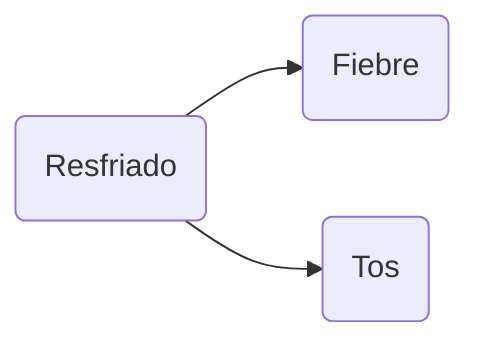
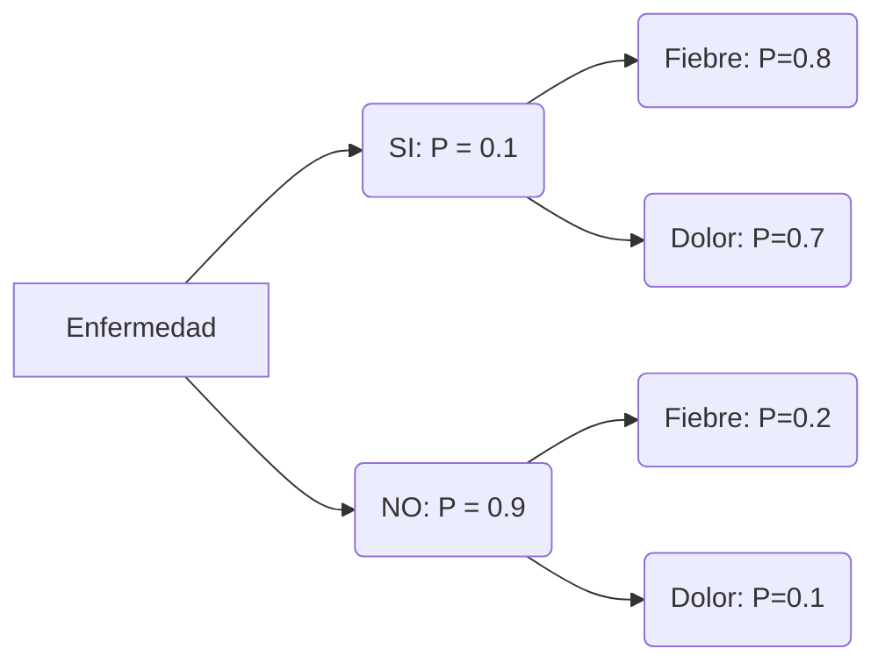
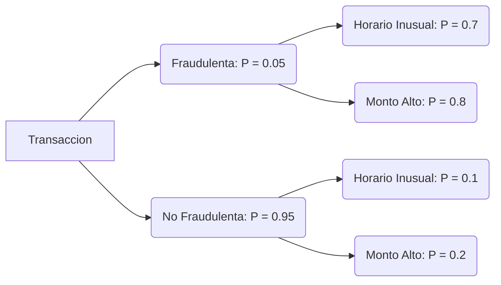

# 3. Sistemas de razonamiento impreciso

Definición y contexto dentro de la Inteligencia Artificial
---

Los **sistemas de razonamiento impreciso** son una de las herramientas más fascinantes de la inteligencia artificial (IA) moderna, diseñados para enfrentar un reto que es común en el mundo real: la **incertidumbre**. Todos los días tomamos decisiones con información incompleta o ambigua, y aunque nosotros, como humanos, podemos intuir o razonar en estos escenarios, los sistemas tradicionales de IA, que dependen de reglas estrictas y datos precisos, pueden tener dificultades. Aquí es donde entran en juego los sistemas de razonamiento impreciso, que permiten a las máquinas tomar decisiones en cierto modo más inteligentes, incluso cuando no tienen toda la información.

En el contexto de la **Inteligencia Artificial (IA)**, el razonamiento impreciso es crucial para abordar problemas en los que la toma de decisiones no puede basarse exclusivamente en datos deterministas. Muchos sistemas, especialmente aquellos que operan en entornos dinámicos, necesitan procesar información ambigua o poco clara para tomar decisiones en tiempo real. En estos casos, técnicas como la **lógica difusa**, las **redes bayesianas** o la **teoría de la posibilidad** son especialmente útiles, ya que proporcionan un marco matemático robusto para manejar la incertidumbre.

La IA tradicional, que sigue reglas predefinidas y estructuradas, funciona bien en entornos controlados donde todo es predecible. Sin embargo, en la vida real, rara vez tenemos todos los datos necesarios para una decisión perfecta. Pensemos en algo tan sencillo como el control de la temperatura en una habitación. Un sistema tradicional podría decidir que si la temperatura es mayor a 25°C, el aire acondicionado debe encenderse al máximo. Pero, ¿qué sucede si la temperatura es de 24.9°C? ¿Es necesario que el aire acondicionado se quede apagado por completo? Aquí es donde los sistemas de razonamiento impreciso, como la **lógica difusa**, ofrecen una solución más sofisticada. En lugar de tomar decisiones binarias —encendido o apagado— la lógica difusa permite que el aire acondicionado funcione a media potencia si la temperatura está cerca de los 25°C, ajustándose suavemente según sea necesario.

Otro enfoque poderoso que se utiliza en el razonamiento impreciso son las **redes bayesianas**, que emplean la probabilidad para gestionar la incertidumbre. Imaginemos el caso de un diagnóstico médico: si un paciente tiene fiebre y tos, un médico puede sospechar que tiene gripe, pero ¿y si también tiene dolor de cabeza o fatiga? Las redes bayesianas permiten calcular la probabilidad de que el paciente tenga gripe en función de estos y otros síntomas. A medida que se recopila más información —como el resultado de una prueba médica— la red ajusta automáticamente sus predicciones, haciendo el diagnóstico más preciso.

El último enfoque propio del razonamiento impreciso que se tratará en este capítulo es la **teoría de la posibilidad**, que surge como alternativa a la probabilidad para manejar la **incertidumbre y la imprecisión**. Mientras que la probabilidad mide con qué frecuencia puede ocurrir un evento, la posibilidad evalúa hasta qué punto un evento es **compatible con la información disponible**. Pensemos, por ejemplo, en un pronóstico meteorológico. Si decimos que es “muy posible” que mañana llueva, no estamos dando una cifra exacta como un 70 % de probabilidad, sino transmitiendo un grado de plausibilidad basado en evidencias parciales (nubosidad, humedad, patrones recientes). Esta teoría resulta especialmente útil en contextos donde los datos son escasos o ambiguos, y donde necesitamos razonar con afirmaciones cualitativas como “posible”, “probable” o “casi seguro”, sin exigir la precisión matemática de un modelo probabilístico.

> Los sistemas de razonamiento impreciso pueden actuar en situaciones donde los datos son imprecisos o incompletos, algo que enfrentamos constantemente en la vida cotidiana. Este enfoque imita, en cierto sentido, nuestra capacidad humana para manejar la incertidumbre y hacer suposiciones razonables, lo que hace que los sistemas de razonamiento impreciso sean esenciales para construir modelos de IA más robustos y adaptables. Como en muchos otros avances de la inteligencia artificial, lo impreciso se convierte en la clave para lograr decisiones más precisas.

Así pues, hemos visto como los **sistemas basados en reglas** fueron uno de los primeros enfoques de la IA para la toma de decisiones automatizada. Estos sistemas funcionan mediante un conjunto de reglas predefinidas del tipo "si-entonces", donde se especifica exactamente qué acción tomar en función de las entradas del sistema. Este enfoque es eficaz en entornos bien definidos, donde los datos de entrada son precisos y se pueden definir reglas claras para todas las situaciones posibles.

Sin embargo, los sistemas basados en reglas tienen dificultades cuando los datos de entrada son inciertos o ambiguos. Si una entrada no coincide exactamente con ninguna regla predefinida, el sistema puede fallar o producir resultados incorrectos. Además, la creación de un conjunto de reglas exhaustivo puede ser extremadamente compleja y difícil de mantener en sistemas grandes.

En contraste, los **sistemas de razonamiento impreciso** permiten gestionar esta incertidumbre al utilizar técnicas que pueden evaluar la probabilidad o el grado de pertenencia de una entrada a un conjunto de posibles respuestas.

### Importancia y relevancia en problemas con incertidumbre

Como se ha comentado, la **incertidumbre** es omnipresente en muchos problemas del mundo real. En situaciones donde los datos son incompletos, ruidosos o ambiguos, los sistemas tradicionales de IA basados en reglas o aprendizaje supervisado pueden tener dificultades para proporcionar resultados fiables. Aquí es donde los sistemas de razonamiento impreciso se vuelven interesantes, ya que permiten a los sistemas de IA tomar decisiones sólidas a pesar de la falta de certeza.

Algunos de los dominios más relevantes donde el razonamiento impreciso juega un papel crucial incluyen:

- **Diagnóstico médico**: Los médicos suelen enfrentarse a situaciones en las que los síntomas no son concluyentes o se superponen entre varias enfermedades. Los sistemas de razonamiento impreciso, como las redes bayesianas, permiten evaluar la probabilidad de diferentes diagnósticos basados en información parcial, mejorando la precisión en el diagnóstico y la confianza del médico en el sistema.

- **Robótica**: Los robots que operan en entornos dinámicos y no controlados deben ser capaces de manejar datos sensoriales ruidosos o incompletos. La lógica difusa permite que los robots tomen decisiones graduales en lugar de decisiones binarias, ajustando su comportamiento en tiempo real según la calidad de la información disponible.

- **Sistemas de recomendación**: En plataformas como Amazon o Netflix, los sistemas de recomendación deben hacer predicciones sobre los gustos del usuario basándose en información incompleta o incierta. Utilizando razonamiento probabilístico, estos sistemas pueden ofrecer recomendaciones personalizadas basadas en grados de similitud o afinidad.

- **Control de procesos industriales**: Los sistemas de control basados en lógica difusa son esenciales en entornos donde las condiciones no siempre son predecibles. Por ejemplo, en el control de temperatura en una planta de fabricación, la lógica difusa puede ajustar continuamente los parámetros del sistema sin requerir umbrales precisos.

> **Ejemplo**: Imaginemos un vehículo autónomo que circula por una carretera y sus sensores detectan un objeto no identificado. Si el sistema de control fuera completamente determinista, podría tomar decisiones equivocadas si no tiene una regla específica para manejar esta situación. Sin embargo, un sistema de razonamiento impreciso puede calcular la probabilidad de que el objeto sea peligroso (como una roca en la carretera) y ajustar su comportamiento en consecuencia, como reducir la velocidad o desviarse ligeramente.

---

**Para reflexionar...**

> **¿En qué situaciones un sistema basado en reglas podría fallar al manejar la incertidumbre de los datos, y cómo podría un sistema de razonamiento impreciso mejorar el resultado?**  
> (Reflexiona sobre escenarios como el diagnóstico médico o la toma de decisiones en robótica, donde los datos pueden ser ambiguos o incompletos)

### Principales modelos de razonamiento impreciso

Cualquiera de los enfoques citados a la hora de diseñar un sistema de razonamiento impreciso ofrece herramientas matemáticas para modelar problemas en los que la información es incierta, incompleta o ambigua. Así pues, los **modelos** aparecen como **estructuras matemáticas y conceptuales diseñadas para representar situaciones o fenómenos donde la información es incierta, incompleta o imprecisa**. Estos modelos permiten realizar razonamientos y tomar decisiones a pesar de la falta de claridad o precisión en los datos. A diferencia de los modelos deterministas, que operan con información exacta y determinada, los modelos de razonamiento impreciso gestionan grados de incertidumbre y ambigüedad de manera efectiva.

Por tanto, podemos afirmar que las características principales de cualquier modelo de razonamiento impreciso son tres. Primera, su capacidad de **representación de la incertidumbre**. Los modelos en sistemas de razonamiento impreciso están diseñados para manejar la incertidumbre inherente a muchos problemas del mundo real. La incertidumbre puede surgir debido a la naturaleza incompleta o ruidosa de los datos, o porque no es posible describir con exactitud todas las variables que afectan una situación. Segunda, son capaces de **manejar información parcial o ambigua**. A menudo, los datos que alimentan a los sistemas de razonamiento impreciso no son precisos o completos. En estos casos, los modelos permiten tomar decisiones razonables basadas en la información disponible, incluso si esta información es incierta o imprecisa. Tercera y última, son capaces de asignar **grados de pertenencia y probabilidades**. En efecto, a diferencia de los modelos deterministas, que asignan valores absolutos (como "verdadero" o "falso"), los modelos de razonamiento impreciso suelen utilizar grados de pertenencia o probabilidades para expresar la relación entre los datos observados y los posibles resultados. En el caso de la lógica difusa, por ejemplo, se emplean **funciones de pertenencia** para definir el grado en que un elemento pertenece a un conjunto determinado. En modelos probabilísticos, se usan **distribuciones de probabilidad** para reflejar las posibilidades de que un evento ocurra bajo condiciones inciertas.

Como se ha comentado al principio de la sección, podemos encontrar tres tipos de modelos de razonamiento impreciso que son lo más habituales

**Modelos basados en lógica difusa**: Se construyen utilizando la lógica difusa. Útiles en situaciones donde no es posible definir límites claros entre categorías, y se requiere una evaluación continua o gradual. Un modelo difuso está compuesto por conjuntos difusos, reglas difusas (del tipo "si-entonces") y funciones de pertenencia que permiten razonamientos en situaciones ambiguas.

**Modelos probabilísticos**: Utilizan la teoría de la probabilidad para gestionar la incertidumbre y se basan en la idea de que los eventos tienen una probabilidad asociada que puede calcularse a partir de los datos disponibles. Las **redes bayesianas** son un ejemplo típico de este tipo de modelo. Permiten representar y manipular relaciones de dependencia entre múltiples variables, actualizando las probabilidades a medida que se dispone de nueva información.

**Modelos basados en teoría de la posibilidad**: A diferencia de los modelos probabilísticos, están diseñados para capturar la noción de que algunos eventos son más "posibles" que otros, sin requerir un conocimiento detallado sobre la probabilidad de cada evento. Estos modelos son útiles cuando se dispone de información limitada o cuando las probabilidades exactas no están disponibles.

Modelos basados en lógica difusa
---

---

La **lógica difusa**, desarrollada por Lotfi Zadeh en 1965, surge como una extensión de la **lógica clásica** para manejar conceptos vagos o imprecisos, que no pueden ser representados adecuadamente por valores binarios (verdadero o falso). A diferencia de la lógica clásica, que se basa en un principio de exclusión mutua (algo es o verdadero o falso), la lógica difusa permite la existencia de grados de verdad, ofreciendo una representación más flexible y matizada de la realidad.

Este enfoque es particularmente útil en problemas donde las fronteras entre categorías no son claras, como por ejemplo cuando hablamos de "temperatura cálida", "nivel de satisfacción", o "distancia cercana". En estos casos, la precisión absoluta de los valores es difícil de definir, lo que convierte a la lógica difusa en una herramienta eficaz para la toma de decisiones basada en información ambigua o incompleta.

### Comparación con la lógica clásica: verdadero/falso vs. grados de verdad

En la **lógica clásica**, cualquier afirmación o proposición solo puede tomar dos valores: verdadero ($1$) o falso ($0$). Esto es útil para modelar situaciones donde los límites son claramente definidos. Sin embargo, en muchos problemas del mundo real, la información es más matizada y no se puede representar con esta rigidez binaria.

La **lógica difusa** expande este marco permitiendo que una afirmación tome cualquier valor dentro del intervalo $[0, 1]$, donde $0$ representa completamente falso, $1$ representa completamente verdadero, y cualquier valor intermedio representa un grado de verdad parcial. Por ejemplo, la afirmación "la temperatura es alta" puede tener un grado de verdad de $0.7$, lo que significa que la temperatura es "bastante alta" pero no completamente.

Este enfoque es especialmente útil en sistemas donde las decisiones no son estrictamente binarias, sino que requieren una evaluación gradual.

> **Ejemplo**: Consideremos el control de la temperatura de un aire acondicionado. En lugar de definir reglas estrictas como "si la temperatura es mayor a $25^\circ C$, encender el aire acondicionado", se puede usar lógica difusa para ajustar gradualmente la potencia del aire acondicionado según el grado de temperatura percibido, con reglas como "si la temperatura es moderadamente alta, reducir ligeramente la temperatura".

### Concepto de conjunto difuso: definición y ejemplos

Un **conjunto difuso** es una generalización del concepto clásico de conjunto. En la teoría de conjuntos clásica, un elemento pertenece o no pertenece a un conjunto, pero en un conjunto difuso, cada elemento tiene un grado de pertenencia que varía entre $0$ y $1$. Este grado de pertenencia refleja en qué medida un elemento es parte del conjunto.

> **Ejemplo:** En un sistema clásico, una persona es considerada "alta" o "baja" en función de un umbral claramente definido. Alguien que mida más de 1,80 metros es clasificado como "alto", mientras que quienes miden menos, pertenecen al conjunto de los "bajos". En este enfoque, no se permiten grados de pertenencia; una persona pertenece solo a un conjunto y no al otro.

La **función de pertenencia** de un conjunto difuso asigna un valor a cada elemento, indicando su grado de pertenencia al conjunto. Por ejemplo, en el conjunto difuso "temperatura cálida", una temperatura de $20^\circ C$ podría tener un grado de pertenencia de $0.2$, mientras que una temperatura de $30^\circ C$ podría tener un grado de pertenencia de $0.9$.

> **Ejemplo**: En un sistema de control de velocidad para un automóvil, el conjunto difuso "velocidad rápida" puede incluir velocidades que varían de manera continua, con un grado de pertenencia de $0.2$ para $60$ km/h y de $0.8$ para $120$ km/h, en lugar de definir una velocidad fija como "rápida".

### Funciones de pertenencia: tipos y aplicaciones

Una **función de pertenencia** es el componente clave de un conjunto difuso, ya que define **matemáticamente** el grado de pertenencia de cada elemento al conjunto. 

Existen varias formas típicas de funciones de pertenencia, cada una adecuada para diferentes tipos de aplicaciones:

Las **funciones trapezoidales y triangulares** son las funciones de pertenencia más comunes y son útiles para situaciones donde los límites de una categoría son graduales. Una función trapezoidal, por ejemplo, define un intervalo central donde la pertenencia es $1$, pero tiene transiciones suaves en los extremos.

Por su parte, las **funciones gaussianas**  son más adecuadas para representar fenómenos naturales donde la transición entre categorías sigue una curva normal. Las funciones gaussianas se utilizan en sistemas donde las transiciones entre estados deben ser muy suaves.

Por último, las **funciones sigmoides** se utilizan para representar situaciones donde hay un cambio rápido entre dos estados. Son útiles en casos donde el cambio de una categoría a otra ocurre de manera abrupta.

> **Ejemplo**: En el control de la ventilación de un edificio, una función de pertenencia trapezoidal podría definir **la temperatura "confortable"**, con un intervalo entre $20^\circ C$ y $25^\circ C$, pero con transiciones graduales en los extremos (entre $15^\circ C$ y $30^\circ C$).

> **Ejemplo:**  En el control de la humedad en una bodega de vinos, una función de pertenencia **gaussiana** podría definir el **nivel de humedad "óptimo"** alrededor del 60%. La función tendría un pico máximo en 60% de humedad, y caería gradualmente en ambas direcciones a medida que la humedad se aleja de ese valor. Por ejemplo, a medida que la humedad desciende a 50% o sube a 70%, la pertenencia al conjunto "óptimo" disminuye suavemente, reflejando una transición más natural entre niveles aceptables y no aceptables para la conservación del vino.

> **Ejemplo:** En el control del nivel de iluminación en un entorno de oficina, una función de pertenencia **sigmoide** podría representar **la transición entre "poca luz" y "mucha luz"**. Para niveles bajos de luz, por ejemplo, por debajo de 300 lux, la pertenencia al conjunto "poca luz" sería cercana a 1. A medida que la iluminación aumenta, la pertenencia disminuye gradualmente, siguiendo la curva sigmoide, hasta que, alrededor de los 600 lux, la pertenencia al conjunto "mucha luz" empieza a predominar, garantizando una transición suave en la intensidad de la iluminación según las necesidades del entorno de trabajo.


> Una **función gaussiana** es una función matemática en forma de campana, que se utiliza frecuentemente en teoría de probabilidad y lógica difusa debido a su capacidad para representar una transición suave y gradual entre valores. Esta función es simétrica y tiene un único pico en su centro, disminuyendo progresivamente a medida que nos alejamos de dicho punto, lo que la hace útil para modelar incertidumbre y variaciones continuas.
>
> Matemáticamente, la **función de pertenencia gaussiana** se expresa como:
>
> $$
> G(x) = e^{-\frac{(x - \mu)^2}{2\sigma^2}}
> $$
> Donde:
>
> - $ x $ es la variable de entrada.
> - $\mu$ es el valor central o la media de la función (el punto donde la función alcanza su valor máximo).
> - $\sigma$ es la desviación estándar, que controla el ancho de la curva; cuanto mayor es $\sigma$, más ancha es la campana.
>
> En lógica difusa, la función gaussiana se utiliza para representar conjuntos donde el grado de pertenencia de un elemento disminuye gradualmente a medida que nos alejamos del valor central. Esto es útil en situaciones donde las transiciones entre categorías son difusas, sin límites claro.
>
> Una **función sigmoide** es una función matemática que tiene una forma de "S" suave y es ampliamente utilizada en diversos campos, incluida la inteligencia artificial y el aprendizaje automático. La característica principal de una función sigmoide es que convierte valores de entrada de un rango amplio en una salida que se encuentra dentro de un rango limitado, generalmente entre 0 y 1, lo que la hace útil para modelar transiciones suaves entre estados. Matemáticamente, una de las formas más comunes de la función sigmoide es la **sigmoide logística**, que se expresa como:
> $$
> S(x) = \frac{1}{1 + e^{-x}}
> $$
> Esta función se utiliza frecuentemente en redes neuronales, donde ayuda a modelar probabilidades o a activar neuronas, y en sistemas de control difuso, donde es útil para representar transiciones suaves entre diferentes estados.

#### Ejemplos de cálculo de función de pertenencia

En el contexto de sistemas difusos, una **función de pertenencia** define el grado en el que un elemento pertenece a un conjunto difuso. Este grado, que varía entre 0 y 1, permite asignar una valoración continua de pertenencia que se emplea en lógica difusa para modelar situaciones de incertidumbre o aproximación.

##### Ejemplo 1: Función de pertenencia trapezoidal para "temperatura alta"

Consideramos el siguiente modelo de función de pertenencia trapezoidal para "temperatura alta":

- Temperatura baja: valores de 20 °C o menos, con una pertenencia de 0.
- Temperatura alta: comienza a partir de 25 °C y llega al valor máximo de pertenencia (1) a 30 °C.
- A partir de 35 °C o más, la pertenencia sigue siendo 1.

La función de pertenencia trapezoidal, μ(x), para la temperatura alta se define como:

$$
\mu_{\text{temp-alta}}(x) =
\begin{cases} 
0, & x \leq 20 \\
\frac{x - 20}{5}, & 20 < x < 25 \\
1, & 25 \leq x \leq 35 \\
\frac{40 - x}{5}, & 35 < x < 40 \\
0, & x \geq 40
\end{cases}
$$

**Cálculo de grados de pertenencia**

Ahora, calcularemos el grado de pertenencia para diferentes temperaturas:

1. **Si la temperatura es 22 °C**:
   - Aplicamos la regla: $\mu_{\text{alta}}(x) = \frac{x - 20}{5}$
   - Sustituyendo: $\mu_{\text{alta}}(22) = \frac{22 - 20}{5} = 0.4$
   - La pertenencia de 22 °C a "temperatura alta" es 0.4.

2. **Si la temperatura es 28 °C**:
   - Como 28 °C está entre 25 y 35, su pertenencia es máxima.
   - Por tanto, $\mu_{\text{alta}}(28) = 1$

3. **Si la temperatura es 38 °C**:
   - Aplicamos la regla: $\mu_{\text{alta}}(x) = \frac{40 - x}{5}$
   - Sustituyendo: $\mu_{\text{alta}}(38) = \frac{40 - 38}{5} = 0.4$
   - La pertenencia de 38 °C a "temperatura alta" es 0.4.

##### Ejemplo 2: Cálculo de función de pertenencia sigmoide para “persona joven”

En sistemas difusos, las funciones de pertenencia sigmoides son útiles para representar conceptos difusos con transiciones suaves en los extremos. Estas funciones tienen una forma en "S" y son ideales para representar conjuntos donde la pertenencia aumenta o disminuye gradualmente en lugar de hacerlo abruptamente.

Consideremos un ejemplo en el que queremos definir el grado de pertenencia al conjunto difuso de "persona joven", usando una función sigmoide. Definimos la función de pertenencia sigmoide para "persona joven" en función de la edad, donde:

- A medida que la edad aumenta, el grado de pertenencia a "persona joven" disminuye gradualmente.
- La función sigmoide que usaremos es:

$$
\mu_{\text{joven}}(x) = \frac{1}{1 + e^{-(x - a) / b}}
$$

donde:

- \( x \) es la edad de la persona.
- \( a \) es el valor de inflexión o centro de la función, que representa la edad a partir de la cual el grado de pertenencia disminuye notablemente. En este caso, consideremos \( a = 30 \).
- \( b \) es un parámetro que controla la pendiente de la transición; cuanto mayor es \( b \), más gradual es la transición. Aquí usaremos \( b = 5 \).

**Cálculo de grados de pertenencia**

Vamos a calcular el grado de pertenencia para diferentes edades usando esta función sigmoide:

**Si la persona tiene 20 años**, sustituyendo en la función: 
$$
\mu_{\text{joven}}(20) = \frac{1}{1 + e^{-(20 - 30) / 5}} \approx 0.12
$$

Es decir, la pertenencia de 20 años a "persona joven" es aproximadamente 0.12.

**Si la persona tiene 30 años**:

$$
\mu_{\text{joven}}(30) = \frac{1}{1 + e^{-(30 - 30) / 5}} = \frac{1}{1 + e^0} = 0.5
$$
   La pertenencia de 30 años a "persona joven" es 0.5, reflejando una transición.

**Si la persona tiene 40 años**, sustituyendo en la función:
$$
   \mu_{\text{joven}}(40) = \frac{1}{1 + e^{-(40 - 30) / 5}} \approx 0.88
$$
   La pertenencia de 40 años a "persona joven" es aproximadamente 0.88.

En este ejemplo vemos cómo la función de pertenencia sigmoide permite modelar la pertenencia al conjunto "persona joven" con una transición gradual en torno a los 30 años. Este tipo de función es especialmente útil para representar conceptos con bordes suaves, donde no existe una distinción clara entre pertenecer o no al conjunto.

### Reglas difusas: estructura y ejemplos

En lógica difusa, una **regla difusa** es una instrucción que conecta condiciones imprecisas con conclusiones o acciones de forma aproximada, utilizando expresiones del lenguaje natural. Su propósito es trasladar el conocimiento humano, que a menudo se formula en términos vagos como “alto”, “bajo” o “moderado”, a un sistema formal que pueda procesarlo automáticamente.

Una **regla difusa** se estructura en términos de "si-entonces", pero en lugar de trabajar con valores exactos, las reglas difusas utilizan grados de pertenencia para manejar la incertidumbre. La forma general de una regla difusa es:
$$
\text{Si \textbf{x} es \textbf{A} entonces \textbf{y} es \textbf{B}}
$$
Donde $x$ y $y$ son variables difusas, y $A$ y $B$ son conjuntos difusos definidos por funciones de pertenencia. El proceso de toma de decisiones se basa en la inferencia difusa, que evalúa estas reglas y produce una salida basada en los grados de verdad de las condiciones.

> **Ejemplo**: En un sistema de control de velocidad, una regla difusa podría ser: "Si la inclinación de la carretera es leve y la velocidad es alta, entonces reducir la velocidad ligeramente". En este caso, las entradas (inclinación y velocidad) son variables difusas y la salida es una acción difusa (reducir la velocidad en un grado determinado).

> **Ejemplo**: En un sistema de climatización, una regla difusa podría ser: "Si la temperatura exterior es baja y la humedad es alta, entonces reducir la ventilación". Aquí, las entradas (temperatura exterior y humedad) son variables difusas, mientras que la salida es una acción difusa (ajustar la ventilación en función de estas condiciones).

> **Ejemplo**: En un sistema de iluminación inteligente, una regla difusa sería: "Si la luz natural es baja y la ocupación de la habitación es alta, entonces aumentar la intensidad de la luz". En este caso, las variables difusas de entrada son la luz natural y la ocupación, mientras que la salida difusa controla la intensidad de la luz.

### Operaciones en conjuntos difusos: unión, intersección, y complementos

Al igual que en la teoría de conjuntos clásica, en los conjuntos difusos se pueden realizar **operaciones** como la unión, intersección y complemento, aunque de manera generalizada para considerar los grados de pertenencia. ¿Por que es importante conocer cómo funcionan estas operaciones? Porque las operaciones con conjuntos difusos son la base para **combinar y manipular la información ambigua en reglas de lógica difusa**.

Hemos visto en la sección anterior como en un sistema de lógica difusa, las reglas del tipo "Si… Entonces…" combinan diferentes conjuntos. Por ejemplo, en un sistema para el control de temperatura, se podría tener una regla del tipo
$$
\text{"Si la temperatura es \textbf{alta} y la humedad es \textbf{baja}, entonces la ventilación debe ser \textbf{media}"}
$$
Para aplicar esta regla, es necesario operar entre los conjuntos difusos "alta" y "baja". Las operaciones como la **intersección (AND)** y **unión (OR)** permiten combinar conjuntos difusos y establecer relaciones entre ellos en las reglas, lo que es crucial para definir la lógica del sistema. Para aplicar estas operaciones hay que realizar un proceso de **inferencia difusa** (o *fuzzyficación*), quiere decir que, por ejemplo el operador **AND** determinará **el grado mínimo de pertenencia** y que el operador **OR**, **el grado máximo**.

En lógica difusa, los operadores **AND** y **OR** tienen una relación directa con las operaciones de **intersección** y **unión** de conjuntos difusos, respectivamente. Esta relación permite combinar diferentes grados de pertenencia de los conjuntos, simulando el razonamiento humano en situaciones de incertidumbre o imprecisión. Así, en lógica difusa, el operador **AND** corresponde a la operación de **intersección** entre conjuntos difusos. Cuando tenemos una regla que implica condiciones conjuntas, como "Si `A` y `B`", estamos evaluando la intersección entre los conjuntos `A` y `B`. Matemáticamente, la intersección se define tomando el **mínimo** de los grados de pertenencia de los conjuntos involucrados. Esto se expresa así:
$$
\mu_{\text{A AND B}}(x) = \min(\mu_A(x), \mu_B(x))
$$
Esto significa que el grado de pertenencia del elemento `x` al conjunto `A AND B` será el valor más bajo entre sus grados de pertenencia individuales en los conjuntos `A` y `B`. Este enfoque refleja el concepto de **restricción conjunta**, donde ambas condiciones deben cumplirse simultáneamente.

En cuanto al operador **OR**, tenemos que en lógica difusa corresponde a la operación de **unión** entre conjuntos difusos. Cuando una regla difusa implica una condición alternativa, como "Si `A` o `B`", se está evaluando la unión entre los conjuntos `A` y `B`.

Matemáticamente, la unión en lógica difusa se define como el **máximo** de los grados de pertenencia de los conjuntos involucrados:
$$
\mu_{\text{A OR B}}(x) = \max(\mu_A(x), \mu_B(x))
$$
Y esto significa que el grado de pertenencia del elemento `x` al conjunto `A OR B` será el mayor de sus grados de pertenencia en `A` o `B`. Este enfoque refleja el concepto de **alternativa permisiva**, donde basta con que una de las condiciones se cumpla.

> **Ejemplo**: Imaginemos un sistema difuso que evalúa la temperatura y la humedad en un invernadero, donde:
>
> - `Temperatura ALTA` tiene un grado de pertenencia de 0.7.
> - `Humedad ALTA` tiene un grado de pertenencia de 0.4.
>
> **Intersección (AND)**: Para evaluar "Si la temperatura es ALTA **y** la humedad es ALTA", aplicamos la intersección:
> $$
> \mu_{\text{ALTA AND ALTA}} = \min(0.7, 0.4) = 0.4
> $$
>
> Esto indica que el grado de pertenencia combinado de cumplir ambas condiciones simultáneamente es 0.4.
>
> **Unión (OR)**: Para evaluar "Si la temperatura es ALTA **o** la humedad es ALTA", aplicamos la unión:
> $$
> \mu_{\text{ALTA OR ALTA}} = \max(0.7, 0.4) = 0.7
> $$
>
> Aquí, el grado de pertenencia combinado es 0.7, reflejando que basta con que una de las dos condiciones se cumpla en mayor medida.

Por último señalar que también existe un relación de equivalencia entre la **operación de complemento difuso** y el operador **NOT**. En lógica difusa, la operación de complemento permite representar la idea de "no pertenencia" de un elemento a un conjunto difuso, similar a cómo la negación indica que una proposición no es verdadera.

La fórmula para calcular el complemento de un grado de pertenencia $ \mu_A(x) $ es:
$$
\mu_{\text{NOT A}}(x) = 1 - \mu_A(x)
$$
donde:

- $ \mu_A(x) $ es el grado de pertenencia del elemento $ x $ en el conjunto difuso $ A $,
- $ \mu_{\text{NOT A}}(x) $ es el grado de pertenencia de $ x $ en el conjunto complementario de $ A $.

> **Ejemplo:** Supongamos que tenemos un conjunto difuso que representa "temperatura ALTA", y para una temperatura de 25 °C, el grado de pertenencia a "temperatura ALTA" es 0.7. El complemento difuso de "temperatura ALTA" representaría "temperatura NO ALTA", y su cálculo sería:
> $$
> \mu_{\text{NO ALTA}}(25) = 1 - 0.7 = 0.3
> $$
>
> Esto significa que el grado de pertenencia de 25 °C a "temperatura NO ALTA" es 0.3, indicando que 25 °C pertenece en un 30 % al conjunto de temperaturas que no son altas.

> **Ejemplo**: Imaginemos un sistema de lógica difusa para evaluar el riesgo de inversión basado en dos entradas: la **volatilidad del mercado** (baja, media, alta) y el **rendimiento esperado** (bajo, medio, alto). Para crear un modelo de evaluación de riesgo:
>
> - Utilizaríamos operaciones de **intersección** para definir reglas como "Si la volatilidad es **alta** y el rendimiento esperado es **alto**, entonces el riesgo es **alto**."
> - Las operaciones de **unión** podrían permitir reglas que flexibilicen la evaluación, como "Si la volatilidad es **media** o el rendimiento esperado es **alto**, entonces el riesgo es **medio**."
>
> Sin las operaciones de conjuntos difusos, sería imposible combinar estas condiciones y realizar una inferencia adecuada, limitando la capacidad del modelo para representar situaciones complejas. Por lo tanto, estas operaciones son esenciales para que los modelos de lógica difusa simulen el razonamiento humano y proporcionen respuestas adaptativas en escenarios inciertos.

### Elaboración de modelos basados en lógica difusa

Hemos visto como los **modelos basados en lógica difusa** son sistemas diseñados para manejar incertidumbre y vaguedad en situaciones donde los datos no son claros o están incompletos. Asimismo hemos introducido los elementos básicos que forman parte de cualquier modelo de este tipo. Queda ahora entender el proceso de elaboración del correspondiente modelo. Para ello hay que tener en cuenta que el núcleo funcional de cualquier modelo basado en lógica difusa es el **mecanismo de inferencia difusa**. En esencia, este mecanismo es el **conjunto de pasos y cálculos lógicos que el modelo aplica para realizar inferencias a partir de datos imprecisos o ambiguos**. Estos pasos permiten que el modelo tome decisiones o proporcione respuestas que reflejan la incertidumbre y gradualidad del conocimiento humano. Sin el mecanismo de inferencia, el modelo sería solo una colección de reglas y funciones de pertenencia, pero no podría procesar datos en tiempo real ni hacer inferencias.

En un modelo de lógica difusa, el mecanismo de inferencia emula la capacidad del pensamiento humano de evaluar escenarios inciertos. Mediante la evaluación de reglas y la combinación de grados de pertenencia, el modelo puede simular decisiones similares a las humanas en entornos complejos. Esta relación entre el mecanismo de inferencia y el modelo permite que el sistema trabaje con conceptos graduales o difusos que son difíciles de cuantificar en sistemas lógicos tradicionales.

Además, el mecanismo de inferencia difusa le otorga al modelo flexibilidad y adaptabilidad. La capacidad de manejar datos ambiguos mediante el uso de funciones de pertenencia y operadores lógicos hace que el modelo sea adecuado para aplicaciones en las que los datos son inciertos o variables. 

#### Fases del ciclo de inferencia

Como se ha comentado, el ciclo de inferencia el proceso que permite a un sistema de lógica difusa transformar entradas imprecisas en una salida precisa. Este ciclo se compone de cuatro fases principales: **fuzzificación**, **evaluación de reglas**, **agregación de resultados** y **desfuzzificación**. A continuación, se explica cada fase y su papel en el conjunto del modelo.

La **fuzzificación** es el primer paso del ciclo de inferencia difusa y se encarga de convertir las entradas concretas en valores difusos, asignándoles un grado de pertenencia en conjuntos difusos predefinidos. El objetivo de esta fase es permitir que el modelo de lógica difusa interprete entradas precisas en términos vagos o imprecisos, como "bajo", "medio" o "alto". Cada entrada es evaluada en relación con una o varias funciones de pertenencia para determinar su grado de pertenencia a cada conjunto difuso relevante.

> **Ejemplo**: Si una entrada representa una temperatura de 28 °C, la fuzzificación determinará su grado de pertenencia a los conjuntos difusos "temperatura baja", "temperatura media" y "temperatura alta". En este caso, la temperatura de 28 °C podría tener un grado de pertenencia de 0.3 a "media" y de 0.7 a "alta".

La **evaluación de reglas** es el proceso en el que se aplican las reglas difusas del sistema para combinar los valores difusos de las entradas y generar una salida difusa preliminar.

Aplicar las reglas de inferencia difusa, generalmente del tipo "Si... Entonces...", permite evaluar cómo se relacionan las condiciones de entrada y cómo influyen en las salidas. Cada regla combina los grados de pertenencia de las entradas mediante operadores difusos como **AND** (mínimo), **OR** (máximo) o **NOT** (complemento).

> **Ejemplo**: Supongamos una regla que dice: "Si la temperatura es ALTA y la humedad es BAJA, entonces la velocidad del ventilador es ALTA." Con un grado de pertenencia de 0.7 en "temperatura ALTA" y 0.5 en "humedad BAJA", el operador AND tomaría el mínimo de ambos, 0.5, como el grado de cumplimiento de la regla para "velocidad ALTA".

En la **agregación de resultados**, las salidas difusas de todas las reglas evaluadas se combinan en un solo conjunto difuso que representa la salida global del sistema. La idea de esta fase es consolidar la influencia de todas las reglas en una sola salida difusa. Para ello se utiliza una operación de unión (generalmente el **máximo**) para combinar los resultados de todas las reglas aplicables. La agregación permite que el sistema considere múltiples reglas al mismo tiempo y genere una salida integrada que refleje todas las posibles combinaciones de las entradas.

> **Ejemplo**: Si tenemos varias reglas que resultan en "velocidad del ventilador ALTA" con grados de pertenencia de 0.5 y 0.7, la operación de agregación combinará estos resultados y el conjunto "velocidad ALTA" tendrá una pertenencia final de 0.7 (el máximo de los valores).

La **desfuzzificación** es la fase final y convierte la salida difusa agregada en un valor concreto que el sistema puede usar para tomar una decisión o ejecutar una acción específica. La desfuzzificación es básica porque, aunque la lógica difusa es adecuada para trabajar con conceptos vagos o imprecisos, la mayoría de los sistemas de control o aplicaciones prácticas **requieren salidas concretas y definidas para interactuar efectivamente con el entorno**. Sin el proceso de desfuzzificación, los resultados del sistema de inferencia difusa serían difíciles de aplicar en situaciones prácticas, ya que se limitarían a una representación ambigua. La desfuzzificación aporta precisión y permite a los sistemas basados en lógica difusa tomar decisiones específicas, cerrando el ciclo de razonamiento difuso desde la entrada hasta la salida.

Al final de lo que se trata es de transformar el conjunto difuso de salida en un valor preciso, lo cual permite que el sistema interactúe con el entorno de manera específica. Para ejecutar esta transformación existen una serie de métodos matemáticos, de entre los cuales podemos destacar los siguientes:

**Centro de Gravedad (o Centroide): ** Es el método de más utilizado. Calcula el "centro de masa" del área bajo la curva de la función de pertenencia de la salida difusa. La fórmula para calcular el centro de gravedad es:
$$
z^* = \frac{\int z \cdot \mu_{\text{salida}}(z) \, dz}{\int \mu_{\text{salida}}(z) \, dz}
$$
donde $z^*$ es el valor desfuzzificado, y $\mu_{\text{salida}}(z)$ representa el grado de pertenencia en el conjunto de salida.

Este método es preciso y produce un valor medio representativo, por lo que es ideal para sistemas de control que requieren decisiones suaves y continuas.

**Media de los Máximos (MOM):** Este método toma la media de todos los valores con el grado de pertenencia más alto en la función de salida difusa. Es una forma simplificada que no calcula el área bajo la curva, sino que se enfoca en los puntos con máxima pertenencia. Computacionalmente menos costoso y rápido, y por tanto útil en sistemas donde el tiempo de respuesta es crítico.

**Máximo de Altura (o Máximo Simple)**: Este método toma el valor $z$ en el que la función de pertenencia de la salida difusa alcanza su valor máximo. Es el método más sencillo y rápido de calcular, ya que solo requiere identificar el máximo valor de pertenencia sin promediar.

### Aplicaciones y ejemplos de los modelos difusos: Sistemas de control

Los **modelos de lógica difusa** se utilizan en una amplia gama de aplicaciones, especialmente en sistemas de control y toma de decisiones. Estos sistemas son populares en entornos donde los modelos clásicos fallan debido a la incertidumbre inherente o la vaguedad de los datos. 

El **control difuso** es una de las aplicaciones más destacadas y prácticas de la lógica difusa en el campo de la ingeniería y la automatización. Su principal ventaja radica en su capacidad para manejar situaciones en las que los sistemas no pueden ser modelados con precisión o cuando el comportamiento del sistema está influido por múltiples factores que no son fáciles de describir mediante ecuaciones exactas. A diferencia de los controladores tradicionales, que requieren un modelo matemático exacto del sistema, el control difuso permite utilizar el conocimiento empírico y la experiencia humana, traducido en reglas difusas, para tomar decisiones de control en tiempo real.

> **Ejemplo:** en un sistema de calefacción, en lugar de decir "si la temperatura es inferior a 18°C, encender la calefacción", el control difuso puede definir reglas más flexibles como "si la temperatura es algo baja, aumentar un poco la calefacción". Este enfoque permite realizar ajustes más suaves y graduales, mejorando la eficiencia energética y el confort.

La **inferencia difusa** que se utiliza en los controladores difusos es similar a la **inferencia en sistemas expertos**, donde se aplican reglas para obtener conclusiones basadas en un conjunto de entradas. Sin embargo, a diferencia de los sistemas basados en reglas clásicas, donde las decisiones son categóricas (verdadero/falso), en el control difuso las decisiones son graduales, lo que permite una mayor flexibilidad y adaptabilidad al entorno.

Claro, veamos un ejemplo simplificado de elaboración de un modelo de este tipo.

#### Ejemplo de cálculo de control difuso en un sistema de calefacción

Supongamos un sistema de lógica difusa que controla el **nivel de calefacción** en función de la **temperatura ambiente**. La variable de entrada es la **temperatura**, y la variable de salida es el **nivel de calefacción**. Ambas están definidas en términos de conjuntos difusos simples.

1. **Temperatura** (entrada) tiene tres conjuntos difusos: "Baja", "Media" y "Alta".
2. **Calefacción** (salida) tiene tres conjuntos difusos: "Bajo", "Medio" y "Alto".

Veamos cuales son las funciones de pertenencia.

**Para la temperatura (entrada del modelo)** tendremos un rango entre 0 °C y 30 °C, y las correspondientes funciones par cada conjunto se definen como sigue:

- **Temperatura Baja**: Triangular, con máximo en 0 °C y baja en 15 °C.

$$
  \mu_{\text{Baja}}(T) = 
  \begin{cases}
      1 - \frac{T}{15} & \text{si } 0 \leq T \leq 15 \\
      0 & \text{si } T > 15
  \end{cases}
$$

- **Temperatura Media**: Triangular, centrada en 15 °C con un valor de 0 en 0 °C y 30 °C.

$$
  \mu_{\text{Media}}(T) = 
  \begin{cases}
      \frac{T}{15} & \text{si } 0 \leq T \leq 15 \\
      1 - \frac{T - 15}{15} & \text{si } 15 < T \leq 30 \\
      0 & \text{en otro caso}
  \end{cases}
$$

- **Temperatura Alta**: Triangular, con mínimo en 15 °C y máximo en 30 °C.

$$
\mu_{\text{Alta}}(T) = 
  \begin{cases}
      \frac{T - 15}{15} & \text{si } 15 \leq T \leq 30 \\
      0 & \text{si } T < 15
  \end{cases}
$$

**Para la calefacción** tenemos un rango de 0 % a 100 % de potencia. Para simplificar, definimos cada función de pertenencia como constante de tal modo que para cada uno de los conjuntos difusos tenemos que

- **Calefacción Baja**: 20 %
- **Calefacción Media**: 50 %
- **Calefacción Alta**: 80 %

Dados los conjuntos difusos y las funciones de pertenencia podemos abordar la fase de **fuzzificación**. Para ello tendríamos que partir de un valor concreto de la variable de entrada (temperatura). Supongamos que dicha temperatura es de **10 °C**. Calculamos el grado de pertenencia de esta temperatura en cada conjunto de temperatura:

1. **Temperatura Baja**: $\mu_{\text{Baja}}(10) = 1 - \frac{10}{15} = 0.33$.
2. **Temperatura Media**: $\mu_{\text{Media}}(10) = \frac{10}{15} = 0.67$
3. **Temperatura Alta**: $\mu_{\text{Alta}}(10) = 0$ (ya que 10 °C está fuera del rango de "Alta")

A partir de aquí tendríamos que aplicar las reglas difusas para el control de calefacción. En nuestro caso las reglas de las que partimos son las siguientes:

1. **Regla 1**: Si la temperatura es **Baja**, entonces la calefacción es **Alta**.
2. **Regla 2**: Si la temperatura es **Media**, entonces la calefacción es **Media**.
3. **Regla 3**: Si la temperatura es **Alta**, entonces la calefacción es **Baja**.

Para nuestra temperatura de 10 °C:

- **Regla 1**: La temperatura es Baja con un grado de pertenencia de 0.33, así que la calefacción **Alta** se activa a 0.33.
- **Regla 2**: La temperatura es Media con un grado de pertenencia de 0.67, así que la calefacción **Media** se activa a 0.67.
- **Regla 3**: La temperatura es Alta con un grado de pertenencia de 0, por lo que la calefacción **Baja** no se activa.

Esto nos da los siguientes grados de pertenencia para cada nivel de calefacción:

- **Calefacción Baja**: 0
- **Calefacción Media**: 0.67
- **Calefacción Alta**: 0.33

Por último abordaríamos el proceso de **desfuzzificación**. Podremos aplicar alguno de los métodos reseñados más arriba. En concreto haremos uso del método del centroide. Así pues aplicamos la fórmula correspondiente:
$$
z^* = \frac{\sum z_i \cdot \mu_{\text{salida}}(z_i)}{\sum \mu_{\text{salida}}(z_i)}
$$
Donde $z_i$ es el valor de calefacción en cada conjunto, y $\mu_{\text{salida}}(z_i)$ es el grado de pertenencia asociado:

- Calefacción Alta (80 %) con grado de pertenencia 0.33
- Calefacción Media (50 %) con grado de pertenencia 0.67
- Calefacción Baja (20 %) con grado de pertenencia 0

Entonces:
$$
z^* = \frac{(80 \times 0.33) + (50 \times 0.67) + (20 \times 0)}{0.33 + 0.67 + 0}
$$
Calculamos cada término:

1. $80 \times 0.33 = 26.4$
2. $0 \times 0.67 = 33.5$
3. $20 \times 0 = 0$

Sumamos los valores:
$$
z^* = \frac{26.4 + 33.5 + 0}{0.33 + 0.67} = \frac{59.9}{1} = 59.9
$$

Hemos obtenido el valor final de salida. El nivel de calefacción, tras la desfuzzificación, es aproximadamente **60 %**. Este valor concreto se puede utilizar para ajustar el sistema de calefacción de manera precisa, proporcionando una respuesta final que tiene en cuenta los diferentes grados de pertenencia y reglas del sistema.

---

#### Ventajas del control difuso frente a otros controles

Uno de los puntos fuertes del control difuso es su capacidad para manejar sistemas complejos sin necesidad de un modelo matemático detallado. Esto es especialmente útil en sistemas dinámicos complejos, o cuando las condiciones cambian constantemente.

El **control difuso** no requiere ningún tipo de conocimiento previo detallado. En lugar de eso, se basa en reglas sencillas que pueden derivarse de la experiencia de operadores humanos. Este enfoque es particularmente útil en situaciones donde el modelo exacto del sistema es difícil de obtener, como en la robótica autónoma o en sistemas con múltiples variables de entrada y salida que interactúan de manera no lineal.

> **Ejemplo**: Un robot que navega en un entorno desconocido puede tener reglas difusas como: "Si la distancia al obstáculo es pequeña, reducir la velocidad rápidamente", o "Si la distancia al obstáculo es moderada, reducir la velocidad ligeramente". Estas reglas permiten que el robot ajuste su comportamiento de manera suave y adaptativa sin necesidad de un modelo matemático preciso del entorno.

#### Integración en sistemas más amplios de IA

El **control difuso** se puede integrar con otros enfoques de IA para formar **sistemas híbridos**. Por ejemplo, un robot autónomo podría utilizar redes neuronales para aprender de su entorno y mejorar su rendimiento con el tiempo, mientras que simultáneamente usa control difuso para tomar decisiones en tiempo real, como ajustar su velocidad o trayectoria en función de la distancia a obstáculos.

Este enfoque híbrido aprovecha las fortalezas de diferentes técnicas de IA. La **lógica difusa** proporciona la flexibilidad y robustez necesarias para manejar la incertidumbre, mientras que otros enfoques como el **aprendizaje automático** permiten que el sistema mejore su rendimiento y se adapte a entornos dinámicos.

En conclusión, el control difuso es una herramienta poderosa dentro de la lógica difusa, y su capacidad para manejar sistemas complejos sin modelos exactos lo convierte en una solución eficiente en una amplia variedad de aplicaciones, desde la automatización industrial hasta la robótica avanzada. 

> Los **modelos basados en lógica difusa** proporcionan un marco poderoso para abordar problemas complejos en situaciones donde la información es incierta o imprecisa, ya que la lógica difusa proporciona un mecanismo para modelar conceptos imprecisos y realizar inferencias en sistemas donde normalmente los modelos tradicionales fallan. 
>
> Los modelos difusos ofrecen **flexibilidad** y **adaptabilidad**, permitiendo manejar información inexacta de manera natural. Sin embargo, una limitación clave es la **subjetividad en la definición de las funciones de pertenencia**. Aunque estas funciones permiten modelar la vaguedad, su diseño depende en gran medida del conocimiento experto y puede introducir sesgos.

### Ventajas y limitaciones de la lógica difusa

La **lógica difusa** tiene múltiples ventajas que la hacen adecuada para aplicaciones que requieren flexibilidad y adaptabilidad. Su capacidad para manejar incertidumbre y ambigüedad permite tomar decisiones en contextos del mundo real donde las situaciones rara vez son estrictamente binarias. En estos entornos, la lógica difusa sobresale al representar conceptos imprecisos como "ligeramente", "moderadamente" o "muy", sin la rigidez de los modelos clásicos. Además, los sistemas difusos son relativamente simples de diseñar e implementar, especialmente en aplicaciones de control, donde la simplicidad y el bajo coste de implementación son factores clave.

Esta flexibilidad también hace que los sistemas basados en lógica difusa se adapten con facilidad a distintas situaciones, lo que permite realizar ajustes en las reglas y funciones sin una reprogramación completa. No obstante, para que estos sistemas funcionen plenamente, es necesario contar con hardware capaz de interpretar señales modulares o variables, como los sistemas de control de velocidad o válvulas de flujo ajustables. La lógica difusa ofrece un rendimiento óptimo cuando el hardware de salida puede responder a señales de control gradual, lo que permite ajustes en niveles de potencia, velocidad o temperatura de manera continua en lugar de limitada a estados fijos de encendido y apagado.

A pesar de estas ventajas, existen algunas limitaciones importantes. La elección de las funciones de pertenencia es un aspecto crucial que afecta directamente al rendimiento del sistema; en muchos casos, su definición es subjetiva y depende de la experiencia humana, lo que introduce un grado de imprecisión en los resultados. Además, la lógica difusa no siempre resulta la opción más adecuada para sistemas de gran escala o con numerosas variables. Cuando los problemas tienen muchas variables o interacciones complejas, los modelos difusos pueden volverse difíciles de manejar y menos eficaces, requiriendo una mayor complejidad en la implementación o un hardware capaz de gestionar grandes cantidades de reglas y combinaciones, lo que limita su aplicabilidad en escenarios industriales o de sistemas a gran escala.

## Modelos probabilísticos

En inteligencia artificial, el **razonamiento probabilístico** es otro enfoque clave para trabajar con incertidumbre e información incompleta. Permite que los modelos tomen decisiones basadas en probabilidades, evaluando múltiples resultados posibles y sus probabilidades asociadas.

El razonamiento probabilístico resulta esencial en inteligencia artificial porque permite **manejar la incertidumbre** de manera sistemática. Gracias a este enfoque, los sistemas no solo trabajan con certezas absolutas, sino que son capaces de asignar y actualizar **grados de confianza** a sus conclusiones.

Su utilidad se aprecia en varios frentes: en el **reconocimiento de patrones**, donde ayuda a interpretar datos incompletos o ambiguos; en la **toma de decisiones dinámicas**, como ocurre en vehículos autónomos o asistentes virtuales que actúan en entornos cambiantes; en la **actualización de creencias** mediante el teorema de Bayes, que permite mejorar predicciones conforme se reciben nuevos datos; y en la **modelización de relaciones complejas** a través de redes bayesianas, donde facilita inferencias en escenarios con múltiples variables interdependientes.

En definitiva, el razonamiento probabilístico dota a la IA de la capacidad de **razonar con dudas y matices**, acercándola al modo en que los humanos enfrentamos la incertidumbre en la vida real.

En este apartado exploraremos los **fundamentos teóricos de la probabilidad** y cómo aplicarlos para manejar incertidumbre en sistemas de IA. Nos enfocaremos en definir conceptos clave, como la **probabilidad condicionada** o la **independencia estadística**, para entender la base matemática detrás de los modelos probabilísticos. Progresivamente, llegaremos al **teorema de Bayes**, una herramienta fundamental para la actualización de creencias basada en nueva evidencia, y a modelos avanzados de inferencia probabilística, como las redes bayesianas o los modelos ocultos de Markov.

El objetivo final es ofrecer una visión clara de cómo el razonamiento probabilístico permite crear modelos de IA que no sólo realizan inferencias con datos completos, sino que también son capaces de **adaptarse a situaciones ambiguas o datos incompletos**. La lógica de la probabilidad aplicada a estos sistemas permite mejorar la robustez y flexibilidad de la IA en entornos dinámicos.

### Conceptos Fundamentales de Probabilidad

Para entender el razonamiento probabilístico, es clave conocer los conceptos que forman su marco matemático. Esto nos permite modelar sistemas donde el resultado es incierto y los sucesos posibles se tratan como eventos aleatorios.

#### Experimento Aleatorio y Espacio Muestral

Un **experimento aleatorio** es un proceso cuyo resultado no se puede predecir con certeza, pero que se puede repetir bajo condiciones controladas. A diferencia de los procesos deterministas, cada realización puede dar un resultado distinto.

Por ejemplo, lanzar una moneda es un experimento aleatorio. El **espacio muestral** ($S$) es el conjunto de todos los resultados posibles. En el caso de la moneda, $S = \{\text{cara, cruz}\}$. Para experimentos más complejos, el espacio muestral puede ser mucho más grande, y conocerlo es fundamental.

#### **Cálculo de Probabilidad: La Regla de Laplace**

La forma más sencilla y común de calcular la probabilidad de un evento ($ A $) es a través de la **regla de Laplace**, que se aplica cuando todos los resultados en el espacio muestral son igualmente probables. 

$$
P(A) = \frac{\text{Número de casos favorables}}{\text{Número total de resultados posibles}}
$$
Por ejemplo, si lanzas un dado de seis caras, cada número tiene la misma probabilidad de salir. La probabilidad de obtener un 4 es de $1/6$, ya que hay un solo resultado favorable de seis posibles.

#### **Eventos y Operaciones entre Eventos**

Un **evento** es cualquier subconjunto del espacio muestral que nos interese. Los eventos pueden ser **simples** (un solo resultado, como $A=\{4\}$) o **compuestos** (varios resultados, como $B=\{2, 4, 6\}$).

##### Unión de Eventos

La **unión** de dos eventos, $A$ y $B$, son los resultados que están en $A$, en $B$, o en ambos. Representa la ocurrencia de al menos uno de los dos eventos.

$$
P(A \cup B) = P(A) + P(B) - P(A \cap B)
$$

> **Ejemplo:** En un dado, sea $ A $: obtener un número par ($A=\{2,4,6\}$) y $B$: obtener un número mayor que 4 ($B=\{5,6\}$). La **intersección** es $A \cap B = \{6\}$.
> Usando la regla de Laplace, $P(A) = 3/6$, $P(B) = 2/6$, y $P(A \cap B) = 1/6$.
> Entonces, $P(A \cup B) = \frac{3}{6} + \frac{2}{6} - \frac{1}{6} = \frac{4}{6} = \frac{2}{3}$.

##### Intersección de Eventos

La **intersección** de los eventos $ A $ y $B$ son los resultados que están en ambos. Representa la ocurrencia simultánea de ambos eventos.

$$
P(A \cap B)
$$
**Ejemplo:** Si $ A $ es obtener un número par y $B$ es obtener un número mayor que 3, la intersección es $A \cap B = \{4, 6\}$. Por la regla de Laplace, $P(A \cap B) = 2/6 = 1/3$.

##### Complemento de un Evento

El **complemento** de un evento $ A $ son los resultados en el espacio muestral que no están en $ A $. Representa la no ocurrencia de $ A $.

$$
P(A^c) = 1 - P(A)
$$

#### Definición de función de probabilidad y axiomas de Kolmogorov

Los **axiomas de Kolmogórov** (1933) son la base matemática que define qué entendemos por **función de probabilidad** en la teoría moderna. Lo que hacen es establecer las propiedades mínimas que debe cumplir cualquier asignación de probabilidades sobre un espacio de sucesos.

De forma formal, si $\Omega$ es el espacio muestral (el conjunto de todos los resultados posibles) y $\mathcal{F}$ es la colección de sucesos (subconjuntos de $\Omega$), una **función de probabilidad** es una aplicación:

$$
P : \mathcal{F} \rightarrow [0,1]
$$

que satisface tres axiomas:

1. **No negatividad:**
   Para todo evento $A \in \mathcal{F}$,
   $$
   P(A) \geq 0
   $$

2. **Normalización:**
   El suceso seguro (todo el espacio muestral) tiene probabilidad 1,
   $$
   P(\Omega) = 1
   $$

3. **Aditividad numerable (o σ-aditividad):**
   Si $A_1, A_2, A_3, \dots, A_n$ son sucesos mutuamente excluyentes (disjuntos), entonces
   $$
   P\Big(\bigcup_{i=1}^{n} A_i\Big) = \sum_{i=1}^{n} P(A_i)
   $$

Estos axiomas establecen las bases de la teoría de probabilidad y permiten realizar cálculos con eventos simples y compuestos en experimentos aleatorios. En IA, estos conceptos son cruciales para modelar y manejar la incertidumbre en la toma de decisiones.

### Probabilidad condicionada

La **probabilidad condicionada** es una extensión fundamental de la probabilidad que permite evaluar la ocurrencia de un evento **cuando ya se conoce cierta información sobre el resultado del experimento**. Esta herramienta es esencial en el análisis de dependencia e independencia entre eventos y es utilizada ampliamente en inferencia estadística y modelos de IA para ajustar probabilidades en función de nueva información.

#### Definición de probabilidad condicionada

La probabilidad condicionada de un evento $A$ dado que otro evento $B$ ha ocurrido (denotada como $P(A|B)$ ) mide la probabilidad de que ocurra $A$ bajo la condición de que $B$ ya ha sucedido. La fórmula general para la probabilidad condicionada es:

$$
P(A|B)=\frac{P(A \cap B)}{P(B)}
$$

donde $P(A \cap B)$ es la probabilidad de que ambos eventos $A$ y $B$ ocurran simultáneamente, y $P(B)$ es la probabilidad de que ocurra $B$. Esta definición es válida solo cuando $P(B)>0$, ya que no es posible condicionar sobre un evento de probabilidad cero.

> **Ejemplo**: Supongamos que tenemos un mazo de 52 cartas, y seleccionamos una carta al azar. Definimos los siguientes eventos:
>
> - **Evento A**: La carta seleccionada es un as.
> - **Evento B**: La carta seleccionada es negra.
>
> Sabemos que hay 4 ases en total, de los cuales 2 son negros (de picas y tréboles). **La probabilidad de obtener un as (evento $A$) sabiendo que la carta es negra (evento $B$)** sería:
>
> - $P(B)=\frac{26}{52}=\frac{1}{2}$, ya que la mitad del mazo son cartas negras.
> - $P(A \cap B)=\frac{2}{52}=\frac{1}{26}$, porque hay 2 ases negros en el mazo de 52 cartas.
>
> Aplicando la fórmula de probabilidad condicionada:
>
> $$
> P(A|B)=\frac{P(A \cap B)}{P(B)}=\frac{\frac{1}{26}}{\frac{1}{2}}=\frac{1}{13}
> $$
>
> Por lo tanto, la probabilidad de que la carta seleccionada sea un as, sabiendo que es negra, es $\frac{1}{13}$.

#### Regla de la multiplicación

La **regla de la multiplicación** es una propiedad fundamental que permite descomponer la probabilidad conjunta de dos eventos en términos de sus probabilidades condicionadas:

$$
P(A \cap B)=P(A|B) \cdot P(B)
$$

Esta propiedad es especialmente útil en el cálculo de probabilidades conjuntas y en la descomposición de probabilidades complejas en probabilidades más manejables.

> **Ejemplo**: Supongamos que un 30% de los estudiantes de una clase estudian matemáticas y que, de esos estudiantes, el 20% también estudian física. Si elegimos un estudiante al azar, la probabilidad de que estudie tanto matemáticas como física es:
>
> - $P(\text{Matemáticas})=0.3$
> - $P(\text{Física | Matemáticas})=0.2$
>
> Aplicando la regla de la multiplicación:
>
> $$
> P(\text{Física} \cap \text{Matemáticas})=P(\text{Física | Matemáticas}) \cdot P(\text{Matemáticas})=0.2 \cdot 0.3=0.06
> $$
>
> Así, la probabilidad de que un estudiante al azar estudie tanto matemáticas como física es 0.06 o 6%.


### Independencia y dependencia entre eventos

La **independencia entre eventos** es un concepto central en teoría de probabilidad que simplifica el cálculo de probabilidades conjuntas. Dos eventos son independientes si la ocurrencia de uno no afecta la probabilidad de ocurrencia del otro. Esta propiedad es clave en muchos modelos probabilísticos, ya que permite descomponer problemas complejos en componentes más manejables.

#### Independencia de eventos

Dos eventos $A$ y $B$ son **independientes** si la probabilidad de que ambos ocurran es igual al producto de sus probabilidades individuales. En términos matemáticos, esto se expresa como:

$$
P(A \cap B)=P(A) \cdot P(B)
$$

Otra forma de expresar independencia es a través de la **probabilidad condicionada**. Si $A$ y $B$ son independientes, entonces la probabilidad de que ocurra $A$ dado que $B$ ha ocurrido es simplemente la probabilidad de $A$:

$$
P(A|B)=P(A)
$$

Esta propiedad también se cumple en sentido inverso: $P(B|A)=P(B)$. La independencia es útil en el cálculo de probabilidades porque permite simplificar las expresiones conjuntas, lo que facilita el análisis de sistemas complejos.

> **Ejemplo**: En un experimento donde lanzamos dos dados, el resultado del primer dado no influye en el resultado del segundo dado. Por lo tanto, el evento de obtener un "3" en el primer dado es independiente del evento de obtener un "5" en el segundo dado. Si la probabilidad de obtener un "3" en el primer dado es $\frac{1}{6}$ y la probabilidad de obtener un "5" en el segundo dado es $\frac{1}{6}$, la probabilidad conjunta de obtener un "3" en el primer dado y un "5" en el segundo es:
>
> $$
> P(\text{3 en el primer dado} \cap \text{5 en el segundo dado})=\frac{1}{6} \cdot \frac{1}{6}=\frac{1}{36}
> $$

#### Dependencia de eventos

Dos eventos son **dependientes** si la ocurrencia de uno afecta la probabilidad de ocurrencia del otro. En este caso, la probabilidad de la intersección de $A$ y $B$ no se puede descomponer como el producto de sus probabilidades individuales. En términos de probabilidad condicionada, si $A$ y $B$ son dependientes, entonces $P(A|B) \neq P(A)$

> **Ejemplo**: Supongamos que en una bolsa hay 5 bolas rojas y 5 bolas azules. Si extraemos una bola al azar sin reemplazo, el evento de sacar una bola roja afecta la probabilidad de sacar una bola azul en la siguiente extracción, ya que ahora habrá menos bolas en la bolsa. Esto hace que los eventos "sacar una bola roja" y "sacar una bola azul" en extracciones consecutivas sean dependientes.

#### Independencia condicional

La **independencia condicional** es un concepto clave en modelos probabilísticos más avanzados, como las redes bayesianas. Dos eventos $A$ y $B$ son condicionalmente independientes dado un tercer evento $C$ si, al conocer la ocurrencia de $C$, la ocurrencia de $A$ no afecta la probabilidad de $B$, y viceversa. Matemáticamente, la independencia condicional se expresa como:

$$
P(A \cap B | C)=P(A | C) \cdot P(B | C)
$$

Esto implica que, bajo la condición de $C$, los eventos $A$ y $B$ pueden tratarse como si fueran independientes. Este principio es fundamental en la construcción de modelos de inferencia probabilística, donde se descomponen probabilidades complejas en relaciones condicionales más simples.

> **Ejemplo**: Supongamos que tenemos información sobre la probabilidad de que un estudiante apruebe un examen (evento $A$), la probabilidad de que haya estudiado (evento $B$), y sabemos si ha asistido a clases (evento $C$). Si sabemos que el estudiante ha asistido a clases, entonces el evento de haber estudiado puede ser condicionalmente independiente del evento de aprobar. Esto quiere decir que, dado el conocimiento de que el estudiante asistió a clase, el hecho de que haya estudiado ya no afecta directamente la probabilidad de aprobar.

La independencia condicional permite que modelos como las redes bayesianas simplifiquen cálculos al representar sólo las dependencias directas, lo que hace más eficiente el manejo de grandes cantidades de variables interrelacionadas.

### El Teorema de Bayes y su importancia en la IA

El **Teorema de Bayes** es uno de los fundamentos clave en el razonamiento probabilístico y es esencial en la IA para manejar la incertidumbre. **Permite actualizar las probabilidades de eventos a medida que se obtiene nueva información,** ajustando las creencias previas en función de la evidencia observada.

> [!tip]
>
> Imagina que observas un animal a lo lejos que parece tener rayas, pero las condiciones de observación no permiten identificarlo con certeza. Sabes que, en general, es **mucho más probable ver un caballo que una cebra** debido a la frecuencia de ambos animales en la zona.
>
> En este caso, tienes dos posibles hipótesis:
>
> 1. **Hipótesis H1**: El animal es un caballo.
> 2. **Hipótesis H2**: El animal es una cebra.
>
> Inicialmente, antes de observar cualquier detalle específico, estás inclinado a pensar que el animal es un caballo, ya que, por ejemplo, un 99% de los animales en el área son caballos, mientras que solo un 1% son cebras. Esta es tu **probabilidad a priori**.
>
> Ahora, al observar el detalle de las **rayas**, surge un dato interesante. Aunque las rayas son un indicador claro de una cebra, es posible (aunque poco común) que un caballo pueda parecer que las tiene debido a sombras, pintura o un patrón inusual. Este detalle, aunque no definitivo, se convierte en una **evidencia** que modifica tu evaluación inicial.
>
> **El teorema de Bayes te permite actualizar tus probabilidades iniciales al considerar esta nueva información. Aunque la observación de rayas aumenta la probabilidad de que sea una cebra, la probabilidad de ver caballos sigue siendo alta en comparación, y esto se tiene en cuenta en el cálculo.**
>
> En resumen, aunque el hecho de observar rayas hace que la hipótesis de que el animal sea una cebra sea más probable que antes, tus probabilidades iniciales (que favorecen ver un caballo) siguen siendo relevantes. Así, la evidencia de las rayas ajusta tu perspectiva, pero no necesariamente cambia tu hipótesis inicial de manera radical si los caballos siguen siendo abrumadoramente más comunes.

#### Definición y explicación del Teorema de Bayes

El Teorema de Bayes establece una relación entre las probabilidades condicionadas de eventos, proporcionando una forma de "invertir" el orden de la probabilidad condicionada. Dado un evento $A$ y un evento $B$, la probabilidad de $A$ dado $B$, denotada $P(A|B)$, se puede expresar en términos de la probabilidad de $B$ dado $A$ y las probabilidades individuales de $A$ y $B$.

##### Enunciado del Teorema de Bayes

Matemáticamente, el Teorema de Bayes se expresa como:

$$
P(A|B)=\frac{P(B|A) \cdot P(A)}{P(B)}
$$

donde:

- $P(A|B)$ es la **probabilidad posterior** de $A$ dado $B$, es decir, la probabilidad de $A$ actualizada en función de la ocurrencia de $B$.
- $P(B|A)$ es la **probabilidad de verosimilitud** de $B$ dado $A$, que mide la probabilidad de observar $B$ si se supone que $A$ es verdadero.
- $P(A)$ es la **probabilidad a priori** de $A$, o la probabilidad inicial que teníamos sobre $A$ antes de observar $B$.
- $P(B)$ es la **probabilidad marginal** de $B$, que representa la probabilidad total de observar $B$ y se puede descomponer en función de los eventos posibles.

##### Derivación del Teorema de Bayes

La derivación del Teorema de Bayes parte de la definición de probabilidad condicionada. Sabemos que:

$$
P(A|B)=\frac{P(A \cap B)}{P(B)}
$$

y, de manera similar:

$$
P(B|A)=\frac{P(A \cap B)}{P(A)}
$$

Al despejar $P(A \cap B)$ en ambas ecuaciones, obtenemos:

$$
P(A \cap B)=P(A|B) \cdot P(B)=P(B|A) \cdot P(A)
$$

Igualando las expresiones, llegamos a la forma del Teorema de Bayes:

$$
P(A|B)=\frac{P(B|A) \cdot P(A)}{P(B)}
$$

##### Interpretación del Teorema de Bayes: Evidencia y creencias

El Teorema de Bayes se interpreta como un mecanismo de actualización de **creencias** en función de **nueva evidencia**. En el contexto de IA, esta interpretación es útil para ajustar las probabilidades en problemas de diagnóstico, predicción o clasificación, donde se deben adaptar las probabilidades de diferentes hipótesis al recibir nueva información.

> **Ejemplo**: Supongamos que queremos diagnosticar si un paciente tiene una enfermedad $D$ en función de un síntoma $S$ (por ejemplo, fiebre). Inicialmente, sabemos que la probabilidad de que cualquier persona tenga la enfermedad (probabilidad previa) es $P(D)=0.01$. También sabemos que si alguien tiene la enfermedad, hay una alta probabilidad de que presente fiebre, es decir, $P(S|D)=0.8$. Además, conocemos que la probabilidad de fiebre en la población general es $P(S)=0.1$.
>
> Aplicando el Teorema de Bayes, podemos calcular la **probabilidad a posteriori** de que un paciente tenga la enfermedad dado que presenta fiebre:
>
> $$
> P(D|S)=\frac{P(S|D) \cdot P(D)}{P(S)}=\frac{0.8 \cdot 0.01}{0.1}=0.08
> $$
>
> Esto significa que, dado que el paciente presenta fiebre, la probabilidad de que tenga la enfermedad se actualiza al 8%. Esta técnica de actualización de creencias permite a los modelos de IA mejorar sus predicciones al incorporar nueva información relevante.

### Aplicaciones del Teorema de Bayes: El clasificador Naïve Bayes

El Teorema de Bayes es una herramienta fundamental en la inteligencia artificial, especialmente útil en problemas de clasificación, inferencia probabilística, diagnóstico médico y toma de decisiones en situaciones con incertidumbre. Su capacidad para actualizar la probabilidad de un evento a partir de evidencia observada permite a los modelos de IA adaptarse y responder de manera dinámica a la nueva información. A efectos del presente curso vamos a exponer una de las aplicaciones más comunes en IA: **El clasificador Naïve Bayes**

El **clasificador Naive Bayes** es un modelo probabilístico simple, basado en el teorema de Bayes, que se utiliza para resolver problemas de clasificación. La premisa clave del clasificador es la suposición de **independencia condicional** entre las características, es decir, que cada característica es independiente de las demás dado el valor de la clase. A pesar de esta simplificación (que raramente se cumple en el mundo real), el clasificador Naive Bayes ofrece buenos resultados en muchos casos prácticos y es eficiente para grandes conjuntos de datos.

#### Fundamento teórico del clasificador Naive Bayes

Dado un conjunto de datos con instancias (o ejemplos) y sus características asociadas, el clasificador Naive Bayes utiliza la probabilidad para predecir la clase de una instancia desconocida. La predicción se basa en el **teorema de Bayes**, que calcula la probabilidad de una clase específica $C$ dada una instancia con características $X=(x_1, x_2, \ldots, x_n)$.

El teorema de Bayes establece que:

$$
P(C|X)=\frac{P(X|C) \cdot P(C)}{P(X)}
$$

donde:

- $P(C|X)$ es la **probabilidad posterior** de la clase $C$ dado el conjunto de características $X$.
- $P(X|C)$ es la **verosimilitud** o la probabilidad de observar $X$ dado que la clase es $C$.
- $P(C)$ es la **probabilidad a priori** de la clase $C$.
- $P(X)$ es la **probabilidad marginal** de observar el conjunto de características $X$, independientemente de la clase.

Para el clasificador Naive Bayes, queremos encontrar la clase $C$ que **maximiza la probabilidad posterior** $P(C|X)$, lo cual se expresa como:

$$
\hat{C}=\arg \max_C P(C|X)
$$

Al aplicar el teorema de Bayes, podemos reescribir esta expresión como:

$$
\hat{C}=\arg \max_C \frac{P(X|C) \cdot P(C)}{P(X)}
$$

Dado que $P(X)$ es constante para todas las clases, se puede simplificar:

$$
\hat{C}=\arg \max_C P(X|C) \cdot P(C)
$$

#### Suposición de independencia condicional

Para simplificar el cálculo de $P(X|C)$, el clasificador Naive Bayes asume que **cada característica $i$ es independiente de las demás dado el valor de la clase $C$.** Bajo esta suposición, la verosimilitud se descompone en el producto de las probabilidades individuales de cada característica $i$ dada la clase $C$:

$$
P(X|C)=P(x_1, x_2, \ldots, x_n|C)=\prod_{i=1}^n P(x_i|C)
$$

La fórmula final para el clasificador Naive Bayes es:

$$
\hat{C}=\arg \max_C P(C) \cdot \prod_{i=1}^n P(x_i|C)
$$

La simplicidad del clasificador Naive Bayes lo hace eficiente y efectivo en muchos escenarios, aunque su rendimiento puede verse afectado cuando la suposición de independencia condicional no se cumple. Sin embargo, es ampliamente utilizado en aplicaciones de texto (como filtrado de spam y análisis de sentimiento) y ofrece buenos resultados en conjuntos de datos de gran dimensión.

#### Entrenamiento del clasificador Naive Bayes

Para entrenar el clasificador Naive Bayes, se debe:

1. **Calcular las probabilidades a priori** $P(C)$ para cada clase $C$. Esto se hace contando la frecuencia de cada clase en el conjunto de entrenamiento y dividiendo por el número total de instancias.

2. **Calcular las probabilidades condicionales** $P(x_i|C)$ para cada característica $i$ dada cada clase $C$. El método de cálculo depende del tipo de características:
   - **Características categóricas**: Se calcula la probabilidad condicional contando la frecuencia de cada valor de $i$ en cada clase $C$.
   - **Características continuas**: Se asume generalmente una **distribución normal** y se calcula $P(x_i|C)$ usando la función de densidad de probabilidad normal con la media y varianza estimadas a partir de los datos de entrenamiento.

#### Clasificación de una nueva instancia

Para clasificar una nueva instancia con características $X=(x_1, x_2, \ldots, x_n)$:

1. Para cada clase $C$, se calcula el valor $P(C) \cdot \prod_{i=1}^n P(x_i|C)$.
2. La clase predicha $\hat{C}$ es aquella que maximiza este valor.

> **Ejemplo**: Supongamos que tenemos un conjunto de datos para predecir si un correo es "spam" o "no spam" basado en las palabras que contiene (por ejemplo, "gratis", "oferta", "urgente").
>
> - Calculamos $P(\text{spam})$ y $P(\text{no spam})$ como la frecuencia de correos spam y no spam en los datos.
> - Para cada palabra relevante, calculamos $P(\text{"gratis"}|\text{spam})$, $P(\text{"oferta"}|\text{spam})$, y así sucesivamente, y hacemos lo mismo para los correos no spam.
> - Para clasificar un correo que contiene las palabras "gratis" y "urgente", calculamos:
>
> $$
> P(\text{spam}) \cdot P(\text{"gratis"}|\text{spam}) \cdot P(\text{"urgente"}|\text{spam})
> $$
>
> y
>
> $$
> P(\text{no spam}) \cdot P(\text{"gratis"}|\text{no spam}) \cdot P(\text{"urgente"}|\text{no spam})
> $$
>
> La categoría que dé el valor mayor será la predicción del clasificador Naive Bayes.


#### Ejemplo resuelto de aplicación del algoritmo Naïve Bayes

Vamos a resolver de forma manual un ejemplo relacionado con un caso de clasificación siguiendo el algoritmo Naïve Bayes. Supongamos que queremos usar dicho algoritmo para saber si podemos jugar o no al golf. Imaginemos un conjunto de datos en el que cada registro representa un día y contiene las siguientes características:

- **Tiempo**: Puede ser soleado, nublado o lluvioso.
- **Temperatura**: Puede ser alta, templada o baja.
- **Humedad**: Puede ser alta o normal.
- **Viento**: Puede estar presente o no.

La variable de salida (*target*) es **Jugar al Golf**, que indica si el día fue adecuado para jugar al golf (sí o no). A continuación, un ejemplo de conjunto de datos:

| Tiempo   | Temperatura | Humedad | Viento | Jugar al Golf |
| -------- | ----------- | ------- | ------ | ------------- |
| Soleado  | Alta        | Alta    | No     | No            |
| Soleado  | Alta        | Alta    | Sí     | No            |
| Nublado  | Alta        | Alta    | No     | Sí            |
| Lluvioso | Templada    | Alta    | No     | Sí            |
| Lluvioso | Baja        | Normal  | No     | Sí            |
| Lluvioso | Baja        | Normal  | Sí     | No            |
| Nublado  | Baja        | Normal  | Sí     | Sí            |
| Soleado  | Templada    | Alta    | No     | No            |
| Soleado  | Baja        | Normal  | No     | Sí            |
| Lluvioso | Templada    | Normal  | No     | Sí            |
| Soleado  | Templada    | Normal  | Sí     | Sí            |
| Nublado  | Templada    | Alta    | Sí     | Sí            |
| Nublado  | Alta        | Normal  | No     | Sí            |
| Lluvioso | Templada    | Alta    | Sí     | No            |

**Objetivo:** Supongamos que queremos predecir si alguien jugará al golf en un día que tiene las siguientes condiciones:

- **Tiempo**: Soleado
- **Temperatura**: Alta
- **Humedad**: Alta
- **Viento**: No

Primero, debemos calcular las probabilidades a priori observando cuántos días se clasificaron como "Jugar al Golf = Sí" y "Jugar al Golf = No".

- Total de días = 14
- Días en que se juega al golf (Sí) = 9
- Días en que no se juega al golf (No) = 5

Probabilidades iniciales (a priori):

$$
P(\text{Sí}) = \frac{9}{14}, \quad P(\text{No}) = \frac{5}{14}
$$

A continuación, calculamos las probabilidades condicionadas para cada característica en las condiciones dadas, por ejemplo, $P(\text{Tiempo} = \text{Soleado}|\text{Sí})$ y $P(\text{Tiempo} = \text{Soleado}|\text{No})$.

1. **Tiempo = Soleado**
   - $P(\text{Tiempo} = \text{Soleado}|\text{Sí}) = \frac{2}{9}$
   - $P(\text{Tiempo} = \text{Soleado}|\text{No}) = \frac{3}{5}$

2. **Temperatura = Alta**
   - $P(\text{Temperatura} = \text{Alta}|\text{Sí}) = \frac{3}{9}$
   - $P(\text{Temperatura} = \text{Alta}|\text{No}) = \frac{2}{5}$

3. **Humedad = Alta**
   - $P(\text{Humedad} = \text{Alta}|\text{Sí}) = \frac{3}{9}$
   - $P(\text{Humedad} = \text{Alta}|\text{No}) = \frac{4}{5}$

4. **Viento = No**
   - $P(\text{Viento} = \text{No}|\text{Sí}) = \frac{6}{9}$
   - $P(\text{Viento} = \text{No}|\text{No}) = \frac{2}{5}$

Para predecir si se jugará al golf en un día con las condiciones dadas, calculamos la probabilidad de "Sí" y "No" usando el teorema de Bayes.

**Calcular $P(\text{Sí}|\text{Condiciones})$**

$$
P(\text{Sí}|\text{Condiciones}) \propto P(\text{Sí}) \cdot P(\text{Tiempo} = \text{Soleado}|\text{Sí}) \cdot P(\text{Temperatura} = \text{Alta}|\text{Sí}) \cdot P(\text{Humedad} = \text{Alta}|\text{Sí}) \cdot P(\text{Viento} = \text{No}|\text{Sí})
$$

Sustituyendo valores:

$$
P(\text{Sí}|\text{Condiciones}) \propto \frac{9}{14} \cdot \frac{2}{9} \cdot \frac{3}{9} \cdot \frac{3}{9} \cdot \frac{6}{9}
$$

**Calcular $P(\text{No}|\text{Condiciones})$**

$$
P(\text{No}|\text{Condiciones}) \propto P(\text{No}) \cdot P(\text{Tiempo} = \text{Soleado}|\text{No}) \cdot P(\text{Temperatura} = \text{Alta}|\text{No}) \cdot P(\text{Humedad} = \text{Alta}|\text{No}) \cdot P(\text{Viento} = \text{No}|\text{No})
$$

Sustituyendo valores:

$$
P(\text{No}|\text{Condiciones}) \propto \frac{5}{14} \cdot \frac{3}{5} \cdot \frac{2}{5} \cdot \frac{4}{5} \cdot \frac{2}{5}
$$

Comparando los valores resultantes de $P(\text{Sí}|\text{Condiciones})$ y $P(\text{No}|\text{Condiciones})$, la opción con el mayor valor será la predicción final. En este caso, si $P(\text{Sí}|\text{Condiciones})$ es mayor, **concluimos que es probable que se juegue al golf en estas condiciones**.

Este ejemplo de Naive Bayes ilustra cómo combinar la información de múltiples características para realizar una predicción probabilística en un problema de clasificación.

### Redes bayesianas: representación gráfica de probabilidades

Las **redes bayesianas** son un tipo de modelo probabilístico que representa relaciones de dependencia condicional entre variables a través de **un grafo dirigido y acíclico**. Estos modelos permiten estructurar y organizar la información probabilística de forma gráfica, lo que facilita la interpretación y el cálculo de probabilidades conjuntas en sistemas complejos.

Las redes bayesianas se utilizan ampliamente en inteligencia artificial para representar y analizar dependencias probabilísticas en sistemas con múltiples variables. Estos modelos ofrecen una manera intuitiva de visualizar y razonar sobre las relaciones entre variables, además de simplificar cálculos complejos que serían inabordables si se trataran las dependencias de forma directa.

#### Definición de red bayesiana

Una red bayesiana es una estructura de grafo dirigida y acíclica donde cada **nodo** representa una variable aleatoria, y cada **arista** (o flecha) representa una relación de dependencia probabilística entre dos nodos. La orientación de las flechas en el grafo indica la dirección de la influencia entre variables y se basa en la probabilidad condicional. Los modelos bayesianos utilizan el Teorema de Bayes y las propiedades de independencia condicional para descomponer las probabilidades conjuntas en componentes más sencillos de calcular.

Una red bayesiana se define por los siguientes elementos:

- **Nodos**: Cada nodo representa una variable aleatoria que puede tomar distintos valores. Por ejemplo, en un sistema de diagnóstico médico, un nodo puede representar la variable "enfermedad" y otro nodo, la variable "síntoma".

- **Aristas (flechas)**: Las flechas entre nodos representan dependencias condicionales entre las variables. Si existe una flecha desde el nodo $A$ hacia el nodo $B$, esto indica que $A$ afecta directamente la probabilidad de $B$.

- **Probabilidades condicionales**: Para cada nodo, se especifica una tabla de probabilidad condicional (CPT, por sus siglas en inglés) que detalla la probabilidad de cada valor de la variable dado el valor de sus nodos padres. Si un nodo no tiene padres, la probabilidad que se define es simplemente su probabilidad marginal.

> **Ejemplo:** Red bayesiana de cuatro nodos
>
> ```mermaid
> graph LR
> A[Condiciones Ambientales]
> B[Síntoma B]
> C[Síntoma C]
> D[Diagnóstico]
> 
> A --> B
> A --> C
> B --> D
> C --> D
> ```
>
> - **Condiciones Ambientales (A)** actúa como nodo raíz, influenciando tanto a **Síntoma B** como a **Síntoma C**.
> - **Síntoma B** y **Síntoma C** son nodos hijos de **Condiciones Ambientales (A)**, pero ambos afectan al **Diagnóstico (D)**.
> - **Diagnóstico (D)** se calcula en función de las probabilidades condicionales de **Síntoma B** y **Síntoma C**.
>
> Esta red bayesiana ilustra cómo las dependencias entre variables pueden influir en la probabilidad de un diagnóstico basado en factores observables (síntomas) y condiciones ambientales.

#### Interpretación probabilística en una red bayesiana

Una red bayesiana permite descomponer la **probabilidad conjunta** de un conjunto de variables en términos de las probabilidades condicionales de cada nodo dado sus nodos padres. Para un conjunto de variables $X_1, X_2, \dots, X_n $, la probabilidad conjunta se expresa como:

$$
P(X_1, X_2, \dots, X_n) = \prod_{i=1}^n P(X_i | \text{padres}(X_i))
$$

Esta descomposición facilita los cálculos al aprovechar las dependencias condicionales y permite evaluar la probabilidad de eventos complejos de forma eficiente. La estructura gráfica de una red bayesiana también hace explícitas las independencias condicionales entre variables, lo que ayuda a simplificar el análisis y reducir la complejidad del modelo.

> **Ejemplo**: Supongamos una red bayesiana simple para un sistema de diagnóstico médico, con tres nodos: "Enfermedad" (D), "Fiebre" (F) y "Dolor" (P). La estructura de la red tiene una flecha de "Enfermedad" hacia "Fiebre" y otra hacia "Dolor".
>
> ```mermaid
> graph LR
> D(Enfermedad) --> F(Fiebre)
> D --> P(Dolor)
> 
> ```
>
> 
>
> Esto indica que tanto "Fiebre" como "Dolor" dependen de la presencia de "Enfermedad". La probabilidad conjunta para estos tres eventos se expresa como:
>
> $$
> P(D, F, P) = P(D) \cdot P(F|D) \cdot P(P|D)
> $$
>
> En esta red, la probabilidad de observar fiebre y dolor puede calcularse en función de la probabilidad de tener la enfermedad y las probabilidades condicionales de presentar fiebre o dolor si se tiene la enfermedad. Esta descomposición permite al sistema calcular probabilidades de manera más eficiente y facilita la interpretación del impacto de cada variable en el diagnóstico.

Las redes bayesianas son herramientas poderosas en el análisis probabilístico, especialmente en IA, porque permiten representar de manera gráfica y comprensible relaciones de dependencia condicional en sistemas complejos. Además, su estructura modular permite actualizar las probabilidades a medida que se incorpora nueva evidencia, lo que las hace altamente adaptativas y eficaces en el razonamiento bajo incertidumbre.

#### Construcción de redes bayesianas

La construcción de una **red bayesiana** implica identificar las variables relevantes de un sistema, establecer las relaciones de dependencia condicional entre ellas, y definir las probabilidades que modelan dichas relaciones. Este proceso permite representar de forma estructurada el conocimiento sobre un problema, facilitando la inferencia y actualización de creencias en sistemas con incertidumbre.

##### Ejemplo de construcción de una red bayesiana simple

Imaginemos que queremos construir una red bayesiana para diagnosticar si una persona está resfriada, basado en los síntomas de fiebre y tos. Identificamos las variables:

- **Resfriado (R)**: Variable que indica si la persona tiene un resfriado o no.
- **Fiebre (F)**: Indica si la persona tiene fiebre.
- **Tos (T)**: Indica si la persona presenta tos.

En esta red, **Resfriado** es la causa probable de los síntomas **Fiebre** y **Tos**. Entonces, el grafo dirigido sería:



##### Importancia de la independencia condicional

Un principio fundamental en la construcción de redes bayesianas es la **independencia condicional**, que permite simplificar los cálculos al evitar la necesidad de especificar todas las probabilidades conjuntas posibles. En el ejemplo anterior, si sabemos que una persona tiene resfriado, la probabilidad de fiebre es independiente de la probabilidad de tos, ya que ambas dependen únicamente de **Resfriado**. 

En términos matemáticos, esto permite expresar la probabilidad conjunta de las tres variables como:

$$
P(R, F, T) = P(R) \cdot P(F|R) \cdot P(T|R)
$$

Esta independencia condicional reduce la complejidad del modelo, haciendo innecesario el cálculo de probabilidades conjuntas más extensas.

##### Pasos para establecer las probabilidades a partir de tablas de probabilidad condicional

Los pasos a seguir a la hora de articular una red bayesiana son los siguientes:

###### **Definir las probabilidades marginales**

Especificar las probabilidades individuales para las variables que no tienen nodos padres en el grafo. En este caso, la probabilidad de **Resfriado** $P(R)$ debe estar definida, ya que **Resfriado** es la causa inicial de los síntomas.

###### **Establecer las probabilidades condicionales**

Para cada variable que tiene nodos padres, definimos la **tabla de probabilidad condicional** (CPT) en función de los valores de su(s) padre(s). En este ejemplo:

- La probabilidad de **Fiebre** dado **Resfriado** $P(F|R)$ debe estar especificada en una tabla que incluya los valores de **Fiebre** cuando hay resfriado y cuando no lo hay.
- Similarmente, para **Tos** dado **Resfriado**, debemos definir $P(T|R)$ en función de si hay o no resfriado.

> **Ejemplo**: Supongamos que conocemos las siguientes probabilidades:
>
> - $P(R = \text{sí}) = 0.1$ (probabilidad de tener resfriado).
> - $P(F = \text{sí} | R = \text{sí}) = 0.8$ y $P(F = \text{sí} | R = \text{no}) = 0.2$ (probabilidad de fiebre con y sin resfriado).
> - $P(T = \text{sí} | R = \text{sí}) = 0.7$ y $P(T = \text{sí} | R = \text{no}) = 0.1$ (probabilidad de tos con y sin resfriado).
>
> Con estos valores, podemos calcular la probabilidad conjunta de cada combinación posible de **Resfriado**, **Fiebre** y **Tos**, simplificando los cálculos y permitiendo que el modelo opere de forma eficiente. 

### Inferencia en redes bayesianas

La **inferencia bayesiana** es un método para actualizar probabilidades en función de nueva evidencia, proporcionando un mecanismo de ajuste de creencias iniciales (probabilidades a priori) mediante el cálculo de probabilidades a posteriori. Este enfoque, basado en el **Teorema de Bayes**, se utiliza ampliamente en sistemas de IA para ajustar hipótesis y mejorar predicciones en contextos de incertidumbre.

En una red bayesiana, la inferencia bayesiana permite calcular la probabilidad de un nodo objetivo condicionado a la observación de otros nodos relacionados, respetando la estructura de dependencias probabilísticas del modelo. Esto permite, por ejemplo, en diagnósticos o predicciones, que la probabilidad de una hipótesis inicial se ajuste en función de síntomas o comportamientos observados, lo que permite actualizar las probabilidades sin recalcular todo el modelo.

La inferencia bayesiana es crítica en IA porque permite una integración flexible y continua de nueva información en sistemas predictivos, adaptándose a datos cambiantes sin necesidad de reconstruir el modelo. Esto es esencial para aplicaciones que requieren decisiones en tiempo real y con información incompleta, como sistemas de recomendación, detección de fraudes o diagnóstico médico, donde los modelos se enriquecen y refinan a medida que reciben nuevas evidencias.

#### Ejemplos de inferencia en redes bayesianas simples

##### Ejemplo: Probabilidad en red de dos nodos

Supongamos que tenemos dos variables:

1. **Lluvia (R)**: Que representa si ha llovido o no.
2. **Césped mojado (W)**: Que representa si el césped está mojado o no.

La estructura de nuestra red es simple: la variable **Lluvia (R)** afecta la probabilidad de que el **Césped esté mojado (W)**.

###### Probabilidades

Supongamos que conocemos las siguientes probabilidades:

- Probabilidad a priori de que haya lluvia:

  - $P(R = \text{sí}) = 0.3$
  - $P(R = \text{no}) = 0.7$

- Probabilidades condicionales de que el césped esté mojado dependiendo de si ha llovido o no:

  - $P(W = \text{sí} | R = \text{sí}) = 0.9$
  - $P(W = \text{sí} | R = \text{no}) = 0.1$

###### Inferencia Bayesiana

Queremos calcular la probabilidad de que haya llovido **dado que observamos que el césped está mojado**, es decir, $P(R = \text{sí} | W = \text{sí})$.

Usamos el **Teorema de Bayes** para actualizar la probabilidad de lluvia a partir de la evidencia observada (césped mojado):

$$
P(R = \text{sí} | W = \text{sí}) = \frac{P(W = \text{sí} | R = \text{sí}) \cdot P(R = \text{sí})}{P(W = \text{sí})}
$$

Donde $P(W = \text{sí})$ es la **probabilidad marginal** de que el césped esté mojado, que podemos calcular sumando las probabilidades de todas las formas en que el césped puede estar mojado:

$$
P(W = \text{sí}) = P(W = \text{sí} | R = \text{sí}) \cdot P(R = \text{sí}) + P(W = \text{sí} | R = \text{no}) \cdot P(R = \text{no})
$$

Sustituyendo los valores:

$$
P(W = \text{sí}) = (0.9 \cdot 0.3) + (0.1 \cdot 0.7) = 0.27 + 0.07 = 0.34
$$

Ahora, aplicamos el Teorema de Bayes:

$$
P(R = \text{sí} | W = \text{sí}) = \frac{0.9 \cdot 0.3}{0.34} = \frac{0.27}{0.34} \approx 0.794
$$

###### Interpretación

Dado que hemos observado que el césped está mojado, la probabilidad de que haya llovido **aumenta a aproximadamente 79.4%** en comparación con la probabilidad inicial del 30%. Este proceso de inferencia bayesiana permite ajustar nuestras creencias iniciales sobre la lluvia al tener en cuenta la nueva evidencia del césped mojado.

##### Ejemplo: Probabilidad de síntomas en enfermedad

Supongamos una red bayesiana que representa el diagnóstico de una **Enfermedad (E)** en función de los síntomas **Fiebre (F)** y **Dolor (D)**.

**Objetivo:** Queremos calcular la probabilidad de que una persona tenga fiebre dado que presenta dolor, es decir, $P(F | D) $.

Partimos de los siguientes datos:

- $P(E = \text{sí}) = 0.1$ y $P(E = \text{no}) = 0.9$.
- $P(F = \text{sí} | E = \text{sí}) = 0.8$ y $P(F = \text{sí} | E = \text{no}) = 0.2$.
- $P(D = \text{sí} | E = \text{sí}) = 0.7$ y $P(D = \text{sí} | E = \text{no}) = 0.1$.

En forma de grafo es más fácil visualizar los datos del problema



Esta red indica que la **Enfermedad** es la causa probable de **Fiebre** y **Dolor**. La inferencia paso a paso es la siguiente:

**Inferencia bayesiana**

1. **Descomponer la probabilidad deseada**: Para calcular $P(F | D) $, utilizamos la definición de probabilidad condicional:

   $$
    P(F | D) = \frac{P(F \cap D)}{P(D)}
   $$

2. **Expresar la probabilidad conjunta en términos de la red**: En una red bayesiana, la probabilidad conjunta de las variables se descompone en probabilidades condicionales. Así, para esta red tenemos:

   $$
    P(F, D) = \sum_{E} P(F | E) \cdot P(D | E) \cdot P(E)
   $$

    Sumamos las probabilidades conjuntas para cada posible valor de $E$:

   $$
    P(F \cap D) = P(F = \text{sí}, D = \text{sí}) = (0.8 \cdot 0.7 \cdot 0.1) + (0.2 \cdot 0.1 \cdot 0.9) = 0.056 + 0.018 = 0.074
   $$

3. **Calcular $P(D) $**: Sumamos las probabilidades de que haya dolor en ambos casos de $E$:

   $$
    P(D = \text{sí}) = P(D = \text{sí} | E = \text{sí}) \cdot P(E = \text{sí}) + P(D = \text{sí} | E = \text{no}) \cdot P(E = \text{no})
   $$

    Sustituyendo:

   $$
    P(D = \text{sí}) = (0.7 \cdot 0.1) + (0.1 \cdot 0.9) = 0.07 + 0.09 = 0.16
   $$

4. **Calcular $P(F | D) $**: Finalmente, aplicamos la fórmula de probabilidad condicional:

   $$
    P(F | D) = \frac{P(F = \text{sí}, D = \text{sí})}{P(D = \text{sí})} = \frac{0.074}{0.16} \approx 0.4625
   $$

En conclusión, la probabilidad de fiebre dado que la persona presenta dolor es aproximadamente 46.25%. Este tipo de cálculo facilita la inferencia en redes bayesianas, lo que permite realizar diagnósticos o tomar decisiones en función de la probabilidad condicional en un sistema con dependencias probabilísticas.

Aquí tienes un ejemplo de inferencia en una red bayesiana en el contexto de la **detección de fraudes financieros**.

##### Ejemplo 2: Detección de fraude financiero

Supongamos una red bayesiana para analizar si una **Transacción (T)** es fraudulenta, en función de dos variables relacionadas: si la transacción ocurre en un **Horario inusual (H)** y si el **Monto (M)** es elevado.

**Objetivo:** Calcular la probabilidad de que una transacción sea en un horario inusual dado que el monto es elevado, es decir, $P(H | M) $.

Los datos son los siguientes:

- $P(T = \text{fraudulenta}) = 0.05$ y $P(T = \text{no fraudulenta}) = 0.95$
- $P(H = \text{sí} | T = \text{fraudulenta}) = 0.7$ y $P(H = \text{sí} | T = \text{no fraudulenta}) = 0.1$
- $P(M = \text{alto} | T = \text{fraudulenta}) = 0.8$ y $P(M = \text{alto} | T = \text{no fraudulenta}) = 0.2$

En forma de grafo se representa así:



Esta red indica que la **Transacción** (T) puede afectar la probabilidad de que ocurra en un **Horario inusual** (H) o tenga un **Monto alto** (M). A continuación, calcularemos $P(H | M)$ usando inferencia bayesiana.

**Inferencia bayesiana**

1. **Descomposición de la probabilidad deseada**: Queremos calcular $P(H | M)$ usando probabilidad condicional:

   $$
    P(H | M) = \frac{P(H \cap M)}{P(M)}
   $$

2. **Expresión de la probabilidad conjunta en términos de la red**: Utilizamos la descomposición en la red:

   $$
    P(H, M) = \sum_{T} P(H | T) \cdot P(M | T) \cdot P(T)
   $$

3. **Cálculo de $P(H \cap M) $**: Sumamos las probabilidades conjuntas para cada valor de $T$:

   $$
    P(H = \text{sí}, M = \text{alto}) = (0.7 \cdot 0.8 \cdot 0.05) + (0.1 \cdot 0.2 \cdot 0.95) = 0.028 + 0.019 = 0.047
   $$

4. **Cálculo de $P(M) $**: Sumamos las probabilidades de que el monto sea alto en ambos casos de $T$:

   $$
    P(M = \text{alto}) = P(M = \text{alto} | T = \text{fraudulenta}) \cdot P(T = \text{fraudulenta}) + P(M = \text{alto} | T = \text{no fraudulenta}) \cdot P(T = \text{no fraudulenta})
   $$

    Sustituyendo:

   $$
    P(M = \text{alto}) = (0.8 \cdot 0.05) + (0.2 \cdot 0.95) = 0.04 + 0.19 = 0.23
   $$

5. **Cálculo de $P(H | M) $**: Finalmente, aplicamos la fórmula de probabilidad condicional:

   $$
    P(H | M) = \frac{P(H = \text{sí}, M = \text{alto})}{P(M = \text{alto})} = \frac{0.047}{0.23} \approx 0.204
   $$

La probabilidad de que una transacción ocurra en un horario inusual dado que el monto es elevado es aproximadamente 20.4%. Esta inferencia es útil para sistemas de detección de fraudes, ya que permite calcular probabilidades condicionales y evaluar la presencia de indicios de fraude en función de patrones de datos.

##### Ejemplo 3: Verosimilitud en la inferencia bayesiana

Imagina que tienes una urna que puede ser de dos tipos:

1. **Tipo A**: Contiene un 70% de bolas rojas y un 30% de bolas azules.
2. **Tipo B**: Contiene un 30% de bolas rojas y un 70% de bolas azules.

No sabemos de qué tipo es la urna, pero tenemos una **hipótesis inicial (a priori)** de que la urna tiene un 50% de probabilidad de ser del tipo A y un 50% de probabilidad de ser del tipo B.

Decidimos extraer una bola al azar y observamos que es **roja**.

###### **Paso 1: Definir las probabilidades iniciales (a priori)**

- $P(\text{A}) = 0.5$ (probabilidad de que la urna sea de tipo A).
- $P(\text{B}) = 0.5$ (probabilidad de que la urna sea de tipo B).

###### **Paso 2: Calcular la verosimilitud**

La **verosimilitud** mide la probabilidad de observar el dato (en este caso, extraer una bola roja) bajo cada una de las hipótesis (A o B). Es decir:

- Si la urna es de tipo A, la probabilidad de extraer una bola roja es **alta**, $P(\text{roja} | \text{A}) = 0.7$.
- Si la urna es de tipo B, la probabilidad de extraer una bola roja es **baja**, $P(\text{roja} | \text{B}) = 0.3$.

Estas probabilidades se interpretan como la **verosimilitud** de observar el evento "bola roja" bajo cada hipótesis sobre el tipo de urna.

###### **Paso 3: Aplicar el teorema de Bayes para actualizar las creencias**

Ahora usamos el teorema de Bayes para calcular la **probabilidad posterior** de cada hipótesis tras observar que la bola extraída es roja.

1. **Calcular el término de evidencia** $P(\text{roja})$, que es la probabilidad total de sacar una bola roja, sumando las probabilidades para cada tipo de urna:

   $$
    P(\text{roja}) = P(\text{roja} | \text{A}) \cdot P(\text{A}) + P(\text{roja} | \text{B}) \cdot P(\text{B})
   $$

    Sustituyendo los valores:

   $$
    P(\text{roja}) = (0.7 \cdot 0.5) + (0.3 \cdot 0.5) = 0.35 + 0.15 = 0.5
   $$

2. **Calcular las probabilidades posteriores** para cada tipo de urna:

- Para la hipótesis **A** (urna de tipo A):

$$
P(\text{A} | \text{roja}) = \frac{P(\text{roja} | \text{A}) \cdot P(\text{A})}{P(\text{roja})} = \frac{0.7 \cdot 0.5}{0.5} = 0.7
$$

   - Para la hipótesis **B** (urna de tipo B):

$$
P(\text{B} | \text{roja}) = \frac{P(\text{roja} | \text{B}) \cdot P(\text{B})}{P(\text{roja})} = \frac{0.3 \cdot 0.5}{0.5} = 0.3
$$

###### **Interpretación**

- La **verosimilitud** de la observación de una bola roja era mayor bajo la hipótesis de que la urna es de tipo A ($P(\text{roja} | \text{A}) = 0.7$) que bajo la hipótesis de que es de tipo B ($P(\text{roja} | \text{B}) = 0.3$).
- Después de actualizar nuestras creencias usando el teorema de Bayes, la **probabilidad posterior** de que la urna sea de tipo A ha aumentado a 0.7, mientras que la de que sea de tipo B ha disminuido a 0.3.

Este ejemplo muestra cómo la verosimilitud afecta la probabilidad posterior y ayuda a ajustar nuestra creencia inicial en función de la probabilidad de observar el dato bajo cada hipótesis.

### Aplicaciones de los Enfoques Probabilísticos en IA

Los enfoques probabilísticos son herramientas fundamentales en inteligencia artificial, especialmente para manejar incertidumbre y realizar inferencias en entornos complejos. Esta sección explora algunas de las aplicaciones más destacadas de los modelos probabilísticos, abarcando ejemplos en áreas como la clasificación de texto, diagnóstico médico o la toma de decisiones en entornos dinámicos. Sin embargo, es importante destacar que los ejemplos que se presentan no agotan todas las posibilidades de aplicación. La versatilidad de estos métodos permite su integración en una amplia gama de problemas, desde sistemas de recomendación hasta análisis predictivo en finanzas o la optimización en procesos industriales.

A lo largo de las próximas subsecciones, se verán aplicaciones concretas de algoritmos como el clasificador **Naïve Bayes** en el filtrado de spam o el uso de **redes bayesianas** para modelar relaciones de causalidad en el diagnóstico médico. Cada ejemplo ilustra el poder de los enfoques probabilísticos para representar dependencias e incertidumbres inherentes a diversos contextos de la IA. Estos modelos permiten a los sistemas de IA adaptarse a cambios y generar predicciones informadas, haciendo de la probabilidad una herramienta clave para resolver problemas reales con precisión y flexibilidad.

#### Clasificación de Documentos y Filtrado de Correo Spam

El **teorema de Bayes** se utiliza ampliamente en la clasificación de documentos y en el **filtrado de correo spam**. Uno de los métodos más comunes es el clasificador **Naïve Bayes**, que aplica el teorema de Bayes asumiendo independencia condicional entre características. En el caso del correo electrónico, este clasificador evalúa la probabilidad de que un mensaje sea spam dado el contenido de sus palabras.

La idea básica es calcular la probabilidad de que un correo sea spam en función de la presencia de ciertas palabras clave. Dado un correo con palabras $w_1, w_2, \ldots, w_n $, el clasificador calcula la probabilidad posterior de cada clase (spam y no spam) según:

$$
P(\text{Spam} | w_1, w_2, \ldots, w_n) \propto P(\text{Spam}) \prod_{i=1}^n P(w_i | \text{Spam})
$$

El clasificador Naïve Bayes permite identificar automáticamente patrones característicos de correos spam. Por ejemplo, palabras como “gratis” o “urgente” pueden aumentar la probabilidad de clasificar un correo como spam. Una vez entrenado con ejemplos etiquetados, el modelo puede clasificar nuevos correos basándose en las probabilidades de cada palabra.

#### Sistemas de Diagnóstico y Asistencia Médica

Los modelos probabilísticos son herramientas fundamentales en el desarrollo de **sistemas de diagnóstico médico** y **asistencia sanitaria**. Mediante redes bayesianas, es posible representar relaciones causales entre síntomas y enfermedades, proporcionando un marco para inferir el diagnóstico más probable en función de los síntomas observados.

En un sistema de diagnóstico, una red bayesiana modela la relación entre síntomas observables (fiebre, tos, dolor) y enfermedades (gripe, neumonía, etc.). Cada nodo en la red representa una variable, y las conexiones entre nodos indican dependencias causales. Con estas probabilidades, se puede calcular la probabilidad de cada enfermedad dada la observación de ciertos síntomas.

> **Ejemplo**: Si un paciente presenta fiebre y tos, un sistema de diagnóstico basado en una red bayesiana podría calcular la probabilidad de enfermedades como gripe o neumonía, y sugerir el diagnóstico más probable. Al ajustar las probabilidades basándose en datos históricos, estos sistemas se vuelven más precisos y útiles en la asistencia médica.

#### Toma de Decisiones en Entornos Dinámicos

En entornos dinámicos, como la robótica y la planificación autónoma, es esencial contar con sistemas capaces de realizar inferencias bajo condiciones de incertidumbre. Las **redes bayesianas** se emplean en estos casos para ayudar en la toma de decisiones adaptativas y en la predicción de cambios en el entorno.

En la **planificación autónoma**, las redes bayesianas también se usan para prever la ocurrencia de ciertos eventos y adaptar decisiones basadas en probabilidad. En la robótica avanzada, estos enfoques probabilísticos permiten a los robots realizar movimientos de forma segura y eficiente, ajustándose dinámicamente a los cambios en el entorno.

Fundamentos teóricos de la teoría de la posibilidad
---

La **teoría de la posibilidad** es un marco matemático que, al igual que la **teoría de la probabilidad**, se utiliza para modelar incertidumbre, pero con un enfoque diferente. Desarrollada inicialmente también por **Lotfi Zadeh** en 1978, la teoría de la posibilidad surge como una extensión natural de la lógica difusa y proporciona una herramienta adicional para el razonamiento impreciso. Mientras que la probabilidad mide la incertidumbre relacionada con la frecuencia de eventos en el largo plazo, la teoría de la posibilidad se centra en cómo evaluar la plausibilidad de eventos individuales cuando la información disponible es incompleta o ambigua.

Esta teoría es útil en situaciones donde no se dispone de suficientes datos para hacer predicciones probabilísticas robustas, pero se cuenta con información cualitativa sobre la posibilidad de que ciertos eventos ocurran. En lugar de trabajar con distribuciones de probabilidad bien definidas, la teoría de la posibilidad permite manejar grados de posibilidad, lo que ofrece una mayor flexibilidad en escenarios de incertidumbre profunda o cuando se trata de decisiones basadas en conocimiento impreciso.

### Principios básicos de la teoría de la posibilidad

La teoría de la posibilidad se basa en dos elementos clave: **la función de posibilidad** y **la función de necesidad**. Ambas permiten evaluar de manera diferente el grado en que un evento puede o debe ocurrir.

#### **Función de posibilidad ($\Pi$)**

La función de posibilidad mide cuán plausible es que un evento ocurra, dado el conocimiento disponible. Se define sobre un conjunto de eventos posibles y toma valores en el intervalo $[0, 1]$, donde $0$ significa que el evento es imposible y $1$ significa que el evento es completamente posible.

La función de posibilidad de un evento $A$, denotada como $\Pi(A)$, representa el grado en que se considera posible que el evento ocurra. A diferencia de la probabilidad, la posibilidad no necesita sumar $1$ para todos los eventos posibles, lo que le otorga mayor flexibilidad para modelar incertidumbre.

Una propiedad clave de la función de posibilidad es que el valor máximo en el conjunto de eventos siempre es $1$, lo que implica que al menos un evento debe ser considerado completamente posible, aunque no todos los eventos deban tener una alta posibilidad.

> **Ejemplo**: Supongamos que se desea evaluar la posibilidad de que llueva mañana basándose en el color de las nubes. En un sistema clásico de probabilidades, se podría asignar una probabilidad concreta basándose en datos históricos. Sin embargo, en un sistema basado en la posibilidad, si las nubes son oscuras, podríamos asignar una posibilidad alta, como $\Pi(\text{lluvia}) = 0.9$, lo que indica que es altamente plausible que llueva, pero no con certeza absoluta

#### Función de necesidad ($N$)

La función de necesidad mide cuán necesario es que un evento ocurra, dados los datos disponibles. Al igual que la función de posibilidad, también toma valores en el intervalo $[0, 1]$. Se define como el grado en que se considera necesario que un evento ocurra para que la descripción de la situación sea coherente con el conocimiento.

Matemáticamente, la función de necesidad de un evento $A$, denotada como $N(A)$, está relacionada con la función de posibilidad a través de la fórmula:

$$
N(A) = 1 - \Pi(\neg A)
$$

Donde $\neg A$ representa el complemento de $A$, es decir, la no ocurrencia del evento. La función de necesidad describe el grado en que se está seguro de que un evento ocurrirá; **si la posibilidad de que no ocurra es baja, entonces la necesidad de que ocurra será alta.**

> **Ejemplo**: Continuando con el ejemplo de la lluvia, si las nubes son bastante oscuras pero hay algo de viento, podríamos considerar que la necesidad de que llueva es menor que su posibilidad. Por ejemplo, podríamos tener $\Pi(\text{lluvia}) = 0.9$, pero $N(\text{lluvia}) = 0.5$, indicando que, aunque es plausible que llueva, no es estrictamente necesario que lo haga.

### Diferencias clave entre probabilidad y posibilidad

La **teoría de la posibilidad** se diferencia de la **teoría de la probabilidad** en varios aspectos fundamentales, aunque ambas comparten el objetivo de manejar la incertidumbre:

La primera diferencia es la que tiene que ver la **interpretación**. En efecto, la probabilidad mide la frecuencia con la que se espera que un evento ocurra en el largo plazo, mientras que la posibilidad mide cuán plausible es que ocurra un evento individual, dada la información incompleta.

> **Ejemplo**: En un sistema probabilístico, se podría decir que la probabilidad de obtener un "5" al lanzar un dado justo es $P(\text{5}) = \frac{1}{6}$. En un sistema de posibilidad, se podría decir que la posibilidad de obtener un "5" es alta si el dado está ligeramente sesgado, pero no tenemos datos suficientes para estimar la probabilidad exacta.

También hay que tener en cuenta que cuando trabajamos con probabilidad, la suma de las probabilidades de todos los eventos mutuamente excluyentes debe ser $1$. En cambio, en la teoría de la posibilidad, no existe tal restricción. Varios eventos pueden tener una alta posibilidad, pero no es necesario que sus sumas sean igual a $1$.

Otra diferencia tiene que ver con la **flexibilidad en la modelización**. La teoría de la posibilidad es más adecuada para situaciones con alta incertidumbre o cuando no se cuenta con datos suficientes para construir un modelo probabilístico confiable.

Por último señalar que la teoría de la posibilidad tiene **una conexión directa con la lógica difusa**, ya que ambas manejan grados de pertenencia e incertidumbre. De hecho, las funciones de pertenencia de los conjuntos difusos pueden interpretarse como funciones de posibilidad, lo que permite integrar estos dos enfoques de manera natural.

> **Ejemplo:** Podemos distinguir entre la **función de posibilidad** y la **función de probabilidad** si intentamos predecir la asistencia de una persona a un evento social, basándonos en información incompleta. Imaginemos que queremos predecir si Juan asistirá a una fiesta esta noche. Sabemos que, en general, cuando Juan está cansado, es poco probable que asista. También sabemos que, si está descansado, generalmente va a este tipo de eventos. Sin embargo, no tenemos datos exactos sobre cuántas veces ha asistido o no en situaciones similares (es decir, no tenemos suficientes datos históricos para calcular probabilidades precisas). 
>
> Basándonos en estas premisas, podemos usar tanto **probabilidad** como **posibilidad** para modelar su asistencia.
>
> **La probabilidad** se basa en datos históricos, por lo que necesitaríamos información precisa sobre cuántas veces Juan ha asistido a fiestas cuando ha estado cansado y cuántas veces ha asistido cuando ha estado descansado. Si tuviéramos esos datos, podríamos estimar algo como:
>
> - La probabilidad de que Juan asista si está descansado es $P(\text{asistir}|\text{descansado}) = 0.8$.
> - La probabilidad de que Juan asista si está cansado es $P(\text{asistir}|\text{cansado}) = 0.2$.
>
> Estas probabilidades son calculadas a partir de un conjunto de datos sobre cuántas veces ha asistido en el pasado bajo estas condiciones específicas. **La probabilidad refleja una frecuencia relativa en el largo plazo**.
>
> Para calcular **la posibilidad**, no necesitamos un conjunto de datos tan detallado o histórico. En lugar de eso, nos basamos en una evaluación subjetiva o cualitativa de cuán plausible es cada escenario, basándonos en el conocimiento disponible.
>
> - Podemos asignar una **posibilidad** alta de que Juan asista si está descansado: $\Pi(\text{asistir}|\text{descansado}) = 1$. Esto indica que es completamente posible que asista si está descansado.
> - También podemos asignar una **posibilidad** baja de que asista si está cansado: $\Pi(\text{asistir}|\text{cansado}) = 0.4$. Esto refleja que, aunque es menos plausible, todavía existe alguna posibilidad de que asista.
>
> En este caso, estamos evaluando la **plausibilidad** de la asistencia de Juan sin requerir datos históricos detallados. La posibilidad mide cuán compatible es cada situación con la información que tenemos, no cuántas veces ha sucedido algo en el pasado, como haría la probabilidad.
>
> El enfoque probabilístico se apoya en datos cuantitativos y busca precisión numérica, mientras que el enfoque basado en la posibilidad ofrece una evaluación más cualitativa y es útil cuando la información es limitada o imprecisa.


> La **teoría de la posibilidad** proporciona un enfoque alternativo a la **teoría de la probabilidad** para modelar la incertidumbre en situaciones donde la información es incompleta o ambigua. A través de las funciones de **posibilidad** y **necesidad**, este enfoque permite gestionar grados de plausibilidad de manera más flexible que los enfoques probabilísticos tradicionales, lo que lo convierte en una herramienta poderosa para la toma de decisiones en sistemas difusos y en contextos donde el conocimiento es limitado.
>
> Si bien la **teoría de la probabilidad** sigue siendo la elección predominante en muchos campos, la **teoría de la posibilidad** se ha consolidado como un complemento valioso, especialmente en sistemas basados en lógica difusa y en escenarios donde la incertidumbre es difícil de cuantificar. Como parte de los **sistemas de razonamiento impreciso**, esta teoría aporta una dimensión adicional al manejo de incertidumbre, haciendo posible resolver problemas complejos en áreas tan diversas como la ingeniería, la medicina y las finanzas.


### Principios de incertidumbre y sus representaciones matemáticas

La **incertidumbre** es una característica omnipresente en los sistemas de inteligencia artificial (IA) que trabajan con datos del mundo real. Los sistemas de IA enfrentan incertidumbre debido a la complejidad, la imprecisión y la naturaleza incompleta de la información disponible. Comprender y manejar adecuadamente la incertidumbre es crucial para diseñar modelos capaces de tomar decisiones precisas en condiciones de ambigüedad.

#### Tipos y fuentes de incertidumbre

Podemos hablar de dos tipos principales de incertidumbre en la IA:

Por un lado la denominada **incertidumbre epistémica**, también conocida como **incertidumbre del conocimiento**. Surge cuando existe falta de conocimiento o información sobre el modelo o el fenómeno que estamos intentando modelar. Esta incertidumbre puede reducirse o eliminarse adquiriendo más datos o mejorando el modelo. Por ejemplo, si no tenemos suficiente información sobre el comportamiento de un sistema, nuestras predicciones estarán cargadas de incertidumbre epistémica.

Por otro lado hemos de tener en cuenta la llamada **incertidumbre aleatoria** o **incertidumbre inherente**. Está relacionada con la naturaleza intrínsecamente impredecible o caótica de ciertos fenómenos. En este caso, incluso con información completa, no podemos eliminarla. Un ejemplo sería el lanzamiento de una moneda, donde el resultado es aleatorio aunque sepamos todas las condiciones del experimento.

Las fuentes de incertidumbre en IA suelen incluir datos incompletos o ruidosos, modelado impreciso, y entornos dinámicos o cambiantes. La representación de esta incertidumbre puede variar dependiendo del tipo de modelo que se utilice, desde modelos probabilísticos hasta enfoques difusos.

#### Representaciones matemáticas de la incertidumbre

Los **modelos probabilísticos** son una de las formas más comunes de representar la incertidumbre, especialmente cuando esta tiene un carácter aleatorio. Utilizan la teoría de la probabilidad para asignar grados de creencia a distintos eventos, basados en la frecuencia esperada de ocurrencia o en información previa. Sin embargo, cuando la incertidumbre es más cualitativa, como en el caso de conceptos vagos o imprecisos, los modelos basados en la **lógica difusa** y la **teoría de la posibilidad** se vuelven más apropiados.

Hemos visto como en lógica difusa, la incertidumbre se modela mediante funciones de pertenencia que permiten asignar grados intermedios entre verdadero y falso (es decir, entre 0 y 1), capturando así la vaguedad de los conceptos. Por su parte, la teoría de la posibilidad asigna valores de plausibilidad a los eventos, ofreciendo una alternativa a la probabilidad cuando no se dispone de información suficiente para realizar estimaciones cuantitativas.

Incertidumbre y entropía

El concepto de **incertidumbre** tiene una fuerte conexión con el de **entropía**, particularmente desde el punto de vista de la **teoría de la información**. En este contexto, la entropía es una medida cuantitativa de la incertidumbre en un sistema y, por tanto, está directamente relacionada con cómo representamos y gestionamos la incertidumbre en los modelos de inteligencia artificial (IA).

En términos simples, la **entropía** mide cuánta información o incertidumbre existe en un conjunto de datos. Se utiliza en diversos campos para evaluar cuán predecible o impredecible es un sistema. En la teoría de la información, la **entropía de Shannon** se utiliza para cuantificar la cantidad de incertidumbre en una variable aleatoria. Matemáticamente, la entropía \(H(X)\) de una variable aleatoria \(X\) con posibles valores $x_1, x_2, \dots, x_n$ y probabilidades asociadas $p(x_1), p(x_2), \dots, p(x_n)$ se expresa como:

$$
H(X) = -\sum_{i=1}^{n} p(x_i) \log_2 p(x_i)
$$

Cuanto mayor es la entropía, mayor es la incertidumbre asociada a la variable \(X\). Por ejemplo, una moneda perfectamente equilibrada tiene una entropía más alta (1 bit) que una moneda sesgada que tiene una alta probabilidad de caer en "cara" (menor entropía).

En los modelos de IA, la entropía se utiliza para medir la incertidumbre en la predicción de un sistema. En **modelos probabilísticos**, como las redes bayesianas, la entropía se emplea para evaluar la **distribución de probabilidad** sobre los estados del sistema o las posibles decisiones. Cuanto mayor es la entropía, más incierto es el resultado, lo que sugiere la necesidad de más información o datos adicionales para reducir la incertidumbre.

En **sistemas de razonamiento impreciso**, como aquellos que usan **teoría de la posibilidad** o **lógica difusa**, aunque no se mide directamente con la entropía de Shannon, se busca capturar el concepto de incertidumbre a través de grados de pertenencia o niveles de posibilidad, los cuales también reflejan la imprevisibilidad o el grado de información incompleta en el sistema

Comparación con otros enfoques de IA
---

---

Los **sistemas de razonamiento impreciso**, como las **redes bayesianas**, la **lógica difusa** y los **modelos basados en la teoría de la posibilidad**, proporcionan herramientas potentes para gestionar la incertidumbre en situaciones donde la información es incompleta, ruidosa o ambigua. En esta sección, se comparan estos modelos con otros enfoques de la **Inteligencia Artificial (IA)**, como el **aprendizaje automático** y los **sistemas expertos**, y se exploran las posibles integraciones con enfoques híbridos.

### Ventajas y desventajas en comparación con los modelos de aprendizaje automático

Los sistemas de razonamiento impreciso y los **modelos de aprendizaje automático** (ML) presentan diferencias significativas tanto en su enfoque como en sus aplicaciones, lo que los hace adecuados para diferentes tipos de problemas.

#### Ventajas de los sistemas de razonamiento impreciso

Mientras que los modelos de ML pueden manejar cierto grado de incertidumbre, **los sistemas de razonamiento impreciso están diseñados específicamente para modelar la incertidumbre** de manera formal. Las redes bayesianas, por ejemplo, permiten gestionar probabilidades condicionales, mientras que la lógica difusa maneja grados de verdad y conjuntos borrosos, lo que los hace ideales para problemas donde la incertidumbre es un componente clave, como el diagnóstico médico o la toma de decisiones en tiempo real.

En muchos dominios, la **explicabilidad** es crítica. **Los sistemas de razonamiento impreciso suelen ser más fáciles de interpretar que los modelos de ML**, especialmente los modelos más complejos como las redes neuronales profundas. Un modelo bayesiano puede proporcionar una explicación clara de por qué se ha tomado una decisión en función de las probabilidades condicionales, y un sistema basado en lógica difusa puede mostrar cómo los grados de pertenencia influyen en las decisiones. Esto es particularmente importante en sectores regulados como el sanitario o el financiero, donde la transparencia en la toma de decisiones es esencial.

Por último es interesante destacar que **los modelos de razonamiento impreciso no necesitan grandes cantidades de datos para funcionar de manera efectiva**. Por ejemplo, una red bayesiana puede manejar bien situaciones donde solo se dispone de un conjunto limitado de datos de entrenamiento, siempre que las relaciones entre las variables estén bien modeladas. Esto contrasta con los modelos de ML, que suelen requerir grandes volúmenes de datos para obtener buenos resultados.

#### Desventajas de los sistemas de razonamiento impreciso

No todo son ventajas a la hora de utilizar los sistemas de razonamiento impreciso. Por ejemplo, las redes bayesianas, pueden tener problemas de **escalabilidad** en redes con un gran número de variables o interdependencias. A medida que crece la complejidad del problema, el costo computacional de la inferencia exacta en redes bayesianas crece exponencialmente. Aunque los métodos de inferencia aproximada, como el muestreo de Monte Carlo, pueden aliviar esta limitación, siguen siendo más lentos que los algoritmos de aprendizaje automático en problemas de gran escala

Por otro lado, los modelos de aprendizaje automático, particularmente las redes neuronales profundas, han demostrado un gran éxito en la generalización a partir de datos complejos, como imágenes o lenguaje natural, gracias a su capacidad para **aprender representaciones jerárquicas**. En cambio, los sistemas de razonamiento impreciso son más adecuados para situaciones donde las relaciones entre las variables son conocidas de antemano y no requieren una compleja extracción de características a partir de los datos.

> **Ejemplo**: En la clasificación de imágenes, las redes neuronales convolucionales (CNN), un tipo de modelo de ML, son muy efectivas debido a su capacidad para extraer automáticamente características relevantes de las imágenes. Por otro lado, un sistema basado en razonamiento impreciso sería difícil de aplicar a este problema, ya que requeriría definir explícitamente las relaciones entre los diferentes elementos de la imagen.

### Relación con los sistemas expertos

Los **sistemas expertos** fueron una de las primeras aplicaciones exitosas de la IA y, al igual que los sistemas de razonamiento impreciso, están diseñados para representar y utilizar el conocimiento humano. Sin embargo, hay diferencias clave en su enfoque y aplicabilidad.

#### Reglas explícitas vs probabilidades y grados de verdad  

Los sistemas expertos tradicionales se basan en reglas explícitas del tipo "si-entonces", donde se define claramente cómo actuar en cada situación. Este enfoque es útil en dominios bien estructurados, como el diagnóstico médico basado en reglas o los sistemas de control industrial con parámetros conocidos. Sin embargo, estos sistemas no gestionan bien la incertidumbre y suelen fallar en situaciones donde los datos son incompletos o ambiguos.

En contraste, los sistemas de razonamiento impreciso, como las redes bayesianas o la lógica difusa, permiten modelar de manera explícita la incertidumbre y el grado en que ciertos hechos son ciertos. Esto permite una mayor flexibilidad en la toma de decisiones y una capacidad para manejar escenarios más complejos.

Tanto los sistemas expertos como los sistemas de razonamiento impreciso ofrecen un alto grado de **explicabilidad**, ya que es posible ver cómo las reglas o probabilidades influyen en las decisiones del sistema. Sin embargo, los sistemas expertos pueden ser más transparentes en entornos donde las reglas explícitas son más intuitivas para los humanos.

> **Ejemplo**: Un sistema experto puede estar diseñado para diagnosticar una enfermedad mediante reglas como "si fiebre y tos, entonces posible gripe". Por otro lado, un sistema basado en redes bayesianas modelaría la probabilidad de que el paciente tenga gripe dada la fiebre y la tos, ajustando las probabilidades según los síntomas adicionales o resultados de pruebas que se obtengan.

### Posibles integraciones con otros enfoques híbridos de IA

Una tendencia emergente en el campo de la IA es la integración de diferentes enfoques en **sistemas híbridos** que combinan las fortalezas de múltiples técnicas para abordar problemas complejos. Los sistemas de razonamiento impreciso se pueden combinar con modelos de aprendizaje automático y sistemas expertos para crear soluciones más robustas.

#### **Combinación con aprendizaje automático**

En muchos casos, los **modelos de aprendizaje automático** pueden proporcionar un primer paso de predicción basado en grandes volúmenes de datos, mientras que los **sistemas de razonamiento impreciso** pueden refinar esa predicción incorporando el conocimiento experto o manejando la incertidumbre. Un enfoque híbrido podría utilizar una red neuronal para extraer características de los datos, como en el reconocimiento de patrones en imágenes, y luego utilizar una red bayesiana para tomar decisiones probabilísticas basadas en esas características y otros factores inciertos.

> **Ejemplo**: En un sistema de diagnóstico médico avanzado, un enfoque híbrido podría utilizar un modelo de aprendizaje profundo para analizar imágenes de resonancias magnéticas, mientras que una red bayesiana podría tomar la decisión final sobre el diagnóstico, incorporando no solo los resultados de la imagen, sino también los antecedentes médicos del paciente y otros factores inciertos.

#### **Integración con sistemas expertos**

Un sistema experto puede beneficiarse de la integración de modelos de razonamiento impreciso para gestionar casos donde las reglas estrictas no son suficientes debido a la presencia de incertidumbre. Por ejemplo, en un sistema de control basado en reglas, se podría incorporar un componente de lógica difusa para manejar las condiciones cambiantes de los sensores que proporcionan información ruidosa o ambigua.

> **Ejemplo**: En la automatización industrial, un sistema basado en reglas podría controlar un proceso de fabricación, pero con la adición de lógica difusa para ajustar las decisiones de control cuando los datos de los sensores no son exactos, como en el caso de variaciones graduales en la temperatura o la presión.

> Los **sistemas de razonamiento impreciso** ofrecen una solución poderosa para gestionar la incertidumbre, complementando las capacidades de los modelos de aprendizaje automático y los sistemas expertos. Aunque tienen limitaciones en cuanto a escalabilidad y generalización a partir de datos complejos, su capacidad para manejar la incertidumbre explícitamente y proporcionar decisiones explicables los convierte en una opción valiosa para una amplia gama de aplicaciones. La integración de estos enfoques en **sistemas híbridos** abre nuevas posibilidades para abordar problemas complejos que requieren tanto aprendizaje a partir de datos como la capacidad de gestionar incertidumbre y variabilidad en las decisiones.

## Tendencias futuras en los sistemas de razonamiento impreciso

---

El campo del **razonamiento impreciso** continúa su evolución impulsado por el crecimiento en **capacidad computacional**, el desarrollo de **algoritmos avanzados**, y la incorporación de tecnologías emergentes como por ejemplo la **computación cuántica**. Ello marcará la tendencia de este tipo de sistemas de IA en el futuro, tanto desde una perspectiva teórica como aplicada.

### Nuevas aproximaciones en el razonamiento impreciso

Las aproximaciones tradicionales, como las **redes bayesianas** y la **lógica difusa**, han demostrado ser esenciales para gestionar incertidumbre en diversos dominios. Sin embargo, emergen técnicas innovadoras para superar las limitaciones de estos métodos clásicos, especialmente en entornos de alta complejidad y con grandes volúmenes de datos.

#### Redes bayesianas profundas

Un avance importante es la combinación de **redes neuronales** con **redes bayesianas**, creando lo que se conoce como **redes bayesianas profundas**. Este enfoque permite aprovechar la capacidad de las redes neuronales para aprender representaciones complejas a partir de grandes volúmenes de datos y la de las redes bayesianas para gestionar la incertidumbre de manera probabilística. Estas redes ofrecen una estimación más precisa de la incertidumbre en las predicciones, crucial en aplicaciones de alto riesgo, como la conducción autónoma y el diagnóstico médico.

> **Ejemplo**: En vehículos autónomos, las redes bayesianas profundas se emplean para predecir eventos en el entorno, como la aparición de peatones, gestionando la incertidumbre en las mediciones de sensores y proporcionando predicciones más confiables.

#### Modelos de razonamiento probabilístico más eficientes

Otra tendencia clave es la investigación en **algoritmos de inferencia probabilística más eficientes**. Métodos como el muestreo de Monte Carlo y el muestreo de Gibbs continúan mejorando en eficiencia computacional, permitiendo aplicar sistemas de razonamiento impreciso a problemas de mayor escala. Además, se desarrollan **métodos variacionales** que aproximan las distribuciones de probabilidad de manera más rápida y eficiente, facilitando el uso de modelos bayesianos en aplicaciones con millones de parámetros, como el análisis de redes sociales o sistemas de recomendación en línea.

### Avances en la computación cuántica

Un desarrollo con gran potencial para el razonamiento impreciso es el impacto de la **computación cuántica**. Los ordenadores cuánticos podrían revolucionar el razonamiento probabilístico, ya que permiten realizar cálculos complejos de forma exponencialmente más rápida que los ordenadores clásicos.

#### Redes bayesianas cuánticas

Las **redes bayesianas cuánticas** son un área emergente que combina la teoría cuántica de la información con redes bayesianas convencionales. Aprovechando propiedades como la **superposición** y el **entrelazamiento cuántico**, estas redes podrían realizar inferencias probabilísticas mucho más rápidamente que los métodos clásicos, permitiendo su uso en dominios que requieren velocidad y precisión en tiempo real.

> **Ejemplo**: En sistemas financieros, una red bayesiana cuántica permitiría un análisis de riesgos en tiempo real con una precisión y velocidad sin precedentes, evaluando probabilidades de eventos adversos en mercados complejos.

#### Optimización cuántica en inferencia probabilística

Otra área de interés es el uso de **algoritmos de optimización cuántica** para acelerar métodos de inferencia aproximada, como el muestreo de Gibbs o de Monte Carlo. Los algoritmos cuánticos pueden explorar más rápido el espacio de probabilidad en estos métodos, permitiendo realizar inferencias en redes bayesianas grandes de forma más eficiente.

> Aunque la computación cuántica está en sus primeras etapas, los experimentos iniciales muestran resultados prometedores. Se espera que las primeras aplicaciones comerciales de algoritmos cuánticos en razonamiento impreciso surjan en los próximos años.

### Impacto del aumento en la capacidad computacional en la implementación de estos sistemas

El crecimiento continuo en **capacidad computacional** —tanto en hardware como en software— está transformando la implementación y el uso de sistemas de razonamiento impreciso. Este aumento permite abordar problemas de mayor complejidad, realizar inferencias más precisas y aplicar estos sistemas en tiempo real, lo cual era impracticable hace solo una década.

#### Inferencia en tiempo real

Con la mejora en procesamiento, los sistemas de razonamiento impreciso podrán ser aplicados en contextos críticos que requieren **inferencias en tiempo real**, como la conducción autónoma, la ciberseguridad o el control industrial. Esto no solo aumenta la eficiencia de las inferencias, sino que también permite gestionar grandes volúmenes de datos provenientes de sensores o fuentes externas en tiempo real.

> **Ejemplo**: Un sistema de monitoreo de pacientes en un hospital puede emplear redes bayesianas en tiempo real para detectar signos de deterioro de salud, ajustando continuamente las probabilidades de diagnóstico a medida que se actualizan los signos vitales y proporcionando recomendaciones al equipo médico de inmediato.

#### Mayor precisión en modelos complejos

El aumento de capacidad computacional permite que los sistemas de razonamiento impreciso sean más **precisos y detallados**. Los modelos que antes requerían simplificación para poder procesarse ahora pueden manejar redes con millones de variables, capturando relaciones complejas entre datos. Este avance es especialmente relevante en la predicción financiera o la gestión de riesgos, donde la precisión es crucial.

> **Ejemplo**: En sistemas de predicción meteorológica, modelos bayesianos previamente limitados por la capacidad de procesamiento ahora pueden integrar múltiples variables climáticas, proporcionando predicciones más precisas sobre fenómenos extremos como huracanes o sequías.

#### Desarrollo de infraestructuras distribuidas y en la nube

La adopción de **infraestructuras distribuidas** y servicios en **la nube** permite que los sistemas de razonamiento impreciso aprovechen el procesamiento paralelo en entornos distribuidos para realizar inferencias probabilísticas a gran escala. Plataformas como Google AI y AWS AI facilitan la implementación y escalabilidad de estos modelos, haciéndolos accesibles para empresas de diferentes tamaños.

